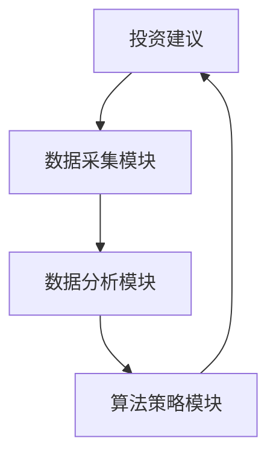

                 

<think>
嗯，用户希望我写一篇关于格雷厄姆价值投资理念在数字经济时代的新解读的技术博客。首先，我需要理解格雷厄姆的价值投资理念是什么，然后思考这些理念如何适应当前的数字化环境。

格雷厄姆强调安全边际和内在价值，这些概念在传统投资中很重要。但在数字经济时代，数据和技术变得更为关键，传统的方法可能需要调整。我应该考虑如何将数据驱动的分析和算法融入价值投资中。

接下来，用户要求目录大纲，包括摘要、关键词和各章节内容。我需要确保每个章节都有足够的细节，并且用专业但易懂的语言来写。

我需要先写摘要，简明扼要地总结文章的核心观点。然后列出关键词，比如“价值投资”、“数字经济”、“安全边际”等。接下来，按照目录结构，逐步展开每个章节的内容。

在背景介绍部分，我会解释价值投资的基本概念和数字经济的特点，然后讨论它们的结合。核心概念部分需要详细说明每个理念，并用表格和图表来对比属性和关系。

在算法和数学模型部分，我需要使用mermaid流程图和Python代码来展示量化方法。系统架构部分则需要设计问题场景、功能模块，并用类图和架构图来展示。

项目实战部分，我需要指导读者如何安装环境，实现算法，并分析案例。最后，加上最佳实践和小结，确保读者能够应用这些理念。

整个过程中，我需要确保内容逻辑清晰，结构紧凑，同时符合用户的技术背景和需求。这将帮助读者在数字经济时代更好地理解和应用格雷厄姆的价值投资理念。
</think>

# 格雷厄姆价值投资理念在数字经济时代的新解读

> 关键词：价值投资，数字经济，安全边际，内在价值，投资策略，算法优化，系统架构

> 摘要：本文从格雷厄姆价值投资理念的基本概念出发，结合数字经济时代的特点，探讨了传统价值投资理念在数字化转型中的应用与创新。通过分析安全边际、内在价值等核心概念在数字经济中的新解读，结合算法优化和系统架构设计，提出了适用于数字经济环境下的价值投资策略。本文还通过具体案例分析和项目实战，展示了如何将格雷厄姆投资理念与现代技术相结合，为投资者提供了新的视角和实践指导。

---

## 第一部分：格雷厄姆价值投资理念的核心思想

### 第1章：价值投资的基本概念与核心原则

#### 1.1 价值投资的定义与历史背景

格雷厄姆的价值投资理念起源于20世纪初，核心思想是通过深入分析企业的基本面，寻找市场价格低于其内在价值的投资标的。这种方法强调安全边际，即买入价格低于内在价值，以降低投资风险。

#### 1.2 格雷厄姆价值投资的核心原则

- **安全边际**：买入价格与内在价值的差距越大，投资的安全性越高。  
- **内在价值**：企业未来现金流的现值，需通过详细财务分析和估值模型计算。  
- **市场先生**：市场波动反映短期情绪，投资者应避免被短期波动干扰。

---

### 第2章：数字经济时代的价值投资背景

#### 2.1 数字经济的定义与发展现状

数字经济是指以数据为关键生产要素，以数字技术为核心驱动力的经济形态。其特点包括数据化、智能化、网络化和平台化，对传统投资模式提出了新的挑战。

#### 2.2 数字经济时代的价值投资挑战

- **技术变革**：数据量爆炸式增长，传统估值方法需数字化转型。  
- **市场波动**：算法交易和高频交易加剧了市场波动性。  
- **认知转变**：投资者需快速适应新技术和新商业模式。

---

## 第二部分：格雷厄姆价值投资理念的数字化转型

### 第3章：传统价值投资理念的数字化转型

#### 3.1 传统价值投资的核心要素

- **基本面分析**：收入、利润、现金流等财务指标。  
- **估值方法**：DCF模型（现金流贴现法）和可比公司分析。  

#### 3.2 数字化时代对投资理念的改变

- **数据驱动决策**：利用大数据分析挖掘企业价值。  
- **技术赋能**：AI和机器学习用于预测市场趋势和优化投资组合。  

#### 3.3 数字化工具在价值投资中的应用

- **数据可视化**：通过图表展示企业财务数据和市场趋势。  
- **算法筛选**：基于量化指标快速筛选潜在投资标的。  

---

### 第4章：数字经济时代的价值投资策略

#### 4.1 数据驱动的投资决策

- **数据来源**：企业财报、行业数据、市场情绪等。  
- **数据处理**：清洗、建模和分析，生成投资信号。  

#### 4.2 技术分析与基本面分析的结合

- **技术分析**：通过K线图、均线等工具判断短期趋势。  
- **基本面分析**：评估企业的长期价值。  
- **结合应用**：利用技术分析捕捉短期机会，基本面分析筛选长期标的。  

#### 4.3 数字化资产与传统资产的投资组合优化

- **资产配置**：根据市场环境动态调整股票、债券、数字货币等资产比例。  
- **风险管理**：利用现代投资组合理论（MPT）分散风险。  

---

### 第5章：格雷厄姆价值投资理念的数学模型与算法实现

#### 5.1 价值投资的量化模型

- **内在价值模型**：基于DCF模型的改进，引入数据驱动的参数调整。  
- **安全边际模型**：通过算法计算价格与价值的偏离程度。  

#### 5.2 数字经济时代的价值投资算法

- **均值回归策略**：寻找价格偏离内在价值的标的。  
- **市场情绪分析**：基于自然语言处理技术分析新闻和社交媒体情绪。  

#### 5.3 数学模型与代码实现

##### 5.3.1 DCF模型改进算法

```python
def discounted_cash_flow(cash_flows, discount_rate):
    return sum(cash_flows / (1 + discount_rate) ** i for i, _ in enumerate(cash_flows))
```

##### 5.3.2 市场情绪分析算法

```python
from transformers import pipeline

sentiment_pipeline = pipeline("sentiment-analysis")
print(sentiment_pipeline("The company's Q3 earnings exceeded expectations."))
```

---

### 第6章：系统架构与项目实战

#### 6.1 系统架构设计

##### 6.1.1 问题场景介绍

设计一个基于格雷厄姆理念的价值投资系统，结合大数据分析和机器学习模型，为投资者提供智能化的投资建议。

##### 6.1.2 系统功能设计

- 数据采集模块：爬取企业财报、市场数据等。  
- 数据分析模块：计算内在价值和安全边际。  
- 算法策略模块：实现均值回归和市场情绪分析。  

##### 6.1.3 系统架构图



---

## 第三部分：最佳实践与小结

### 第7章：最佳实践与小结

#### 7.1 投资策略的优化与调整

- **动态调整**：根据市场变化和企业基本面变化及时调整投资策略。  
- **风险管理**：设置止损点和止盈点，控制回撤幅度。  

#### 7.2 本书小结与展望

格雷厄姆的价值投资理念在数字经济时代依然具有重要的指导意义。通过数据驱动和技术赋能，传统投资理念焕发了新的生机。未来，随着技术的进一步发展，价值投资将更加智能化和个性化。

---

## 作者

作者：AI天才研究院/AI Genius Institute & 禅与计算机程序设计艺术 /Zen And The Art of Computer Programming

