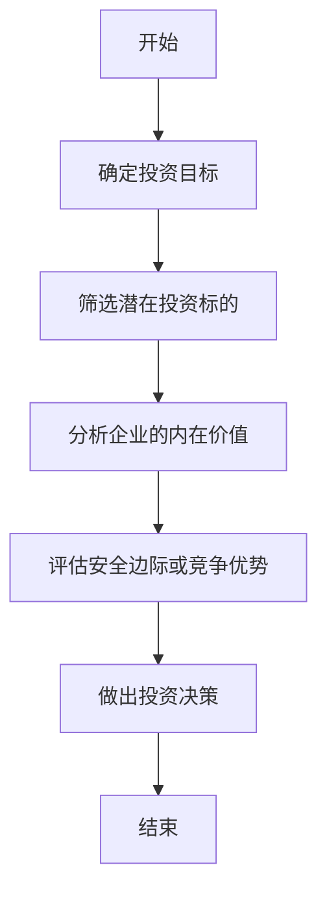
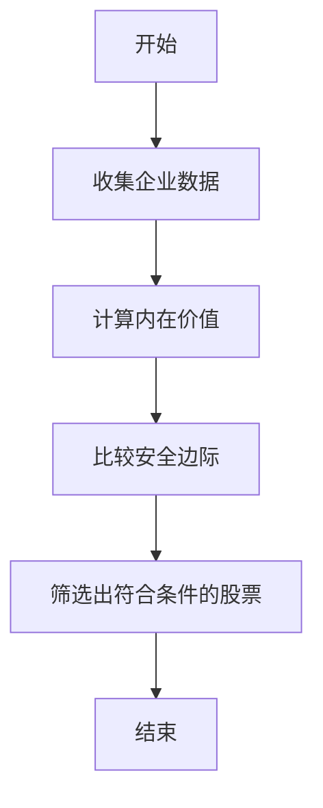
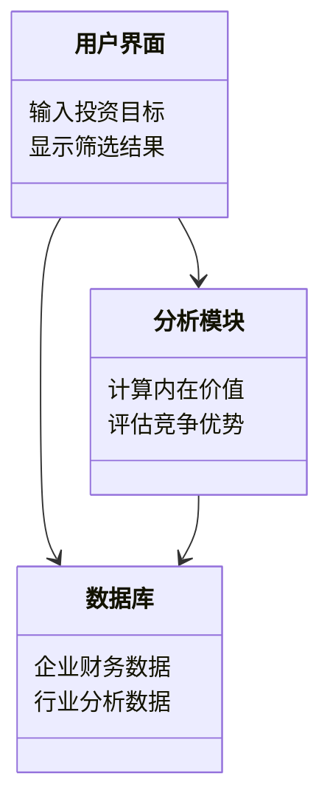
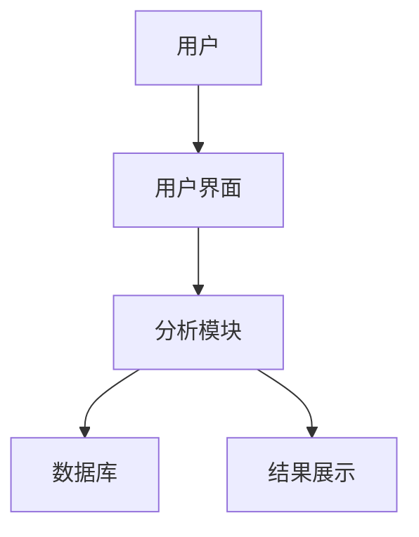

                 

<think>
嗯，用户希望撰写一篇关于《格雷厄姆到巴菲特：价值投资理念的演变》的技术博客文章。首先，我需要明确文章的结构和内容要求，确保涵盖从格雷厄姆到巴菲特的演变过程，包括背景介绍、核心概念、算法原理、系统分析、项目实战和总结。

我应该从背景介绍开始，详细讲述价值投资的起源与发展，重点分析格雷厄姆的安全边际和内在价值理念，以及巴菲特如何继承和发展这些理念。接下来，对比两者的策略和方法，使用表格和流程图来展示差异。

然后，探讨价值投资的算法和数学模型，比如格雷厄姆的筛选法和巴菲特的综合分析法，用流程图和数学公式详细说明。这部分需要清晰的数学模型和实际案例，帮助读者理解。

系统分析部分，设计一个价值投资决策支持系统，用类图和架构图展示模块之间的关系和交互流程。项目实战部分，选择一个实际案例，分析如何应用价值投资的方法进行投资决策。

最后，总结价值投资的关键点，给出最佳实践的建议，并展望未来的趋势。确保文章逻辑清晰，结构紧凑，语言专业且易于理解。
</think>

# 格雷厄姆到巴菲特：价值投资理念的演变

**关键词**：价值投资、格雷厄姆、巴菲特、投资策略、内在价值、安全边际

**摘要**：  
价值投资是一种以基本面分析为基础的投资策略，强调通过深入研究企业的内在价值来做出投资决策。本文从格雷厄姆的价值投资理念出发，分析其核心概念和方法，探讨巴菲特如何继承并发展了这些理念，最终形成了现代价值投资的体系。通过对比分析、算法模型和实际案例，本文揭示了价值投资的演变过程及其在现代投资中的重要性。

---

## 第1章：价值投资的起源与发展

### 1.1 价值投资的历史背景

#### 1.1.1 投资领域的早期探索  
价值投资的起源可以追溯到19世纪末和20世纪初。当时，投资者开始意识到市场波动性和情绪化对投资决策的影响，逐渐从“情绪化投资”转向“理性投资”。早期的价值投资者试图通过分析企业的财务状况来判断其股票的合理价格。

#### 1.1.2 经济学与投资理论的演变  
20世纪初，经济学和金融学的理论逐渐成熟，为价值投资的发展提供了理论基础。特别是“有效市场假说”和“行为金融学”的兴起，推动了投资者对内在价值和市场定价之间关系的深入研究。

#### 1.1.3 价值投资的兴起与传播  
20世纪30年代，本杰明·格雷厄姆和戴维·多德提出了价值投资的核心理念，即通过分析企业的基本面来寻找被市场低估的投资标的。这一理念在当时并未立即得到广泛认可，但随着市场的波动和经济危机的爆发，价值投资逐渐被更多人接受。

---

### 1.2 格雷厄姆的价值投资理念

#### 1.2.1 安全边际的概念  
格雷厄姆提出了“安全边际”的概念，即股票的市场价格与内在价值之间的差距。他建议投资者以低于内在价值的价格购买股票，以确保投资的安全性和盈利性。  
$$ \text{安全边际} = \text{内在价值} - \text{市场价格} $$

#### 1.2.2 内在价值的计算  
格雷厄姆认为，内在价值是企业未来现金流的现值。他通过对企业财务报表的分析，计算出股票的合理价格范围。  
$$ \text{内在价值} = \sum_{t=1}^{n} \frac{\text{现金流}_t}{(1 + r)^t} $$  
其中，$r$ 是折现率，$n$ 是预测的年数。

#### 1.2.3 投资策略的核心原则  
格雷厄姆的价值投资策略包括以下核心原则：  
1. 避免情绪化投资，坚持理性分析。  
2. 选择具有安全边际的股票。  
3. 长期持有优质资产，避免频繁交易。  

---

### 1.3 巴菲特对价值投资的继承与发展

#### 1.3.1 巴菲特的投资理念  
巴菲特是格雷厄姆的学生，他继承了格雷厄姆的价值投资理念，并在此基础上进行了创新。巴菲特强调，投资的本质是寻找具有持续竞争优势的企业，并长期持有这些企业股票。

#### 1.3.2 企业竞争优势的识别  
巴菲特提出了“护城河”理论，认为具有强大竞争优势的企业能够长期保持高盈利能力。他通过分析企业的市场份额、品牌价值和竞争优势，筛选出具有长期增长潜力的优秀企业。

#### 1.3.3 长期价值的评估  
巴菲特强调，投资决策应基于企业的长期价值，而非短期市场波动。他通过分析企业的财务报表和行业地位，评估其未来的盈利能力和成长空间。

---

## 第2章：价值投资的核心概念与联系

### 2.1 核心概念的对比分析

#### 2.1.1 格雷厄姆与巴菲特的核心理念对比  
下表对比了格雷厄姆和巴菲特在价值投资理念上的主要差异：

| **维度**       | **格雷厄姆**                   | **巴菲特**                   |
|----------------|--------------------------------|-------------------------------|
| 投资目标       | 寻找被低估的股票               | 投资具有竞争优势的企业       |
| 投资策略       | 基于安全边际的买入策略         | 基于长期价值的买入策略       |
| 分析方法       | 以财务指标为主                 | 以竞争优势和长期价值为主     |

#### 2.1.2 价值投资的决策流程  
以下是一个简化的价值投资决策流程图：

---

## 第3章：价值投资的算法与数学模型

### 3.1 格雷厄姆的筛选法

#### 3.1.1 筛选标准的数学模型  
格雷厄姆提出了以下筛选标准：  
1. 股票价格低于其内在价值的一定比例（通常为2/3）。  
2. 企业的市盈率低于行业平均水平。  
3. 企业的财务状况健康，无重大负债。

#### 3.1.2 筛选流程的Mermaid图  
以下是一个简化的筛选流程图：

---

### 3.2 巴菲特的综合分析法

#### 3.2.1 综合分析法的数学模型  
巴菲特的综合分析法基于企业的长期价值，其核心公式为：  
$$ \text{长期价值} = \text{企业未来现金流的现值} $$  

---

## 第4章：价值投资的系统分析与架构设计

### 4.1 价值投资决策支持系统

#### 4.1.1 系统功能设计  
以下是一个价值投资决策支持系统的功能模块图：

#### 4.1.2 系统架构设计  
以下是一个价值投资决策支持系统的架构图：

---

## 第5章：价值投资的项目实战

### 5.1 案例分析：巴菲特的选股策略

#### 5.1.1 案例背景  
以巴菲特投资的可口可乐为例，分析其如何通过竞争优势和长期价值进行投资决策。

#### 5.1.2 筛选过程  
1. 确定投资目标：寻找具有强大竞争优势的企业。  
2. 分析企业财务数据：评估企业的盈利能力、市场份额和品牌价值。  
3. 计算内在价值：基于未来现金流的现值，确定股票的合理价格。  
4. 做出投资决策：以低于内在价值的价格买入股票，长期持有。

---

## 第6章：价值投资的最佳实践与总结

### 6.1 最佳实践 tips

1. **长期投资**：价值投资的核心是长期持有优质资产，避免短期波动的干扰。  
2. **分散投资**：通过分散投资降低风险，避免将所有资金集中在单一股票上。  
3. **持续学习**：市场环境不断变化，投资者需要持续学习和调整投资策略。  

### 6.2 总结  
价值投资从格雷厄姆的安全边际理念到巴菲特的竞争优势理论，经历了从理论到实践的演变。它强调基本面分析和长期投资，帮助投资者在复杂多变的市场中找到优质资产。

### 6.3 展望  
随着大数据和人工智能技术的发展，价值投资的分析方法和决策流程将更加高效和精准。未来的投资领域将更加依赖于技术驱动的分析工具，以帮助投资者更好地识别潜在投资机会。

---

**作者：AI天才研究院/AI Genius Institute & 禅与计算机程序设计艺术 /Zen And The Art of Computer Programming**

