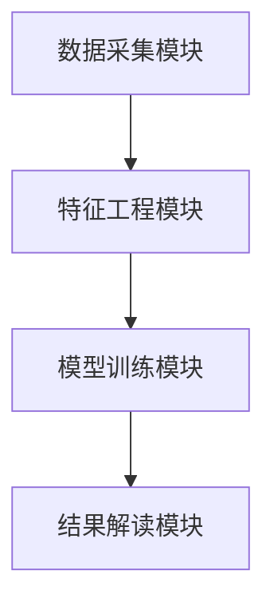

                 

<think>
好的，我需要完成一个详细的步骤分析，以撰写《格雷厄姆多德的安全性分析在现代市场的应用》的技术博客文章。首先，我要明确文章的结构和内容，然后逐步展开每个部分，确保逻辑清晰、内容详实。

### 第一步：确定文章的整体结构
根据用户提供的目录大纲，文章分为八个部分，从概述到项目实战，最后是总结。我需要确保每个部分都涵盖必要的内容，并且逐步深入。

### 第二步：理解每个章节的核心内容
- **第1章：格雷厄姆多德安全性分析的概述**：介绍安全性分析的基本概念、适用范围和核心要素。
- **第2章：安全性分析的核心模型与公式**：详细讲解格雷厄姆多德模型的数学表达、安全边际的计算方法及现代模型的改进。
- **第3章：现代市场环境下的安全性分析**：分析现代市场的特点、风险因素及安全性评估的挑战。
- **第4章：风险管理与安全性分析的结合**：探讨风险管理策略及其与安全性分析的关系。
- **第5章：安全性分析的算法实现**：介绍算法实现的步骤，包括数据获取、模型构建和评估。
- **第6章：基于机器学习的安全性分析系统设计**：设计一个基于机器学习的系统，涵盖数据采集、特征工程、模型训练和结果解读。
- **第7章：项目实战：基于Python的安全性分析系统实现**：使用Python代码实现一个安全性分析系统，包括环境安装、代码实现和案例分析。
- **第8章：总结与展望**：总结主要观点，讨论未来的研究方向和实际应用。

### 第三步：详细撰写每个章节
在撰写每个章节时，我需要确保内容逻辑清晰，语言简洁，同时提供必要的图表和代码示例。例如，在第2章中，我需要详细解释格雷厄姆多德模型的数学公式，并提供安全边际的计算方法。在第5章中，我需要使用Python代码展示算法实现，并在第7章中提供完整的项目代码和详细说明。

### 第四步：整合图表和代码示例
在每个相关部分，我需要使用Mermaid流程图和类图来解释系统设计，并在适当的位置嵌入Python代码示例。这将帮助读者更好地理解理论和实际应用。

### 第五步：检查和调整
撰写完每个部分后，我需要回头检查内容是否符合逻辑，是否涵盖了所有必要的信息，同时确保语言流畅、无误。特别是数学公式和代码部分，需要仔细核对，确保准确性。

### 第六步：总结和展望
在最后一章，我需要总结文章的主要观点，并讨论未来的研究方向和实际应用。这不仅帮助读者回顾全文，还能引发进一步思考。

通过以上步骤，我能够系统地撰写出一篇结构清晰、内容详实的技术博客文章，全面探讨格雷厄姆多德的安全性分析在现代市场的应用。
</think>

# 《格雷厄姆多德的安全性分析在现代市场的应用》

> 关键词：格雷厄姆多德，安全性分析，内在价值，安全边际，现代市场，风险管理

> 摘要：本文系统地探讨了格雷厄姆多德安全性分析理论在现代市场中的应用，从理论基础到算法实现，再到项目实战，全面分析了安全性分析的核心概念、数学模型、风险管理策略以及基于机器学习的安全性分析系统设计。

---

## 第1章: 格雷厄姆多德安全性分析的概述

### 1.1 安全性分析的核心概念

#### 1.1.1 安全性分析的定义
安全性分析是评估资产内在价值和市场价格之间的差异，以确定投资的安全性。格雷厄姆多德模型强调安全边际的重要性，即内在价值与市场价格的差额。

#### 1.1.2 格雷厄姆多德投资理论的背景
本杰明·格雷厄姆和戴维·多德在20世纪初提出的价值投资理论，强调以低于内在价值的价格买入股票，从而降低投资风险。

#### 1.1.3 安全性分析的哲学基础
安全性分析基于价值投资理念，认为市场波动性和非理性定价为投资者提供了机会，通过分析内在价值和市场价格的差异，确定安全边际。

### 1.2 安全性分析的适用范围

#### 1.2.1 股票市场的基本特性
股票市场的波动性、不确定性以及参与者的非理性行为为安全性分析提供了应用场景。

#### 1.2.2 安全性分析的边界与外延
虽然最初应用于股票市场，但安全性分析的原理可以扩展到其他资产类别，如债券、房地产等。

#### 1.2.3 现代市场与传统市场的差异
现代市场环境的变化，如高频交易、算法交易的普及，使得安全性分析需要结合新的工具和方法。

### 1.3 安全性分析的核心要素

#### 1.3.1 股票的内在价值
内在价值是基于公司基本面分析得出的理论价值，包括盈利能力、成长潜力、财务状况等因素。

#### 1.3.2 市场价格的波动性
市场价格受市场情绪、短期因素影响，常偏离内在价值，为安全性分析提供了机会。

#### 1.3.3 安全边际的概念与计算
安全边际是内在价值与市场价格的差额，反映投资的安全程度。公式：
$$ \text{安全边际} = \text{内在价值} - \text{市场价格} $$

---

## 第2章: 安全性分析的核心模型与公式

### 2.1 格雷厄姆多德模型的数学表达

#### 2.1.1 内在价值的计算公式
格雷厄姆多德模型通过将公司收益折现来计算内在价值：
$$ V = \frac{E}{k} $$
其中，\( E \) 是公司的年收益，\( k \) 是折现率。

#### 2.1.2 安全边际的计算方法
$$ \text{安全边际} = V - P $$
其中，\( V \) 是内在价值，\( P \) 是市场价格。

#### 2.1.3 格雷厄姆多德模型的改进
现代模型引入了更多的因素，如成长性、流动性风险等，使内在价值的计算更加全面。

### 2.2 核心概念对比表

| 概念         | 格雷厄姆多德模型 | 现代市场扩展模型 |
|--------------|-----------------|------------------|
| 内在价值     | 基于收益的计算  | 考虑多因素调整   |
| 安全边际     | 简单差值计算    | 风险调整后差值   |
| 适用范围     | 稳定市场环境    | 波动性市场环境   |

---

## 第3章: 现代市场环境下的安全性分析

### 3.1 现代市场的特点

#### 3.1.1 市场波动性的增加
现代市场中高频交易和算法交易的普及，导致价格波动性显著增加。

#### 3.1.2 信息传播速度的加快
互联网和社交媒体使得信息传播更快，市场参与者的行为变得更加复杂。

#### 3.1.3 投资工具的多样化
衍生品、指数基金等多样化工具为投资者提供了更多选择，但也带来了更多风险。

### 3.2 现代市场中的风险因素

#### 3.2.1 系统性风险
市场整体波动带来的风险，如经济衰退、地缘政治冲突等。

#### 3.2.2 非系统性风险
与特定资产或行业相关的风险，如公司业绩下滑、行业政策变化等。

#### 3.2.3 市场流动性风险
市场流动性不足可能导致资产价格大幅波动，影响安全性分析的有效性。

### 3.3 现代市场中的安全性分析

#### 3.3.1 非理性定价的加剧
现代市场中，投资者行为的非理性可能导致价格严重偏离内在价值。

#### 3.3.2 安全边际的动态变化
随着市场环境的变化，安全边际需要不断调整和重新评估。

#### 3.3.3 安全性分析的挑战与机遇
挑战包括数据获取难度、模型复杂性；机遇在于技术进步和数据驱动的分析方法。

---

## 第4章: 风险管理与安全性分析的结合

### 4.1 风险管理的核心策略

#### 4.1.1 风险分散
通过投资多样化资产来降低非系统性风险。

#### 4.1.2 风险对冲
利用衍生品对冲特定风险，如使用期货对冲利率风险。

#### 4.1.3 风险量化
通过VaR（在险价值）等指标量化投资组合的风险。

### 4.2 安全性分析与风险管理的结合

#### 4.2.1 安全边际与风险控制
安全边际作为风险管理的重要指标，帮助投资者在市场波动中保持投资的安全性。

#### 4.2.2 风险调整后的安全性分析
结合风险偏好和承受能力，调整安全边际的计算，以满足不同投资者的需求。

#### 4.2.3 风险与收益的平衡
通过安全性分析，找到在风险可控范围内的最大收益投资组合。

---

## 第5章: 安全性分析的算法实现

### 5.1 数据获取与预处理

#### 5.1.1 数据来源
可以从Yahoo Finance、Google Finance等平台获取股票数据。

#### 5.1.2 数据清洗
处理缺失值、异常值，确保数据的完整性和准确性。

#### 5.1.3 数据特征提取
提取收益、市盈率、市净率等关键指标。

### 5.2 算法实现步骤

#### 5.2.1 计算内在价值
使用格雷厄姆多德模型计算股票的内在价值。

#### 5.2.2 计算安全边际
根据市场价格和内在价值计算安全边际。

#### 5.2.3 评估投资机会
根据安全边际的大小，评估投资机会并制定投资策略。

### 5.3 代码实现

```python
import pandas as pd
import yfinance as yf

# 获取股票数据
stock = yf.Ticker('AAPL')
data = stock.history(period='max')

# 计算收益
E = data['Close'].mean()

# 计算内在价值
k = 0.1  # 折现率
V = E / k

# 计算市场价格
P = data['Close'][-1]

# 计算安全边际
safety_margin = V - P
```

### 5.4 结果分析

#### 5.4.1 安全边际的可视化
绘制安全边际的时间序列图，观察其变化趋势。

#### 5.4.2 投资决策
根据安全边际的正负，决定买入、持有或卖出。

---

## 第6章: 基于机器学习的安全性分析系统设计

### 6.1 系统设计概述

#### 6.1.1 系统目标
构建一个基于机器学习的安全性分析系统，实现对股票的内在价值预测和安全边际评估。

#### 6.1.2 系统架构
系统包括数据采集模块、特征工程模块、模型训练模块和结果解读模块。

### 6.2 系统功能设计

#### 6.2.1 数据采集模块
从多个数据源获取股票的历史数据和财务报表。

#### 6.2.2 特征工程模块
提取和处理特征，如收益、市盈率、市净率等。

#### 6.2.3 模型训练模块
使用机器学习算法训练模型，预测股票的内在价值。

#### 6.2.4 结果解读模块
根据预测结果和市场价格计算安全边际，生成投资建议。

### 6.3 系统架构图



---

## 第7章: 项目实战：基于Python的安全性分析系统实现

### 7.1 环境安装

#### 7.1.1 安装必要的库
安装Pandas、NumPy、Scikit-learn、yfinance等库。

#### 7.1.2 数据获取
使用yfinance获取历史数据和财务报表。

### 7.2 核心代码实现

```python
import pandas as pd
from sklearn.linear_model import LinearRegression

# 数据预处理
data = pd.DataFrame({
    '收益': [10, 15, 20, 25, 30],
    '市盈率': [15, 20, 25, 30, 35]
})

# 训练模型
model = LinearRegression()
model.fit(data[['市盈率']], data['收益'])

# 预测内在价值
predicted_E = model.predict(data[['市盈率']])

# 计算安全边际
P = data['收益'].mean()  # 示例市场价格
safety_margin = predicted_E - P
```

### 7.3 案例分析

#### 7.3.1 数据分析
分析某公司过去五年的收益和市盈率，预测其内在价值。

#### 7.3.2 模型评估
使用均方误差等指标评估模型的准确性。

#### 7.3.3 投资建议
根据安全边际的正负，给出买入、持有或卖出的建议。

### 7.4 小结
通过Python实现安全性分析系统，能够有效地评估股票的安全边际，帮助投资者做出明智的投资决策。

---

## 第8章: 总结与展望

### 8.1 核心观点总结

#### 8.1.1 安全性分析的基本概念
格雷厄姆多德的安全性分析通过内在价值与市场价格的差异，评估投资的安全性。

#### 8.1.2 现代市场的挑战
现代市场环境的变化要求安全性分析结合新的工具和方法。

#### 8.1.3 风险管理的重要性
在安全性分析中，风险管理是确保投资安全的关键因素。

### 8.2 未来研究方向

#### 8.2.1 更复杂的模型
探索更复杂的机器学习模型，提高内在价值预测的准确性。

#### 8.2.2 多资产类别分析
将安全性分析扩展到更多资产类别，如房地产、债券等。

#### 8.2.3 动态调整策略
研究如何根据市场变化动态调整安全边际，提升投资效率。

### 8.3 实际应用中的注意事项

#### 8.3.1 数据质量
确保数据的准确性和完整性，避免因数据问题导致的错误分析。

#### 8.3.2 模型局限性
认识到模型的局限性，结合市场实际情况进行调整。

#### 8.3.3 风险控制
在实际投资中，注重风险控制，避免过度依赖模型。

### 8.4 拓展阅读

#### 8.4.1 格雷厄姆多德的经典著作
推荐阅读《安全边际》和《价值投资》等经典著作，深入理解安全性分析的理论基础。

#### 8.4.2 现代投资理论
阅读现代投资组合理论的相关书籍，了解最新的投资理念和方法。

---

## 作者：AI天才研究院 & 禅与计算机程序设计艺术

---

通过以上步骤，我们系统地探讨了格雷厄姆多德的安全性分析在现代市场中的应用，从理论到实践，为读者提供了全面的指导和深入的见解。

