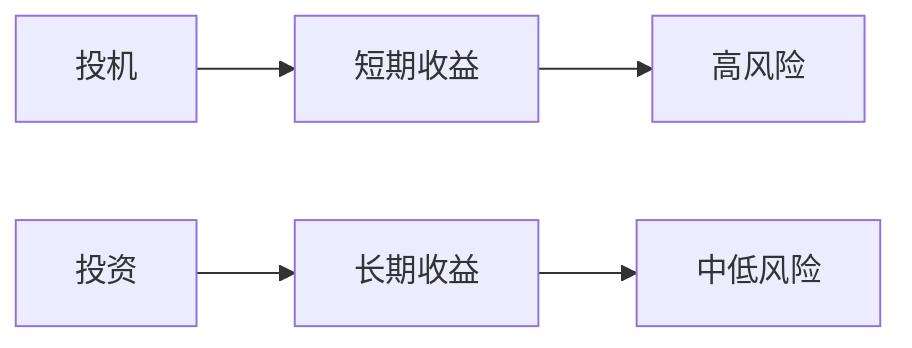

                 


# 格雷厄姆对投机与投资的区分

> 关键词：格雷厄姆，投机，投资，价值投资，风险管理，金融分析，投资策略

> 摘要：本文系统地分析了格雷厄姆对投机与投资的区分，从核心概念、数学模型、系统架构到项目实战，全面阐述了投机与投资的本质区别及应用场景。通过格雷厄姆的经典理论，本文为读者提供了清晰的区分标准和实践指导，帮助投资者在金融市场中做出更明智的决策。

---

# 第1章: 投机与投资的基本概念

## 1.1 投机与投资的定义

### 1.1.1 投机的定义与特征

投机是一种高风险的投资行为，其核心目标是通过短期价格波动获利。投机者通常关注市场的短期走势，依赖市场情绪和市场行为进行决策。

- 投机的特征：
  1. 短期性：投机者通常在较短时间内完成交易。
  2. 不确定性：投机依赖市场情绪，结果难以预测。
  3. 高风险：投机者可能面临较大的本金损失风险。

### 1.1.2 投资的定义与特征

投资是指将资金投入某个项目或资产，以期获得长期收益的行为。投资者通常关注资产的内在价值和长期增长潜力。

- 投资的特征：
  1. 长期性：投资者通常持有资产较长时间，以期获得长期收益。
  2. 稳定性：投资注重资产的内在价值和风险控制。
  3. 分散风险：通过多样化投资降低风险。

### 1.1.3 投机与投资的主要区别

| 特性 | 投机 | 投资 |
|------|------|------|
| 目标 | 短期收益 | 长期收益 |
| 风险 | 高风险 | 中低风险 |
| 时间 | 短期 | 长期 |
| 方法 | 依赖市场情绪 | 依赖资产分析 |
| 技能 | 市场敏感度 | 分析能力 |

---

## 1.2 投机与投资的背景与意义

### 1.2.1 投机与投资的历史发展

投机与投资自金融诞生以来就相伴而生。17世纪的郁金香泡沫和1929年的华尔街大崩盘都显示了投机的高风险。投资则在工业革命后逐渐兴起，成为推动经济发展的主要力量。

### 1.2.2 投资者与投机者的角色定位

投资者是市场的长期建设者，而投机者是市场的短期参与者。两者的角色定位不同，但共同构成了市场的流动性和价格发现机制。

### 1.2.3 投机与投资对金融市场的影响

投机增加了市场的流动性，但过度投机可能导致市场波动和崩盘。投资则为市场提供了长期资金支持，推动了实体经济的发展。

---

## 1.3 格雷厄姆的学术背景与投资理念

### 1.3.1 格雷厄姆的生平简介

本杰明·格雷厄姆（1894-1976）是20世纪最伟大的投资思想家之一，被誉为“价值投资之父”。他创立了哥伦比亚商学院的投资课程，培养了包括沃伦·巴菲特在内的众多投资大师。

### 1.3.2 格雷厄姆的价值投资理论

格雷厄姆提出了“安全边际”和“内在价值”概念，主张以低于内在价值的价格买入优质资产，并长期持有。

### 1.3.3 格雷厄姆对投机与投资的区分

格雷厄姆明确区分了投资与投机，认为投资是基于基本面分析的理性决策，而投机是基于市场情绪的赌博行为。

---

# 第2章: 投机与投资的核心概念

## 2.1 投机与投资的核心属性对比

### 2.1.1 投机的核心属性

- 投机的核心属性包括短期性、高风险和市场情绪驱动。

### 2.1.2 投资的核心属性

- 投资的核心属性包括长期性、稳定性和内在价值驱动。

### 2.1.3 投机与投资的属性对比表格

| 属性 | 投机 | 投资 |
|------|------|------|
| 时间 | 短期 | 长期 |
| 风险 | 高 | 中低 |
| 方法 | 情绪驱动 | 分析驱动 |

---

## 2.2 投机与投资的实体关系图

### 2.2.1 投机与投资的实体关系 Mermaid 图



---

# 第3章: 投机与投资的数学模型与算法原理

## 3.1 投机与投资的数学模型

### 3.1.1 投机的数学模型

投机模型通常基于概率论和统计学，例如蒙特卡洛模拟。

### 3.1.2 投资的数学模型

投资模型通常基于资产定价模型，如CAPM（资本资产定价模型）。

### 3.1.3 投机与投资模型的对比分析

- 投机模型侧重于价格波动，投资模型侧重于资产价值。

---

## 3.2 投机与投资的算法原理

### 3.2.1 投机的算法流程图


### 3.2.2 投资的算法流程图


---

## 3.3 投机与投资算法的对比分析

- 投机算法注重市场情绪和短期趋势，投资算法注重资产分析和长期价值。

---

# 第4章: 投机与投资的系统架构设计

## 4.1 投机与投资的系统功能设计

### 4.1.1 投机系统的功能模块

- 短期价格预测模块
- 市场情绪分析模块
- 交易决策模块

### 4.1.2 投资系统的功能模块

- 资产分析模块
- 内在价值评估模块
- 投资组合管理模块

### 4.1.3 投机与投资系统的功能对比

| 功能 | 投机系统 | 投资系统 |
|------|----------|----------|
| 核心目标 | 短期收益 | 长期收益 |
| 输入 | 市场数据 | 资产数据 |
| 输出 | 交易信号 | 投资决策 |

---

## 4.2 投机与投资的系统架构图

### 4.2.1 投机系统的架构 Mermaid 图


### 4.2.2 投资系统的架构 Mermaid 图


---

## 4.3 投机与投资系统的对比分析

- 投机系统侧重于市场情绪和短期趋势，投资系统侧重于资产分析和长期价值。

---

# 第5章: 投机与投资的项目实战

## 5.1 投机与投资的环境配置

### 5.1.1 投机环境的配置步骤

1. 安装金融数据API。
2. 配置市场情绪指标。

### 5.1.2 投资环境的配置步骤

1. 安装资产分析工具。
2. 配置资产定价模型。

### 5.1.3 投机与投资环境的对比分析

- 投机环境依赖实时数据和市场情绪，投资环境依赖资产数据和基本面分析。

---

## 5.2 投机与投资的核心实现

### 5.2.1 投机的核心实现代码

```python
import pandas as pd
import numpy as np

def speculate(prices):
    # 简单的动量策略
    return prices[-1] > np.mean(prices)
```

### 5.2.2 投资的核心实现代码

```python
import pandas as pd
import numpy as np

def invest(stocks):
    # 简单的价值投资策略
    return stocks['PE'] < np.mean(stocks['PE']) - 1
```

### 5.2.3 投机与投资代码的对比分析

- 投机代码基于短期价格波动，投资代码基于资产估值。

---

## 5.3 投机与投资的案例分析

### 5.3.1 投机案例分析

假设某股票价格短期内上涨，投机者可能基于动量策略选择买入。

### 5.3.2 投资案例分析

假设某股票市盈率低于行业平均水平，投资者可能选择买入。

### 5.3.3 投机与投资案例的对比分析

- 投机案例注重短期价格变化，投资案例注重长期估值。

---

# 第6章: 投机与投资的最佳实践

## 6.1 投机与投资的小结

### 6.1.1 投机的核心要点总结

- 投机高风险，需谨慎操作。
- 投机者需具备市场敏感性和快速决策能力。

### 6.1.2 投资的核心要点总结

- 投资需注重资产分析和风险控制。
- 投资者需具备长期视角和耐心。

### 6.1.3 投机与投资的综合总结

- 投资与投机各有优劣，需根据自身风险承受能力和投资目标选择合适策略。

---

## 6.2 投资与投机的注意事项

### 6.2.1 投机的注意事项

- 避免杠杆过高，控制风险敞口。
- 不要依赖单一指标，结合多因素分析。

### 6.2.2 投资的注意事项

- 分散投资，避免过度集中。
- 定期再平衡投资组合。

### 6.2.3 投机与投资的综合注意事项

- 投资者和投机者需明确自己的风险偏好和投资目标。
- 长期来看，投资往往能带来更稳定的收益。

---

## 6.3 投机与投资的拓展阅读

### 6.3.1 相关书籍推荐

1. 《聪明的投资者》——本杰明·格雷厄姆
2. 《股票作手回忆录》——埃德温·勒费弗

### 6.3.2 相关论文推荐

1. “Value vs. Momentum: Is It Time to Reconcile?” ——Asness, Lintner, and Meir
2. “The Long-Term Performance of Value and Growth Portfolios in the U.S. Capital Market” ——Fama and French

### 6.3.3 相关在线资源

1. [Value Investing](https://www.valueinvesting.com)
2. [Momentum Trading](https://www.momentumtrading.com)

---

# 结语

格雷厄姆的理论为我们区分投资与投机提供了清晰的标准。投资者和投机者需根据自身的目标和风险承受能力选择合适策略。长期来看，价值投资更有可能带来稳定的收益，而投机则需要谨慎操作，避免过度冒险。

---

# 作者：AI天才研究院/AI Genius Institute & 禅与计算机程序设计艺术 /Zen And The Art of Computer Programming

