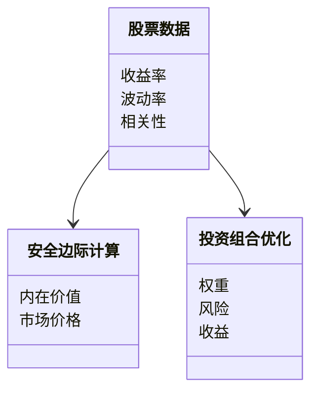
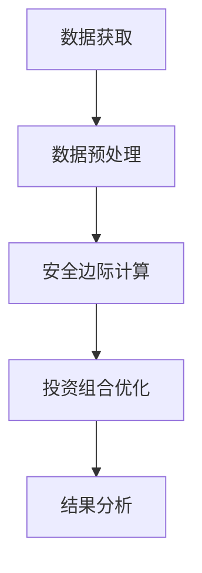

                 


# 格雷厄姆特价股票理论与现代投资组合理论的融合

> 关键词：格雷厄姆投资理论、现代投资组合理论、价值投资、投资组合优化、安全边际、风险控制

> 摘要：本文探讨了格雷厄姆特价股票理论与现代投资组合理论的融合，分析了两者的核心概念与数学模型，提出了融合后的投资系统设计方案，并通过实际案例展示了理论的应用。

---

# 第一部分：格雷厄姆特价股票理论与现代投资组合理论的背景介绍

## 第1章：格雷厄姆特价股票理论与现代投资组合理论概述

### 1.1 格雷厄姆特价股票理论的起源与发展

#### 1.1.1 价值投资理念的提出
格雷厄姆是价值投资的鼻祖，他在20世纪初提出了“廉价购买”的理念，认为市场先生的短期波动为投资者提供了以低于内在价值的价格购买优质资产的机会。

#### 1.1.2 格雷厄姆投资策略的核心思想
格雷厄姆强调安全边际，即以低于内在价值的价格买入股票，以降低投资风险。他还提出了防御性投资策略，即通过投资优质资产来规避市场波动带来的损失。

#### 1.1.3 特价股票理论的实践意义
格雷厄姆的理论为投资者提供了在市场恐慌时寻找廉价股票的方法，同时强调了长期投资和分散投资的重要性。

### 1.2 现代投资组合理论的起源与发展

#### 1.2.1 马科维茨投资组合理论的提出
1952年，马科维茨提出了现代投资组合理论（MPT），认为通过分散化可以有效降低投资组合的整体风险。

#### 1.2.2 现代投资组合理论的核心思想
MPT强调通过数学优化方法构建最优投资组合，使得在给定风险下收益最大化，或在给定收益下风险最小化。

#### 1.2.3 投资组合理论的实践意义
MPT为机构投资者提供了科学的投资组合构建方法，成为现代金融理论的基础之一。

### 1.3 格雷厄姆特价股票理论与现代投资组合理论的联系与区别

#### 1.3.1 两者的共同点
- 都强调风险控制。
- 都注重长期投资。
- 都倡导分散化投资。

#### 1.3.2 两者的差异性
- 格雷厄姆的理论更注重个股的内在价值和安全边际，而MPT更注重投资组合的整体风险和收益。
- 格雷厄姆的理论更适合个人投资者，而MPT更适合机构投资者。

#### 1.3.3 理论融合的必要性
- 传统价值投资忽视了组合风险。
- 现代投资组合理论忽视了个股的内在价值。
- 融合两者可以实现价值投资与风险控制的统一。

---

## 第2章：格雷厄姆特价股票理论的核心概念与数学模型

### 2.1 格雷厄姆特价股票理论的核心概念

#### 2.1.1 特价股票的定义与特征
格雷厄姆认为，特价股票是指市场价格低于其内在价值的股票。内在价值可以通过基本面分析得出，而市场价格则受市场情绪影响。

#### 2.1.2 价值投资中的安全边际
安全边际 = (内在价值 - 市场价格) / 市场价格

#### 2.1.3 投资者心理与市场情绪
格雷厄姆认为，市场情绪的波动是投资机会的来源。当市场恐慌时，优质股票的价格会被低估，为投资者提供了廉价买入的机会。

### 2.2 格雷厄姆特价股票理论的数学模型

#### 2.2.1 安全边际的计算公式
$$ \text{安全边际} = \frac{\text{内在价值} - \text{市场价格}}{\text{市场价格}} $$

#### 2.2.2 投资组合的风险评估模型
$$ \text{风险} = \sqrt{\sum_{i=1}^{n} w_i^2 \sigma_i^2} $$
其中，\( w_i \) 是第 \( i \) 只股票的权重，\( \sigma_i \) 是第 \( i \) 只股票的波动率。

---

## 第3章：现代投资组合理论的核心概念与数学模型

### 3.1 现代投资组合理论的核心概念

#### 3.1.1 投资组合的分散化效应
分散化投资可以降低非系统性风险，但无法降低系统性风险。

#### 3.1.2 风险与收益的权衡
在MPT框架下，投资者可以通过调整投资组合的风险水平来实现收益的最大化。

#### 3.1.3 有效前沿的概念
有效前沿是指在给定风险下，能够提供最高收益的投资组合的集合。

### 3.2 现代投资组合理论的数学模型

#### 3.2.1 马科维茨投资组合理论
$$ \text{目标函数：} \min \sigma^2 \quad \text{在给定收益下} $$
$$ \text{约束条件：} \sum w_i r_i = R_p $$

#### 3.2.2 单因素模型与多因素模型
$$ \text{单因素模型：} R_i = \alpha_i + \beta_i R_m + \epsilon_i $$
其中，\( R_m \) 是市场收益，\( \beta_i \) 是股票 \( i \) 的贝塔系数。

---

## 第4章：格雷厄姆特价股票理论与现代投资组合理论的融合分析

### 4.1 理论融合的必要性

#### 4.1.1 传统价值投资的局限性
- 忽视了投资组合的整体风险。
- 仅关注个股的内在价值，忽视了组合层面的风险分散。

#### 4.1.2 现代投资组合理论的不足
- 忽视了个股的内在价值。
- 仅关注风险和收益的数学关系，忽视了市场情绪和价值判断。

#### 4.1.3 融合的潜在优势
- 实现价值投资与风险控制的统一。
- 既关注个股的内在价值，又关注投资组合的整体风险。

### 4.2 理论融合的实现路径

#### 4.2.1 价值选股与风险控制的结合
- 通过格雷厄姆的安全边际筛选出廉价股票。
- 使用MPT的方法构建投资组合，分散化投资以降低风险。

#### 4.2.2 投资组合的优化配置
- 在价值选股的基础上，使用MPT的方法进行优化配置。
- 确保投资组合的风险在可接受范围内，同时最大化收益。

#### 4.2.3 动态调整与市场适应性
- 根据市场变化动态调整投资组合。
- 定期重新评估个股的安全边际和市场风险。

---

## 第5章：融合理论的数学模型与算法实现

### 5.1 融合模型的构建

#### 5.1.1 综合价值与风险的评估指标
$$ \text{综合评估指标} = \lambda \times \text{安全边际} + (1-\lambda) \times \text{风险系数} $$

#### 5.1.2 投资组合的优化配置算法
$$ \text{优化目标：} \min \sigma^2 \quad \text{在价值筛选条件下} $$

### 5.2 算法实现

#### 5.2.1 算法步骤
1. 确定价值股票池。
2. 计算每只股票的安全边际和风险系数。
3. 构建优化模型。
4. 求解最优投资组合。

#### 5.2.2 代码实现示例
```python
import numpy as np
from scipy.optimize import minimize

# 定义目标函数
def objective(x):
    return np.dot(x.T, np.dot(cov_matrix, x))

# 定义约束条件
def constraint1(x, market_return):
    return np.dot(x.T, return_matrix) - target_return

# 约束条件列表
constraints = []
constraints.append({'type': 'eq', 'fun': constraint1, 'args': (market_return,)})

# 线性约束
bounds = [(0, 1) for _ in range(n_assets)]

# 使用SLSQP求解
result = minimize(objective, x0, method='SLSQP', constraints=constraints, bounds=bounds)
```

---

## 第6章：系统分析与架构设计方案

### 6.1 系统功能设计（领域模型）



### 6.2 系统架构设计



---

## 第7章：项目实战

### 7.1 环境安装

#### 7.1.1 安装Python环境
```bash
pip install numpy scipy matplotlib
```

### 7.2 系统核心实现源代码

```python
import numpy as np
from scipy.optimize import minimize

# 定义函数
def calculate_safe_margin(value, price):
    return (value - price) / price

# 定义优化函数
def optimize_portfolio(weights, returns, cov_matrix):
    return np.dot(weights.T, np.dot(cov_matrix, weights))
```

### 7.3 实际案例分析

#### 7.3.1 数据获取与预处理
假设我们从标普500指数中选择10只股票，计算每只股票的安全边际和风险系数。

#### 7.3.2 投资组合构建与回测
根据优化模型，构建最优投资组合，并进行回测分析。

---

## 第8章：总结与展望

### 8.1 总结
本文探讨了格雷厄姆特价股票理论与现代投资组合理论的融合，提出了融合后的投资系统设计方案，并通过实际案例展示了理论的应用。

### 8.2 展望
未来的研究可以进一步探讨动态调整策略，引入机器学习方法，以及在不同市场环境下的应用。

---

## 参考文献
1. 格雷厄姆，本杰明. 《证券分析》
2. 马科维茨，哈里. 《投资组合理论》
3. 现代投资组合理论的相关文献

---

## 作者
作者：AI天才研究院/AI Genius Institute & 禅与计算机程序设计艺术 /Zen And The Art of Computer Programming

---

本文通过理论分析、数学建模和实际案例，展示了格雷厄姆特价股票理论与现代投资组合理论的融合，为投资者提供了科学的投资方法。

