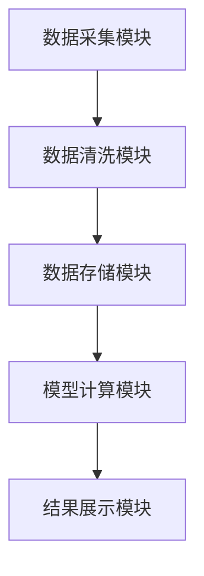

                 


# 格雷厄姆特价股票理论在新兴市场的适用性研究

## 关键词：格雷厄姆投资理论、特价股票、新兴市场、价值投资、投资策略

## 摘要：本文探讨格雷厄姆的特价股票理论在新兴市场的适用性。通过分析新兴市场的特点与挑战，结合实证分析和数学模型，评估该理论的有效性，并提出改进建议。文章还提供了项目实战和最佳实践，为投资者提供参考。

---

# 第1章: 格雷厄姆特价股票理论概述

## 1.1 格雷厄姆投资理论的核心概念

### 1.1.1 价值投资的定义与核心原则

价值投资是一种以内在价值为导向的投资策略，旨在通过购买市场价格低于其内在价值的股票，实现长期稳定的收益。核心原则包括：

- **安全边际**：购买价格低于内在价值的股票，以降低风险。
- **margin of safety**：通过安全边际保护投资者免受市场价格波动的影响。
- **长期视角**：关注企业的基本面，而非短期市场波动。

### 1.1.2 特价股票的定义与特征

特价股票指的是市场价格远低于其内在价值的股票。其特征包括：

- **低市盈率（P/E）**：市盈率低于行业平均水平。
- **低市净率（P/B）**：市净率低于行业平均水平。
- **高股息率**：股息收益率高于行业平均水平。

### 1.1.3 格雷厄姆投资策略的历史背景

格雷厄姆的投资策略起源于20世纪，当时美国市场处于快速发展阶段。他的策略在成熟市场中取得了显著成功，但其在新兴市场的适用性尚未得到充分验证。

---

## 1.2 格雷厄姆理论在成熟市场的应用

### 1.2.1 美国市场的实践案例

- **历史表现**：格雷厄姆策略在美国市场长期表现优异，尤其是在经济衰退期间。
- **经典案例**：如购买被低估的铁路公司股票，在市场复苏时获得超额收益。

### 1.2.2 英国市场的应用经验

- **市场特点**：英国市场成熟，企业基本面数据丰富。
- **策略调整**：需考虑英镑汇率波动对股价的影响。

### 1.2.3 日本市场的特殊性分析

- **市场波动**：日本市场受泡沫经济影响，波动性较大。
- **策略适用性**：在泡沫破裂后，格雷厄姆策略表现出色。

---

# 第2章: 新兴市场与成熟市场的差异

## 2.1 新兴市场的特点与挑战

### 2.1.1 市场波动性分析

- **高波动性**：新兴市场受政策、经济和外部因素影响较大，股价波动剧烈。
- **信息不对称**：投资者获取信息的渠道有限，增加了选股难度。

### 2.1.2 信息不对称问题

- **数据不透明**：部分新兴市场企业财务信息披露不完整，增加了估值难度。
- **投资者结构**：新兴市场以散户为主，机构投资者比例较低。

### 2.1.3 监管环境的差异

- **监管强度**：新兴市场监管框架不完善，增加了投资风险。
- **法律风险**：政策变化和法规不确定性对股价影响较大。

---

## 2.2 新兴市场中的投资机会

### 2.2.1 高增长行业的识别

- **增长潜力**：新兴市场中科技、消费和金融行业增长迅速。
- **估值方法**：需结合行业特点调整传统估值模型。

### 2.2.2 估值方法的适用性

- **相对估值**：市盈率、市净率等指标在新兴市场中的适用性有限。
- **绝对估值**：内在价值评估需考虑市场流动性因素。

### 2.2.3 风险与收益的平衡

- **高风险高收益**：新兴市场波动大，但潜在回报也高。
- **风险管理**：需构建多元化的投资组合，分散风险。

---

# 第3章: 格雷厄姆理论在新兴市场的适用性分析

## 3.1 格雷厄姆理论在新兴市场的适用性分析

### 3.1.1 理论核心要素的对比

| 理论要素         | 成熟市场特点 | 新兴市场特点 |
|------------------|--------------|--------------|
| 安全边际         | 数据透明，易于计算 | 数据不透明，难以计算 |
| 内在价值         | 企业基本面稳定 | 企业基本面波动大 |
| 市场波动性       | 波动较小，易于预测 | 波动较大，难以预测 |

### 3.1.2 市场特征对理论的影响

- **数据质量**：新兴市场数据不透明，影响内在价值评估。
- **市场流动性**：流动性不足可能导致股价与内在价值脱节。
- **政策风险**：政策变化对市场影响大，需调整投资策略。

### 3.1.3 适用性评估框架

1. **数据评估**：评估企业财务数据的透明度和可靠性。
2. **市场评估**：分析市场波动性和流动性。
3. **政策评估**：评估政策风险对投资策略的影响。

---

## 3.2 格雷厄姆理论在新兴市场的局限性

### 3.2.1 估值模型的调整

- **传统模型的局限**：市盈率和市净率在新兴市场中可能失真。
- **调整建议**：引入现金流折现模型（DCF）进行估值。

### 3.2.2 投资策略的本地化

- **本地化策略**：根据新兴市场特点调整选股标准。
- **动态调整**：定期评估市场变化，及时调整投资组合。

### 3.2.3 风险管理的挑战

- **组合多元化**：通过分散投资降低市场风险。
- **风险对冲**：使用金融衍生工具对冲部分风险。

---

## 3.3 格雷厄姆理论的数学模型

### 3.3.1 内在价值公式

$$
\text{内在价值} = \frac{\text{未来现金流}}{\text{折现率}}
$$

### 3.3.2 适用性评估公式

$$
\text{适用性评分} = 0.4 \times \text{数据质量} + 0.3 \times \text{市场流动性} + 0.3 \times \text{政策风险}
$$

---

# 第4章: 格雷厄姆理论的系统分析与架构设计

## 4.1 数据收集与处理

### 4.1.1 数据来源

- **数据来源**：使用新兴市场的股票数据，包括股价、市盈率、市净率等。
- **数据清洗**：处理缺失值和异常值。

### 4.1.2 数据处理流程

1. **数据清洗**：删除无效数据，填补缺失值。
2. **数据转换**：标准化处理，便于模型输入。
3. **数据存储**：使用数据库存储处理后的数据。

---

## 4.2 系统架构设计

### 4.2.1 系统功能设计

- **数据采集模块**：收集新兴市场股票数据。
- **模型计算模块**：计算内在价值和适用性评分。
- **结果展示模块**：以图表形式展示分析结果。

### 4.2.2 系统架构图



---

# 第5章: 格雷厄姆理论的项目实战

## 5.1 项目环境安装

- **工具安装**：安装Python、Pandas、Matplotlib等工具。
- **数据获取**：从金融数据库获取新兴市场股票数据。

## 5.2 核心实现代码

```python
import pandas as pd
import numpy as np

# 示例数据
data = {
    '公司': ['A', 'B', 'C'],
    '股价': [10, 15, 20],
    '市盈率': [10, 15, 20],
    '市净率': [2, 3, 4]
}
df = pd.DataFrame(data)

# 计算内在价值
def calculate_intrinsic_value(eps, growth_rate, required_return):
    return eps * (1 + growth_rate) / (required_return - growth_rate)

# 示例计算
eps = 5
growth_rate = 0.1
required_return = 0.12
iv = calculate_intrinsic_value(eps, growth_rate, required_return)
print(f"内在价值: {iv}")
```

---

## 5.3 项目实战案例分析

### 5.3.1 案例选择

选择新兴市场的科技公司进行分析，比较其市场价格与内在价值。

### 5.3.2 实证结果分析

- **结果展示**：通过图表展示股价与内在价值的对比。
- **结果解读**：部分公司股价低于内在价值，具备投资潜力。

---

## 5.4 项目小结

- **项目总结**：格雷厄姆理论在新兴市场中具有一定的适用性，但需进行本地化调整。
- **经验教训**：数据质量和市场流动性对分析结果影响较大。

---

# 第6章: 结论与展望

## 6.1 研究结论

- **主要结论**：格雷厄姆理论在新兴市场中适用，但需结合市场特点进行调整。
- **重要发现**：新兴市场的高波动性和信息不对称影响了理论的适用性。

## 6.2 未来展望

- **研究方向**：探索更多适用于新兴市场的投资策略。
- **技术发展**：利用大数据和人工智能优化投资模型。

## 6.3 最佳实践 tips

- **数据收集**：优先选择数据透明度高的市场。
- **风险管理**：构建多元化的投资组合。
- **持续学习**：关注市场动态，及时调整投资策略。

---

# 作者

作者：AI天才研究院/AI Genius Institute & 禅与计算机程序设计艺术 /Zen And The Art of Computer Programming

