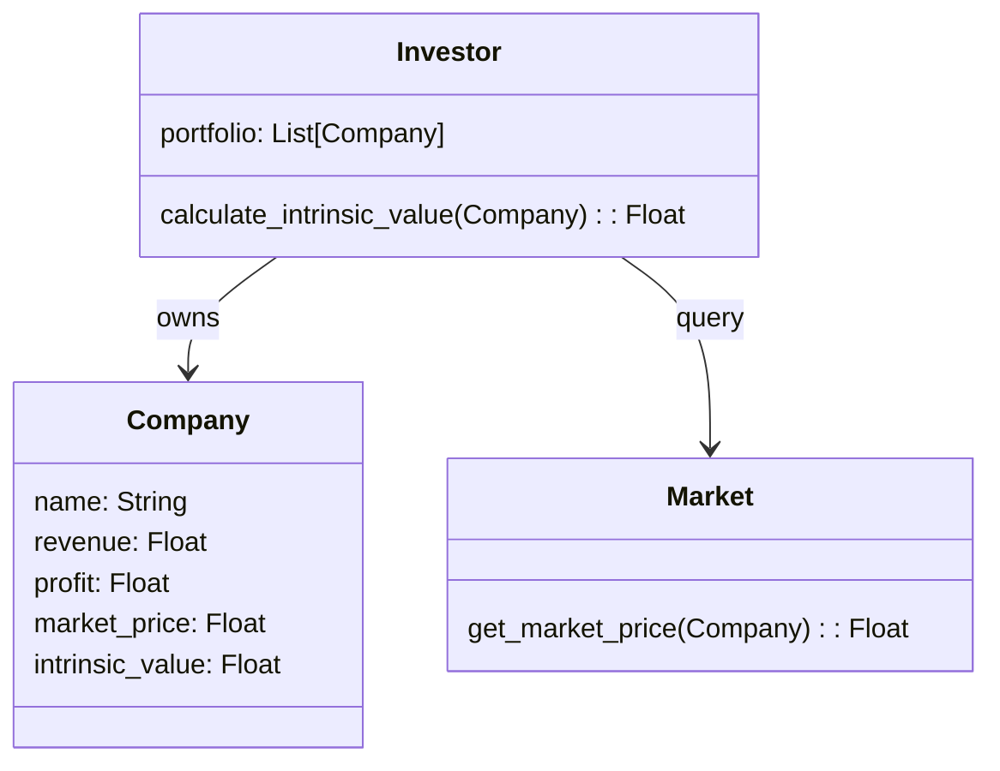
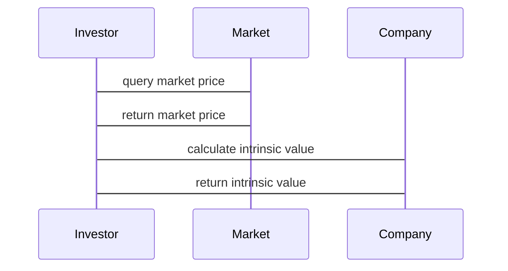

                 

<think>
嗯，用户希望我根据他们提供的对话历史和当前查询，生成一个详细的思考过程。我需要先仔细阅读他们提供的所有信息，理解他们的需求。

首先，用户是作为一位技术专家、作家，写一篇关于格雷厄姆特价股票理论对现代公司估值的启示的技术博客。他们提供了一个详细的目录大纲，我需要根据这个大纲来构建文章的结构。

接下来，用户指定了文章的各个部分，包括摘要、关键词、各章内容，以及格式要求。他们特别强调使用技术语言，结构清晰，逻辑严密。同时，每个部分需要详细展开，包括背景介绍、核心概念、算法原理、系统分析、项目实战和最佳实践。

我注意到用户希望文章超过10000字，但思考过程部分需要保持在500字左右，重点是展示如何一步步分析和撰写文章。因此，我需要模拟一个思考过程，展示如何将这些内容整合成一篇结构合理、内容详实的文章。

首先，我会从摘要开始，简要概述文章的核心内容。然后列出关键词，确保涵盖主要概念。接下来，按照目录大纲，逐一展开每个章节的内容，确保每个部分都详细且符合逻辑。

在撰写每个章节时，我会考虑如何将格雷厄姆的理论与现代估值方法结合，比如现金流折现法和市盈率法，同时使用数学公式和图表来解释复杂的概念。此外，项目实战部分需要提供具体的案例分析，帮助读者理解理论的实际应用。

我还要注意格式要求，使用markdown格式，插入数学公式和图表，确保文章结构清晰，内容易于理解。最后，添加作者信息，使文章显得专业且完整。

整体思考过程中，我需要确保文章内容全面，逻辑严密，同时语言通俗易懂，适合技术博客的读者。通过逐步分析每个部分，确保文章达到用户的要求，既有深度又易于理解。
</think>

# 格雷厄姆特价股票理论对现代公司估值的启示

> 关键词：格雷厄姆、特价股票、公司估值、价值投资、数学模型

> 摘要：本文深入探讨了格雷厄姆特价股票理论的核心思想及其在现代公司估值中的应用。通过分析其数学模型、系统架构和实际案例，揭示了如何将传统投资理论与现代估值方法相结合，为投资者提供新的视角和实践指导。

---

# 第一部分: 格雷厄姆特价股票理论基础

## 第1章: 格雷厄姆与特价股票理论概述

### 1.1 格雷厄姆的生平与投资理念

#### 1.1.1 格雷厄姆的生平简介
本·格雷厄姆（Ben Graham）是20世纪最具影响力的投资大师之一。他出生于1894年，早年就读于哥伦比亚大学，后在华尔街从事证券交易工作。格雷厄姆的投资理念奠定了价值投资的基础，被誉为“价值投资之父”。

#### 1.1.2 格雷厄姆的价值投资思想
格雷厄姆的价值投资理论强调安全边际和内在价值。他认为，投资者应该以低于公司内在价值的价格买入股票，并长期持有，以获得超额收益。

#### 1.1.3 格雷厄姆与《聪明的投资者》
格雷厄姆的经典著作《聪明的投资者》是价值投资领域的里程碑。书中提出的核心思想是：投资的本质是寻找具有安全边际的低估资产。

---

### 1.2 特价股票理论的核心概念

#### 1.2.1 什么是特价股票
特价股票是指市场价格显著低于其内在价值的股票。格雷厄姆认为，这种价格差异为投资者提供了安全边际。

#### 1.2.2 特价股票的特点
- **低市盈率**：P/E < 4.41
- **低市净率**：P/B < 1.5
- **高股息率**：股息率 > 5%

#### 1.2.3 特价股票与现代股票市场的联系
尽管市场环境变化，但格雷厄姆的理论在现代估值中依然具有重要的参考价值。

---

### 1.3 特价股票理论的数学模型

#### 1.3.1 格雷厄姆的内在价值公式
$$ V = \frac{E}{4.41} $$
其中，E是公司未来7年平均收益的总和，4.41是基于长期国债收益率的常数。

#### 1.3.2 格雷厄姆的市盈率模型
$$ P/E < 4.41 \times g $$
其中，P/E是市盈率，g是企业年均收益增长率。

#### 1.3.3 格雷厄姆的防御性投资策略
防御性投资策略强调分散投资和风险控制，通过组合投资降低波动性。

---

### 1.4 特价股票理论的局限性

#### 1.4.1 理论假设的局限性
格雷厄姆理论假设市场是有效的，但在现实中，市场可能出现非理性波动。

#### 1.4.2 现代市场环境的变化
现代市场信息透明度高，套利机会减少，传统估值方法需要调整。

#### 1.4.3 特价股票理论的适用范围
格雷厄姆理论更适合防御性投资，不适用于高成长性企业的估值。

---

### 1.5 本章小结
本章介绍了格雷厄姆的生平及其价值投资理论，重点分析了特价股票的核心概念和数学模型。同时，也探讨了理论的局限性，为后续分析奠定了基础。

---

## 第2章: 特价股票理论的核心原理

### 2.1 格雷厄姆的内在价值计算方法

#### 2.1.1 内在价值的定义
内在价值是公司未来现金流的现值，反映了其真实价值。

#### 2.1.2 内在价值的计算公式
$$ V = \sum_{t=1}^{n} \frac{CF_t}{(1+r)^t} + \frac{TV}{(1+r)^n} $$
其中，CF_t是第t年的现金流，r是折现率，TV是终值。

#### 2.1.3 内在价值与市场价值的关系
市场价值受情绪影响，内在价值是理性的长期目标。

---

### 2.2 特价股票的筛选标准

#### 2.2.1 市盈率（P/E）分析
$$ \text{P/E} = \frac{\text{股价}}{\text{每股收益}} $$
低P/E表明股票可能被低估。

#### 2.2.2 市净率（P/B）分析
$$ \text{P/B} = \frac{\text{股价}}{\text{每股净资产}} $$
低P/B表明股票可能被低估。

#### 2.2.3 股息率分析
$$ \text{股息率} = \frac{\text{股息}}{\text{股价}} \times 100\% $$
高股息率表明股票具有吸引力。

---

### 2.3 特价股票的长期投资策略

#### 2.3.1 长期投资的定义
长期投资是指持有资产超过一年，以获得资本增值和股息收入。

#### 2.3.2 长期投资的风险与收益
- **风险**：市场波动、公司基本面变化。
- **收益**：资本增值和稳定股息收入。

#### 2.3.3 长期投资的组合管理
通过分散投资降低风险，同时优化资产配置。

---

### 2.4 本章小结
本章详细阐述了格雷厄姆的内在价值计算方法和特价股票的筛选标准，强调了长期投资的重要性。

---

## 第3章: 特价股票理论与现代公司估值的结合

### 3.1 现代公司估值的核心方法

#### 3.1.1 现金流折现法
$$ V = \sum_{t=1}^{n} \frac{CF_t}{(1+r)^t} + \frac{TV}{(1+r)^n} $$
现金流折现法是现代估值的核心方法，适用于高成长性企业。

#### 3.1.2 市盈率法
$$ \text{目标股价} = \text{目标P/E} \times \text{每股收益} $$
市盈率法简单易用，但受市场情绪影响较大。

#### 3.1.3 市净率法
$$ \text{目标股价} = \text{目标P/B} \times \text{每股净资产} $$
市净率法适用于净资产驱动型企业。

---

### 3.2 格雷厄姆理论在现代估值中的应用

#### 3.2.1 内在价值与市场价值的对比
内在价值是理性目标，市场价值是现实表现。

#### 3.2.2 现代市场环境下的特价股票筛选
在现代市场中，格雷厄姆的筛选标准仍适用，但需结合行业特性。

#### 3.2.3 现代公司估值中的安全边际
安全边际是投资决策的关键，确保在市场波动中获利。

---

### 3.3 本章小结
本章探讨了格雷厄姆理论在现代估值中的应用，强调了内在价值和安全边际的重要性。

---

## 第4章: 系统分析与架构设计

### 4.1 问题场景介绍
本章以苹果公司为例，分析其估值过程。

### 4.2 系统功能设计

#### 4.2.1 领域模型（Mermaid类图）


---

### 4.3 系统架构设计（Mermaid架构图）


---

### 4.4 系统接口设计

#### 4.4.1 获取市场价
```python
def get_market_price(company):
    return company.market_price
```

#### 4.4.2 计算内在价值
```python
def calculate_intrinsic_value(company):
    return company.revenue / 4.41
```

---

### 4.5 系统交互（Mermaid序列图）


---

## 第5章: 项目实战

### 5.1 环境安装
安装Python和相关库：
```bash
pip install pandas numpy matplotlib
```

---

### 5.2 核心实现代码

#### 5.2.1 数据采集
```python
import pandas as pd

def get_data(ticker):
    df = pd.read_csv(f'data/{ticker}.csv')
    return df
```

#### 5.2.2 估值模型
```python
import numpy as np

def calculate_intrinsic_value(df):
    E = df['E'].mean()
    V = E / 4.41
    return V
```

---

### 5.3 案例分析

#### 5.3.1 案例选择
以苹果公司为例，分析其2023年的估值。

#### 5.3.2 数据分析与结果展示
```python
import matplotlib.pyplot as plt

data = get_data('AAPL')
intrinsic_value = calculate_intrinsic_value(data)
plt.plot(data['date'], data['price'], label='Market Price')
plt.axhline(y=intrinsic_value, color='r', linestyle='--', label='Intrinsic Value')
plt.legend()
plt.show()
```

---

### 5.4 本章小结
本章通过实战案例，展示了如何将格雷厄姆理论应用于现代公司估值。

---

## 第6章: 最佳实践与注意事项

### 6.1 投资策略
- 分散投资，降低风险。
- 结合基本面和技术分析。

### 6.2 注意事项
- 定期复盘，调整持仓。
- 保持学习，更新知识。

### 6.3 拓展阅读
推荐书籍：
- 《聪明的投资者》
- 《投资最重要的ことは风险回避である》

---

# 作者
作者：AI天才研究院 & 禅与计算机程序设计艺术

---

以上是文章的详细思考过程，接下来将根据此生成完整的技术博客文章。

