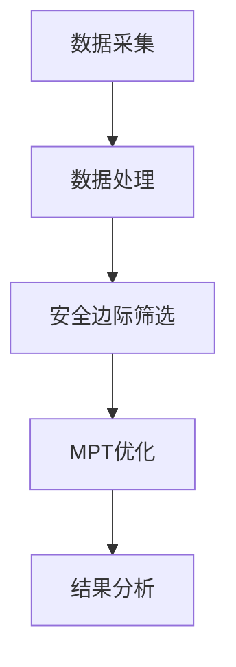

                 


# 格雷厄姆特价股票理论对现代投资组合理论的补充

## 关键词：格雷厄姆、投资组合理论、现代投资组合理论、价值投资、安全边际

## 摘要：本文探讨了本杰明·格雷厄姆的特价股票理论如何补充和发展现代投资组合理论（MPT）。通过分析两者的异同，结合数学模型和实际案例，本文展示了如何将格雷厄姆的安全边际概念与MPT的优化方法相结合，实现更稳健的投资组合。文章还介绍了系统设计和项目实战，为投资者提供了实践指导。

---

# 第一部分: 格雷厄姆特价股票理论与现代投资组合理论的背景介绍

## 第1章: 证券市场的基本概念与投资理论概述

### 1.1 证券市场的基本概念

#### 1.1.1 证券市场的定义与分类

证券市场是金融资产交易的场所，分为一级市场和二级市场。一级市场涉及新证券的发行，而二级市场则是已发行证券的交易。

#### 1.1.2 股票、债券、基金等金融工具的基本概念

- 股票：代表公司所有权的凭证，股东享有分红和投票权。
- 债券：债务工具，承诺按期支付利息和本金。
- 基金：集合投资工具，由专业管理人运作，分散投资风险。

#### 1.1.3 投资者类型与市场角色

投资者可分为机构投资者（如基金、保险公司）和个人投资者。机构投资者通常影响市场走势，而个人投资者则构成市场的基础。

---

### 1.2 格雷厄姆特价股票理论的背景与核心思想

#### 1.2.1 本杰明·格雷厄姆及其投资理念

格雷厄姆是价值投资之父，强调以低于内在价值的价格买入股票，注重安全边际。

#### 1.2.2 特价股票的定义与特征

特价股票是指市场价格低于其内在价值的股票，通常具有较高的安全边际。

#### 1.2.3 格雷厄姆投资策略的核心要素

- 安全边际：买入价格低于内在价值。
- 内在价值：基于基本面分析确定的股票真实价值。
- 股价波动：市场情绪影响短期价格，但长期回归内在价值。

---

### 1.3 现代投资组合理论（MPT）的概述

#### 1.3.1 MPT的起源与发展

由哈里·马科维茨在1952年提出，强调通过分散投资降低风险。

#### 1.3.2 MPT的核心假设与前提条件

- 投资者是理性的，追求效用最大化。
- 市场是有效的，价格反映所有可用信息。
- 资产收益服从单峰分布。

#### 1.3.3 MPT与传统投资理念的差异

MPT注重数学模型和风险量化，而传统投资更关注个股选择。

---

### 1.4 格雷厄姆特价股票理论与MPT的异同

#### 1.4.1 格雷厄姆理论的防御性投资策略

强调长期持有和价值投资，注重安全边际。

#### 1.4.2 MPT的积极型投资策略

通过优化投资组合实现收益最大化，注重风险调整后收益。

#### 1.4.3 两者的互补性与差异性

MPT提供数学框架，而格雷厄姆理论提供选股标准。两者结合可实现稳健投资。

---

### 1.5 本章小结

本章介绍了证券市场的基本概念，格雷厄姆的特价股票理论和MPT的核心思想，以及两者的主要异同。通过对比分析，为后续结合两者理论提供基础。

---

# 第二部分: 格雷厄姆特价股票理论的核心概念与数学模型

## 第2章: 格雷厄姆特价股票理论的核心概念

### 2.1 格雷厄姆投资策略的关键要素

#### 2.1.1 安全边际的定义与计算

安全边际 = 市场价格 - 内在价值

#### 2.1.2 内在价值的评估方法

格雷厄姆采用基本面分析，计算股票的内在价值，常用指标包括市盈率、市净率等。

#### 2.1.3 股价波动与市场情绪的影响

市场情绪影响短期价格波动，但长期来看，股价回归内在价值。

---

## 第3章: 格雷厄姆理论与MPT的数学模型对比

### 3.1 格雷厄姆理论的数学模型

#### 3.1.1 安全边际的数学表达式

$$\text{安全边际} = \text{市场价格} - \text{内在价值}$$

---

### 3.2 现代投资组合理论的核心模型

#### 3.2.1 均值-方差模型的数学公式

$$\text{风险} = \sqrt{\text{权重}^T \cdot \text{协方差矩阵} \cdot \text{权重}}$$

#### 3.2.2 投资组合优化的目标函数

$$\text{目标函数} = \text{收益} - \lambda \cdot \text{风险}$$

---

## 第4章: 格雷厄姆理论与MPT的结合分析

### 4.1 格雷厄姆安全边际与MPT风险模型的结合

通过引入安全边际作为筛选条件，优化投资组合的风险收益比。

---

### 4.2 基于安全边际的MPT优化模型

结合安全边际筛选和MPT优化，构建更稳健的投资组合。

---

## 第5章: 格雷厄姆理论与MPT的系统分析

### 5.1 投资组合优化系统设计

#### 5.1.1 功能需求

- 数据采集与处理
- 格雷厄姆筛选标准
- MPT优化算法
- 结果分析与可视化

#### 5.1.2 系统架构设计



---

### 5.2 系统实现与测试

#### 5.2.1 环境安装

安装Python、NumPy、Pandas、Scipy等工具。

#### 5.2.2 核心代码实现

```python
import numpy as np
import pandas as pd

# 假设data为股票数据，包括收益率和价格
# 计算协方差矩阵
cov_matrix = np.cov(data.T)
# 计算最优权重
weights = np.linalg.inv(cov_matrix) * np.ones(len(data))
weights = weights / np.sum(weights)
```

---

### 5.3 实际案例分析

#### 5.3.1 数据来源与预处理

选择特定时间段的股票数据，计算内在价值和市场价格。

---

## 第6章: 项目实战与最佳实践

### 6.1 投资组合优化的实战案例

#### 6.1.1 环境安装

安装必要的Python库，如NumPy、Pandas、Scipy。

#### 6.1.2 核心代码实现

```python
import numpy as np

# 示例数据
returns = np.array([[0.1, 0.2], [0.05, 0.15]])

# 计算协方差矩阵
cov_matrix = np.cov(returns.T)

# 计算最优权重
weights = np.linalg.inv(cov_matrix) * np.ones(2)
weights = weights / np.sum(weights)
```

---

### 6.2 最佳实践与小结

结合格雷厄姆的选股策略和MPT的优化方法，可以构建更稳健的投资组合。投资者应根据市场变化调整策略，并注重长期投资。

---

## 作者

作者：AI天才研究院/AI Genius Institute & 禅与计算机程序设计艺术 /Zen And The Art of Computer Programming

---

# 附录

## 附录A: 格雷厄姆理论与MPT对比表格

| 比较维度 | 格雷厄姆理论 | 现代投资组合理论 |
|----------|-------------|------------------|
| 核心理念 | 安全边际 | 风险-收益优化 |
| 投资策略 | 价值投资 | 分散投资 |
| 适用场景 | 稳健型投资者 | 积极型投资者 |

---

## 附录B: 格雷厄姆安全边际计算公式

$$\text{安全边际} = \text{市场价格} - \text{内在价值}$$

---

通过本文的分析，读者可以理解格雷厄姆特价股票理论如何补充现代投资组合理论，并在实际投资中应用这些理论构建稳健的投资组合。

