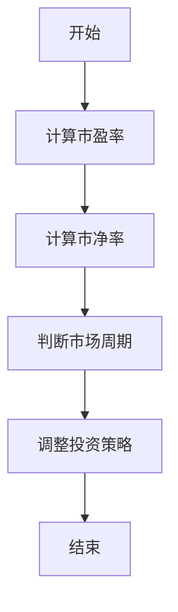
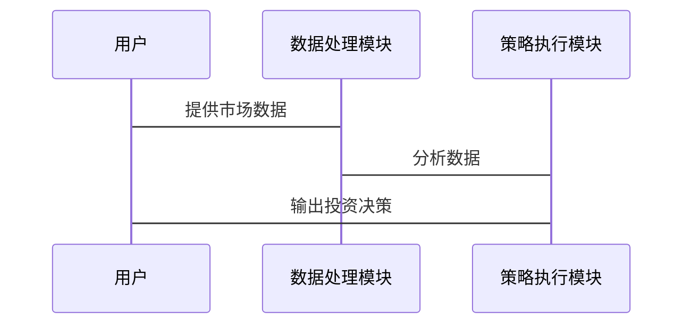

                 


# 格雷厄姆特价股票策略在不同市场周期中的动态调整

> 关键词：格雷厄姆投资理论，特价股票策略，市场周期，动态调整，价值投资

> 摘要：本文深入探讨了格雷厄姆特价股票策略在不同市场周期中的应用与调整。通过分析经济周期、市场情绪和行业周期对策略的影响，结合数学模型与算法原理，提出了在不同市场环境下动态调整投资策略的方法。文章还通过具体案例分析和系统架构设计，展示了如何在实际投资中应用这些策略，并提供了风险管理与心理控制的最佳实践建议。

---

## 第1章: 格雷厄姆特价股票策略的背景与核心概念

### 1.1 格雷厄姆投资理论的起源与发展

#### 1.1.1 价值投资的起源
价值投资是一种以企业内在价值为导向的投资策略，其核心思想是寻找市场价格低于内在价值的股票进行投资。这一理念由本杰明·格雷厄姆（Benjamin Graham）在20世纪初提出，奠定了现代价值投资的基础。

#### 1.1.2 格雷厄姆的投资理念
格雷厄姆强调，投资的本质是寻找具有安全边际（Margin of Safety）的股票。他认为，市场价格会因市场情绪波动而偏离其内在价值，因此在市场低估时买入、在市场高估时卖出是一种有效的投资策略。

#### 1.1.3 特价股票的定义与特征
格雷厄姆定义的特价股票是指那些市场价格远低于其内在价值的股票。这类股票通常具有以下特征：
- 低市盈率（P/E ratio）：市盈率低于行业平均水平。
- 低市净率（P/B ratio）：市净率低于行业平均水平。
- 高股息率：公司愿意通过分红回报股东。

### 1.2 市场周期与投资策略的关系

#### 1.2.1 市场周期的基本类型
市场周期通常分为四个阶段：
1. **衰退期**：经济活动放缓，企业盈利下降。
2. **恢复期**：经济开始复苏，企业盈利逐步恢复。
3. **膨胀期**：经济 overheating，企业盈利增长迅速。
4. **顶峰期**：经济达到峰值，市场可能出现泡沫。

#### 1.2.2 不同周期对投资策略的影响
- **衰退期**：市场情绪低落，适合寻找特价股票。
- **恢复期**：市场情绪逐渐改善，适合逐步增加投资。
- **膨胀期**：市场情绪高涨，需警惕高估风险。
- **顶峰期**：市场可能出现泡沫，需谨慎操作。

#### 1.2.3 格雷厄姆策略在周期中的适用性
格雷厄姆策略在市场低估阶段（衰退期和恢复期初）表现最佳，而在市场高估阶段（膨胀期和顶峰期）需谨慎调整。

### 1.3 格雷厄姆特价股票策略的核心要素

#### 1.3.1 低市盈率与低市净率的定义
- 市盈率（P/E ratio）= 股票价格 / 每股收益（EPS）
- 市净率（P/B ratio）= 股票价格 / 每股净资产（BPS）

#### 1.3.2 股东权益与企业价值的评估
格雷厄姆强调通过分析公司财务报表，尤其是股东权益和企业价值，来评估股票的内在价值。

#### 1.3.3 财务指标在策略中的应用
关键财务指标包括：
- 每股收益（EPS）
- 每股净资产（BPS）
- 净利润
- 资产负债率

---

## 第2章: 格雷厄姆特价股票策略的数学模型与算法原理

### 2.1 格雷厄姆策略的核心数学公式

#### 2.1.1 市盈率计算公式
$$
市盈率 = \frac{股票价格}{每股收益}
$$

#### 2.1.2 市净率计算公式
$$
市净率 = \frac{股票价格}{每股净资产}
$$

#### 2.1.3 股东权益计算公式
$$
股东权益 = 资产 - 负债
$$

### 2.2 策略的动态调整算法

#### 2.2.1 动态调整的条件判断
- 如果当前市盈率 < 历史平均市盈率，且市净率 < 历史平均市净率，则增加投资。
- 如果当前市盈率 > 历史平均市盈率，且市净率 > 历史平均市净率，则减少投资。

#### 2.2.2 市场周期的识别算法
1. 收集过去5年以上的市场数据。
2. 计算每段时间的市盈率和市净率平均值。
3. 判断当前市场是否处于低估或高估状态。

#### 2.2.3 投资组合的优化算法
1. 根据市场周期调整投资比例。
2. 优先选择低市盈率和低市净率的股票。
3. 定期重新评估投资组合，确保符合当前市场环境。

### 2.3 算法的流程图



### 2.4 本章小结

---

## 第3章: 格雷厄姆策略在不同市场周期中的应用

### 3.1 经济周期对策略的影响

#### 3.1.1 衰退期的策略调整
- 市场情绪低迷，适合寻找特价股票。
- 优先选择低市盈率和低市净率的股票。

#### 3.1.2 恢复期的策略调整
- 市场情绪逐渐改善，逐步增加投资。
- 保持对低市盈率和低市净率股票的关注。

#### 3.1.3 膨胀期的策略调整
- 市场情绪高涨，需警惕高估风险。
- 减少投资比例，避免过度暴露在高估值股票中。

#### 3.1.4 顶峰期的策略调整
- 市场可能出现泡沫，需谨慎操作。
- 考虑逐步退出或降低投资比例。

### 3.2 市场情绪对策略的影响

#### 3.2.1 市场恐慌时的策略
- 增加投资，利用市场恐慌寻找廉价股票。

#### 3.2.2 市场乐观时的策略
- 减少投资，避免高位入场。

#### 3.2.3 市场中性时的策略
- 保持适度投资，根据市场情况灵活调整。

### 3.3 行业周期对策略的影响

#### 3.3.1 周期性行业的识别
- 行业周期波动较大的行业，如能源和制造业。

#### 3.3.2 非周期性行业的策略
- 非周期性行业（如公用事业和消费品行业）在市场波动中更具防御性。

#### 3.3.3 行业拐点的判断
- 通过分析行业财务数据和市场趋势，判断行业是否处于拐点。

### 3.4 本章小结

---

## 第4章: 格雷厄姆策略的系统分析与架构设计

### 4.1 问题场景介绍
- 投资者需要根据市场周期动态调整投资策略。

### 4.2 系统功能设计

#### 4.2.1 领域模型


#### 4.2.2 系统架构设计


#### 4.2.3 系统接口设计
- 数据接口：从数据源获取市场数据。
- 策略接口：根据市场数据执行策略。

#### 4.2.4 系统交互设计


### 4.3 本章小结

---

## 第5章: 格雷厄姆策略的实战案例

### 5.1 环境安装
- 数据源：Yahoo Finance 或其他金融数据平台。
- 工具：Python、Pandas、Matplotlib。

### 5.2 核心实现源代码

#### 5.2.1 数据获取与预处理
```python
import pandas as pd
import yfinance as yf

# 获取股票数据
data = yf.download('AAPL', start='2020-01-01', end='2023-12-31')

# 计算市盈率和市净率
data['PE'] = data['Close'] / data['EPS']
data['PB'] = data['Close'] / data['Book Value per Share']
```

#### 5.2.2 策略实现
```python
def graham_strategy(data):
    # 计算平均市盈率和市净率
    avg_pe = data['PE'].mean()
    avg_pb = data['PB'].mean()
    
    # 判断当前估值
    if data['PE'][-1] < avg_pe and data['PB'][-1] < avg_pb:
        return '买入'
    elif data['PE'][-1] > avg_pe and data['PB'][-1] > avg_pb:
        return '卖出'
    else:
        return '持有'
```

### 5.3 案例分析与解读
- 以苹果公司（AAPL）为例，分析其市盈率和市净率的变化。
- 根据策略模型，判断当前是否适合买入、卖出或持有。

### 5.4 本章小结

---

## 第6章: 风险管理与心理控制

### 6.1 风险管理策略
- 设置止损点：当股价下跌超过一定比例时，立即卖出。
- 分批建仓：避免一次性投入过多资金，分散风险。

### 6.2 心理控制
- 避免情绪化决策：在市场波动时保持冷静。
- 定期回顾与调整：根据市场变化及时优化投资组合。

### 6.3 本章小结

---

## 第7章: 总结与展望

### 7.1 总结
- 格雷厄姆策略在不同市场周期中的动态调整是一种有效的投资方法。
- 通过数学模型和系统架构设计，可以更好地实现策略的自动化和优化。

### 7.2 展望
- 结合人工智能技术，进一步优化策略。
- 开发更多适应不同市场环境的策略模型。

### 7.3 本章小结

---

## 作者：AI天才研究院/AI Genius Institute & 禅与计算机程序设计艺术 /Zen And The Art of Computer Programming

---

通过本文的分析与实践，我们可以看到，格雷厄姆特价股票策略在不同市场周期中的动态调整不仅是一种理论方法，更是一种可以在实际投资中应用的策略。希望本文的内容能够为投资者提供有价值的参考和启发。

