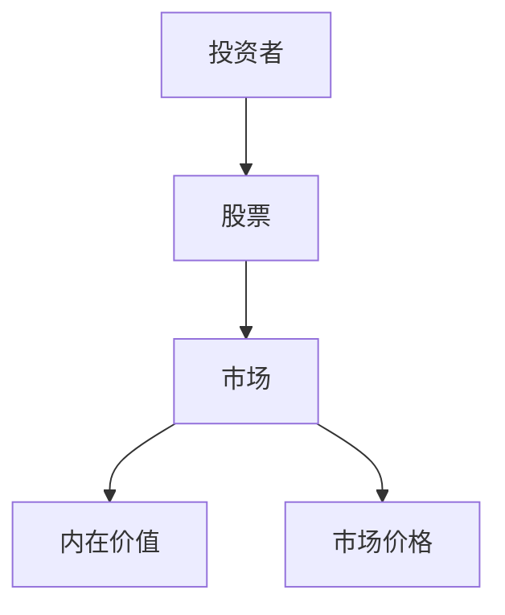
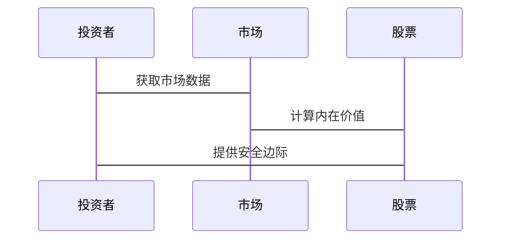

                 


# 格雷厄姆特价股票策略在不同市场效率下的表现

> 关键词：格雷厄姆特价股票策略、市场效率、价值投资、安全边际、内在价值、数学模型、系统设计

> 摘要：本文深入分析了格雷厄姆特价股票策略在不同市场效率下的表现。从策略的背景与核心概念出发，结合数学模型与实证分析，探讨了策略在弱有效、半强有效与强有效市场中的适用性。通过系统架构设计与项目实战，展示了策略的实际应用价值，并提出了优化建议。

---

# 第一部分: 格雷厄姆特价股票策略概述

## 第1章: 格雷厄姆特价股票策略的背景与核心概念

### 1.1 格雷厄姆投资理论的起源与发展

#### 1.1.1 价值投资的起源
- **价值投资**起源于20世纪初，由本杰明·格雷厄姆和戴维·多德共同提出。
- 格雷厄姆的学生彼得·林奇和沃伦·巴菲特继承并发扬了这一理论。
- 格雷厄姆强调**安全边际**和**内在价值**，认为市场短期是投票机，长期是称重机。

#### 1.1.2 格雷厄姆的投资理念
- **买入低于内在价值的股票**：通过分析公司的基本面，寻找市场价格低于内在价值的股票。
- **安全边际**：买入价格与内在价值的差距越大，安全边际越高，投资风险越小。
- **分散投资**：通过投资多个股票分散风险。

#### 1.1.3 特价股票的定义与特征
- **特价股票**：市场价格远低于内在价值的股票。
- **特征**：
  - 价格低廉。
  - 市盈率、市净率等估值指标显著低于行业平均水平。
  - 公司基本面良好，具备长期增长潜力。

### 1.2 市场效率的层次与分类

#### 1.2.1 市场效率的定义
- **市场效率**：指市场价格反映所有相关信息的速度和程度。
- **有效市场假说（EMH）**：市场价格已经反映了所有公开信息，因此无法通过分析找到定价错误的股票。

#### 1.2.2 弱有效、半强有效与强有效市场的区分
- **弱有效市场**：市场价格反映历史信息，技术分析无效。
- **半强有效市场**：市场价格反映所有公开信息，基本面分析无效。
- **强有效市场**：市场价格反映所有公开和非公开信息，内部信息无用。

#### 1.2.3 不同市场效率下股票定价的差异
- **弱有效市场**：部分股票定价偏离内在价值，存在套利机会。
- **半强有效市场**：股票定价接近内在价值，套利机会减少。
- **强有效市场**：股票定价等于内在价值，无套利机会。

---

## 第2章: 格雷厄姆特价股票策略的核心概念与联系

### 2.1 核心概念原理

#### 2.1.1 安全边际的概念
- **安全边际**：买入价格与内在价值的差距。
- **公式**：$$ \text{安全边际} = \text{买入价格} - \text{内在价值} $$
- **作用**：降低投资风险，缓冲短期市场波动的影响。

#### 2.1.2 内在价值的计算方法
- **内在价值**：基于公司基本面分析，预测未来现金流的现值。
- **公式**：$$ V = \sum_{t=1}^{n} \frac{CF_t}{(1 + r)^t} $$
  - \( V \)：内在价值
  - \( CF_t \)：第 \( t \) 年的现金流
  - \( r \)：折现率
  - \( n \)：预测年数

#### 2.1.3 市场价格与内在价值的偏离
- **市场波动**：短期市场波动可能导致市场价格偏离内在价值。
- **价值回归**：长期来看，市场价格趋向于内在价值。

### 2.2 核心概念属性特征对比

#### 2.2.1 安全边际与风险控制的对比
| 特性         | 安全边际              | 风险控制              |
|--------------|-----------------------|-----------------------|
| **定义**     | 买入价格与内在价值的差距 | 控制投资风险的措施    |
| **作用**     | 减少投资损失           | 降低投资风险          |
| **实施**     | 选择低价股票           | 分散投资、止损设置    |

#### 2.2.2 内在价值与市场价格的关系
- **低效市场**：市场价格与内在价值存在较大偏离。
- **高效市场**：市场价格接近内在价值。

#### 2.2.3 不同市场效率下策略的适用性
- **弱有效市场**：适合格雷厄姆策略。
- **半强有效市场**：部分适用。
- **强有效市场**：几乎不适用。

### 2.3 ER实体关系图


---

## 第3章: 格雷厄姆特价股票策略的数学模型与实证分析

### 3.1 格雷厄姆策略的数学模型

#### 3.1.1 内在价值计算公式
$$ V = \frac{E}{1 + r} $$
- \( E \)：预期收益
- \( r \)：折现率

#### 3.1.2 安全边际计算公式
$$ S = P \times (1 - \frac{1}{V}) $$
- \( S \)：安全边际
- \( P \)：市场价格

### 3.2 不同市场效率下的策略表现

#### 3.2.1 弱有效市场下的策略效果
- **表现**：容易找到定价低于内在价值的股票。
- **挑战**：市场效率提高，套利机会减少。

#### 3.2.2 半强有效市场下的策略调整
- **调整**：增加对基本面分析的重视。
- **效果**：部分股票仍存在低估机会。

#### 3.2.3 强有效市场下的策略优化
- **优化**：结合技术分析和基本面分析。
- **效果**：难以找到显著低估的股票。

---

## 第4章: 系统分析与架构设计方案

### 4.1 系统功能设计

#### 4.1.1 领域模型


### 4.2 系统架构设计

#### 4.2.1 系统架构图


### 4.3 系统接口设计

#### 4.3.1 数据接口
- **输入**：股票数据、市场数据。
- **输出**：内在价值、市场价格、安全边际。

### 4.4 系统交互设计

#### 4.4.1 交互序列图


---

## 第5章: 项目实战

### 5.1 环境安装

#### 5.1.1 安装Python环境
```bash
python --version
pip install numpy pandas matplotlib
```

### 5.2 系统核心实现源代码

#### 5.2.1 计算内在价值的代码
```python
def calculate_intrinsic_value(earnings, discount_rate):
    return earnings / (1 + discount_rate)
```

#### 5.2.2 计算安全边际的代码
```python
def calculate_margin_of_safety(price, intrinsic_value):
    return price * (1 - 1 / intrinsic_value)
```

### 5.3 实际案例分析

#### 5.3.1 案例分析
- **公司**：XYZ公司
- **数据**：
  - 净利润：$100万
  - 折现率：5%
  - 市场价格：$20
  - 内在价值：$$ \frac{100}{1 + 0.05} = 95.24 $$
  - 安全边际：$$ 20 \times (1 - \frac{1}{95.24}) = 20 \times 0.8105 = 16.21 $$

### 5.4 项目小结

#### 5.4.1 项目总结
- **优势**：格雷厄姆策略在低效市场中表现优异。
- **挑战**：在高效市场中难以找到低估股票。
- **优化建议**：结合技术分析和基本面分析。

---

## 第6章: 最佳实践、小结、注意事项、拓展阅读

### 6.1 最佳实践
- **持续学习**：关注市场变化，调整投资策略。
- **风险管理**：设置止损点，分散投资。

### 6.2 小结
- 格雷厄姆策略在低效市场中表现优异，但在高效市场中难以实现超额收益。
- 投资者应根据市场环境调整策略，结合技术分析和基本面分析。

### 6.3 注意事项
- **市场环境**：策略在低效市场中效果最佳。
- **数据质量**：确保数据准确，避免误判。

### 6.4 拓展阅读
- 《证券分析》（The Analysis of Investment Value）——本杰明·格雷厄姆
- 《投资学基础》——查尔斯·埃文斯

---

# 作者：AI天才研究院/AI Genius Institute & 禅与计算机程序设计艺术 /Zen And The Art of Computer Programming

