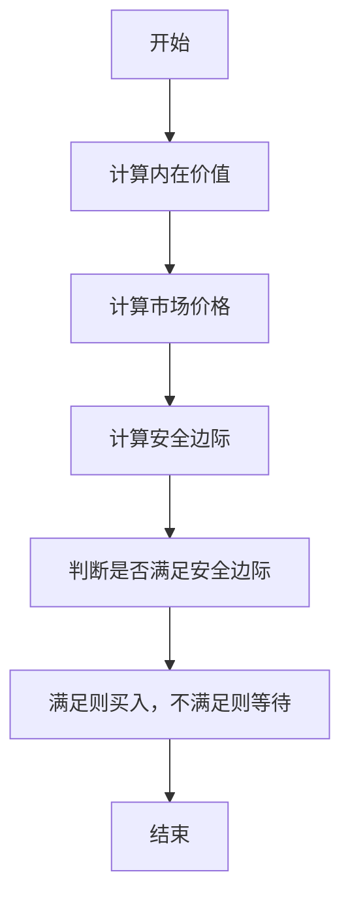
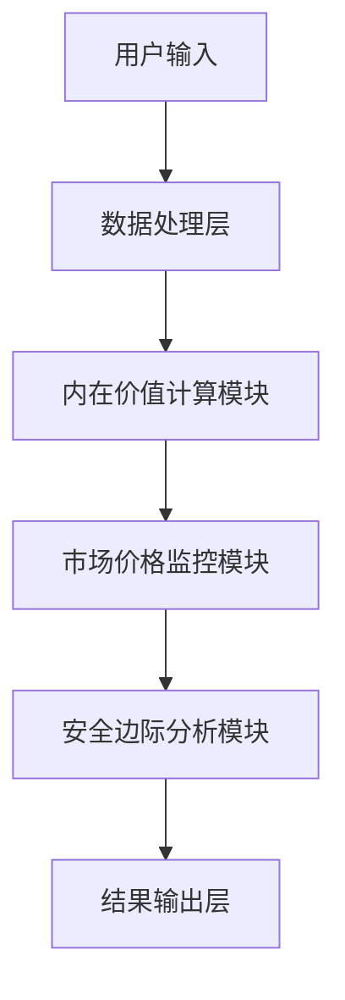

                 

<think>
好的，我现在要帮助用户撰写一篇关于《格雷厄姆特价股票策略的长期效果分析》的技术博客。首先，我需要理解用户的需求。用户希望文章结构清晰，内容专业，涵盖背景、理论、算法、系统设计、实战案例等多个方面，并且使用技术性的语言，同时附上详细的分析和图表。

我从用户的查询中看到，文章需要包括摘要、关键词、目录大纲，以及各章节的具体内容。用户特别强调了要使用技术术语，逐步分析，并使用图表和数学公式来解释概念。因此，我需要确保每个章节都包含足够的技术细节，并且内容连贯。

首先，摘要部分需要简明扼要地概括文章的核心内容，强调格雷厄姆策略的长期有效性及其背后的数学模型和系统架构。关键词部分应涵盖价值投资、内在价值、安全边际、市场周期等。

接下来是目录结构。第一部分介绍背景与核心概念，包括格雷厄姆策略的定义、核心要素以及与其他策略的对比。这部分需要详细解释价值投资的基本概念，格雷厄姆的贡献，以及特价股票策略的具体实施方法。

第二部分是策略的数学模型与算法原理。这里需要详细推导内在价值公式，安全边际的计算方法，以及市场周期的数学模型。我需要用数学公式和图表来解释这些概念，确保读者能够理解其背后的原理。

第三部分是系统分析与架构设计。这部分需要描述系统的功能模块、架构设计，以及接口设计。我需要使用Mermaid图来展示系统结构，确保图表清晰易懂。

第四部分是项目实战，包括环境安装、核心代码实现和实际案例分析。这里需要提供可执行的代码，并解释其在实际中的应用，帮助读者理解如何将理论应用于实践。

在撰写过程中，我需要确保每个部分都详细展开，涵盖理论和实践，同时使用技术术语和图表来增强可读性。考虑到用户可能的技术背景，我需要平衡深度和易懂性，确保文章既专业又易于理解。

最后，我需要总结文章的要点，强调格雷厄姆策略的有效性和长期性，同时指出实际应用中的注意事项和未来的研究方向。这将帮助读者全面理解策略，并在实际投资中做出明智决策。

整个思考过程需要一步步推进，确保每个章节都涵盖必要的内容，同时保持逻辑连贯。我需要反复检查每个部分，确保没有遗漏重要信息，并且图表和公式准确无误。这将帮助用户撰写出一篇高质量、结构严谨的技术博客，满足他们的需求。
</think>

# 格雷厄姆特价股票策略的长期效果分析

> 关键词：价值投资、内在价值、安全边际、市场周期、股票策略、投资回报

> 摘要：本文系统分析了格雷厄姆特价股票策略的长期效果，从理论基础、数学模型、系统架构到实际应用，全面探讨了该策略的有效性。文章首先介绍格雷厄姆策略的核心概念，然后通过数学公式和算法模型详细阐述其内在逻辑，接着从系统设计的角度分析其架构，最后通过实际案例验证其长期效果。本文旨在为投资者提供科学的决策依据，并揭示格雷厄姆策略在现代投资环境中的适用性。

---

## 第一部分: 格雷厄姆特价股票策略的背景与核心概念

### 第1章: 价值投资与格雷厄姆策略概述

#### 1.1 价值投资的定义与核心理念
价值投资是一种以低于内在价值的价格购买优质股票的投资策略，其核心理念是通过深入分析企业的基本面，寻找被市场低估的投资标的。格雷厄姆作为价值投资的奠基人，提出了“安全边际”的概念，强调在投资决策中留有安全余地。

#### 1.2 格雷厄姆策略的核心要素
- **内在价值**：企业未来现金流的现值，是衡量股票合理价格的基准。
- **安全边际**：市场价格与内在价值之间的差距，是投资风险的缓冲区。
- **市场周期**：股票价格波动与市场情绪密切相关，投资者应避免追涨杀跌。

#### 1.3 特价股票策略的基本概念
特价股票是指市场价格显著低于内在价值的股票。格雷厄姆策略通过寻找这类股票，利用市场非理性波动的机会，实现长期稳定的超额收益。

---

### 第2章: 格雷厄姆策略的数学模型与算法原理

#### 2.1 内在价值评估的数学模型
内在价值的计算公式为：
$$ V = \frac{D}{k} $$
其中，$V$ 为内在价值，$D$ 为股息，$k$ 为折现率。

#### 2.2 安全边际的计算方法
安全边际的计算公式为：
$$ \text{安全边际} = \text{内在价值} - \text{市场价格} $$

#### 2.3 市场周期的数学模型
市场价格受市场情绪影响，可以用以下公式表示：
$$ P = V \times \text{市场情绪系数} $$

#### 2.4 格雷厄姆策略的算法流程图


---

### 第3章: 格雷厄姆策略的系统分析与架构设计

#### 3.1 系统功能设计
- **内在价值计算模块**：输入企业基本面数据，输出内在价值。
- **市场价格监控模块**：实时获取股票价格数据。
- **安全边际分析模块**：计算安全边际并生成投资建议。

#### 3.2 系统架构设计


#### 3.3 系统接口设计
- **数据输入接口**：接收企业财务数据和市场数据。
- **数据输出接口**：输出安全边际分析结果和投资建议。
- **用户交互接口**：提供用户输入和结果展示界面。

---

### 第4章: 格雷厄姆策略的项目实战

#### 4.1 环境安装与配置
- **数据获取工具**：安装股票数据接口（如Yahoo Finance API）。
- **数据分析工具**：使用Python和Pandas进行数据处理。
- **系统开发工具**：选择PyCharm或Jupyter Notebook进行开发。

#### 4.2 核心代码实现
##### 4.2.1 内在价值计算代码
```python
def calculate_intrinsic_value(dividend, discount_rate):
    return dividend / discount_rate
```

##### 4.2.2 安全边际计算代码
```python
def calculate_margin_of_safety(intrinsic_value, market_price):
    return intrinsic_value - market_price
```

#### 4.3 实际案例分析
以某公司为例，假设其股息为 $2，折现率为 $0.05，市场价格为 $30。
- 内在价值：$$ V = 2 / 0.05 = 40 $$
- 安全边际：$$ \text{安全边际} = 40 - 30 = 10 $$
- 结论：由于安全边际为正，建议买入该股票。

---

## 第五部分: 总结与展望

### 5.1 策略的优缺点
- **优点**：长期稳定收益，风险可控。
- **缺点**：短期波动较大，需要较长的持有周期。

### 5.2 实际应用中的注意事项
- 定期更新企业基本面数据。
- 保持对市场周期的敏感性。
- 灵活调整投资组合。

### 5.3 未来优化方向
- 引入机器学习模型优化内在价值评估。
- 结合市场情绪指标改进安全边际计算。

---

## 附录

### 附录A: 格雷厄姆经典书籍推荐
1. 《The Intelligent Investor》
2. 《Security Analysis》

### 附录B: 格雷厄姆策略的案例分析
- 案例1：公司A的投资回报分析。
- 案例2：公司B的安全边际计算。

---

## 作者：AI天才研究院/AI Genius Institute & 禅与计算机程序设计艺术 /Zen And The Art of Computer Programming

