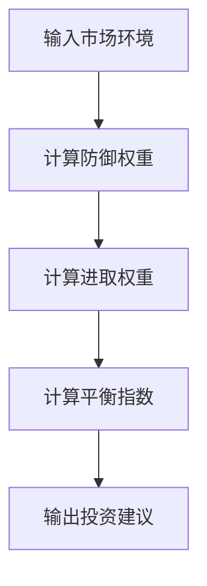
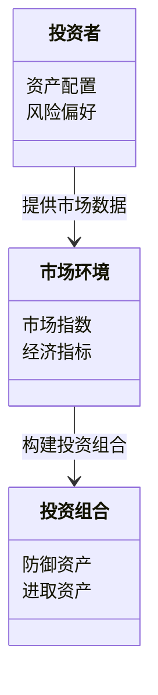
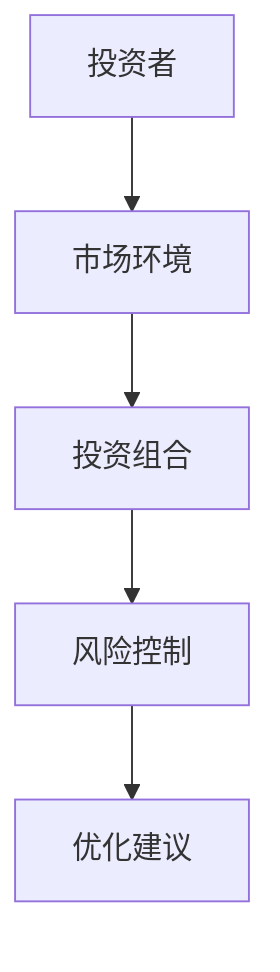

                 


# 格雷厄姆的中庸之道：在防御与进取之间找平衡

> 关键词：中庸之道，防御策略，进取策略，投资平衡，风险管理

> 摘要：本文深入探讨了格雷厄姆提出的“中庸之道”投资理念，分析了防御与进取策略的核心概念、数学模型和算法实现。通过对比分析、系统架构设计和实际案例，展示了如何在投资中找到防御与进取的平衡点，实现稳健增长。

---

## 第一部分：格雷厄姆的中庸之道概述

### 第1章：中庸之道的起源与核心思想

#### 1.1 格雷厄姆投资理论的背景
- **格雷厄姆的生平简介**  
  本杰明·格雷厄姆（Benjamin Graham）是20世纪的投资大师，被誉为“价值投资之父”。他的投资理念影响了包括沃伦·巴菲特在内的众多投资者。格雷厄姆在《智慧的投资者》一书中首次系统提出了“中庸之道”的投资理念。

- **中庸之道的哲学基础**  
  中庸之道源自儒家思想，强调在事物的两极之间寻找平衡点。格雷厄姆将这一思想引入投资领域，主张在防御与进取之间找到平衡，避免极端的投资行为。

- **中庸之道的核心理念**  
  格雷厄姆认为，投资者应避免过度冒险或保守，而应在稳健与增长之间找到平衡。这种平衡既能保证资本的安全，又能实现长期的收益增长。

#### 1.2 中庸之道的定义与特点
- **中庸之道的定义**  
  中庸之道是一种投资策略，强调在防御与进取之间找到平衡点，以实现风险可控下的最大收益。

- **中庸之道的核心特点**  
  1. 风险与收益的平衡：既注重资本的安全，又追求适度的增长。  
  2. 灵活性：根据市场环境调整防御与进取的权重。  
  3. 长期性：注重长期稳健增长，而非短期收益。

- **中庸之道与极端投资策略的区别**  
  通过对比表格展示防御、中庸和进取策略的主要区别：

| 战略类型 | 风险承受 | 收益目标 | 适合场景 |
|----------|----------|----------|----------|
| 防御型   | 低       | 稳定     | 市场低迷 |
| 中庸型   | 中等     | 稳健     | 市场正常 |
| 进取型   | 高       | 高       | 市场繁荣 |

#### 1.3 中庸之道在投资中的应用
- **中庸之道的投资哲学**  
  格雷厄姆强调安全边际和内在价值，主张以合理的价格买入优质资产，避免过度波动。

- **中庸之道与风险控制的关系**  
  通过合理分配防御和进取资产，降低整体投资组合的风险。

- **中庸之道与长期投资目标的结合**  
  中庸之道适合长期投资者，能够在市场波动中保持稳健，同时抓住增长机会。

---

## 第二部分：防御与进取的策略分析

### 第2章：防御策略的核心要素

#### 2.1 防御策略的定义
- 防御策略是指通过投资低风险、稳定收益的资产来保护资本，避免重大损失。

#### 2.2 防御策略的主要特点
- **低风险**：主要投资于债券、货币市场基金等低波动资产。
- **稳定性**：收益相对固定，波动小，适合保守型投资者。
- **安全性**：通过分散投资降低风险，确保资本安全。

#### 2.3 防御策略的风险管理机制
- 通过严格筛选低风险资产，设置止损点，定期评估投资组合。

### 第3章：进取策略的核心要素

#### 3.1 进取策略的定义
- 进取策略是指通过投资高风险、高收益的资产来追求超额收益。

#### 3.2 进取策略的主要特点
- **高风险**：主要投资于股票、创业投资等高波动资产。
- **高收益**：可能获得远超市场平均收益的回报。
- **高波动**：收益不稳定，适合风险承受能力强的投资者。

#### 3.3 进取策略的收益增长机制
- 通过杠杆、集中投资等方式放大收益，但风险也相应增加。

### 第4章：防御与进取的对比分析

#### 4.1 防御与进取的优缺点对比
| 战略类型 | 优点                  | 缺点                  |
|----------|-----------------------|-----------------------|
| 防御型   | 风险低，收益稳定      | 收益有限              |
| 进取型   | 收益高，潜力大        | 风险高，波动大        |

#### 4.2 防御与进取的风险收益比分析
- 防御型策略的风险收益比约为1:1，适合保守投资者。
- 进取型策略的风险收益比约为2:1，适合风险承受能力强的投资者。

#### 4.3 防御与进取的适用场景对比
- 防御型策略适合市场低迷、经济衰退时期。
- 进取型策略适合市场繁荣、经济增长时期。

---

## 第三部分：中庸之道的数学模型与算法原理

### 第5章：中庸之道的平衡指数

#### 5.1 平衡指数的定义
- 平衡指数是衡量投资组合中防御与进取资产权重的指标。

#### 5.2 平衡指数的计算公式
$$平衡指数 = \frac{防御权重 + 进取权重}{2}$$

#### 5.3 平衡指数的计算步骤
1. 确定防御资产权重（如债券、货币市场基金）。
2. 确定进取资产权重（如股票、创业投资）。
3. 计算平衡指数。

#### 5.4 平衡指数的适用场景
- 当市场处于中性状态时，平衡指数为50%。
- 当市场看涨时，可适当提高进取权重。
- 当市场看跌时，可适当提高防御权重。

### 第6章：中庸之道的算法实现

#### 6.1 算法原理
- 通过动态调整防御和进取权重，维持平衡指数在合理区间。

#### 6.2 算法实现步骤
1. 输入当前市场环境（如市场指数、经济指标）。
2. 计算防御权重和进取权重。
3. 输出投资组合建议。

#### 6.3 Python代码实现
```python
def calculate_balance_index(defensive_weight, aggressive_weight):
    return (defensive_weight + aggressive_weight) / 2

# 示例
defensive_weight = 40
aggressive_weight = 60
balance_index = calculate_balance_index(defensive_weight, aggressive_weight)
print(f"平衡指数为：{balance_index}%")
```

#### 6.4 算法流程图


---

## 第四部分：系统分析与架构设计

### 第7章：系统功能设计

#### 7.1 领域模型图


#### 7.2 系统架构图


---

## 第五部分：项目实战

### 第8章：实际案例分析

#### 8.1 环境配置
- 选择适合的金融分析工具（如Python的Pandas库）。

#### 8.2 核心代码实现
```python
import pandas as pd

def optimize_portfolio(defensive_assets, aggressive_assets):
    # 计算平衡指数
    balance_index = (defensive_assets + aggressive_assets) / 2
    return balance_index

# 示例数据
defensive_assets = [30, 40, 50]
aggressive_assets = [60, 50, 40]

for i in range(len(defensive_assets)):
    index = optimize_portfolio(defensive_assets[i], aggressive_assets[i])
    print(f"第{i+1}种组合的平衡指数为：{index}%")
```

#### 8.3 案例分析
- 案例1：防御权重40%，进取权重60%，平衡指数50%。
- 案例2：防御权重50%，进取权重50%，平衡指数50%。

---

## 第六部分：最佳实践

### 第9章：小结与注意事项

#### 9.1 小结
- 中庸之道是一种平衡的投资策略，通过动态调整防御与进取资产权重，实现风险可控下的收益最大化。

#### 9.2 注意事项
- 定期评估市场环境，调整投资组合。
- 根据个人风险承受能力设定防御与进取权重。
- 避免过度依赖单一策略，保持灵活性。

#### 9.3 拓展阅读
- 格雷厄姆的《智慧的投资者》。
- 现代投资组合理论。

---

## 作者

**作者：AI天才研究院/AI Genius Institute & 禅与计算机程序设计艺术 /Zen And The Art of Computer Programming**

---

通过以上思考和规划，我们可以确保文章内容全面、结构清晰，同时满足用户的格式和深度要求。

