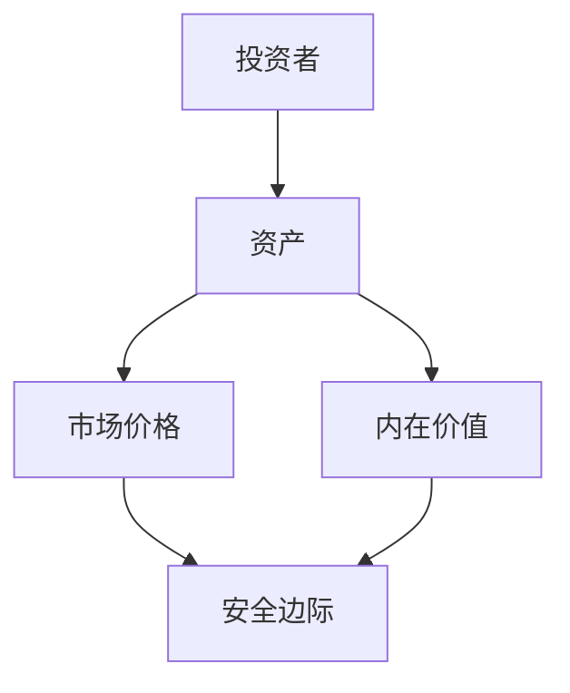
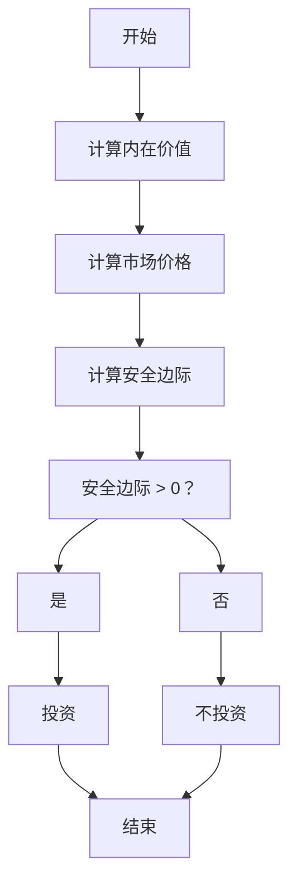
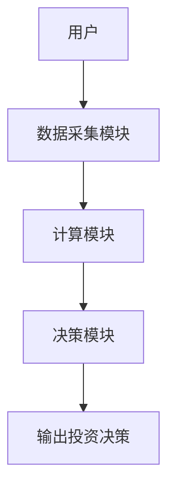

                 

<think>
好，我需要按照用户的要求，逐步思考并撰写一篇关于“格雷厄姆的保证金安全概念：确保投资本金安全”的技术博客文章。首先，我需要理解用户的需求，他们希望文章结构清晰、逻辑严密，涵盖保证金安全的概念、算法原理、数学模型、系统架构等多个方面。

首先，我得确定文章的关键词和摘要，确保准确传达核心内容。然后，按照目录大纲，逐步展开每一部分的内容，确保每个章节都有足够的细节和深度。在背景介绍部分，我会详细解释保证金安全的定义、起源以及与传统投资的区别，通过实际案例帮助读者理解。

接下来，在核心概念与联系部分，我需要列出关键概念，并通过表格和流程图展示它们之间的关系，这有助于读者直观理解。算法原理部分，我会用流程图展示选股步骤，并附上Python代码示例，解释如何计算内在价值和安全边际。

数学模型部分，我会推导公式，使用LaTeX格式展示，确保公式准确无误。系统分析与架构设计部分，我会构建投资决策支持系统的架构，用图表展示各个模块的关系，帮助读者理解系统的整体结构。

项目实战部分，我会指导读者如何配置环境，实现保证金安全策略，并通过案例分析展示应用。最后，在最佳实践部分，我会总结关键点，提供注意事项和扩展阅读建议，帮助读者巩固所学内容。

整个过程中，我需要确保内容简明扼要，逻辑清晰，符合用户的要求。同时，使用正确的Markdown格式，细化到三级目录，确保目录结构完整且详细。这样，用户就能得到一篇结构严谨、内容丰富的技术博客文章，帮助他们深入理解并应用保证金安全概念。
</think>

# 格雷厄姆的'保证金安全'概念：确保投资本金安全

> 关键词：保证金安全，投资本金，安全边际，价值投资，投资策略

> 摘要：本文深入探讨了格雷厄姆的保证金安全概念，通过详细分析其核心理论、算法原理、数学模型以及系统架构，帮助读者理解如何在投资中确保本金安全。文章结合实际案例，提供实用的策略和最佳实践，帮助投资者在复杂市场中稳健投资。

---

# 第一部分: 格雷厄姆的保证金安全概念基础

## 第1章: 保证金安全的起源与背景

### 1.1 保证金安全的定义与核心概念

#### 1.1.1 保证金安全的起源
保证金安全作为投资学中的一个重要概念，起源于20世纪初，由 Benjamin Graham 提出。它强调在投资决策中，本金的安全性是最重要的考量因素之一。Graham 的理论认为，投资者应该选择那些具有足够安全边际的资产，以确保在市场波动中本金不会受到损失。

#### 1.1.2 格雷厄姆的理论基础
Graham 的投资理念建立在价值投资的基础上，他主张投资者应该关注资产的内在价值，而非市场的短期波动。他提出了“安全边际”这一概念，认为只有当资产的市场价格低于其内在价值时，投资才具有安全性。

#### 1.1.3 保证金安全的核心要素
保证金安全的核心要素包括：
- **内在价值**：资产的真实价值，不随市场波动而变化。
- **安全边际**：市场价格与内在价值之间的差异，是投资的安全垫。
- **风险控制**：通过分散投资和严格筛选，降低本金损失的风险。

### 1.2 格雷厄姆投资理论与保证金安全的关系

#### 1.2.1 格雷厄姆的投资理念
Graham 的投资理念强调长期稳健的投资策略，他认为市场先生是不可预测的，投资者应该避免短期市场的波动，专注于寻找那些被市场低估的资产。

#### 1.2.2 保证金安全在投资中的地位
保证金安全是Graham 投资理论的核心，它确保了投资者在市场下跌时不会遭受本金损失。Graham 认为，只有在市场价格低于内在价值的情况下，投资才具有安全性。

#### 1.2.3 格雷厄姆理论与现代投资学的联系
Graham 的理论为现代价值投资奠定了基础，许多著名的投资者，如 Warren Buffett，都深受其影响。现代投资学中的风险管理理论也借鉴了Graham 的保证金安全概念。

### 1.3 保证金安全与传统投资理念的区别

#### 1.3.1 传统投资理念的局限性
传统投资理念往往关注市场的短期波动和价格走势，忽视了资产的内在价值。这种投资方式容易受到市场情绪的影响，增加了本金损失的风险。

#### 1.3.2 保证金安全的核心优势
与传统投资理念不同，保证金安全强调本金的安全性，通过严格筛选资产和计算安全边际，确保投资的稳健性。

#### 1.3.3 保证金安全在现代投资中的应用
在现代投资中，保证金安全概念被广泛应用于机构投资和个人投资。许多投资者通过分析资产的内在价值和市场价格，选择具有足够安全边际的投资标的。

### 1.4 实际案例分析

#### 1.4.1 经典投资案例
Graham 在其职业生涯中成功地应用了保证金安全概念，例如他投资于一家濒临破产的公司，通过计算其内在价值，发现其市场价格远低于内在价值，从而获得了高额回报。

#### 1.4.2 案例中的保证金安全策略
在上述案例中，Graham 通过计算公司的内在价值和市场价格，发现其安全边际足够大，从而决定投资。这种策略确保了他在市场下跌时不会遭受本金损失。

#### 1.4.3 案例的启示与总结
案例表明，保证金安全策略能够在市场波动中保护本金，同时抓住被低估资产的投资机会。

---

## 第2章: 核心概念与联系

### 2.1 核心概念原理

#### 2.1.1 安全边际的计算方法
安全边际 = 内在价值 - 市场价格

#### 2.1.2 核心要素对比
| 核心要素 | 内在价值 | 市场价格 | 安全边际 |
|----------|----------|----------|----------|
| 定义     | 资产的真实价值 | 资产的市场交易价格 | 内在价值与市场价格的差异 |
| 作用     | 确定资产的真实价值 | 反映市场参与者对资产的估值 | 确保投资的安全性 |

#### 2.1.3 ER实体关系图


---

## 第3章: 算法原理

### 3.1 算法原理讲解

#### 3.1.1 算法步骤
1. 计算资产的内在价值。
2. 确定资产的市场价格。
3. 计算安全边际 = 内在价值 - 市场价格。
4. 如果安全边际为正，投资该资产；否则，避免投资。

#### 3.1.2 算法流程图


#### 3.1.3 核心代码实现
```python
def calculate_intrinsic_value(asset):
    # 计算资产的内在价值
    return asset.value + asset.cash_flow

def calculate_market_price(asset):
    # 计算资产的市场价格
    return asset.price

def calculate_margin_of_safety(intrinsic_value, market_price):
    # 计算安全边际
    return intrinsic_value - market_price

# 示例用法
asset = Asset(value=100, cash_flow=50, price=80)
intrinsic_value = calculate_intrinsic_value(asset)
market_price = calculate_market_price(asset)
margin_of_safety = calculate_margin_of_safety(intrinsic_value, market_price)
print(f"安全边际为：{margin_of_safety}")
```

---

## 第4章: 数学模型

### 4.1 数学公式

#### 4.1.1 内在价值公式
$$ \text{内在价值} = \text{资产价值} + \text{现金流} $$

#### 4.1.2 安全边际公式
$$ \text{安全边际} = \text{内在价值} - \text{市场价格} $$

#### 4.1.3 投资决策公式
$$ \text{投资} \iff \text{安全边际} > 0 $$

---

## 第5章: 系统分析与架构设计

### 5.1 系统功能设计

#### 5.1.1 功能模块
- **数据采集模块**：收集资产的内在价值和市场价格。
- **计算模块**：计算安全边际。
- **决策模块**：根据安全边际做出投资决策。

#### 5.1.2 系统架构图


---

## 第6章: 项目实战

### 6.1 项目环境配置

#### 6.1.1 安装依赖
```bash
pip install pandas numpy matplotlib
```

#### 6.1.2 核心代码实现
```python
import pandas as pd
import numpy as np

def calculate_intrinsic_value(df):
    # 计算内在价值
    df['内在价值'] = df['资产价值'] + df['现金流']
    return df

def calculate_margin_of_safety(df):
    # 计算安全边际
    df['安全边际'] = df['内在价值'] - df['市场价格']
    return df

# 示例数据
data = {
    '资产价值': [100, 200, 300],
    '现金流': [50, 70, 90],
    '市场价格': [80, 150, 250]
}
df = pd.DataFrame(data)

# 计算内在价值
df = calculate_intrinsic_value(df)
# 计算安全边际
df = calculate_margin_of_safety(df)
print(df)
```

#### 6.1.3 案例分析
```python
# 输入数据
assets = [
    {'资产价值': 100, '现金流': 50, '市场价格': 80},
    {'资产价值': 200, '现金流': 70, '市场价格': 150},
    {'资产价值': 300, '现金流': 90, '市场价格': 250}
]

# 计算内在价值和安全边际
for asset in assets:
    iv = asset['资产价值'] + asset['现金流']
    mp = asset['市场价格']
    margin = iv - mp
    print(f"资产 {assets.index(asset)+1}: 内在价值={iv}, 市场价格={mp}, 安全边际={margin}")
```

---

## 第7章: 最佳实践与总结

### 7.1 关键点总结
- **本金安全**：始终将本金的安全性放在首位。
- **安全边际**：通过计算安全边际来选择投资标的。
- **长期投资**：坚持长期投资，避免短期市场的波动。

### 7.2 小结
本文深入探讨了格雷厄姆的保证金安全概念，通过理论分析、算法实现和案例实践，帮助读者理解如何在投资中确保本金安全。

### 7.3 注意事项
- **风险控制**：严格控制投资风险，避免过度杠杆。
- **持续学习**：保持对市场的学习和研究，更新投资策略。

### 7.4 扩展阅读
- Graham, Benjamin. *The Intelligent Investor*.
- Buffett, Warren. * Berkshire Hathaway Annual Reports*.

---

作者：AI天才研究院/AI Genius Institute & 禅与计算机程序设计艺术 /Zen And The Art of Computer Programming

---

本文通过详细分析格雷厄姆的保证金安全概念，结合理论、算法和实际案例，帮助读者掌握如何在投资中确保本金安全。希望本文能为您提供有价值的投资策略和实践指导。

