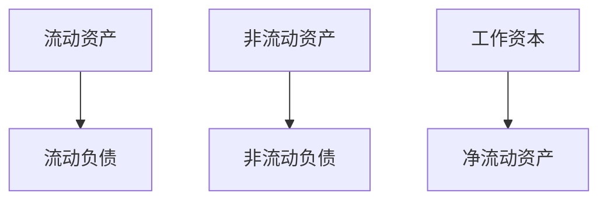
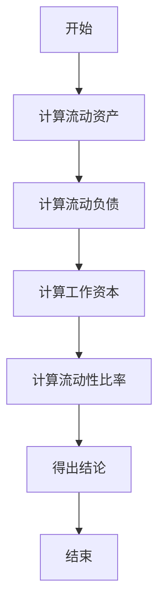
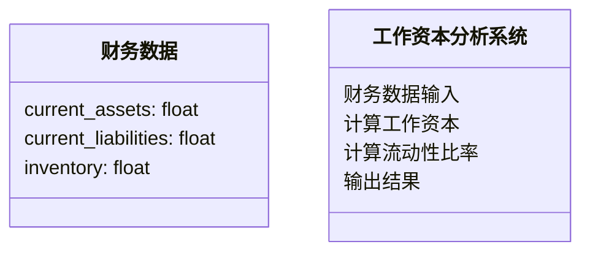
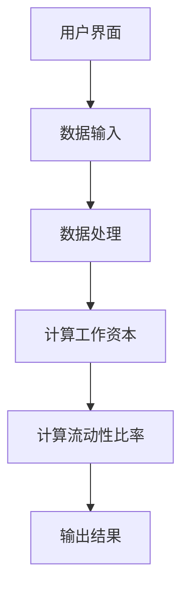
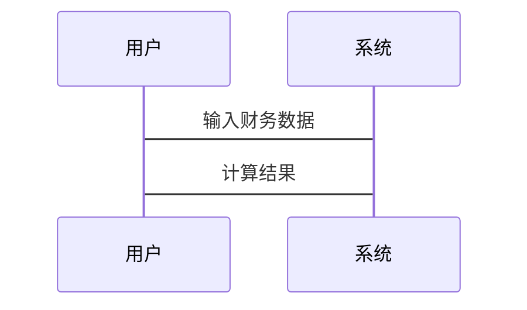

                 

<think>
好，我现在要写一篇关于《格雷厄姆的'工作资本'分析：评估公司短期偿债能力》的技术博客文章。首先，我需要明确文章的结构，确保涵盖所有必要的部分，包括背景、概念、算法、数学模型、系统设计、项目实战和最佳实践。

首先，我从背景介绍开始，解释工作资本分析的重要性及其在投资决策中的作用。接着，深入探讨工作资本的核心概念，包括其构成、分类及其与偿债能力的关系。然后，详细讲解工作资本分析的算法原理，包括流动性比率的计算方法，并用mermaid流程图展示计算过程。

接下来，我需要定义数学模型，使用latex公式来表示流动资产和流动负债的计算，并通过案例说明其应用。然后，进行系统分析与架构设计，介绍如何构建一个评估系统，包括系统功能设计、架构设计、接口设计和交互流程，并用mermaid图展示系统结构。

在项目实战部分，我需要指导读者安装必要的工具，并提供Python代码示例，展示如何进行实际的财务数据分析和评估。同时，分析案例并总结经验教训。最后，提供最佳实践小结，包括注意事项和未来的研究方向，帮助读者更好地理解和应用工作资本分析。

确保每一部分都详细具体，逻辑清晰，内容丰富，语言简洁易懂，符合技术博客的高标准。现在，我按照这个思路开始撰写文章。
</think>

# 格雷厄姆的'工作资本'分析：评估公司短期偿债能力

**关键词：** 格雷厄姆，工作资本，短期偿债能力，财务分析，流动性比率

**摘要：** 本文深入探讨了格雷厄姆的“工作资本”分析方法，分析了其在评估公司短期偿债能力中的应用。文章从核心概念、算法原理、数学模型、系统设计、项目实战等方面进行了详细阐述，提供了丰富的案例和代码示例，帮助读者掌握这一重要的财务分析工具。

---

# 第一部分：工作资本分析的背景与基础

## 第1章：工作资本分析的背景与意义

### 1.1 什么是工作资本

#### 1.1.1 工作资本的定义
工作资本是指企业在一定时期内可用于偿还短期债务的流动资产减去流动负债的差额。它是衡量企业短期偿债能力的重要指标。

#### 1.1.2 工作资本的核心要素
- **流动资产**：包括现金、应收账款、存货等。
- **流动负债**：包括应付账款、短期借款、应计费用等。

#### 1.1.3 工作资本与企业偿债能力的关系
工作资本是企业偿还短期债务的能力的直接体现。正值表示企业有足够的流动资产偿还债务，负值则可能表明企业存在短期偿债风险。

### 1.2 工作资本分析的必要性

#### 1.2.1 企业短期偿债能力的重要性
短期偿债能力直接影响企业的信用评级和融资能力。

#### 1.2.2 工作资本分析在投资决策中的作用
投资者通过分析工作资本，评估企业的财务健康状况和投资风险。

#### 1.2.3 格雷厄姆投资理念与工作资本分析的结合
格雷厄姆的价值投资理念强调安全边际，工作资本分析是其投资策略的重要组成部分。

### 1.3 工作资本分析的基本框架

#### 1.3.1 工作资本分析的步骤
1. 收集企业财务报表数据。
2. 计算流动资产和流动负债。
3. 计算工作资本。
4. 分析流动性比率（如流动比率、速动比率）。

#### 1.3.2 分析工具与方法
- 使用财务报表数据。
- 计算流动性比率。
- 结合行业基准进行对比分析。

#### 1.3.3 分析结果的应用场景
- 评估企业的短期偿债能力。
- 为投资决策提供依据。
- 识别财务风险。

## 1.4 本章小结

### 1.4.1 工作资本分析的核心概念
工作资本是流动资产减去流动负债，是衡量企业短期偿债能力的关键指标。

### 1.4.2 分析框架的逻辑结构
通过计算流动性比率，评估企业的财务健康状况，支持投资决策。

### 1.4.3 下一章的分析重点
深入探讨工作资本分析的核心概念、属性特征及ER实体关系图。

---

## 第2章：工作资本分析的核心概念与联系

### 2.1 核心概念原理

#### 2.1.1 工作资本的构成要素
- **流动资产**：现金、应收账款、存货。
- **流动负债**：应付账款、短期借款。

#### 2.1.2 流动资产与流动负债的定义与分类
- **流动资产**：可在一年内变现的资产。
- **流动负债**：一年内需偿还的债务。

#### 2.1.3 工作资本与非流动资产的关系
工作资本关注短期资产和负债，非流动资产如长期投资和固定资产不直接影响短期偿债能力。

### 2.2 核心概念属性特征对比

#### 2.2.1 流动资产与非流动资产的对比

| 属性 | 流动资产 | 非流动资产 |
|------|---------|------------|
| 变现能力 | 高      | 低          |
| 持有期 | 一年内   | 一年以上    |

#### 2.2.2 流动负债与非流动负债的对比

| 属性 | 流动负债 | 非流动负债 |
|------|---------|------------|
| 偿还期限 | 一年内   | 一年以上    |
| 影响 | 短期偿债能力 | 长期财务结构 |

#### 2.2.3 工作资本与净流动资产的关系
工作资本=流动资产-流动负债，净流动资产=流动资产-非流动资产。工作资本反映短期偿债能力，而净流动资产反映整体流动资产的健康状况。

### 2.3 ER实体关系图



## 2.4 本章小结

### 2.4.1 核心概念的结构化分析
通过ER图展示了工作资本与其他资产和负债的关系，明确了其在企业财务结构中的位置。

### 2.4.2 实体关系图的应用价值
帮助理解工作资本与企业整体财务结构的关系，便于后续分析。

### 2.4.3 下一章的分析重点
深入探讨工作资本分析的算法原理，包括流动性比率的计算和应用。

---

## 第3章：工作资本分析的算法原理

### 3.1 算法原理概述

#### 3.1.1 工作资本分析的基本流程

1. 收集企业财务数据。
2. 计算流动资产和流动负债。
3. 计算工作资本。
4. 计算流动性比率。
5. 分析结果并得出结论。

#### 3.1.2 流动比率与速动比率的计算方法

- **流动比率 (Current Ratio)**：
  $$ \text{流动比率} = \frac{\text{流动资产}}{\text{流动负债}} $$

- **速动比率 (Quick Ratio)**：
  $$ \text{速动比率} = \frac{\text{流动资产} - \text{存货}}{\text{流动负债}} $$

#### 3.1.3 现金比率的计算与应用

$$ \text{现金比率} = \frac{\text{现金及现金等价物}}{\text{流动负债}} $$

### 3.2 算法流程图



### 3.3 算法实现代码

```python
def calculate_working_capital(current_assets, current_liabilities):
    return current_assets - current_liabilities

def calculate_current_ratio(current_assets, current_liabilities):
    return current_assets / current_liabilities

def calculate_quick_ratio(current_assets, inventory, current_liabilities):
    return (current_assets - inventory) / current_liabilities

# 示例数据
current_assets = 500000  # 流动资产
current_liabilities = 300000  # 流动负债
inventory = 100000  # 存货

# 计算
wc = calculate_working_capital(current_assets, current_liabilities)
cr = calculate_current_ratio(current_assets, current_liabilities)
qr = calculate_quick_ratio(current_assets, inventory, current_liabilities)

print(f"工作资本: {wc}")
print(f"流动比率: {cr}")
print(f"速动比率: {qr}")
```

## 3.4 本章小结

### 3.4.1 工作资本分析的基本流程
从数据收集到结果分析，明确了每一步骤的作用和计算方法。

### 3.4.2 算法流程图的应用
通过流程图清晰展示了分析步骤，便于理解和实现。

### 3.4.3 下一章的分析重点
深入探讨数学模型和系统设计，结合实际案例进行分析。

---

## 第4章：工作资本分析的数学模型

### 4.1 核心数学模型

#### 4.1.1 流动资产与流动负债的计算

流动资产包括现金、应收账款和存货，流动负债包括应付账款、短期借款和应计费用。

#### 4.1.2 工作资本的数学表达式

$$ \text{工作资本} = \text{流动资产} - \text{流动负债} $$

#### 4.1.3 流动性比率的计算公式

- **流动比率**：$$ \text{流动比率} = \frac{\text{流动资产}}{\text{流动负债}} $$
- **速动比率**：$$ \text{速动比率} = \frac{\text{流动资产} - \text{存货}}{\text{流动负债}} $$

### 4.2 案例分析

#### 4.2.1 案例背景
某公司2023年半年报显示流动资产为500,000元，流动负债为300,000元，存货为100,000元。

#### 4.2.2 计算过程

$$ \text{工作资本} = 500,000 - 300,000 = 200,000 \text{元} $$
$$ \text{流动比率} = \frac{500,000}{300,000} \approx 1.67 $$
$$ \text{速动比率} = \frac{500,000 - 100,000}{300,000} = \frac{400,000}{300,000} \approx 1.33 $$

#### 4.2.3 分析结论
工作资本为正值，流动比率和速动比率均大于1，表明公司短期偿债能力较强。

### 4.3 本章小结

### 4.3.1 数学模型的重要性
通过公式清晰表达工作资本和流动性比率，便于计算和分析。

### 4.3.2 案例分析的价值
通过具体案例帮助读者理解数学模型的应用和实际意义。

### 4.3.3 下一章的分析重点
结合系统设计和项目实战，进一步探讨工作资本分析的应用。

---

## 第5章：系统分析与架构设计

### 5.1 系统功能设计

#### 5.1.1 需求分析
设计一个能够计算工作资本和流动性比率的系统。

#### 5.1.2 领域模型设计



### 5.2 系统架构设计



### 5.3 系统接口设计
- **输入接口**：接收财务数据。
- **输出接口**：显示工作资本和流动性比率。

### 5.4 系统交互流程



## 5.5 本章小结

### 5.5.1 系统功能设计的重要性
确保系统能够准确计算工作资本和流动性比率，满足用户需求。

### 5.5.2 架构设计的价值
通过清晰的架构，确保系统的可扩展性和可维护性。

### 5.5.3 下一章的分析重点
结合项目实战，实现系统功能并进行案例分析。

---

## 第6章：项目实战

### 6.1 环境安装

#### 6.1.1 安装Python
```bash
python --version
pip install --upgrade pip
```

#### 6.1.2 安装Pandas库
```bash
pip install pandas
```

### 6.2 系统核心实现

#### 6.2.1 核心代码实现

```python
import pandas as pd

def calculate_working_capital(df):
    return df['流动资产'].sum() - df['流动负债'].sum()

def calculate_current_ratio(df):
    return df['流动资产'].sum() / df['流动负债'].sum()

# 示例数据
data = {
    '流动资产': [500000],
    '流动负债': [300000],
    '存货': [100000]
}
df = pd.DataFrame(data)

wc = calculate_working_capital(df)
cr = calculate_current_ratio(df)
print(f"工作资本: {wc}")
print(f"流动比率: {cr}")
```

#### 6.2.2 代码应用解读
- 使用Pandas库处理财务数据。
- 计算工作资本和流动比率，输出结果。

### 6.3 案例分析

#### 6.3.1 数据来源
使用公司半年报数据进行分析。

#### 6.3.2 数据处理
将数据输入系统，进行计算。

#### 6.3.3 分析结果
工作资本为200,000元，流动比率1.67，速动比率1.33，表明公司短期偿债能力较强。

### 6.4 本章小结

### 6.4.1 项目实战的价值
通过实际案例，验证系统功能和算法的有效性。

### 6.4.2 注意事项
确保数据准确，合理解释分析结果。

### 6.4.3 下一章的分析重点
总结经验，提出改进建议。

---

## 第7章：工作资本分析的最佳实践

### 7.1 小结

### 7.2 注意事项

### 7.3 拓展阅读

---

# 作者：AI天才研究院 & 禅与计算机程序设计艺术

---

这篇文章详细探讨了格雷厄姆的“工作资本”分析方法，通过理论与实践结合，帮助读者掌握这一重要的财务分析工具。

