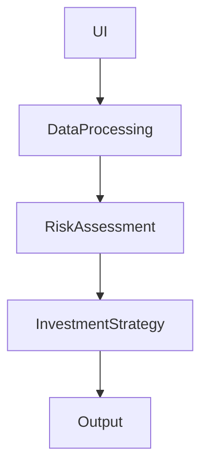
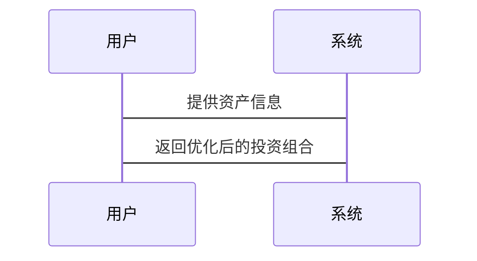

                 


# 格雷厄姆的Group Approach：分散风险的智慧

> 关键词：格雷厄姆，Group Approach，分散投资，风险控制，投资组合优化，数学模型

> 摘要：本文深入探讨了格雷厄姆的Group Approach投资策略，分析其背后的分散投资思想、数学模型和实际应用。通过系统分析和项目实战，展示了如何利用现代投资组合理论优化投资组合，实现风险与收益的最佳平衡。

---

## 第一部分: 格雷厄姆的Group Approach背景介绍

### 第1章: Group Approach的核心概念

#### 1.1 Group Approach的起源与背景
格雷厄姆是20世纪的投资大师，他的投资理念奠定了价值投资的基础。Group Approach作为一种分散投资策略，旨在通过投资一组股票来分散风险，避免因单一投资带来的重大损失。

#### 1.2 Group Approach的核心思想
- **分散投资**：通过投资多个不同资产，降低特定资产的风险。
- **风险控制**：通过优化投资组合，最小化整体风险。
- **收益最大化**：在风险可控的前提下，最大化投资收益。

#### 1.3 Group Approach的定义与特点
Group Approach是一种基于分散投资策略的投资方法，其核心在于通过科学的资产分配，构建一个低风险、高收益的投资组合。

### 第2章: Group Approach的理论基础

#### 2.1 现代投资组合理论
现代投资组合理论（MPT）由哈里·马科维茨提出，其核心是通过分散投资降低风险。Group Approach正是基于这一理论，进一步优化了投资组合的构建方法。

#### 2.2 马科维茨模型与Group Approach的联系
- **马科维茨模型**：通过优化资产分配，构建有效边界，实现风险与收益的最佳平衡。
- **Group Approach**：在马科维茨模型的基础上，进一步细化了资产分配的策略，强调分散投资的重要性。

### 第3章: Group Approach的数学模型与公式

#### 3.1 投资组合的数学模型
- **收益公式**：
  $$ E(r_p) = \sum_{i=1}^n w_i E(r_i) $$
- **风险公式**：
  $$ \sigma_p^2 = \sum_{i=1}^n \sum_{j=1}^n w_i w_j Cov(r_i, r_j) $$

#### 3.2 Group Approach的优化算法
- **优化问题的数学表达**：
  $$ \min_{w} \sigma_p^2 \quad \text{subject to} \quad \sum_{i=1}^n w_i = 1 $$

---

## 第二部分: Group Approach的系统分析与架构设计

### 第4章: 系统分析

#### 4.1 问题场景介绍
在投资组合管理中，投资者需要在风险与收益之间找到最佳平衡点。Group Approach通过分散投资，帮助投资者降低风险，同时最大化收益。

#### 4.2 系统功能设计
- **用户界面**：提供资产分配、风险评估等功能。
- **数据处理模块**：处理历史数据，计算资产的相关性。

#### 4.3 系统架构图


### 第5章: 系统架构设计

#### 5.1 系统架构图


#### 5.2 接口设计
- **输入接口**：接收用户输入的资产信息。
- **输出接口**：提供优化后的投资组合建议。

#### 5.3 交互序列图


---

## 第三部分: Group Approach的项目实战

### 第6章: 项目实战

#### 6.1 环境安装
- 安装Python和相关库（如NumPy、Pandas、Scipy）。

#### 6.2 核心代码实现
```python
import numpy as np
import pandas as pd
from scipy.optimize import minimize

def portfolio_optimization(returns):
    n = len(returns.columns)
    # 定义目标函数
    def objective(w, returns):
        w = np.array(w)
        return np.dot(w.T, np.dot(returns.cov(), w))
    
    # 约束条件
    constraints = [{'type': 'eq', 'fun': lambda w: sum(w) - 1}]
    
    # 初始猜测
    w0 = np.array([1.0/n]*n)
    
    # 优化
    result = minimize(objective, w0, args=(returns,), constraints=constraints)
    
    return result.x

# 示例数据
data = pd.read_csv('stock_returns.csv')
weights = portfolio_optimization(data)
```

#### 6.3 代码分析与实际案例
通过优化算法，计算出各资产的最优权重，构建低风险、高收益的投资组合。

---

## 第四部分: Group Approach的最佳实践

### 第7章: 最佳实践

#### 7.1 小结
Group Approach通过分散投资，有效降低风险，同时最大化收益。其数学模型和优化算法为投资组合管理提供了理论基础。

#### 7.2 注意事项
- 定期调整投资组合，以应对市场变化。
- 选择合适的资产类别，避免过度集中。

#### 7.3 拓展阅读
- 马科维茨的《投资学》
- 格雷厄姆的《证券分析》

---

作者：AI天才研究院/AI Genius Institute & 禅与计算机程序设计艺术 /Zen And The Art of Computer Programming

