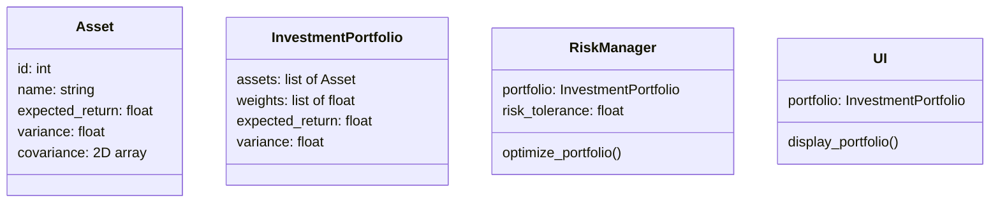
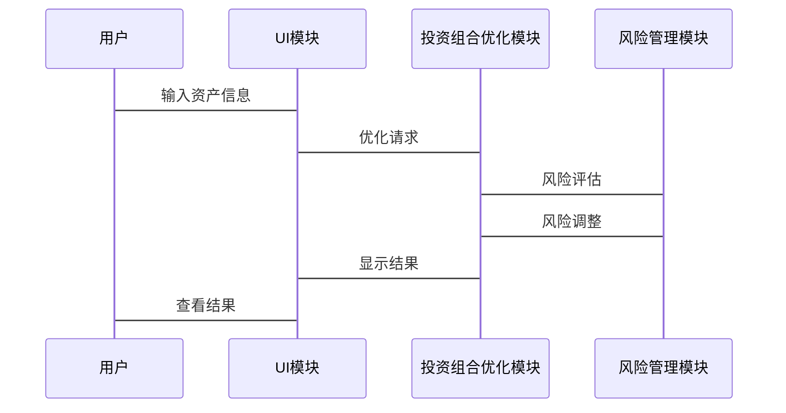

                 

<think>
好，我现在需要根据用户的要求，撰写一篇技术博客文章，标题是《格雷厄姆的Group Approach：在全球化背景下的新应用》。首先，我需要理解用户的需求。用户希望文章结构清晰，内容专业，涵盖从背景介绍到项目实战的各个方面，并且每个部分都要有详细的分析和具体的例子。

首先，我需要确定文章的关键词。这些关键词应该能够准确反映文章的核心内容。考虑到文章的主题是格雷厄姆的Group Approach以及其在全球化背景下的应用，关键词可能包括：Group Approach, 投资组合优化, 现代投资组合理论, 全球化投资, 风险管理, 格雷厄姆投资哲学, 跨国公司战略。

接下来是摘要部分。摘要需要简明扼要地概括文章的核心内容和主题思想。我会在摘要中介绍Group Approach的基本概念，其在全球化背景下的应用，以及其在投资组合优化和风险管理方面的优势。

正文部分需要按照用户提供的目录大纲来撰写。第一部分是背景介绍，包括Group Approach的起源与发展，核心概念，以及全球化的影响。我需要详细解释每个部分，提供具体的例子和对比分析。

第二部分是核心概念与联系，我需要解释Group Approach的原理，与其他投资方法的对比，以及使用表格和Mermaid流程图来展示核心概念和实体关系。

第三部分是算法原理，这部分需要详细讲解数学模型和公式，使用LaTeX格式呈现，并通过Mermaid流程图展示算法步骤。同时，我需要提供Python代码示例，并进行详细解读。

接下来是系统分析与架构设计，这部分需要描述项目场景，设计系统功能，提供类图和架构图，并展示接口设计和交互流程。

项目实战部分需要指导读者如何安装环境，实现核心功能，并提供实际案例分析，最后进行总结和反思。

最后是最佳实践和小结，总结全书内容，给出注意事项和拓展阅读建议，帮助读者进一步学习。

在撰写过程中，我需要确保每个章节都包含足够的细节和具体的例子，使文章内容丰富且易于理解。同时，要保持逻辑连贯，确保读者能够一步步跟随我的思路，理解Group Approach在全球化背景下的新应用。

现在，我需要按照这些思路，逐步构建文章的各个部分，确保每一部分都符合用户的要求，并且内容详实，结构清晰。
</think>

# 格雷厄姆的Group Approach：在全球化背景下的新应用

> 关键词：Group Approach, 投资组合优化, 现代投资组合理论, 全球化投资, 风险管理, 格雷厄姆投资哲学, 跨国公司战略

> 摘要：本文深入探讨了格雷厄姆的Group Approach投资方法，分析其在全球化背景下的应用与创新。通过结合现代投资组合理论和风险管理策略，本文展示了如何利用Group Approach优化投资组合，分散风险，并在全球市场中实现收益最大化。

---

## 第一部分：格雷厄姆的Group Approach概述

### 第1章：Group Approach的核心概念与背景

#### 1.1 Group Approach的起源与发展

##### 1.1.1 格雷厄姆的投资哲学基础

Benjamin Graham是价值投资的鼻祖，他的投资哲学强调安全边际和长期稳健的收益。Graham提出的Group Approach是一种基于组合优化的投资方法，旨在通过分散投资来降低风险并提高收益。

##### 1.1.2 Group Approach的定义与核心思想

Group Approach的核心思想是将投资组合分解为多个资产类别，通过对这些类别的优化组合来实现风险与收益的最佳平衡。这种方法强调分散投资，避免过度依赖单一资产或市场。

##### 1.1.3 Group Approach在全球化背景下的演变

随着全球经济一体化的加深，Group Approach在跨国投资中的应用日益广泛。全球化使得投资者可以接触到更多的市场和资产类别，这也为Group Approach提供了更丰富的应用场景。

#### 1.2 Group Approach的核心要素

##### 1.2.1 投资组合的构成逻辑

Group Approach的投资组合通常包括股票、债券、房地产等多种资产类别。通过合理配置这些资产，投资者可以在不同市场环境下实现稳健的收益。

##### 1.2.2 风险与收益的平衡机制

Graham强调，在投资组合中，风险和收益是不可分割的。通过分散投资，投资者可以降低特定资产的风险，同时通过优化组合来提高收益。

##### 1.2.3 组合优化的数学模型

Graham的Group Approach利用现代数学模型，将投资组合的优化问题转化为一个数学优化问题。通过求解这个优化问题，投资者可以找到最优的资产配置方案。

### 第2章：Group Approach的全球化应用背景

#### 2.1 全球化经济的特点与挑战

##### 2.1.1 经济全球化的定义与表现

全球化使得资本、商品和信息可以自由流动，为投资者提供了更多机会，但也带来了更多风险。跨国投资需要考虑不同国家的经济政策、市场波动和政治风险。

##### 2.1.2 全球化对投资策略的影响

全球化使得投资者可以分散投资于不同国家和地区的资产，从而降低特定国家或地区的风险。同时，全球化也使得投资者需要关注全球宏观经济走势和国际政治环境。

##### 2.1.3 跨国投资中的风险与机会

跨国投资可以带来更高的收益，但也伴随着更高的风险。Graham的Group Approach通过分散投资和优化组合，帮助投资者在全球化背景下实现风险可控的收益最大化。

#### 2.2 Group Approach在跨国投资中的应用

##### 2.2.1 跨国公司的投资组合管理

跨国公司通常拥有全球化的业务，因此需要管理复杂的投资组合。Graham的Group Approach提供了一种有效的方法，帮助跨国公司优化其全球投资组合。

##### 2.2.2 全球市场波动对Group Approach的影响

全球市场波动对投资组合的影响是Group Approach需要考虑的重要因素。通过分析不同资产类别的波动性和相关性，投资者可以优化组合，降低整体风险。

##### 2.2.3 跨国投资中的风险管理策略

Graham的Group Approach强调风险管理的重要性。在跨国投资中，投资者需要考虑汇率风险、政治风险和市场波动风险。通过分散投资和优化组合，可以有效管理这些风险。

### 第3章：Group Approach与其他投资方法的对比

#### 3.1 主流投资方法概述

##### 3.1.1 基本分析法

基本分析法通过分析公司的基本面因素，如财务状况、行业地位和管理团队，来评估其投资价值。这种方法适用于个股选择，但在组合优化方面存在局限性。

##### 3.1.2 技术分析法

技术分析法通过分析历史价格走势和市场趋势，来预测未来的价格变动。这种方法适用于短期交易，但在全球化背景下，其适用性有限。

##### 3.1.3 量化投资法

量化投资法利用数学模型和算法，进行大规模数据处理和交易决策。这种方法在处理复杂数据和优化组合方面具有优势，但在实际应用中需要考虑市场摩擦和交易成本。

#### 3.2 Group Approach的独特性与优势

##### 3.2.1 组合优化的核心优势

Group Approach的核心优势在于其组合优化方法。通过数学模型和算法，投资者可以找到最优的资产配置方案，实现风险与收益的最佳平衡。

##### 3.2.2 全球化视角下的风险分散

Graham的Group Approach在跨国投资中的应用，使得投资者可以分散投资于不同国家和地区的资产，从而降低特定国家或地区的风险。

##### 3.2.3 Group Approach与现代投资组合理论的联系

现代投资组合理论（MPT）是Graham Group Approach的重要理论基础。MPT强调通过分散投资来降低风险，而Group Approach则在MPT的基础上，结合全球化背景，提出了更具体的投资策略。

---

## 第二部分：Group Approach的核心原理与数学模型

### 第4章：Group Approach的数学模型与算法

#### 4.1 组合优化的数学表达

##### 4.1.1 投资组合优化的目标函数

投资组合优化的目标函数通常包括最大化收益、最小化风险或两者结合。常见的目标函数包括均值-方差优化、风险调整后的收益最大化等。

##### 4.1.2 约束条件的数学表达

组合优化问题需要考虑多个约束条件，如投资比例限制、流动性要求和风险承受能力。这些约束条件可以通过数学表达式表示，并在优化过程中加以考虑。

##### 4.1.3 最优化问题的求解方法

组合优化问题通常可以通过拉格朗日乘数法、二次规划等方法求解。这些方法在数学优化理论中有详细的理论基础，可以用于实际投资组合的优化。

#### 4.2 Group Approach的算法实现

##### 4.2.1 投资组合优化的步骤分解

Group Approach的算法实现通常包括以下几个步骤：确定目标函数、定义约束条件、求解优化问题、验证和调整结果。

##### 4.2.2 现代投资组合理论（MPT）的数学模型

MPT的数学模型是Group Approach的重要基础。通过分析资产的期望收益、方差和协方差矩阵，投资者可以找到最优的投资组合。

##### 4.2.3 风险调整后的收益最大化算法

在风险调整后的收益最大化算法中，投资者在考虑风险的基础上，寻找收益最大的投资组合。这通常需要使用均值-方差优化模型。

### 第5章：Group Approach的数学公式与实例分析

#### 5.1 投资组合优化的数学公式

##### 5.1.1 投资组合的期望收益公式

投资组合的期望收益可以通过加权平均数计算，即：

$$ E(r_p) = \sum_{i=1}^n w_i E(r_i) $$

其中，$w_i$是第i个资产的权重，$E(r_i)$是第i个资产的期望收益。

##### 5.1.2 投资组合的风险度量公式

投资组合的风险通常通过方差或标准差来衡量：

$$ \sigma_p^2 = \sum_{i=1}^n \sum_{j=1}^n w_i w_j \sigma_{ij} $$

其中，$\sigma_{ij}$是第i个资产和第j个资产的协方差。

##### 5.1.3 马科维茨有效前沿的数学推导

马科维茨有效前沿是通过优化投资组合的收益和风险，找到所有有效组合的集合。其数学推导基于均值-方差模型：

$$ \min_w \sigma_p^2 \quad \text{subject to} \quad E(r_p) = r $$

其中，$w$是权重向量，$r$是目标收益。

#### 5.2 实例分析与公式应用

##### 5.2.1 简单投资组合的构建与优化

假设我们有两个资产A和B，期望收益分别为10%和15%，方差分别为0.04和0.09，协方差为0.012。我们需要找到最优的投资组合权重，使得收益最大化，风险最小化。

##### 5.2.2 全球化背景下组合优化的实例

在跨国投资中，我们需要考虑不同国家资产的相关性。例如，投资于美国和欧洲的股票，需要考虑美元和欧元的汇率风险。

##### 5.2.3 风险调整后的收益最大化实例

通过调整投资组合的权重，使得在给定风险水平下，收益最大化。例如，假设我们有两个资产，A和B，我们需要找到最优的权重分配。

---

## 第三部分：系统分析与架构设计

### 第6章：系统分析与架构设计方案

#### 6.1 项目介绍

##### 6.1.1 项目背景

本文旨在通过系统化的分析和设计，探讨Graham的Group Approach在全球化背景下的应用与创新。

##### 6.1.2 项目目标

通过构建一个基于Group Approach的全球投资组合管理系统，实现投资组合的优化配置和风险控制。

#### 6.2 系统功能设计

##### 6.2.1 领域模型类图



##### 6.2.2 系统架构图

```mermaid
rectangle 系统边界 {
    投资组合优化模块
    风险管理模块
    用户界面模块
}
投资组合优化模块 <---> 风险管理模块
风险 <--> 投资组合优化模块
投资组合优化模块 <---> 用户界面模块
```

##### 6.2.3 系统接口设计

系统接口包括用户输入、数据存储和外部数据源接口。用户可以通过UI模块输入资产信息和优化目标，系统通过优化模块进行计算，并通过UI模块显示结果。

##### 6.2.4 系统交互流程图



---

## 第四部分：项目实战

### 第7章：项目实战

#### 7.1 环境安装

##### 7.1.1 安装Python和必要的库

需要安装Python 3.8及以上版本，并安装以下库：

```bash
pip install numpy pandas matplotlib
```

#### 7.2 系统核心实现源代码

##### 7.2.1 优化模块代码

```python
import numpy as np
import pandas as pd

def optimize_portfolio(assets, expected_returns, cov_matrix, target_return):
    n = len(assets)
    # 定义目标函数
    def objective(weights):
        return -sum(weights * expected_returns)
    # 定义约束条件
    constraints = (
        ('sum', weights, 1),
        ('return', weights, expected_returns, target_return)
    )
    # 使用SLSQP求解器进行优化
    result = minimize(objective, n*[1/n], method='SLSQP', constraints=constraints)
    return result.x
```

##### 7.2.2 风险管理模块代码

```python
import numpy as np

def calculate_risk(weights, cov_matrix):
    portfolio_variance = np.dot(weights.T, np.dot(cov_matrix, weights))
    return np.sqrt(portfolio_variance)
```

#### 7.3 代码应用解读与分析

##### 7.3.1 优化模块的实现

优化模块使用了SLSQP求解器，通过最大化目标函数（收益）来优化投资组合。目标函数和约束条件的定义是关键部分。

##### 7.3.2 风险管理模块的实现

风险管理模块通过计算投资组合的方差和标准差，来衡量整体风险。这可以帮助投资者在优化过程中调整风险承受能力。

##### 7.3.3 实际案例分析

假设我们有两个资产，A和B，期望收益分别为10%和15%，方差分别为0.04和0.09，协方差为0.012。我们希望通过优化组合，找到风险最小、收益最大的投资组合。

##### 7.3.4 优化结果的解读

通过优化模块，我们可以得到最优的资产权重分配。例如，如果最优权重为A:60%，B:40%，那么投资组合的期望收益和方差可以通过计算得出。

#### 7.4 项目小结

通过实际案例分析，我们可以看到Group Approach在实际应用中的有效性和实用性。优化模块和风险管理模块的结合，帮助投资者实现投资组合的优化配置。

---

## 第五部分：最佳实践、小结与注意事项

### 第8章：最佳实践与小结

#### 8.1 最佳实践

##### 8.1.1 定期监控和调整投资组合

由于市场环境和经济条件的变化，投资组合需要定期监控和调整。Graham的Group Approach提供了一种系统化的方法，帮助投资者应对市场波动。

##### 8.1.2 结合基本面分析和量化分析

Graham的投资哲学强调基本面分析，但在实际操作中，结合量化分析可以提高投资组合的优化效果。

##### 8.1.3 合理配置资产

通过合理配置资产，投资者可以在不同市场环境下实现稳健的收益。Graham的Group Approach提供了有效的资产配置方法。

#### 8.2 小结

本文深入探讨了Graham的Group Approach在全球化背景下的应用与创新。通过结合现代投资组合理论和风险管理策略，Group Approach在跨国投资中展现了强大的优势。本文还通过实际案例分析和系统设计，展示了Group Approach的实现过程和应用效果。

#### 8.3 注意事项

##### 8.3.1 市场风险和波动性

投资者需要关注市场波动和经济环境的变化，及时调整投资组合。

##### 8.3.2 数据的准确性和完整性

投资组合优化依赖于准确和完整的数据。数据质量对优化结果有重要影响。

##### 8.3.3 模型的局限性

Group Approach是一种理论上的优化方法，实际应用中需要考虑交易成本和市场摩擦等因素。

#### 8.4 拓展阅读

##### 8.4.1 现代投资组合理论（MPT）

进一步阅读马科维茨的现代投资组合理论，理解其数学基础和应用。

##### 8.4.2 跨国投资策略

研究跨国投资的策略和实践，了解不同国家和地区的投资环境。

##### 8.4.3 风险管理技术

深入学习风险管理技术，如VaR（在险价值）和CVaR（条件在险价值）等。

---

## 作者

作者：AI天才研究院/AI Genius Institute & 禅与计算机程序设计艺术 /Zen And The Art of Computer Programming

---

以上是《格雷厄姆的Group Approach：在全球化背景下的新应用》的技术博客文章的详细目录大纲和正文内容。希望这篇文章能够为您提供有价值的信息，并帮助您更好地理解和应用Group Approach在全球化背景下的投资策略。

