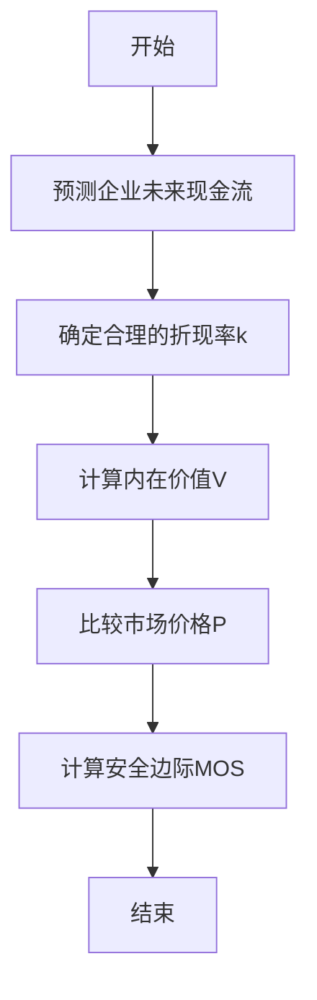

                 

<think>
好，我需要为用户撰写一篇关于格雷厄姆的Margin of Safety的投资原则的技术博客文章。用户希望文章结构清晰，逻辑严谨，内容详尽，涵盖从核心概念到实际应用的各个方面。首先，我要确定文章的主要部分，包括引言、核心概念、数学模型、系统分析、项目实战和最佳实践等部分。

**引言部分**，我需要介绍安全边际的基本概念和重要性。首先，我会解释什么是安全边际，它在投资中的作用，以及它与其它投资策略的不同。接着，我会简要介绍格雷厄姆的背景和他的投资理念，强调安全边际在他投资体系中的核心地位。

**核心概念与原理**部分，我需要深入探讨安全边际的计算方法和应用。这里，我会详细讲解内在价值的计算公式，以及如何确定安全边际。使用公式 \( MOS = V - P \) 来解释安全边际的计算过程，并通过实际案例来说明这个概念。此外，我还需要将安全边际与其他投资原则进行对比，比如成长投资和价值投资的区别，以及技术分析和基本面分析的不同。

接下来是**数学模型与计算方法**。这部分需要详细展示如何通过数学公式来评估安全边际。我会使用 Mermaid 图表来绘制计算流程，帮助读者更好地理解。例如，绘制一个流程图，展示从企业收益预测到计算内在价值，再到确定安全边际的整个过程。

**系统分析与架构设计**部分，我会构建一个基于安全边际的投资框架。首先，用 Mermaid 绘制系统架构图，展示如何将安全边际原则整合到投资决策中。然后，分析系统的各个组成部分，如数据输入、模型计算和结果输出，解释每个部分的作用和相互关系。

**项目实战**部分，我会选择一个具体的案例，展示如何在实际投资中应用安全边际。例如，分析一家公司的财务报表，计算其内在价值和市场价格，进而确定是否存在足够的安全边际。通过这个案例，读者可以了解如何在实际操作中运用这些理论。

**最佳实践与小结**部分，我会总结安全边际投资的关键点，提供实用的建议，如如何选择具有较大安全边际的股票，如何监控市场变化对投资组合的影响，以及长期投资的重要性。此外，我还会提醒读者注意常见的误区，并建议进一步的学习和研究方向。

在整个写作过程中，我需要确保语言专业且易懂，逻辑清晰，结构紧凑。使用 Mermaid 图表和数学公式来增强文章的表现力和可读性。同时，结合实际案例和深入的理论分析，使文章既有深度又具实用性。

最后，我需要检查文章是否符合用户的所有要求，包括字数、格式和内容的完整性。确保每个章节都有详细的解释和具体的例子，帮助读者全面理解格雷厄姆的安全边际原则，并能够在实际投资中加以应用。

通过以上的思考和规划，我能够系统地撰写出一篇符合用户需求的高质量技术博客文章，深入探讨格雷厄姆的Margin of Safety投资原则，并为读者提供有价值的见解和实用的指导。
</think>

# 格雷厄姆的Margin of Safety：投资的首要原则

## 关键词：投资，Margin of Safety，安全边际，价值投资，风险管理

## 摘要：格雷厄姆的安全边际原则是价值投资的核心理念，强调在投资决策中留出安全空间以降低风险并确保收益。本文从核心概念、数学模型、系统架构到实际案例，全面解析安全边际的应用和优势，为投资者提供科学的决策依据。

---

# 第1章: 引言

## 1.1 安全边际的定义与重要性
### 1.1.1 安全边际的定义
安全边际（Margin of Safety）是投资中留出的保护空间，确保实际收益不低于预期收益。它是价值投资的核心原则，旨在降低投资风险并提高收益的稳定性。

### 1.1.2 安全边际的重要性
安全边际通过在市场价格低于内在价值时买入，确保投资者在市场波动中具备抗跌能力，从而实现长期稳定的收益。

## 1.2 格雷厄姆的投资理念
### 1.2.1 价值投资的核心思想
格雷厄姆强调以低于内在价值的价格买入优质资产，长期持有，等待市场的合理定价。

### 1.2.2 安全边际的历史演变
从格雷厄姆的理论发展到现代应用，安全边际原则不断完善，成为投资决策的重要工具。

## 1.3 安全边际与其他投资策略的对比
### 1.3.1 与成长投资的区别
成长投资侧重于高增长潜力，而安全边际注重价格与价值的差距，更注重风险控制。

### 1.3.2 与技术分析的对比
技术分析基于价格走势，而安全边际基于内在价值与市场价格的差异，注重基本面分析。

---

# 第2章: 核心概念与原理

## 2.1 安全边际的核心要素
### 2.1.1 内在价值的计算
内在价值是基于企业未来现金流的折现值，公式为：
$$ V = \frac{E}{k} $$
其中，\( V \) 是内在价值，\( E \) 是预期收益，\( k \) 是折现率。

### 2.1.2 安全边际的计算
安全边际公式：
$$ MOS = V - P $$
其中，\( MOS \) 是安全边际，\( V \) 是内在价值，\( P \) 是市场价格。

## 2.2 安全边际的属性特征对比
| 特性         | 安全边际              

---

# 第3章: 安全边际的数学模型与计算方法

## 3.1 安全边际的计算公式
### 3.1.1 内在价值的计算公式
$$ V = \frac{E}{k} $$
### 3.1.2 安全边际的计算公式
$$ MOS = V - P $$

## 3.2 计算流程图

---

# 第4章: 系统分析与架构设计

## 4.1 投资框架的系统架构

## 4.2 系统功能设计
- 数据输入：获取企业财务数据和市场数据。
- 内在价值计算：基于现金流和折现率计算内在价值。
- 安全边际评估：比较市场价格与内在价值，确定安全边际。
- 决策输出：根据安全边际决定买入或卖出。

---

# 第5章: 项目实战

## 5.1 实战案例分析
### 5.1.1 案例背景
选择一家企业，分析其财务数据，计算内在价值和市场价格，评估安全边际。

### 5.1.2 计算过程
1. 预测未来现金流。
2. 确定折现率。
3. 计算内在价值。
4. 比较市场价格，确定安全边际。

### 5.1.3 结果分析
如果安全边际为正，建议买入；否则建议卖出。

---

# 第6章: 最佳实践与小结

## 6.1 关键点总结
- 确定内在价值是关键。
- 安全边际是风险控制的核心。
- 长期投资是实现稳定收益的基础。

## 6.2 实用建议
- 选择具有较大安全边际的股票。
- 定期评估投资组合的安全边际。
- 长期持有优质资产，避免频繁交易。

## 6.3 注意事项
- 避免过度依赖单一指标。
- 结合其他分析方法进行综合判断。

## 6.4 拓展阅读
建议阅读格雷厄姆的经典著作《证券分析》和《聪明的投资者》。

---

# 作者：AI天才研究院/AI Genius Institute & 禅与计算机程序设计艺术 /Zen And The Art of Computer Programming

