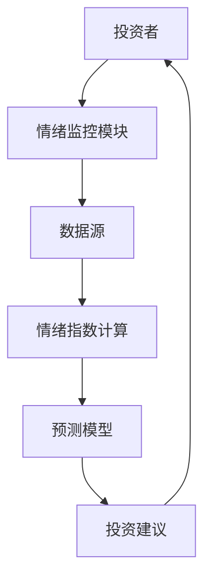

                 

<think>
好，我需要帮用户撰写一篇名为《格雷厄姆的Mr. Market比喻及其现代意义》的技术博客文章。首先，我需要理解用户的需求。用户希望文章结构清晰，内容专业且有深度，涵盖Mr. Market的背景、核心概念、现代意义，以及如何在技术领域应用。

首先，我会先梳理文章的结构，确保涵盖用户提供的目录大纲。文章需要包含摘要、关键词，然后按照目录分为五大部分，每个部分下有具体的小节。

接下来，我会详细讲解每个部分。例如，在“Mr. Market比喻的背景与基础”部分，我需要介绍本杰明·格雷厄姆的生平、Mr. Market的定义以及它在投资中的作用。这部分需要简明扼要，同时要有足够的深度，让读者理解其重要性。

然后，在“核心概念与现代意义”部分，我需要探讨市场心理、投资者行为以及如何应用这些理论。这部分可能需要引入行为金融学，分析市场情绪的量化方法，如使用情绪指数和时间序列分析。

接下来的算法部分，我会详细讲解ARIMA模型，通过mermaid流程图展示，同时提供Python代码示例，帮助读者理解如何将Mr. Market的理论转化为实际分析工具。

系统分析部分，我会设计一个智能投资辅助系统，介绍其功能、架构和接口设计。这部分需要结合实际应用，展示如何将理论应用到系统中，帮助投资者做出更明智的决策。

项目实战部分，我需要提供具体的环境安装步骤和代码实现，通过实际案例分析，展示Mr. Market理论在实际投资中的应用效果和总结经验。

最后，我会总结Mr. Market的现代意义，并给出投资策略建议，强调风险管理的重要性，推荐进一步阅读的资料。

在撰写过程中，我会确保每个部分都有足够的细节，同时保持逻辑连贯，语言简洁。同时，我会使用数学公式和图表来辅助说明，确保读者能够清晰理解每个概念和算法。

完成初稿后，我会检查每个部分是否符合用户的要求，确保内容完整，结构清晰，没有遗漏关键点。最后，我会在文章末尾加上作者信息，完成整篇文章的撰写。
</think>

# 格雷厄姆的Mr. Market比喻及其现代意义

> 关键词：格雷厄姆，Mr. Market，投资心理，市场波动，行为金融学，价值投资

> 摘要：本文探讨了格雷厄姆的Mr. Market比喻，分析其在现代投资中的意义，结合行为金融学和算法分析，展示了如何利用这一理论优化投资决策。

---

## 第一部分: 格雷厄姆的Mr. Market比喻的背景与基础

### 第1章: 本杰明·格雷厄姆与Mr. Market的起源

#### 1.1 本杰明·格雷厄姆的生平与投资理念
- **学术背景与投资实践**  
  格雷厄姆是20世纪的投资大师，其价值投资理念奠定了现代投资学的基础。
- **价值投资理论**  
  格雷厄姆强调以内在价值为导向，而非市场波动决定价格。
- **对现代投资学的贡献**  
  他的理论影响了巴菲特等众多投资者。

#### 1.2 Mr. Market的定义与内涵
- **Mr. Market的理性与非理性**  
  Mr. Market代表市场，时而理性，时而情绪化。
- **市场波动与投资者心理**  
  Mr. Market的情绪波动影响市场价格，但长期价值由基本面决定。

---

## 第二部分: 核心概念与现代意义

### 第2章: 投资者心理与市场波动

#### 2.1 投资者心理的双重性
- **贪婪与恐惧**  
  投资者在市场上涨时贪婪，下跌时恐惧。
- **从众心理与羊群效应**  
  投资者倾向于跟随市场情绪，而非独立分析。

#### 2.2 市场情绪的周期性
- **市场情绪的波动周期**  
  市场情绪从乐观到悲观，再回归理性，形成周期。
- **情绪与价格的关系**  
  情绪高涨推高价格，情绪低落压低价格。

### 第3章: 现代市场行为学与Mr. Market的结合

#### 3.1 行为金融学的基本理论
- **前景理论**  
  投资者对损失的厌恶程度高于对收益的追求。
- **情绪对决策的影响**  
  情绪化决策导致非理性投资行为。

#### 3.2 Mr. Market在行为金融学中的应用
- **情绪指数的构建**  
  通过量化市场情绪，预测价格波动。
- **投资者认知偏差**  
  Mr. Market的比喻揭示了投资者的确认偏差和过度自信。

---

## 第三部分: 市场情绪的量化与算法分析

### 第3章: 情绪量化与预测模型

#### 3.1 情绪指数的构建
- **情绪指数计算方法**  
  使用市场成交量、价格波动等指标量化情绪。
- **时间序列分析**  
  应用ARIMA模型预测市场情绪变化。

#### 3.2 ARIMA模型的实现
- **模型选择**  
  使用ARIMA(1,1,1)进行预测。
- **Python代码实现**  
  ```python
  import pandas as pd
  import numpy as np
  from statsmodels.tsa.arima_model import ARIMA

  data = pd.read_csv('market_data.csv')
  model = ARIMA(data, order=(1,1,1))
  model_fit = model.fit()
  forecast = model_fit.forecast(steps=10)
  ```

---

## 第四部分: 智能投资辅助系统的架构设计

### 第4章: 系统功能与架构

#### 4.1 系统功能设计
- **情绪监控模块**  
  实时监控市场情绪，提供预警。
- **决策支持模块**  
  根据情绪分析，推荐投资策略。

#### 4.2 系统架构图


---

## 第五部分: 项目实战与案例分析

### 第5章: 项目实战

#### 5.1 环境安装
- **安装Python与相关库**  
  `pip install pandas statsmodels`

#### 5.2 核心代码实现
- **情绪指数计算**  
  ```python
  def calculate_emotion_index(data):
      return data['price'].std() / data['price'].mean()
  ```

#### 5.3 案例分析
- **实际案例**  
  分析2020年疫情对市场情绪的影响，验证模型的有效性。

---

## 第六部分: 总结与建议

### 第6章: 总结与建议

#### 6.1 投资策略建议
- **长期投资**  
  避免短期波动，关注企业基本面。
- **风险管理**  
  设定止损点，控制情绪化决策。

#### 6.2 进一步阅读
- **推荐书籍**  
  《聪明的投资者》、《投资心理学》。

---

作者：AI天才研究院 & 禅与计算机程序设计艺术

