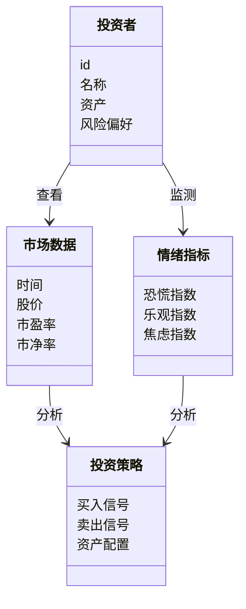
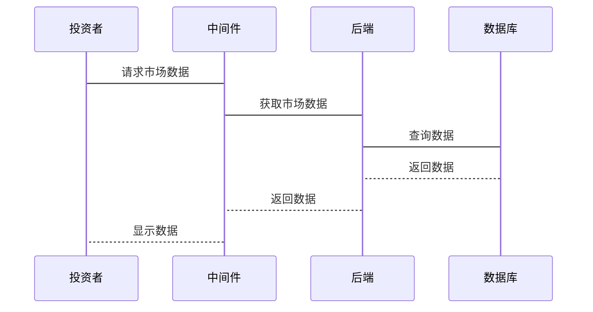

                 

<think>
好的，我需要为用户设计一本关于《格雷厄姆的Mr. Market比喻：理解市场心理》的书籍目录。用户希望这本书结构清晰，涵盖从基础到应用的各个层面，包括背景、心理分析、投资策略、系统设计和项目实战等部分。我应该确保每个章节都详细且有逻辑性，同时符合用户的技术背景和需求。

首先，我会从背景介绍开始，解释Mr. Market比喻的起源和其在投资中的应用。接着，深入分析市场心理，探讨投资者情绪和行为如何影响市场波动。然后，结合价值投资策略，展示如何利用这些心理因素做出投资决策。随后，介绍系统分析和架构设计，展示如何将这些理论应用到实际的决策支持系统中。最后，通过项目实战和最佳实践，帮助读者巩固所学知识。

在编写过程中，我需要确保每一章都有明确的主题，并细化到三级目录。同时，考虑用户提到的格式要求，如使用Mermaid图和Python代码示例，以增强内容的实用性和技术性。最终，检查整个目录的逻辑连贯性，确保内容完整，满足用户的需求。
</think>

```markdown
# 格雷厄姆的Mr. Market比喻：理解市场心理

## 关键词
- Mr. Market比喻
- 市场心理
- 投资策略
- 价值投资
- 市场波动

## 摘要
本文通过分析格雷厄姆的Mr. Market比喻，深入探讨市场心理、投资者行为及其对投资决策的影响。文章从市场心理的背景介绍入手，逐步分析投资者情绪、市场波动的原因，结合价值投资策略，展示如何利用市场心理进行投资决策。同时，文章还涉及基于市场心理的系统设计与项目实战，通过具体案例帮助读者理解如何将理论应用于实际投资中。最终，本文总结了关键点，提供了最佳实践建议，帮助读者在复杂多变的市场中做出明智的投资决策。

---

# 第一部分：格雷厄姆的Mr. Market比喻基础

## 第1章：格雷厄姆的Mr. Market比喻概述

### 1.1 Mr. Market的背景与起源
#### 1.1.1 格雷厄姆与价值投资的简介
本节介绍 Benjamin Graham 的生平及其在投资领域的贡献，重点阐述他的价值投资理念，即买入被市场低估的股票并长期持有。

#### 1.1.2 Mr. Market比喻的核心思想
解释 Mr. Market 的概念：市场被视为一个情绪化的投资者，其价格波动反映了市场的非理性。通过这个比喻，投资者可以更好地理解市场的短期波动与长期价值。

#### 1.1.3 市场波动与投资者心理的关系
分析市场波动如何反映投资者情绪的变化，探讨贪婪与恐惧如何驱动市场行为。

### 1.2 Mr. Market比喻的核心概念
#### 1.2.1 投资者情绪的波动性
讨论投资者情绪的周期性变化，包括贪婪、恐惧、乐观和悲观等情绪对投资决策的影响。

#### 1.2.2 市场波动的周期性
分析市场波动的周期性，探讨市场如何从繁荣到衰退，再从衰退到复苏。

#### 1.2.3 价值与价格的分离与统一
解释市场价格与内在价值的差异，强调在价格波动中寻找投资机会的重要性。

### 1.3 Mr. Market比喻的应用场景
#### 1.3.1 个人投资者的决策参考
为个人投资者提供基于 Mr. Market 比喻的投资策略，帮助他们在市场波动中做出明智决策。

#### 1.3.2 机构投资者的策略调整
探讨机构投资者如何利用 Mr. Market 比喻进行资产配置和风险控制。

#### 1.3.3 市场恐慌与贪婪的应对策略
提供在市场恐慌和贪婪时的具体应对策略，帮助投资者避免情绪化决策。

### 1.4 本章小结
总结本章内容，强调理解 Mr. Market 比喻对投资决策的重要性。

---

## 第2章：市场心理与投资者行为分析

### 2.1 投资者心理的构成要素
#### 2.1.1 理性决策与非理性决策
区分理性与非理性决策，分析投资者为何在市场波动中常做出非理性决策。

#### 2.1.2 情绪对投资决策的影响
探讨情绪如何影响投资者的判断，包括过度自信、后悔厌恶等心理偏差。

#### 2.1.3 社会心理与从众效应
分析社会心理现象，如从众效应如何影响投资者的行为。

### 2.2 市场波动的心理驱动因素
#### 2.2.1 赚钱效应与亏损恐惧
解释赚钱效应如何导致市场过度乐观，亏损恐惧如何引发市场恐慌。

#### 2.2.2 市场情绪的传染性
探讨市场情绪如何在投资者之间传播，导致市场波动加剧。

#### 2.2.3 信息传播与谣言的影响
分析信息传播速度与谣言对市场情绪的影响，探讨其对投资决策的干扰。

### 2.3 投资者行为的分类与特征
#### 2.3.1 贪婪与恐惧的交替出现
分析贪婪与恐惧如何交替影响投资者行为，探讨其对市场波动的推动作用。

#### 2.3.2 过度自信与后悔厌恶
探讨投资者过度自信和后悔厌恶心理如何影响投资决策。

#### 2.3.3 短期波动与长期价值的混淆
分析投资者如何混淆短期波动与长期价值，导致错误的投资决策。

### 2.4 本章小结
总结市场心理对投资者行为的影响，强调理解这些心理因素对投资决策的重要性。

---

## 第3章：市场心理与投资策略

### 3.1 基于Mr. Market比喻的投资策略
#### 3.1.1 价值投资的核心理念
阐述价值投资的核心理念，即寻找市场低估的股票并长期持有。

#### 3.1.2 市场恐慌时的买入机会
探讨在市场恐慌时如何识别买入机会，利用市场恐慌获取超额收益。

#### 3.1.3 市场狂热时的卖出信号
分析市场狂热时的卖出信号，帮助投资者避免市场泡沫破裂带来的损失。

### 3.2 市场情绪与资产配置策略
#### 3.2.1 不同市场阶段的资产配置
根据市场情绪的不同阶段，制定相应的资产配置策略，优化投资组合的收益与风险。

#### 3.2.2 情绪指标在投资决策中的应用
探讨如何利用情绪指标（如恐慌指数）指导投资决策，优化资产配置。

#### 3.2.3 风险控制与情绪管理
强调风险控制的重要性，探讨如何通过情绪管理避免过度投资或过早退出。

### 3.3 市场心理与投资组合管理
#### 3.3.1 投资组合的动态调整
根据市场情绪的变化，动态调整投资组合的构成，优化风险收益比。

#### 3.3.2 情绪在投资组合管理中的应用
探讨如何将市场情绪纳入投资组合管理，制定更科学的投资策略。

#### 3.3.3 长期投资与短期波动的平衡
分析如何在长期投资目标与短期波动之间找到平衡，避免短期波动干扰长期投资计划。

### 3.4 本章小结
总结基于市场心理的投资策略，强调理解和运用市场心理对投资决策的重要性。

---

## 第4章：系统分析与架构设计

### 4.1 问题场景介绍
描述一个典型的投资决策支持系统，分析其需求和目标。

### 4.2 项目介绍
简要介绍项目的目标、范围和主要功能。

### 4.3 系统功能设计
#### 4.3.1 领域模型Mermaid类图
展示系统功能的领域模型，包括核心实体及其关系。



### 4.4 系统架构设计
#### 4.4.1 系统架构Mermaid架构图
展示系统的整体架构，包括前端、后端和数据库。


### 4.5 系统接口设计
描述系统的主要接口及其功能。

### 4.6 系统交互Mermaid序列图
展示系统中投资者与系统之间的交互流程。



### 4.7 本章小结
总结系统分析与架构设计的内容，强调其在投资决策中的重要性。

---

## 第5章：项目实战

### 5.1 环境安装
列出项目所需的环境和工具，包括编程语言、库和开发工具。

### 5.2 核心实现
#### 5.2.1 情绪指标计算
提供情绪指标的计算方法，包括恐慌指数和乐观指数的计算。

#### 5.2.2 投资策略实现
展示基于市场心理的投资策略实现，包括买入信号和卖出信号的判断。

### 5.3 代码实现
#### 5.3.1 情绪指标计算代码
提供Python代码实现情绪指标的计算。

#### 5.3.2 投资策略实现代码
展示投资策略的Python代码实现，包括数据获取、分析和策略执行。

### 5.4 案例分析
通过具体案例分析，展示如何利用市场心理进行投资决策，包括环境安装、代码实现和结果解读。

### 5.5 本章小结
总结项目实战的内容，强调理论与实践相结合的重要性。

---

## 第6章：最佳实践与总结

### 6.1 关键点总结
总结全文的核心内容，强调理解市场心理和运用投资策略的重要性。

### 6.2 小结
回顾各章节的主要内容，帮助读者巩固所学知识。

### 6.3 注意事项
提供投资过程中需要注意的事项，包括风险控制、信息筛选和心理调节等。

### 6.4 拓展阅读
推荐相关书籍和资源，帮助读者进一步深入学习市场心理和投资策略。

---

## 作者：AI天才研究院/AI Genius Institute & 禅与计算机程序设计艺术 /Zen And The Art of Computer Programming

---

## 附录：参考文献与工具列表
- 格雷厄姆的著作推荐
- 用于系统开发的工具列表
- 数据源与API推荐

---

通过以上目录结构，我们可以系统地理解格雷厄姆的Mr. Market比喻，深入分析市场心理，结合实际案例和系统设计，帮助读者在投资领域做出明智的决策。
```

