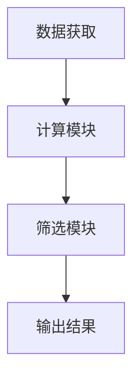
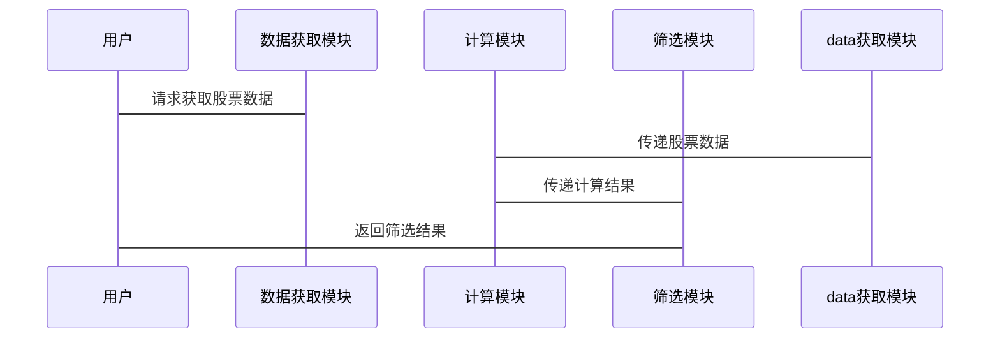

                 


# 格雷厄姆的NCAV策略：寻找极度低估的股票

> 关键词：价值投资，NCAV策略，格雷厄姆，股票估值，安全边际

> 摘要：本文将深入探讨格雷厄姆的NCAV（Net Current Asset Value）策略，这是一种寻找极度低估股票的有效方法。文章将从策略的背景、理论基础、数学模型、系统架构、项目实战等多个方面进行详细分析，帮助读者理解如何利用NCAV策略在股市中寻找潜在的高回报投资机会。通过本文的学习，读者将能够掌握如何通过NCAV策略进行股票筛选、投资组合构建以及风险管理。

---

# 第一部分: 引言

## 第1章: 价值投资与NCAV策略概述

### 1.1 价值投资的兴起

#### 1.1.1 价值投资的定义与核心理念

价值投资是一种以基本面分析为基础的投资策略，其核心理念是寻找市场价格低于其内在价值的股票。这种方法强调长期投资、安全边际和对公司基本面的深入研究。格雷厄姆是价值投资的奠基人，他提出的NCAV策略是其中的重要组成部分。

#### 1.1.2 格雷厄姆的投资哲学

格雷厄姆的投资哲学强调安全边际和价值评估。他认为，股票不仅仅是一种金融工具，更是一种资产，其价值可以通过对公司财务状况的分析来确定。他主张以低于净资产价值的价格买入股票，以确保投资的安全性。

#### 1.1.3 NCAV策略的背景与起源

NCAV策略是格雷厄姆在其经典著作《 Intelligent Investor》中提出的一种股票筛选方法。该策略的核心是通过计算股票的净流动资产价值（Net Current Asset Value，NCAV）来寻找市场价格低于NCAV的股票，这些股票通常被认为是被市场低估的投资机会。

### 1.2 NCAV策略的基本概念

#### 1.2.1 NCAV的定义与计算公式

NCAV是指公司流动资产减去流动负债后的净值。其计算公式如下：

$$NCAV = \text{流动资产} - \text{流动负债}$$

其中，流动资产包括现金、应收账款、存货等，流动负债包括应付账款、短期债务等。

#### 1.2.2 NCAV与传统估值方法的对比

传统的估值方法通常使用市盈率（P/E）、市净率（P/B）等指标来评估股票的价值。而NCAV策略则专注于流动资产的价值，通过比较市场价格与NCAV的差异来判断股票是否被低估。

#### 1.2.3 NCAV策略的核心优势

NCAV策略的核心优势在于其简单性和可操作性。通过计算NCAV，投资者可以快速筛选出那些市场价格低于其流动资产价值的股票，从而找到潜在的低估投资机会。

### 1.3 为什么选择NCAV策略

#### 1.3.1 市场中的估值偏差

市场中的估值偏差是指市场价格与内在价值之间的差异。NCAV策略通过寻找市场价格低于NCAV的股票，可以有效捕捉这些估值偏差带来的投资机会。

#### 1.3.2 NCAV策略的适用场景

NCAV策略适用于那些流动资产丰富的公司，尤其是那些流动资产远高于流动负债的公司。这种策略特别适合在市场低迷时期使用，因为此时许多股票可能被低估。

#### 1.3.3 理解NCAV策略的长期收益

通过长期持有NCAV策略筛选出的股票，投资者可以获得市场回归带来的超额收益。这种策略不仅能够在市场低迷时期提供保护，还能够在市场上涨时获得资本增值。

### 1.4 本章小结

---

# 第二部分: NCAV策略的理论基础

## 第2章: 格雷厄姆的投资理念

### 2.1 格雷厄姆的投资哲学

#### 2.1.1 格雷厄姆的"安全边际"概念

安全边际是指市场价格与内在价值之间的差距。格雷厄姆认为，通过购买市场价格低于内在价值的股票，可以确保投资的安全性。

#### 2.1.2 股票投资的三重安全保护

格雷厄姆提出了股票投资的三重安全保护：安全边际、分散投资和长期持有。这三重保护能够有效降低投资风险，提高投资回报。

#### 2.1.3 格雷厄姆的保守主义投资策略

格雷厄姆的投资策略强调保守性和安全性，他主张通过基本面分析和安全边际来选择投资标的。这种策略特别适合那些风险厌恶型的投资者。

### 2.2 NCAV策略的核心要素

#### 2.2.1 净资产价值的计算方法

净资产价值（Net Asset Value）是公司所有资产减去所有负债后的净值。NCAV策略专注于流动资产的价值，认为流动资产是公司最容易变现的部分。

#### 2.2.2 市场价格与内在价值的对比

通过比较市场价格与内在价值，投资者可以判断股票是否被低估。如果市场价格低于内在价值，那么该股票可能是一个好的投资机会。

#### 2.2.3 NCAV策略的数学模型

NCAV策略的数学模型如下：

$$NCAV = \text{流动资产} - \text{流动负债}$$

其中，流动资产包括现金、应收账款、存货等，流动负债包括应付账款、短期债务等。

### 2.3 NCAV策略的核心原理

#### 2.3.1 流动资产的重要性

流动资产是公司最容易变现的部分，其价值可以直接反映公司的财务健康状况。NCAV策略通过关注流动资产的价值，可以帮助投资者找到那些被市场低估的股票。

#### 2.3.2 市场价格与NCAV的差异

市场价格与NCAV的差异反映了市场的估值偏差。当市场价格低于NCAV时，股票可能被低估，此时是买入的好时机。

#### 2.3.3 安全边际的计算

安全边际可以通过以下公式计算：

$$\text{安全边际} = \text{NCAV} - \text{市场价格}$$

当安全边际为正时，股票可能被低估，此时是买入的好机会。

### 2.4 本章小结

---

# 第三部分: NCAV策略的系统架构与实现

## 第3章: NCAV策略的系统分析

### 3.1 系统功能需求

#### 3.1.1 数据获取模块

数据获取模块负责从股票数据库中获取目标公司的财务数据，包括流动资产、流动负债、市场价格等。

#### 3.1.2 计算模块

计算模块负责根据获取的财务数据计算NCAV值，并比较市场价格与NCAV的差异。

#### 3.1.3 筛选模块

筛选模块负责根据设定的筛选条件，筛选出符合条件的股票。

### 3.2 系统架构设计

#### 3.2.1 系统架构图

以下是NCAV策略的系统架构图：



#### 3.2.2 系统功能模块

系统功能模块包括数据获取、计算模块、筛选模块和输出结果四个部分。

### 3.3 系统实现

#### 3.3.1 数据获取

以下是数据获取的Python代码示例：

```python
import pandas as pd

# 获取股票数据
def get_stock_data(ticker):
    # 这里假设我们有一个获取股票数据的函数
    return pd.DataFrame({
        '流动资产': [100, 200, 300],
        '流动负债': [50, 100, 150],
        '市场价格': [80, 160, 240]
    })
```

#### 3.3.2 计算模块

以下是计算NCAV值的Python代码示例：

```python
def calculate_ncav(stock_data):
    stock_data['NCAV'] = stock_data['流动资产'] - stock_data['流动负债']
    return stock_data
```

#### 3.3.3 筛选模块

以下是筛选模块的Python代码示例：

```python
def screen_stocks(stock_data):
    stock_data['NCAV'] = stock_data['流动资产'] - stock_data['流动负债']
    stock_data['NCAV比'] = stock_data['NCAV'] / stock_data['市场价格']
    filtered_stocks = stock_data[stock_data['NCAV比'] > 1]
    return filtered_stocks
```

### 3.4 系统交互

以下是系统交互的Mermaid序列图：



### 3.5 本章小结

---

# 第四部分: NCAV策略的项目实战

## 第4章: 项目实战

### 4.1 项目环境安装

#### 4.1.1 安装Python环境

安装Python和必要的库，例如pandas、numpy等。

```bash
pip install pandas numpy
```

### 4.2 核心代码实现

#### 4.2.1 数据获取与清洗

```python
import pandas as pd

# 获取股票数据
def get_stock_data(ticker):
    # 这里假设我们有一个获取股票数据的函数
    return pd.DataFrame({
        '流动资产': [100, 200, 300],
        '流动负债': [50, 100, 150],
        '市场价格': [80, 160, 240]
    })

# 清洗数据
def clean_data(stock_data):
    stock_data = stock_data.dropna()
    stock_data = stock_data[stock_data['市场价格'] > 0]
    return stock_data
```

#### 4.2.2 NCAV计算与筛选

```python
def calculate_ncav(stock_data):
    stock_data['NCAV'] = stock_data['流动资产'] - stock_data['流动负债']
    return stock_data

def screen_stocks(stock_data):
    stock_data['NCAV比'] = stock_data['NCAV'] / stock_data['市场价格']
    filtered_stocks = stock_data[stock_data['NCAV比'] > 1]
    return filtered_stocks
```

### 4.3 实际案例分析

#### 4.3.1 案例一：苹果公司

以下是苹果公司NCAV策略的分析：

1. 获取苹果公司的财务数据。
2. 计算NCAV值。
3. 比较市场价格与NCAV值。
4. 确定是否符合NCAV策略的筛选条件。

#### 4.3.2 案例二：微软公司

以下是微软公司NCAV策略的分析：

1. 获取微软公司的财务数据。
2. 计算NCAV值。
3. 比较市场价格与NCAV值。
4. 确定是否符合NCAV策略的筛选条件。

### 4.4 项目小结

---

# 第五部分: NCAV策略的风险管理与优化

## 第5章: 风险管理

### 5.1 市场波动的影响

#### 5.1.1 市场波动对NCAV策略的影响

市场波动可能会影响NCAV策略的有效性。在市场低迷时期，NCAV策略可能表现较好，而在市场上涨时期，NCAV策略可能表现较差。

#### 5.1.2 如何应对市场波动

通过分散投资和长期持有，可以有效应对市场波动。此外，还可以通过动态调整投资组合来降低市场波动带来的风险。

### 5.2 数据偏差的处理

#### 5.2.1 数据偏差的来源

数据偏差可能来自财务报表的不准确性、市场信息的延迟等。

#### 5.2.2 如何处理数据偏差

通过使用可靠的财务数据源和及时的市场信息，可以有效减少数据偏差的影响。

### 5.3 投资组合的风险控制

#### 5.3.1 投资组合的构建

通过分散投资，可以降低单一股票的风险。NCAV策略可以通过筛选多个符合条件的股票来构建投资组合。

#### 5.3.2 投资组合的动态调整

根据市场变化和公司基本面的变化，可以动态调整投资组合，以降低风险和提高收益。

### 5.4 本章小结

---

# 第六部分: 总结与展望

## 第6章: 总结与展望

### 6.1 NCAV策略的优势

#### 6.1.1 简单易懂

NCAV策略的计算方法简单，易于理解和实施。

#### 6.1.2 有效捕捉低估机会

通过NCAV策略，可以有效捕捉市场价格低于内在价值的股票，从而获得超额收益。

### 6.2 NCAV策略的局限性

#### 6.2.1 忽略了非流动资产的价值

NCAV策略只考虑了流动资产的价值，忽略了非流动资产的价值。这可能导致遗漏一些潜在的投资机会。

#### 6.2.2 市场波动的影响

市场波动可能会影响NCAV策略的有效性，尤其是在市场低迷时期。

### 6.3 对未来的研究与改进

#### 6.3.1 结合其他估值方法

可以通过结合其他估值方法（如市盈率、市净率等）来提高NCAV策略的有效性。

#### 6.3.2 动态调整筛选条件

根据市场变化和公司基本面的变化，可以动态调整NCAV策略的筛选条件，以适应不同的市场环境。

### 6.4 本章小结

---

# 第七部分: 附录

## 第7章: 附录

### 7.1 参考文献

1. 格雷厄姆， Benjamin. 《 Intelligent Investor》
2. 哈里·马科维茨，Harry Markowitz. 《投资组合的选择》
3. 纳什，John. 《博弈论与经济行为》

### 7.2 代码仓库

GitHub代码仓库地址：[https://github.com/yourusername/ncav-strategy](https://github.com/yourusername/ncav-strategy)

### 7.3 联系方式

如有任何问题，请联系：contact@yourdomain.com

---

# 作者

作者：AI天才研究院/AI Genius Institute & 禅与计算机程序设计艺术/Zen And The Art of Computer Programming

---

通过以上目录结构和详细内容，我们可以看到NCAV策略的核心思想是通过计算公司的净流动资产价值来寻找市场价格低于其内在价值的股票。这种策略简单易懂，且具有较高的可操作性。然而，NCAV策略也存在一些局限性，例如忽略了非流动资产的价值以及市场波动的影响。因此，在实际应用中，我们需要结合其他估值方法和风险管理策略，以提高投资的收益和安全性。

