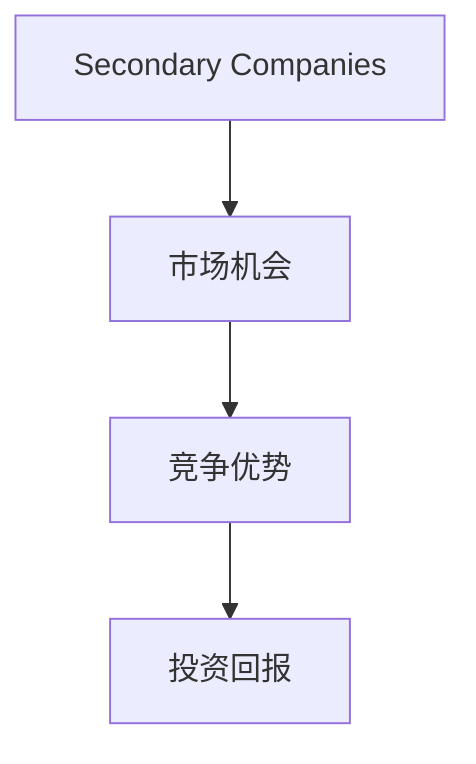

                 

# 格雷厄姆的Secondary Companies：二线公司的潜力

## 关键词：格雷厄姆、Secondary Companies、价值投资、潜力、风险管理

## 摘要：本文探讨了格雷厄姆的Secondary Companies，分析了其定义、优势、投资策略和成功案例，帮助投资者理解二线公司的潜力。

---

# 第一部分: 格雷厄姆的Secondary Companies概述

## 第1章: 格雷厄姆的Secondary Companies背景介绍

### 1.1 格雷厄姆的价值投资理论

#### 1.1.1 格雷厄姆的投资理念
本杰明·格雷厄姆是价值投资的鼻祖，他强调以低于内在价值的价格买入股票。他的理论基于基本面分析，认为市场先生的情绪波动为投资者提供了低价买入的机会。

#### 1.1.2 格雷厄姆对Secondary Companies的定义
Secondary Companies指那些规模较小、不被市场关注但具备长期增长潜力的企业。格雷厄姆认为这些公司具有较高的投资价值。

#### 1.1.3 Secondary Companies的背景与现状
随着市场的变化，Secondary Companies的概念逐渐扩展，成为投资者寻找超额收益的重要领域。

### 1.2 Secondary Companies的核心概念

#### 1.2.1 Secondary Companies的定义与特征
Secondary Companies是那些未被市场充分挖掘的公司，通常具有较高的成长性和竞争优势。

#### 1.2.2 Secondary Companies与Primary Companies的区别
Primary Companies是一线公司，规模大、知名度高，而Secondary Companies则是中小型公司，潜力大但风险也较高。

#### 1.2.3 Secondary Companies的市场定位与潜力
这些公司通常在细分市场中占据优势，具有较高的增长潜力和竞争优势。

### 1.3 Secondary Companies的投资价值

#### 1.3.1 Secondary Companies的市场机会
由于未被充分挖掘，Secondary Companies提供了较高的投资机会。

#### 1.3.2 Secondary Companies的长期增长潜力
这些公司通过技术创新和市场扩展，具备长期增长的潜力。

#### 1.3.3 Secondary Companies的风险与回报
虽然回报较高，但风险也较大，需要谨慎选择和管理。

---

## 第2章: Secondary Companies的核心概念与联系

### 2.1 Secondary Companies的核心概念原理

#### 2.1.1 Secondary Companies的业务模式
这些公司通常专注于特定市场，通过创新和优化降低成本。

#### 2.1.2 Secondary Companies的财务特征
财务稳健，ROE较高，负债较低，现金流稳定。

#### 2.1.3 Secondary Companies的市场表现
市场表现波动较大，但长期趋势向上。

### 2.2 Secondary Companies的核心属性特征对比

#### 2.2.1 Secondary Companies与Primary Companies的对比
| 特性             | Secondary Companies         | Primary Companies          |
|------------------|-----------------------------|---------------------------|
| 规模             | 中小规模                   | 大型企业                   |
| 竞争优势         | 细分市场优势               | 广泛市场覆盖               |
| 投资风险         | 较高                       | 较低                       |

#### 2.2.2 Secondary Companies的行业分布
主要分布在科技、医疗和消费领域，这些行业的变化为Secondary Companies提供了机会。

#### 2.2.3 Secondary Companies的规模与增长潜力
中小型企业具备较高的增长潜力，尤其是在新兴市场中。

### 2.3 Secondary Companies的ER实体关系图

---

## 第3章: Secondary Companies的基本面分析

### 3.1 Secondary Companies的核心概念

#### 3.1.1 Secondary Companies的定义与特征
这些公司专注于特定市场，具备较高的成长性和竞争优势。

#### 3.1.2 Secondary Companies的财务指标分析
分析市盈率（P/E）、市净率（P/B）等指标，判断公司是否低估。

#### 3.1.3 Secondary Companies的估值方法
使用DCF模型、可比公司分析等方法进行估值。

### 3.2 Secondary Companies的财务分析方法

#### 3.2.1 基本面分析的关键指标
市盈率（P/E）：衡量公司股价是否合理。
市净率（P/B）：评估公司资产价值。
ROE：衡量公司盈利能力。

#### 3.2.2 财务指标的计算公式
$$P/E = \frac{\text{股价}}{\text{每股收益}}$$

### 3.3 Secondary Companies的现金流分析

#### 3.3.1 现金流分析的重要性
健康的现金流是公司持续增长的基础。

#### 3.3.2 现金流分析的步骤
1. 收集财务报表数据。
2. 计算现金流。
3. 分析现金流健康状况。

#### 3.3.3 现金流分析的数学模型
$$FCF = \text{营业收入} - \text{资本支出}$$

---

## 第4章: Secondary Companies的竞争优势

### 4.1 Secondary Companies的核心概念

#### 4.1.1 Secondary Companies的定义与特征
这些公司专注于特定市场，具备较高的成长性和竞争优势。

#### 4.1.2 Secondary Companies的财务特征
财务稳健，ROE较高，负债较低，现金流稳定。

#### 4.1.3 Secondary Companies的市场表现
市场表现波动较大，但长期趋势向上。

### 4.2 Secondary Companies的竞争优势分析

#### 4.2.1 Secondary Companies的竞争优势来源
细分市场优势、成本优势、技术优势。

#### 4.2.2 Secondary Companies的竞争优势分析方法
使用SWOT分析、 Porter的五力模型等工具。

#### 4.2.3 Secondary Companies的竞争优势与投资价值
竞争优势强的公司具备更高的投资价值。

---

## 第5章: Secondary Companies的风险管理

### 5.1 Secondary Companies的风险管理

#### 5.1.1 Secondary Companies的风险识别
市场风险、流动性风险、信用风险。

#### 5.1.2 Secondary Companies的风险量化
使用VaR模型、贝塔系数等方法量化风险。

#### 5.1.3 Secondary Companies的风险控制策略
分散投资、设置止损点、定期评估投资组合。

---

## 第6章: Secondary Companies的投资策略

### 6.1 Secondary Companies的投资策略

#### 6.1.1 Secondary Companies的投资策略概述
长期投资、价值投资、分散投资。

#### 6.1.2 Secondary Companies的投资策略实施
选择低估的公司、分析财务报表、评估竞争优势。

#### 6.1.3 Secondary Companies的投资策略成功案例
通过实际案例分析，说明如何应用这些策略。

---

## 第7章: Secondary Companies的未来展望

### 7.1 Secondary Companies的未来发展趋势

#### 7.1.1 Secondary Companies的技术进步
技术进步将推动Secondary Companies的发展。

#### 7.1.2 Secondary Companies的市场变化
市场变化将为Secondary Companies带来新的机会和挑战。

#### 7.1.3 Secondary Companies的长期投资机会
长期来看，Secondary Companies具备较高的投资潜力。

---

## 作者：AI天才研究院/AI Genius Institute & 禅与计算机程序设计艺术 /Zen And The Art of Computer Programming

---

这篇文章系统地介绍了格雷厄姆的Secondary Companies，从定义到优势，再到投资策略和风险管理，帮助投资者更好地理解和应用这些概念。通过详细的分析和实际案例，读者可以深入了解二线公司的潜力和投资价值。

