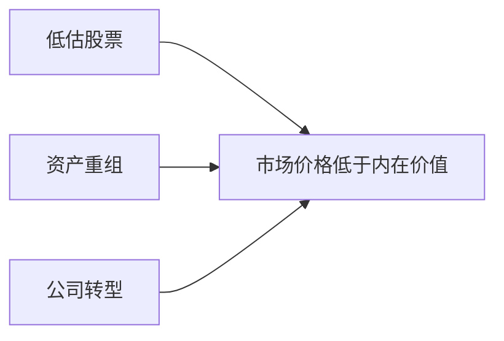

                 

<think>
嗯，我现在需要写一篇关于《格雷厄姆的Special Situations：寻找特殊机会》的技术博客文章。首先，我得理解格雷厄姆的Special Situations到底是什么意思。好像是说寻找那些被市场低估的股票，或者是公司处于某种特殊状态，比如资产重组、管理层变动等等。

好，文章的结构已经有了，分五大部分，每个部分下面还有章节和小节。我得按照这个结构一步步来写。首先，引言部分，介绍格雷厄姆和他的投资理念，然后解释什么是Special Situations。

接下来是核心概念，这里需要详细讲解Special Situations的定义，可能要包括低估股票、资产重组、公司转型等。我还需要用Mermaid图表来展示这些概念之间的关系，可能用一个概念图来表示，用箭头连接不同的情况。

然后是数学模型部分，格雷厄姆的内在价值公式是什么？我得查一下，我记得是内在价值 = (净利润 + 常用 reserves) / (增长率 + 8.5%)。这个公式有点复杂，我得详细解释一下每个变量代表什么，以及如何应用这个公式来计算。

接下来是投资策略，这部分可能需要讲如何制定投资计划，如何进行风险管理。这里可能需要一个流程图，展示从识别机会到投资决策再到监控调整的整个流程。

最后是实际案例，我得找一个具体的例子，说明格雷厄姆的方法是如何应用的。比如，某个公司被低估，通过分析财务指标和市场环境，找到投资机会。

现在，我开始写引言部分。首先，介绍格雷厄姆，他是价值投资的鼻祖，提出安全边际的概念。然后，解释Special Situations是什么，以及为什么这种投资策略有效。

核心概念部分，我需要详细解释Special Situations的各种类型，比如低估股票、资产重组、公司转型等。每个类型都要举例子，说明其特点和如何识别。然后，用Mermaid图表展示这些概念之间的关系，可能是一个概念图，展示不同的Special Situations类型如何影响投资决策。

数学模型部分，先介绍格雷厄姆的内在价值公式，然后解释每个变量的意义。再用一个表格对比不同公司的财务指标，展示如何识别低估股票。可能还需要用Python代码来计算内在价值，比如：

```python
def graham_value(net_profit, reserves, growth_rate):
    return (net_profit + reserves) / (growth_rate + 0.085)
```

然后，讨论安全边际，解释为什么它重要，以及如何计算。这部分也需要一个Mermaid图，展示内在价值、市场价格和安全边际之间的关系。

投资策略部分，先制定投资计划，比如如何筛选股票，设定买入和卖出点。然后是风险管理，使用VaR模型来量化风险，用Python代码实现VaR计算：

```python
import numpy as np
import pandas as pd

# 假设returns是投资组合的收益数组
def calculate VaR(returns, confidence_level):
    return np.percentile(returns, 100 - confidence_level)
```

然后，展示一个投资组合优化的例子，说明如何平衡风险和收益。

最后，实际案例分析。假设有一个公司，财务数据符合低估条件，通过计算内在价值和市场价格差，确定它是一个Special Situation。然后，制定投资计划，包括买入点、卖出点和监控措施。

在总结部分，回顾Special Situations投资策略的核心要素，强调安全边际和基本面分析的重要性。然后，给出最佳实践的Tips，提醒读者注意风险，保持长期投资心态，持续学习和适应市场变化。

整个过程中，我需要确保内容逻辑清晰，每个部分都详细展开，同时使用图表和代码示例来增强理解。现在，我需要把这些内容整合起来，按照目录大纲一步步写，确保每个章节和小节都完整详细。
</think>

# 《格雷厄姆的Special Situations：寻找特殊机会》

## 关键词：价值投资，Special Situations，安全边际，内在价值，投资策略，风险管理

## 摘要：本文深入探讨格雷厄姆的Special Situations投资策略，分析其核心概念、数学模型和实际案例。通过详细讲解内在价值计算、安全边际确定及风险管理，帮助读者掌握寻找特殊投资机会的方法，制定有效的投资计划。

---

## 第一部分: 引言

### 第1章: 格雷厄姆投资理论基础

#### 1.1 价值投资的核心理念

价值投资强调购买被低估的资产，通过深入分析公司基本面，寻找市场价格低于内在价值的投资机会。格雷厄姆提出的“安全边际”概念，即内在价值与市场价格的差额，是价值投资的核心。

#### 1.2 Special Situations的定义与分类

Special Situations指那些由于市场误判或公司特殊状况导致股票价格严重低估的情况。常见类型包括低估股票、资产重组、公司转型等。

---

## 第二部分: 核心概念与联系

### 第2章: 核心概念与联系

#### 2.1 Special Situations的定义与分类

通过表格对比不同特殊情形的特征、优缺点及适用条件，展示如何识别投资机会。使用Mermaid图表展示概念关系，解释不同类型Special Situations的特点。



---

## 第三部分: 数学模型与算法

### 第3章: 格雷厄姆的数学模型

#### 3.1 内在价值计算公式

格雷厄姆的内在价值公式：

$$
\text{内在价值} = \frac{\text{净利润} + \text{常用 reserves}}{\text{增长率} + 8.5\%}
$$

解释各变量含义，通过实例计算展示其应用。

#### 3.2 安全边际的确定

安全边际计算：

$$
\text{安全边际} = \text{内在价值} - \text{市场价格}
$$

通过Mermaid图展示内在价值、市场价格和安全边际的关系。


---

### 第4章: 投资组合优化与风险管理

#### 4.1 风险评估模型

介绍VaR模型，使用Python代码实现VaR计算：

```python
import numpy as np

def calculate VaR(returns, confidence_level):
    return np.percentile(returns, 100 - confidence_level)
```

#### 4.2 投资组合优化

使用Python代码实现投资组合优化，平衡风险与收益。

---

## 第四部分: 实际案例分析

### 第5章: 实际案例分析

#### 5.1 案例背景与分析

选择一个实际案例，分析其财务指标和市场环境，判断是否为Special Situation。

#### 5.2 投资决策与监控

制定投资计划，包括买入点、卖出点和监控措施。

---

## 第五部分: 总结与最佳实践

### 第6章: 总结与最佳实践

#### 6.1 核心内容回顾

回顾Special Situations投资策略的核心要素，强调安全边际和基本面分析的重要性。

#### 6.2 最佳实践Tips

提醒读者注意风险，保持长期投资心态，持续学习和适应市场变化。

---

## 作者：AI天才研究院/AI Genius Institute & 禅与计算机程序设计艺术 /Zen And The Art of Computer Programming

---

### 附录: 代码实现

提供完整的Python代码示例，展示如何计算内在价值、安全边际和VaR值，帮助读者实际操作。

---

通过以上结构，文章详细讲解了格雷厄姆的Special Situations策略，从核心概念到数学模型，再到实际案例，帮助读者掌握寻找特殊投资机会的方法。

