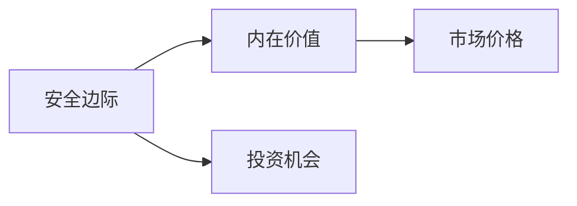

                 


# 《格雷厄姆的价值投资传承》

## 关键词：
- 价值投资、格雷厄姆、安全边际、内在价值、投资策略、巴菲特、彼得·林奇

## 摘要：
本文将详细介绍格雷厄姆的价值投资理论及其传承。通过分析格雷厄姆的核心理念，如安全边际和内在价值，探讨其在现代投资中的应用。结合实际案例和系统架构，展示如何将格雷厄姆的理论与技术结合，构建有效的投资策略。

---

## 第1章：引言

### 1.1 背景介绍
- **问题背景**：传统投资领域中，价值投资是基于对公司内在价值的深入分析，寻找市场价格低于内在价值的投资机会。
- **问题描述**：格雷厄姆的价值投资理论强调安全边际和内在价值，为投资者提供了长期稳健的投资策略。
- **问题解决**：通过系统化的方法，将格雷厄姆的理论应用于现代投资实践。

---

## 第2章：价值投资的核心概念

### 2.1 核心概念与联系
- **安全边际**：指股票价格低于其内在价值的程度，确保在市场波动中仍有获利空间。
- **内在价值**：公司未来现金流的现值，计算方法包括股息贴现模型和自由现金流贴现模型。

**概念对比表格**：
| 概念      | 定义                                                                 |
|-----------|--------------------------------------------------------------------|
| 安全边际  | 股票价格与内在价值之间的差距，提供缓冲以应对市场波动。         |
| 内在价值  | 公司未来现金流的现值，反映其真实价值。                             |

**Mermaid图示**：


---

## 第3章：价值投资的算法原理

### 3.1 安全边际计算算法
- **算法流程**：
  1. 计算公司的内在价值。
  2. 确定市场价格。
  3. 计算安全边际（内在价值 - 市场价格）。

**Python实现代码**：
```python
def calculate_margin_of_safety(intrinsic_value, market_price):
    return intrinsic_value - market_price

# 示例
intrinsic_value = 100  # 内在价值
market_price = 80       # 市场价格
margin = calculate_margin_of_safety(intrinsic_value, market_price)
print(f"安全边际为：${margin}")
```

### 3.2 内在价值计算算法
- **股息贴现模型（DDM）**：
  $$ \text{内在价值} = \frac{\text{预期股息}}{\text{折现率} - \text{增长率}} $$

**Python实现代码**：
```python
def calculate_intrinsic_value(dividend, discount_rate, growth_rate):
    return dividend / (discount_rate - growth_rate)

# 示例
dividend = 2.0  # 预期股息
discount_rate = 0.08  # 折现率
growth_rate = 0.02    # 股息增长率
intrinsic_value = calculate_intrinsic_value(dividend, discount_rate, growth_rate)
print(f"内在价值为：${intrinsic_value}")
```

---

## 第4章：价值投资的系统架构

### 4.1 领域模型
- **领域模型类图**：
  ```mermaid
  classDiagram
      class Company {
          name: str
          intrinsic_value: float
          market_price: float
      }
      class InvestmentStrategy {
          calculate_margin_of_safety(Company)
          calculate_intrinsic_value(Company)
      }
      Company <|-- InvestmentStrategy
  ```

### 4.2 系统架构
- **系统架构图**：
  ```mermaid
  graph LR
      InvestmentSystem --> DataCollector
      DataCollector --> Analyzer
      Analyzer --> DecisionMaker
      DecisionMaker --> Investor
  ```

### 4.3 接口与交互
- **序列图**：
  ```mermaid
  sequenceDiagram
      Investor -> DataCollector: 获取公司数据
      DataCollector -> Analyzer: 分析内在价值
      Analyzer -> DecisionMaker: 计算安全边际
      DecisionMaker -> Investor: 提供投资建议
  ```

---

## 第5章：项目实战

### 5.1 环境安装
- 安装Python和必要的库（如pandas、numpy）。

### 5.2 核心实现
```python
class InvestmentStrategy:
    def calculate_intrinsic_value(self, company):
        # 使用DDM计算内在价值
        dividend = company.dividend
        discount_rate = company.discount_rate
        growth_rate = company.growth_rate
        return dividend / (discount_rate - growth_rate)
    
    def calculate_margin_of_safety(self, company):
        return company.intrinsic_value - company.market_price
```

### 5.3 案例分析
- **案例1**：分析可口可乐公司，计算其安全边际。
- **案例2**：分析IBM公司，评估其投资价值。

---

## 第6章：总结与展望

### 6.1 核心总结
- 格雷厄姆的价值投资理论通过安全边际和内在价值，提供了稳健的投资策略。
- 现代技术，如大数据和机器学习，可以进一步优化这些策略。

### 6.2 未来展望
- 结合人工智能技术，提升内在价值计算的准确性。
- 开发自动化投资系统，实现格雷厄姆理论的智能化应用。

---

## 作者：
作者：AI天才研究院 & 禅与计算机程序设计艺术

