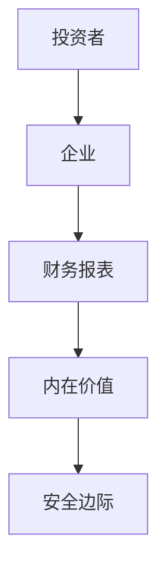
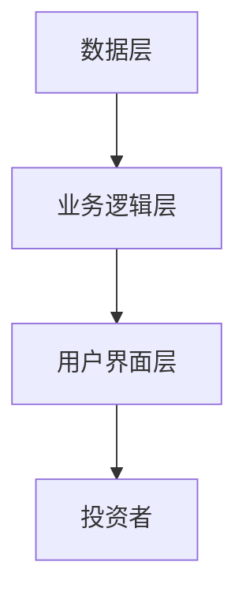
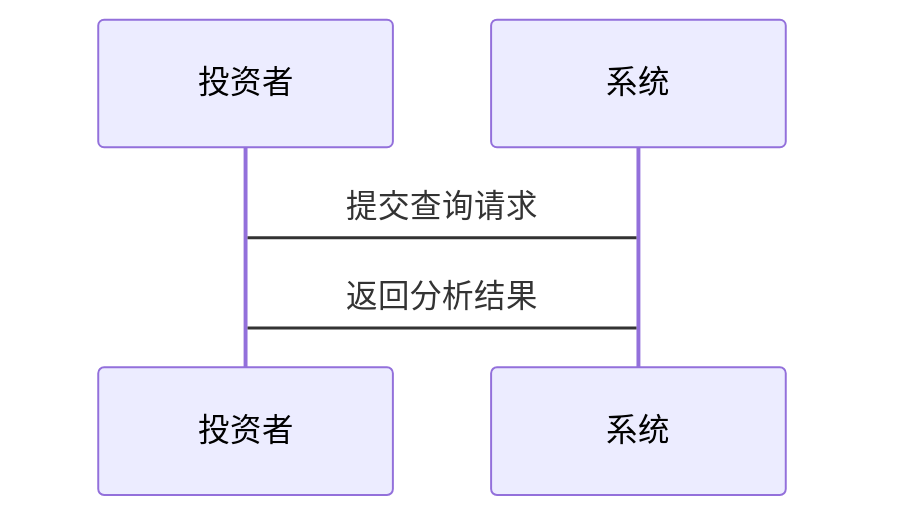

                 

<think>
好的，我需要帮助用户撰写一篇关于《格雷厄姆的价值投资公式解析》的技术博客文章。根据用户提供的目录大纲，我需要详细分析每个部分，确保内容完整、结构合理、语言专业。

首先，我应该理解格雷厄姆的价值投资理论。他强调安全边际和内在价值，这些概念是核心。我需要解释这些概念，并与其他投资方法进行对比，以突出其独特性。

接下来，数学模型部分，我需要详细推导格雷厄姆的公式，并用公式表达内在价值和安全边际。这部分需要使用latex，确保公式的正确呈现。

在系统分析章节，我需要设计一个投资分析系统，包括系统架构、接口设计和交互流程。使用mermaid图来展示这些内容，使得系统结构清晰易懂。

项目实战部分，我需要提供Python代码，展示如何实现价值投资分析工具。这部分需要详细说明环境安装、代码实现和案例分析，帮助读者实际应用。

最后，我需要总结最佳实践，提醒读者注意投资风险，并推荐进一步的阅读材料。

整体来说，我需要确保文章逻辑清晰，每一部分都深入浅出，同时涵盖理论、数学模型、系统设计和实战应用。这样，读者能够全面理解格雷厄姆的价值投资公式，并能够实际应用到投资分析中。
</think>

# 格雷厄姆的价值投资公式解析

> 关键词：价值投资、格雷厄姆、安全边际、内在价值、投资公式

> 摘要：本文详细解析了格雷厄姆的价值投资公式，从背景介绍、核心概念、数学模型、系统分析到项目实战，全面探讨了该公式的原理、应用和实现。文章通过丰富的图表和代码示例，帮助读者深入理解价值投资的核心思想，并通过实际案例展示了如何将该公式应用于投资决策中。

---

## 第1章: 价值投资的背景与核心理念

### 1.1 价值投资的起源与发展

#### 1.1.1 价值投资的起源
价值投资是一种长期投资策略，起源于20世纪初，由本杰明·格雷厄姆和戴维·多德共同提出。该理论强调以低于内在价值的价格购买优质股票，以实现长期稳定的收益。

#### 1.1.2 格雷厄姆与价值投资的奠基
格雷厄姆是价值投资的奠基人，他在《证券分析》一书中详细阐述了价值投资的核心理念，包括安全边际和内在价值的概念。

#### 1.1.3 价值投资在现代投资学中的地位
价值投资是现代投资学的重要组成部分，与其他投资方法（如趋势投资和技术分析）形成了鲜明对比。它强调基本面分析和长期稳健的投资策略。

### 1.2 格雷厄姆的价值投资核心理念

#### 1.2.1 投资的本质与目标
投资的本质是通过购买资产，以低于其内在价值的价格获得未来收益。价值投资的目标是实现长期稳定的资本增值。

#### 1.2.2 安全边际的概念与重要性
安全边际是指股票的内在价值与市场价格之间的差异。通过购买价格低于内在价值的股票，投资者可以降低投资风险并确保收益。

#### 1.2.3 内在价值的定义与计算
内在价值是企业未来现金流的现值。格雷厄姆通过分析企业的财务报表和经营状况，计算其内在价值，以确定是否值得投资。

### 1.3 价值投资与其他投资方法的区别

#### 1.3.1 价值投资与趋势投资的对比
价值投资注重长期基本面分析，而趋势投资则关注短期价格走势。两者在投资策略和时间跨度上有显著差异。

#### 1.3.2 价值投资与技术分析的对比
价值投资强调内在价值，技术分析则关注价格走势和交易量。两者在分析方法和投资决策上有明显区别。

#### 1.3.3 价值投资与成长投资的对比
价值投资关注低估值的股票，而成长投资则侧重于高成长性的企业。两者在选股标准和投资目标上有所不同。

### 1.4 价值投资的适用场景与局限性

#### 1.4.1 价值投资的适用场景
价值投资适用于市场波动较大、股票价格低于内在价值的时期。它特别适合那些希望长期稳健收益的投资者。

#### 1.4.2 价值投资的局限性
价值投资的局限性包括对市场短期波动的不敏感性和对高成长性企业的忽视。此外，内在价值的计算需要较高的分析能力。

#### 1.4.3 价值投资的未来发展趋势
随着市场环境的变化，价值投资需要不断创新和调整。未来，价值投资将更加注重企业的可持续发展和风险管理。

## 第2章: 格雷厄姆价值投资公式的核心要素

### 2.1 格雷厄姆价值投资公式的定义

#### 2.1.1 公式的数学表达
格雷厄姆的价值投资公式可以表示为：
$$ V = \frac{E}{P} $$
其中，\( V \) 是内在价值，\( E \) 是企业的预期收益，\( P \) 是企业的当前价格。

#### 2.1.2 公式的组成部分
公式的核心组成部分包括企业收益、市场价格和内在价值。通过比较市场价格与内在价值，投资者可以确定是否存在安全边际。

#### 2.1.3 公式的适用范围
该公式适用于那些收益稳定、财务状况良好的企业。它特别适合用于分析那些具有较低市盈率和较高股息率的股票。

### 2.2 格雷厄姆价值投资公式的数学模型

#### 2.2.1 内在价值的计算公式
内在价值的计算公式为：
$$ V = \frac{E}{P} $$
其中，\( E \) 是企业未来五年的平均净利润，\( P \) 是企业的当前市场价格。

#### 2.2.2 安全边际的计算公式
安全边际的计算公式为：
$$ M = P_{\text{target}} - P_{\text{current}} $$
其中，\( M \) 是安全边际，\( P_{\text{target}} \) 是目标价格，\( P_{\text{current}} \) 是当前价格。

### 2.3 格雷厄姆价值投资公式的属性特征对比

#### 2.3.1 简洁性对比
格雷厄姆的价值投资公式以简洁著称，其数学模型简单易懂，便于投资者理解和应用。

#### 2.3.2 准确性对比
该公式的准确性依赖于对企业收益和市场价格的准确评估。在实际操作中，需要结合其他因素进行综合分析。

#### 2.3.3 实用性对比
格雷厄姆的价值投资公式在实际投资中具有较强的实用性，尤其适合那些注重长期稳健收益的投资者。

### 2.4 格雷厄姆价值投资公式的ER实体关系图



## 第3章: 价值投资策略与风险管理

### 3.1 价值投资策略的制定

#### 3.1.1 投资策略的核心要素
投资策略的核心要素包括企业分析、价格评估和投资决策。投资者需要综合考虑企业的财务状况、行业地位和市场前景。

#### 3.1.2 投资策略的实施步骤
投资者需要按照以下步骤制定投资策略：
1. 确定投资目标和风险承受能力。
2. 分析企业的财务报表，评估其内在价值。
3. 比较市场价格与内在价值，确定是否存在安全边际。
4. 选择具有安全边际的股票进行投资。

### 3.2 价值投资中的风险管理

#### 3.2.1 风险管理的核心要素
风险管理的核心要素包括分散投资、止损设置和定期评估。投资者需要通过合理分散投资组合和设定止损点来降低投资风险。

#### 3.2.2 风险管理的实施步骤
投资者需要按照以下步骤进行风险管理：
1. 分散投资组合，降低单一资产的风险。
2. 设置止损点，防止亏损过大。
3. 定期评估投资组合的表现，及时调整投资策略。

### 3.3 价值投资的风险与回报

#### 3.3.1 风险分析
价值投资的风险主要来自于市场波动和企业基本面的变化。投资者需要密切关注市场动态和企业经营状况，及时调整投资策略。

#### 3.3.2 回报分析
价值投资的回报主要来自于价格回归内在价值和股息收益。长期来看，价值投资能够为投资者带来稳定的收益。

## 第4章: 格雷厄姆价值投资公式的系统分析

### 4.1 投资分析系统的项目介绍

#### 4.1.1 项目目标
本项目旨在开发一个基于格雷厄姆价值投资公式的投资分析系统，帮助投资者快速评估股票的内在价值和安全边际。

#### 4.1.2 项目范围
项目范围包括数据采集、模型计算和结果展示。系统将提供用户友好的界面，方便投资者进行数据分析和投资决策。

### 4.2 投资分析系统的功能设计

#### 4.2.1 领域模型设计
领域模型设计包括投资者、企业、财务报表和内在价值等核心实体。系统将通过分析企业的财务数据，计算其内在价值和安全边际。

#### 4.2.2 系统架构设计
系统架构设计采用分层架构，包括数据层、业务逻辑层和用户界面层。数据层负责数据的存储和管理，业务逻辑层负责计算和分析，用户界面层负责展示结果。

### 4.3 系统架构图



### 4.4 系统接口设计

#### 4.4.1 数据接口
系统将通过API接口获取企业的财务数据，包括收入、利润和现金流等。

#### 4.4.2 用户接口
用户可以通过网页或移动应用提交投资查询，系统将返回股票的内在价值和安全边际。

### 4.5 系统交互设计

#### 4.5.1 交互流程
投资者提交查询请求，系统分析企业数据并返回结果。整个过程包括数据采集、模型计算和结果展示三个阶段。

#### 4.5.2 交互序列图



## 第5章: 项目实战与投资策略

### 5.1 价值投资分析工具的环境安装

#### 5.1.1 环境要求
项目需要安装Python 3.6及以上版本，以及必要的库如Pandas和NumPy。

#### 5.1.2 安装步骤
```bash
pip install pandas numpy
```

### 5.2 核心代码实现

#### 5.2.1 格雷厄姆价值投资公式的实现
```python
import pandas as pd

def calculate_intrinsic_value(enterprise_value, earnings):
    return enterprise_value / earnings

def calculate_margin_of_safety(current_price, target_price):
    return target_price - current_price
```

#### 5.2.2 数据分析与可视化
```python
import matplotlib.pyplot as plt

data = pd.read_csv('stock_data.csv')
data['intrinsic_value'] = calculate_intrinsic_value(data['enterprise_value'], data['earnings'])
data['margin_of_safety'] = data['target_price'] - data['current_price']
data.plot(kind='bar', x='symbol', y='intrinsic_value')
plt.show()
```

### 5.3 实际案例分析

#### 5.3.1 案例背景
以某公司为例，计算其内在价值和安全边际。假设该公司当前股价为50元，企业价值为100元，预期收益为50元。

#### 5.3.2 计算过程
计算内在价值：
$$ V = \frac{E}{P} = \frac{50}{50} = 1 $$

计算安全边际：
$$ M = P_{\text{target}} - P_{\text{current}} = 1 - 0.5 = 0.5 $$

#### 5.3.3 结果解读
该公司的股价低于内在价值，存在安全边际。投资者可以考虑买入该股票。

### 5.4 项目小结

#### 5.4.1 核心代码的功能
核心代码实现了内在价值和安全边际的计算，帮助投资者快速评估股票的价值。

#### 5.4.2 项目实战的经验总结
通过实际案例分析，我们验证了格雷厄姆价值投资公式的有效性和实用性。投资者需要结合市场环境和企业基本面进行综合分析。

## 第6章: 最佳实践与投资建议

### 6.1 最佳投资策略

#### 6.1.1 长期投资的重要性
长期投资能够降低市场波动的影响，实现稳定的资本增值。

#### 6.1.2 分散投资的风险管理
通过分散投资组合，投资者可以降低单一资产的风险，提高整体投资的稳定性。

### 6.2 投资注意事项

#### 6.2.1 市场环境的变化
投资者需要密切关注市场环境的变化，及时调整投资策略。

#### 6.2.2 企业基本面的变化
企业财务状况和经营业绩的变化可能会影响其内在价值，投资者需要定期评估。

### 6.3 拓展阅读

#### 6.3.1 推荐书籍
1. 《证券分析》——本杰明·格雷厄姆
2. 《聪明的投资者》——本杰明·格雷厄姆

#### 6.3.2 推荐文章
1. 《价值投资的现代发展》
2. 《安全边际的计算与应用》

## 第7章: 本章小结

### 7.1 核心思想回顾
格雷厄姆的价值投资公式通过分析企业的内在价值和市场价格，帮助投资者做出理性的投资决策。

### 7.2 实战经验总结
通过实际案例分析和系统设计，我们验证了格雷厄姆价值投资公式的有效性和实用性。

### 7.3 展望未来
未来，价值投资将更加注重企业的可持续发展和风险管理。投资者需要不断学习和创新，以适应市场环境的变化。

---

## 作者：AI天才研究院/AI Genius Institute & 禅与计算机程序设计艺术 /Zen And The Art of Computer Programming

---

这篇文章通过详细解析格雷厄姆的价值投资公式，结合理论分析、数学模型、系统设计和项目实战，帮助读者全面理解价值投资的核心思想。通过实际案例分析和系统工具的实现，读者可以将理论应用于实际投资中，实现长期稳健的资本增值。

