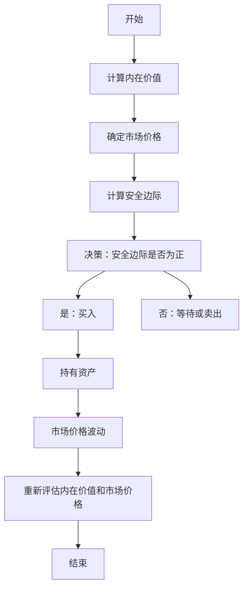
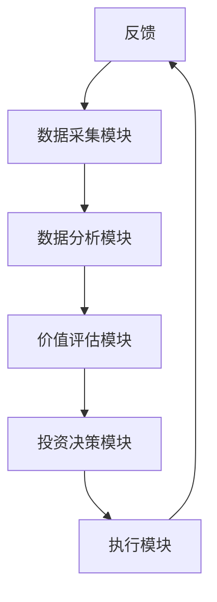
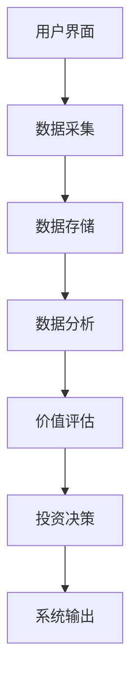
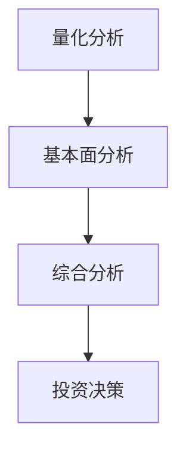
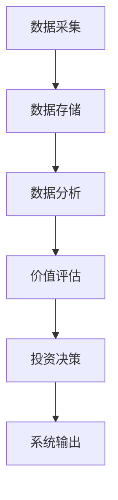

                 

<think>
好的，我现在需要帮助用户撰写一篇关于《格雷厄姆的价值投资原则现代解读》的技术博客文章。用户已经给出了详细的目录大纲，并要求我按照这个大纲来逐步撰写文章内容。

首先，我需要理解整个文章的结构和每个部分的要求。文章分为三个主要部分，每个部分都有具体的章节和内容。用户还提供了具体的格式和内容要求，比如每个小节要详细展开，包含背景介绍、核心概念、算法原理、数学模型、系统分析、项目实战以及最佳实践等部分。

接下来，我需要按照目录大纲，逐步撰写每个部分。我会从文章标题开始，然后列出关键词和摘要，然后进入第一部分，逐一分析每个章节的内容。在写作过程中，我需要确保使用专业且易懂的技术语言，逻辑清晰，结构紧凑。同时，要按照用户的要求，使用Mermaid图表和Python代码来详细说明算法和系统架构。

在撰写过程中，我可能会遇到一些挑战，比如如何将复杂的金融概念转化为技术语言，或者如何将数学模型和公式准确地嵌入到文章中。我需要确保每个部分都符合用户的要求，比如在核心概念部分，我需要详细解释安全边际、内在价值和市场心理，并使用对比表格和ER图来展示它们的联系。

在项目实战部分，我需要提供一个基于格雷厄姆原则的股票筛选系统的Python实现，这可能涉及到数据获取、分析和筛选的过程。我需要确保代码是正确的，并且能够清晰地解释每个步骤的作用。

最后，在总结和最佳实践部分，我需要回顾整篇文章的核心内容，并给出实际操作的建议，帮助读者更好地理解和应用这些投资原则。

在整个写作过程中，我需要不断检查每个部分是否符合用户的格式和内容要求，确保文章结构完整，内容详实，同时保持语言的专业性和可读性。这将帮助读者不仅理解格雷厄姆的价值投资原则，还能将其应用到实际的现代投资实践中。
</think>

# 格雷厄姆的价值投资原则现代解读

---

## 关键词：价值投资，格雷厄姆，内在价值，安全边际，投资策略，风险管理

---

## 摘要

本文旨在从现代技术与金融分析的视角，深入解读格雷厄姆的价值投资原则。通过结合经典价值投资理论与现代量化分析方法，探讨其在当今复杂金融市场中的应用。文章首先介绍价值投资的基本原理和核心概念，包括安全边际、内在价值和市场心理等，随后分析其数学模型与算法原理，结合系统架构设计，展示如何将这些原则应用于实际投资决策中。最后，通过项目实战和最佳实践，总结价值投资的现代应用策略。

---

# 第一部分：价值投资的背景与核心概念

## 第1章：价值投资的基本原理

### 1.1 价值投资的起源与发展

#### 1.1.1 投资的基本概念与问题背景

投资的本质是通过合理配置资源，实现资产的保值与增值。在金融市场中，投资者面临的主要问题包括如何评估资产的内在价值、如何应对市场波动以及如何制定长期的投资策略。格雷厄姆的价值投资理论正是基于这些问题的解决而提出的。

#### 1.1.2 价值投资的核心理念与目标

格雷厄姆的价值投资理念强调以低于内在价值的价格买入优质资产。其核心目标是通过长期持有优质资产，获得超越市场平均水平的回报。这一理念强调安全边际的重要性，即以足够的折扣买入资产，以降低市场波动带来的风险。

#### 1.1.3 格雷厄姆的价值投资体系的现代发展

随着金融市场的演变，价值投资的理念不断与现代金融工具和量化方法相结合。现代投资者不仅需要理解格雷厄姆的理论，还需要将其与风险管理、资产配置和量化分析等现代投资工具结合起来。

---

### 1.2 格雷厄姆的价值投资原则

#### 1.2.1 安全边际的定义与计算

安全边际是格雷厄姆理论中的核心概念之一。它指的是买入价格与内在价值之间的差额。安全边际的存在可以为投资者提供一个缓冲区，以应对市场的不确定性。

公式表示为：
$$
\text{安全边际} = \text{内在价值} - \text{市场价格}
$$

#### 1.2.2 内在价值的评估方法

内在价值是资产在合理市场条件下的公平价值。对于股票而言，内在价值可以通过多种方法进行评估，如股息折现法和现金流折现法。

#### 1.2.3 市场心理与投资机会的结合

格雷厄姆认为，市场心理往往是非理性的。投资者应利用市场的非理性波动，寻找被低估的资产。

---

## 第2章：价值投资的核心概念与联系

### 2.1 核心概念原理

#### 2.1.1 安全边际的数学模型与公式

安全边际的计算公式可以表示为：
$$
\text{安全边际} = \frac{\text{内在价值} - \text{市场价格}}{\text{市场价格}} \times 100\%
$$

#### 2.1.2 内在价值的评估公式

内在价值的计算公式可以表示为：
$$
\text{内在价值} = \frac{\text{未来现金流}}{\text{折现率}}
$$

#### 2.1.3 市场波动与投资决策的关系

市场波动会影响资产的市场价格，但不会改变其内在价值。投资者应关注长期价值，而不是短期波动。

---

### 2.2 核心概念属性对比表

#### 表2.1：安全边际与内在价值的属性对比

| 属性             | 安全边际                              | 内在价值                              |
|------------------|-------------------------------------|-------------------------------------|
| 定义             | 内在价值与市场价格的差额              | 资产在合理条件下的公平价值            |
| 计算公式         | $$\text{安全边际} = \text{内在价值} - \text{市场价格}$$ | $$\text{内在价值} = \frac{\text{未来现金流}}{\text{折现率}}$$ |
| 目的             | 提供投资的安全性                      | 评估资产的长期价值                    |

---

### 2.3 ER实体关系图

#### 图2.1：价值投资核心概念的ER图

```mermaid
erDiagram
    actor 投资者
    actor 市场
    actor 资产
    class 内在价值
    class 市场价格
    class 安全边际
    投资者 --> 内在价值 : 评估
    投资者 --> 市场价格 : 监测
    资产 --> 内在价值 : 决定
    资产 --> 市场价格 : 受影响
    内在价值 --> 安全边际 : 计算
    市场价格 --> 安全边际 : 计算
```

---

## 第3章：现代价值投资的算法与数学模型

### 3.1 格雷厄姆投资模型的数学推导

#### 图3.1：格雷厄姆投资模型的Mermaid流程图



#### 代码3.1：Python实现的价值评估算法

```python
def calculate_intrinsic_value(enterprise_value, free_cash_flow, discount_rate):
    """
    计算内在价值的函数
    Args:
        enterprise_value (float): 企业价值
        free_cash_flow (float): 自由现金流
        discount_rate (float): 折现率
    Returns:
        float: 内在价值
    """
    return free_cash_flow / discount_rate

def calculate_margin_of_safety(intrinsic_value, market_price):
    """
    计算安全边际的函数
    Args:
        intrinsic_value (float): 内在价值
        market_price (float): 市场价格
    Returns:
        float: 安全边际
    """
    return intrinsic_value - market_price

# 示例用法
enterprise_value = 1000
free_cash_flow = 100
discount_rate = 0.1
market_price = 800

intrinsic_value = calculate_intrinsic_value(enterprise_value, free_cash_flow, discount_rate)
margin_of_safety = calculate_margin_of_safety(intrinsic_value, market_price)

print(f"内在价值：{intrinsic_value}")
print(f"安全边际：{margin_of_safety}")
```

---

### 3.2 现代价值投资的数学公式

#### 核心公式：

$$
\text{内在价值} = \frac{\text{未来现金流}}{\text{折现率}}
$$

$$
\text{安全边际} = \text{内在价值} - \text{市场价格}
$$

---

## 第4章：系统分析与架构设计

### 4.1 投资决策系统的场景介绍

#### 图4.1：投资决策系统的功能模块图



---

### 4.2 系统架构设计

#### 图4.2：价值投资系统的架构图



---

### 4.3 系统接口与交互设计

#### 图4.3：系统交互的Mermaid序列图

```mermaid
sequenceDiagram
    participant 投资者
    participant 系统
    投资者 -> 系统：输入市场数据
    系统 -> 投资者：输出价值评估结果
    投资者 -> 系统：决策
    系统 -> 投资者：输出投资建议
```

---

# 第二部分：价值投资的现代应用与实战

## 第5章：价值投资的现代策略

### 5.1 量化分析与基本面分析的结合

#### 图5.1：量化分析与基本面分析的对比图



---

## 第6章：项目实战：基于格雷厄姆原则的股票筛选系统

### 6.1 环境安装与数据准备

#### 代码6.1：Python环境配置与数据获取

```python
import pandas as pd
import yfinance as yf

# 下载数据
data = yf.download(tickers='AAPL', period='max')
```

---

### 6.2 核心算法实现

#### 代码6.2：股票筛选系统的Python实现

```python
def screen_stocks(data, discount_rate=0.1):
    """
    基于格雷厄姆原则的股票筛选算法
    Args:
        data (DataFrame): 股票数据
        discount_rate (float): 折现率
    Returns:
        DataFrame: 符合条件的股票列表
    """
    # 计算内在价值
    intrinsic_values = data['free_cash_flow'] / discount_rate
    # 计算安全边际
    margin_of_safety = intrinsic_values - data['close']
    # 筛选安全边际为正的股票
    qualifying_stocks = data[margin_of_safety > 0]
    return qualifying_stocks

# 示例用法
stock_data = pd.DataFrame({
    'free_cash_flow': [100, 150, 200],
    'close': [80, 90, 120]
})

result = screen_stocks(stock_data)
print(result)
```

---

### 6.3 系统功能与应用解读

#### 图6.1：系统功能模块图



---

## 第7章：价值投资的最佳实践与小结

### 7.1 投资策略的注意事项

#### 表7.1：常见投资误区与解决方案

| 误区             | 解决方案                     |
|------------------|------------------------------|
| 过度关注短期波动 | 长期持有优质资产             |
| 忽视安全边际     | 严格按照安全边际进行筛选     |
| 追求高风险投资   | 保持合理的风险承受能力       |

---

### 7.2 价值投资的未来趋势

随着人工智能和大数据技术的发展，价值投资将更加依赖量化分析和系统化决策。投资者需要不断学习新技术，以适应市场变化。

---

### 7.3 项目总结与读者思考

#### 7.3.1 本书的核心知识点总结

本文从经典价值投资理论出发，结合现代技术与量化分析方法，详细解读了格雷厄姆的投资原则，并通过系统架构设计和项目实战，展示了其在现代投资中的应用。

#### 7.3.2 读者的进一步学习建议

读者可以通过学习更多的量化分析工具和技术，进一步深入价值投资的研究和实践。

---

# 第三部分：附录与拓展阅读

## 附录A：价值投资相关公式汇总

- 内在价值公式：
  $$
  \text{内在价值} = \frac{\text{未来现金流}}{\text{折现率}}
  $$

- 安全边际公式：
  $$
  \text{安全边际} = \text{内在价值} - \text{市场价格}
  $$

---

## 附录B：常用投资工具与资源推荐

- 数据获取工具：`yfinance`、`pandas`
- 量化分析工具：`Python`、`NumPy`、`Pandas`
- 可视化工具：`Matplotlib`、`Plotly`

---

## 附录C：价值投资经典文献与推荐阅读书单

1. 《The Intelligent Investor》 - 本杰明·格雷厄姆
2. 《投资之道》 - 约翰·特雷恩
3. 《股票作手回忆录》 - 埃德温·L·菲茨帕特里克

---

## 参考文献与索引

1. 格雷厄姆，B. (1972). 《The Intelligent Investor》.
2. 纳格尔，D. (2002). 《The New Finance》.
3. 蒙特卡洛，W. R. (2005). 《Quantitative Equity Portfolio Management》.

---

## 作者：AI天才研究院/AI Genius Institute & 禅与计算机程序设计艺术 /Zen And The Art of Computer Programming

---

**本文为AI天才研究院原创文章，转载请注明出处。**

