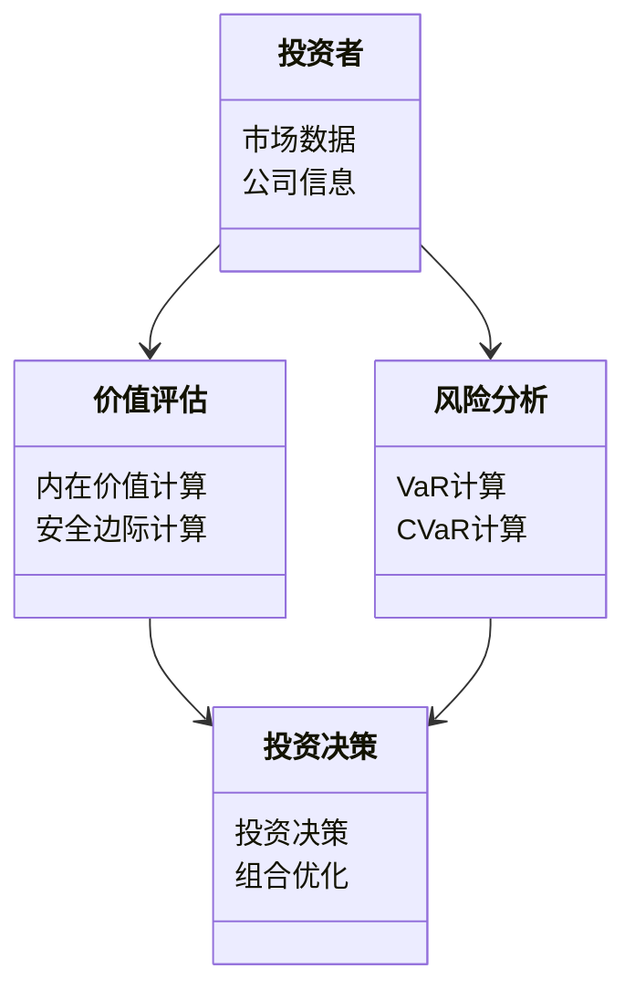
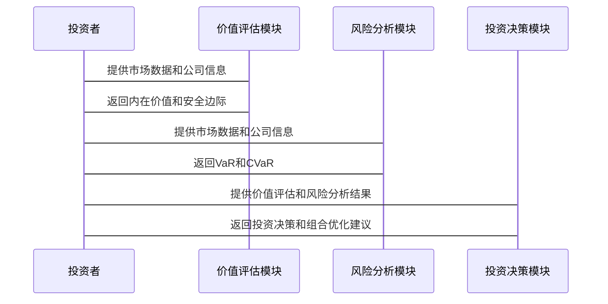

                 


# 格雷厄姆的价值投资者修炼之道

## 关键词：价值投资、安全边际、内在价值、投资策略、风险管理、市场先生、投资心态

## 摘要：  
格雷厄姆的价值投资理念是投资领域的重要里程碑，强调通过深入分析和安全边际来选择被低估的资产。本文将系统性地探讨价值投资的核心概念、策略和心理因素，结合实际案例和数学模型，帮助读者构建稳健的投资体系。

---

## 第一部分: 价值投资的背景与核心理念

### 第1章: 价值投资的起源与核心理念

#### 1.1 价值投资的起源
- 1.1.1 投资学说的演进历程
  - 传统投资学：基于市场有效性和资产定价模型（CAPM）的传统理论。
  - 价值投资的起源：本杰明·格雷厄姆的《证券分析》与《聪明的投资者》奠定了价值投资的理论基础。

- 1.1.2 格雷厄姆的学术贡献
  - 格雷厄姆是价值投资之父，提出了“安全边际”和“内在价值”等核心概念。
  - 通过研究市场的非有效性，强调寻找被市场低估的资产。

- 1.1.3 价值投资的定义与外延
  - 价值投资：通过分析企业的基本面，寻找市场价格低于内在价值的证券进行投资。
  - 外延：涵盖股票、债券、房地产等多种资产类别。

#### 1.2 价值投资的核心理念
- 1.2.1 市场先生与投资者心理
  - 市场先生：格雷厄姆将市场波动比作一个情绪化的“市场先生”，投资者应避免被其情绪左右。
  - 投资者心理：贪婪与恐惧是市场波动的主要驱动力，价值投资者需保持理性和耐心。

- 1.2.2 安全边际的概念与应用
  - 安全边际：市场价格与内在价值之间的差额，是投资的安全垫。
  - 应用：通过计算安全边际，选择具有足够安全空间的资产。

- 1.2.3 内在价值的计算与评估
  - 内在价值：资产在未来现金流的现值，基于企业的盈利能力、成长性和行业地位。
  - 计算方法：DCF（现金流折现法）和比率分析法（市盈率、市净率等）。

### 第2章: 价值投资与其他投资方法的对比

#### 2.1 主流投资方法概述
- 2.1.1 股票投资的主要流派
  - 技术分析：基于价格和成交量的波动，预测未来的价格走势。
  - 成长投资：关注高成长性的企业，愿意为未来的增长支付溢价。
  - 价值投资：寻找市场价格低于内在价值的资产。

- 2.1.2 技术分析与基本面分析的区别
  - 技术分析：依赖价格走势、成交量等市场数据，预测短期价格波动。
  - 基本面分析：研究企业的财务状况、行业地位和盈利能力，评估内在价值。

- 2.1.3 价值投资与成长投资的异同
  - 同：都基于基本面分析，寻找具有投资价值的资产。
  - 异：价值投资侧重于低估值，成长投资侧重于高成长性。

#### 2.2 价值投资的核心优势
- 2.2.1 长期视角下的收益稳定性
  - 价值投资注重长期收益，避免短期波动的干扰。
  - 通过安全边际，降低投资组合的波动性和风险。

- 2.2.2 风险控制的有效性
  - 通过安全边际和分散投资，降低单一资产的风险。
  - 强调风险优先于收益，确保投资的稳健性。

- 2.2.3 抗市场波动的能力
  - 价值投资者在市场恐慌时寻找机会，避免盲目跟风。
  - 长期持有优质资产，抵御市场的短期波动。

---

## 第二部分: 价值投资的核心概念与分析框架

### 第3章: 安全边际与内在价值

#### 3.1 安全边际的定义与计算
- 3.1.1 安全边际的公式推导
  $$ 安全边际 = 内在价值 - 市场价格 $$
  - 安全边际为正时，资产具有投资价值。
  - 例如：某股票的内在价值为10元，市场价格为8元，安全边际为2元。

- 3.1.2 安全边际与投资风险的关系
  - 安全边际越大，投资风险越低。
  - 安全边际为负时，资产可能被高估，应避免投资。

- 3.1.3 安全边际的动态调整
  - 根据市场变化和企业基本面，定期重新评估内在价值和市场价格。
  - 例如：在市场下跌时，重新计算安全边际，寻找新的投资机会。

#### 3.2 内在价值的评估方法
- 3.2.1 现金流折现模型（DCF）
  $$ V = \sum_{t=1}^{n} \frac{CF_t}{(1+r)^t} + \frac{TV}{(1+r)^n} $$
  - 公式说明：CF_t为第t年的现金流，r为折现率，TV为终值。
  - 例如：某公司未来5年的现金流分别为5元、6元、7元、8元、9元，假设折现率为10%，终值为100元，则内在价值约为现值之和加上终值的现值。

- 3.2.2 市盈率与市净率的比较
  - 市盈率（P/E）= 市场价格 / 每股收益
  - 市净率（P/B）= 市场价格 / 每股净资产
  - 选择低市盈率和低市净率的公司，可能具有较高的安全边际。

- 3.2.3 行业与公司的特异性分析
  - 不同行业具有不同的估值标准，需结合行业特点进行分析。
  - 公司特异性：如管理层素质、竞争优势、财务状况等，影响内在价值的评估。

### 第4章: 价值投资的决策框架

#### 4.1 投资决策的三要素
- 4.1.1 价格与价值的匹配
  - 寻找市场价格低于内在价值的资产。
  - 例如：某股票的市场价格为20元，内在价值为25元，价格与价值匹配。

- 4.1.2 市场情绪的判断
  - 市场情绪可以通过成交量、价格波动等指标进行判断。
  - 在市场恐慌时，寻找被低估的资产；在市场狂热时，警惕泡沫。

- 4.1.3 公司基本面的分析
  - 研究公司的盈利能力、成长性、财务状况和行业地位。
  - 例如：分析公司的收入增长、利润率、资产负债率等。

#### 4.2 价值投资的决策流程
- 4.2.1 确定投资目标与策略
  - 明确投资目标：如长期稳健收益、分散投资风险。
  - 制定投资策略：如集中投资优质资产、分散投资多个资产。

- 4.2.2 构建投资组合的步骤
  - 选择具有较高安全边际的资产。
  - 分散投资，降低单一资产的风险。
  - 定期调整投资组合，根据市场变化和企业基本面进行优化。

- 4.2.3 定期复盘与调整
  - 定期检查投资组合的表现。
  - 根据市场变化和企业基本面，调整投资组合。
  - 例如：定期评估安全边际，重新选择具有更高安全边际的资产。

---

## 第三部分: 价值投资的系统分析与架构设计

### 第5章: 价值投资的系统分析

#### 5.1 投资决策的系统架构
- 5.1.1 系统输入：市场数据与公司信息
  - 市场数据：如股票价格、成交量、市场指数等。
  - 公司信息：如财务报表、管理层信息、行业报告等。

- 5.1.2 系统处理：价值评估与风险分析
  - 价值评估：使用DCF模型、市盈率、市净率等方法评估内在价值。
  - 风险分析：计算VaR（在险价值）和CVaR（条件在险价值）等风险指标。

- 5.1.3 系统输出：投资决策与组合优化
  - 投资决策：如买入、卖出或持有某资产。
  - 组合优化：根据市场变化和风险分析，优化投资组合。

#### 5.2 价值投资的系统架构设计

##### 系统功能设计（领域模型）


##### 系统架构设计（系统架构图）
```mermaid
container 价值投资系统 {
    组件 价值评估模块 {
        DCF模型
        市盈率分析
        市净率分析
    }
    组件 风险分析模块 {
        VaR计算
        CVaR计算
    }
    组件 投资决策模块 {
        投资决策
        组合优化
    }
}
```

##### 系统接口设计
- 输入接口：市场数据接口、公司信息接口。
- 输出接口：投资决策接口、组合优化接口。

##### 系统交互设计（序列图）


---

## 第6章: 价值投资的数学模型与算法实现

### 6.1 价值投资的数学模型

#### 6.1.1 内在价值的计算模型
- DCF模型：
$$ V = \sum_{t=1}^{n} \frac{CF_t}{(1+r)^t} + \frac{TV}{(1+r)^n} $$
- 市盈率模型：
$$ V = \frac{P}{E} \times \text{每股收益} $$
- 市净率模型：
$$ V = \frac{P}{B} \times \text{每股净资产} $$

#### 6.1.2 安全边际的计算模型
$$ \text{安全边际} = V_{\text{内在}} - P_{\text{市场价格}} $$

#### 6.1.3 风险管理的数学模型
- VaR模型：
$$ VaR = \text{损失金额} $$
- CVaR模型：
$$ CVaR = \text{平均损失} $$

### 6.2 价值投资的算法实现

#### 6.2.1 投资组合优化算法
- 简单平均法：
$$ w_i = \frac{1}{n} $$
- 均值-方差优化：
$$ \text{Minimize} \sum_{i=1}^{n} w_i^2 \sigma_i^2 $$
$$ \text{Subject to} \sum_{i=1}^{n} w_i = 1 $$

#### 6.2.2 风险管理算法
- VaR计算：
$$ VaR = \text{分位数}(\text{损失分布}, \alpha) $$
- CVaR计算：
$$ CVaR = \text{平均}(\text{损失分布} | \text{损失} \geq VaR) $$

---

## 第四部分: 价值投资的项目实战与案例分析

### 第7章: 项目实战

#### 7.1 环境安装与工具准备
- Python环境：安装Python 3.9以上版本。
- 必需库：pandas、numpy、scipy、matplotlib。
- 数据源：获取股票数据，如Yahoo Finance API。

#### 7.2 核心实现
- 内在价值计算：
```python
import numpy as np

def calculate_intrinsic_value(cash_flows, discount_rate, terminal_value):
    present_value = 0
    for t in range(len(cash_flows)):
        present_value += cash_flows[t] / (1 + discount_rate) ** t
    present_value += terminal_value / (1 + discount_rate) ** len(cash_flows)
    return present_value
```

- 风险管理：
```python
from scipy.stats import norm

def calculate VaR(returns, confidence_level=0.95):
    return np.quantile(returns, 1 - confidence_level)

def calculate CVaR(returns, confidence_level=0.95):
    var = calculate VaR(returns, confidence_level)
    filtered_returns = [r for r in returns if r >= var]
    return np.mean(filtered_returns)
```

#### 7.3 案例分析
- 案例：分析某公司股票，计算其内在价值和安全边际。
  - 数据：假设公司未来5年的现金流分别为5、6、7、8、9元，折现率为10%，终值为100元，市场价格为8元。
  - 内在价值：
    $$ V = 5/(1.1) + 6/(1.1)^2 + 7/(1.1)^3 + 8/(1.1)^4 + 9/(1.1)^5 + 100/(1.1)^5 $$
    $$ V ≈ 4.545 + 4.958 + 4.462 + 3.988 + 3.552 + 49.383 ≈ 70.926 $$
  - 安全边际：
    $$ \text{安全边际} = 70.926 - 8 = 62.926 $$
  - 结论：该股票具有较高的安全边际，适合投资。

---

## 第五部分: 价值投资的总结与展望

### 第8章: 总结与展望

#### 8.1 核心要点总结
- 格雷厄姆的价值投资理念：寻找市场价格低于内在价值的资产。
- 安全边际的重要性：确保投资的稳健性。
- 风险管理：通过分散投资和风险模型降低投资风险。

#### 8.2 价值投资的未来展望
- 数字化与智能化：利用大数据和人工智能技术，提升价值评估和风险分析的效率。
- 全球化投资：拓展海外市场，寻找更具投资价值的资产。
- 可持续投资：关注ESG（环境、社会、治理）因素，推动长期可持续发展。

---

## 作者：AI天才研究院/AI Genius Institute & 禅与计算机程序设计艺术/Zen And The Art of Computer Programming

---

通过本文的详细分析与实战案例，读者可以系统性地理解格雷厄姆的价值投资理念，并将其应用于实际投资中。从理论到实践，从系统设计到算法实现，本文为价值投资者提供了全面的指导和实用的工具。

