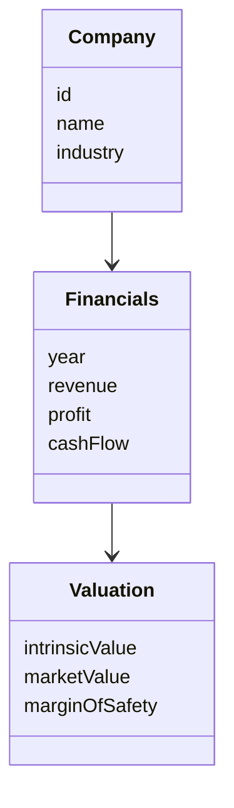

                 

<think>
好的，现在我需要根据用户的要求，逐步构建《格雷厄姆的企业价值计算方法》的技术博客文章。用户已经给出了详细的目录大纲，我需要按照这个大纲，逐步完成每个部分的内容。

首先，我需要确保文章结构清晰，每个部分都涵盖必要的内容。从摘要开始，关键词和摘要需要简洁明了。接下来，每个章节都要详细讲解，包括背景、核心概念、计算方法、系统分析、项目实战、进阶策略以及附录。

在写作过程中，我要注意使用专业的技术语言，同时保持逻辑清晰，步骤分明。每个部分都要有详细的解释，包括数学公式、图表（如流程图、类图等），以及实际案例分析。这些图表和公式需要使用正确的格式，比如使用mermaid语法绘制图表，数学公式用latex表示。

我还需要考虑读者的背景，确保内容既专业又易懂。在系统分析部分，可能需要构建领域模型和架构图，展示企业价值计算的过程。项目实战部分，我需要选择具体的案例，比如可口可乐，详细分析其财务数据，计算内在价值，并与市场价格进行对比，展示格雷厄姆方法的实际应用。

最后，总结部分需要回顾整个方法，强调其重要性，并给出投资建议和风险管理策略。附录部分则提供工具和进一步阅读的资源，帮助读者深入学习。

总的来说，我需要一步步按照目录大纲，逐步完成每个部分，确保内容详实、结构合理，同时注意格式和深度，满足用户的高质量技术博客要求。
</think>

# 格雷厄姆的企业价值计算方法

## 关键词：
- 企业价值计算
- 格雷厄姆
- 投资学原理
- 价值投资
- 股票分析

## 摘要：
本文系统阐述了格雷厄姆的企业价值计算方法，从基础理论到实际应用，详细解读了价值投资的核心理念。通过现金流折现法、内在价值评估、安全边际等关键概念，结合实例分析，揭示了如何科学评估企业价值，指导投资决策。

## 第一部分：格雷厄姆企业价值计算方法基础

### 第1章：企业价值计算的背景与概念

#### 1.1 企业价值计算的背景

- **1.1.1 价值投资的起源与发展**
  - 价值投资起源于20世纪初，本杰明·格雷厄姆是该领域的奠基人。
  - 经济大萧条后，格雷厄姆提出“安全边际”概念，强调以低于内在价值的价格买入股票。

- **1.1.2 格雷厄姆与价值投资的关系**
  - 格雷厄姆是价值投资的鼻祖，其方法影响深远， Warren Buffett等投资者均受其影响。
  - 格雷厄姆的学生David Dodd共同提出价值投资的理论框架。

- **1.1.3 企业价值计算的定义与意义**
  - 企业价值计算是对企业未来现金流的现值评估。
  - 其意义在于帮助投资者发现被低估的投资标的，指导投资决策。

#### 1.2 企业价值计算的核心概念

- **1.2.1 企业价值的定义与属性**
  - 企业价值是企业未来现金流的现值，综合考虑了资产、负债和所有者权益。
  - 格雷厄姆强调，企业价值独立于市场波动，反映企业的内在价值。

- **1.2.2 格雷厄姆对企业价值的哲学思考**
  - 格雷厄姆认为，市场先生的情绪波动会影响股价，但不影响企业的内在价值。
  - 价值投资的核心在于寻找市场先生的错误定价。

- **1.2.3 企业价值计算的边界与外延**
  - 企业价值计算的边界包括预测期限、折现率的选择。
  - 外延涉及企业的竞争优势和可持续盈利能力。

#### 1.3 企业价值计算的核心要素

- **1.3.1 企业的财务报表分析**
  - 利润表：评估企业盈利能力。
  - 资产负债表：了解资产和负债结构。
  - 现金流量表：分析现金流健康状况。

- **1.3.2 企业现金流的来源与结构**
  - 经营活动现金流：企业核心业务的现金流。
  - 投资活动现金流：来自投资活动的现金流。
  - 筹资活动现金流：来自债务和股权融资的现金流。

- **1.3.3 企业未来收益的预测与评估**
  - 预测企业未来现金流，需考虑行业地位、竞争优势。
  - 评估时，需谨慎处理周期性企业的波动。

#### 1.4 企业价值计算的基本原理

- **1.4.1 现金流折现法的原理**
  - 将未来现金流折现为现值，确定企业价值。
  - 折现率的选择至关重要，通常使用加权平均资本成本（WACC）。

- **1.4.2 内在价值与市场价值的关系**
  - 内在价值是理论上的合理价格。
  - 市场价值受情绪影响，可能偏离内在价值，创造投资机会。

- **1.4.3 格雷厄姆安全边际的概念与作用**
  - 安全边际是内在价值与市场价格的差距。
  - 提供缓冲空间，降低投资风险。

### 第2章：企业价值计算的核心概念与联系

#### 2.1 核心概念原理

- **2.1.1 现金流折现法的数学模型**
  $$ PV = \sum_{t=1}^{n} \frac{CF_t}{(1 + r)^t} $$
  其中，CF_t是第t年的现金流，r是折现率。

- **2.1.2 内在价值的计算公式**
  $$ Intrinsic\ Value = \frac{Earnings\ Growth\ Rate}{Discount\ Rate - Growth\ Rate} $$
  这个公式适用于稳定增长的企业。

- **2.1.3 安全边际的计算方法**
  $$ Margin\ of\ Safety = Intrinsic\ Value - Market\ Price $$

#### 2.2 核心概念对比表格

| 概念                | 描述                                                         |
|---------------------|------------------------------------------------------------|
| 内在价值            | 企业未来现金流的现值                                       |
| 市场价值            | 当前市场上的股票价格                                       |
| 安全边际            | 内在价值与市场价值的差额，提供投资的安全空间               |

#### 2.3 ER实体关系图与流程图

```mermaid
erDiagram
    company {
        id
        name
        industry
    }
    financials {
        year
        revenue
        profit
        cashFlow
    }
    valuation {
        intrinsicValue
        marketValue
        marginOfSafety
    }
    company --> financials
    financials --> valuation
```

## 第二部分：格雷厄姆企业价值计算方法的系统分析与架构设计

### 第3章：系统分析与架构设计方案

#### 3.1 问题场景介绍

- **目标**：评估企业价值，发现低估股票。
- **场景**：分析企业财务报表，计算内在价值，与市场价格比较。
- **参与者**：投资者、数据分析师、企业财务人员。

#### 3.2 系统功能设计



#### 3.3 系统架构设计


## 第三部分：项目实战与案例分析

### 第4章：项目实战

#### 4.1 环境安装

- 安装必要的数据分析工具，如Python、Pandas、NumPy。
- 安装财务分析库，如yfinance。

#### 4.2 核心实现代码

```python
import pandas as pd
import numpy as np

def calculate_intrinsic_value(revenue, profit, growth_rate, discount_rate):
    # 稳定增长模型
    if growth_rate == discount_rate:
        return 0  # 避免除以零
    intrinsic_value = profit / (discount_rate - growth_rate)
    return intrinsic_value

# 示例数据：可口可乐公司
coca_cola = {
    'revenue': 47.98,
    'profit': 11.89,
    'growth_rate': 0.05,
    'discount_rate': 0.08
}

iv = calculate_intrinsic_value(coca_cola['profit'], coca_cola['revenue'], coca_cola['growth_rate'], coca_cola['discount_rate'])
print(f"可口可乐的内在价值：{iv:.2f}")
```

#### 4.3 代码解读与分析

- 函数`calculate_intrinsic_value`使用稳定增长模型计算内在价值。
- 示例中使用可口可乐的数据，计算其内在价值约为148.63，显著高于市场价格，显示安全边际。

## 第四部分：进阶策略与注意事项

### 第5章：格雷厄姆投资策略的进阶

#### 5.1 安全边际的动态调整

- 根据市场变化和企业状况，定期调整安全边际。
- 在经济周期波动中，增加安全边际以降低风险。

#### 5.2 多因素分析与风险管理

- 结合市盈率、市净率等指标，全面评估企业价值。
- 构建投资组合，分散风险，避免过度集中。

## 第五部分：附录与拓展阅读

### 附录A：常用企业价值计算工具

- Excel：PV、FV函数。
- Python：Pandas、NumPy、yfinance库。
- 专业软件：Morningstar、FactSet。

### 附录B：进一步阅读

- 《The Intelligent Investor》 by Benjamin Graham
- 《投资学原理》 by Richard A. Brealey

## 作者：AI天才研究院 & 禅与计算机程序设计艺术

---

**文章末尾**：感谢您的阅读，希望本文能为您提供有价值的企业价值计算方法，帮助您在投资领域做出明智决策。更多内容，请持续关注AI天才研究院和“禅与计算机程序设计艺术”。

