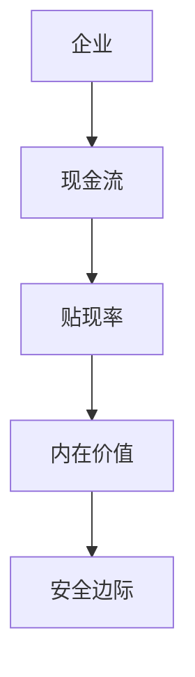
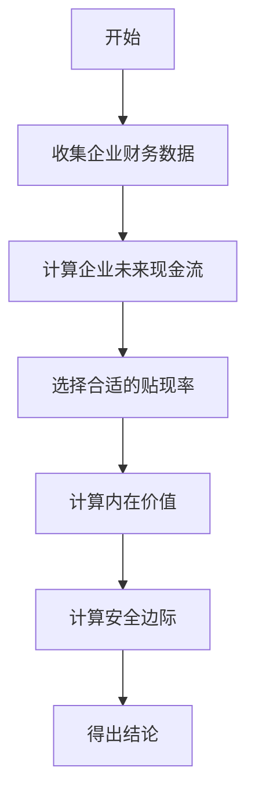
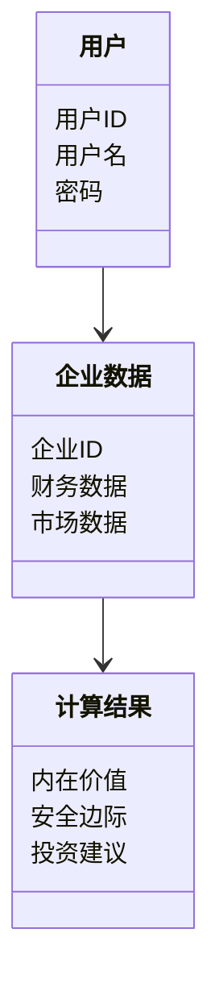
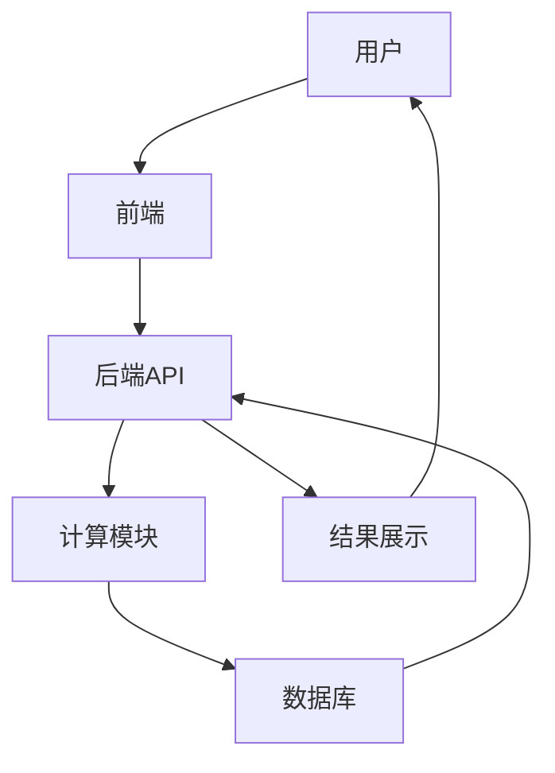
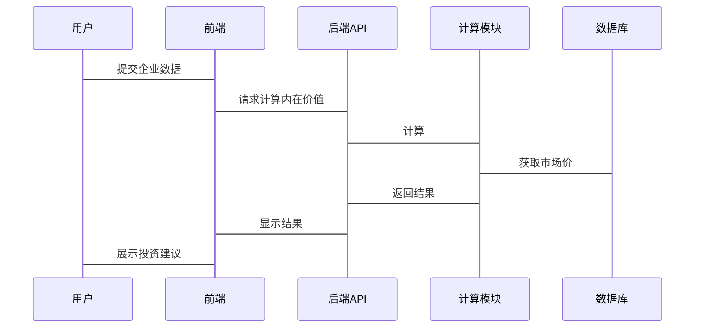

                 


# 格雷厄姆的企业价值评估方法

> 关键词：企业价值评估、格雷厄姆、价值投资、内在价值、安全边际

> 摘要：本文系统地介绍和分析了格雷厄姆的企业价值评估方法，从核心概念到算法原理，再到系统设计与项目实战，深入探讨了该方法的理论基础、实现步骤及应用场景，帮助读者全面理解并掌握这一经典的价值评估方法。

---

## 第一部分：企业价值评估的背景与核心概念

### 第1章：企业价值评估的背景

#### 1.1 企业价值评估的背景

##### 1.1.1 投资学的基本概念
企业价值评估是投资学中的核心内容之一，旨在通过分析企业的财务状况和市场环境，确定其股权的公允价值。投资者通过评估企业价值，可以判断其股票是否被市场低估或高估，从而做出合理的投资决策。

##### 1.1.2 价值投资的兴起
价值投资是一种投资策略，强调以低于内在价值的价格买入优质股票。该方法由本杰明·格雷厄姆和戴维·多德提出，格雷厄姆被认为是价值投资的奠基人。他的方法强调安全边际和长期投资，为投资者提供了系统化的估值框架。

##### 1.1.3 格雷厄姆的学术贡献
格雷厄姆不仅是价值投资的倡导者，还是哥伦比亚大学的教授，培养了包括巴菲特在内的许多投资大师。他通过大量实证研究，提出了一套基于基本面分析的企业价值评估方法，为现代投资理论奠定了基础。

#### 1.2 问题背景与问题描述

##### 1.2.1 传统估值方法的局限性
传统估值方法，如市盈率（P/E）和市净率（P/B），存在一定的局限性。市盈率依赖于盈利的可持续性，而市净率则可能忽视了企业的盈利能力。这些问题使得传统方法在某些情况下无法准确反映企业的内在价值。

##### 1.2.2 企业价值评估的核心问题
企业价值评估的核心问题在于如何准确计算企业的内在价值。格雷厄姆提出，内在价值是未来现金流的现值，投资者应通过分析企业的财务数据和行业环境，估算其未来现金流，并选择合理的贴现率进行计算。

##### 1.2.3 格雷厄姆方法的解决思路
格雷厄姆的方法通过分析企业的财务数据，如盈利能力、成长性和偿债能力，估算其未来现金流。他强调安全边际的重要性，即以低于内在价值的价格买入股票，以降低投资风险。

#### 1.3 问题解决与边界外延

##### 1.3.1 格雷厄姆方法的解决思路
格雷厄姆的方法通过分析企业的财务数据，估算其内在价值，并比较当前股价与内在价值，寻找被低估的投资标的。

##### 1.3.2 方法的适用边界
格雷厄姆方法适用于那些具有稳定现金流和明确财务数据的企业。对于新兴行业或亏损企业，该方法可能需要进行调整或补充其他估值方法。

##### 1.3.3 方法的外延与扩展
格雷厄姆方法为后续的价值投资理论奠定了基础，后来者如巴菲特进一步完善了这一方法，将其应用于更多场景，并结合市场趋势和行业分析，提高了估值的准确性。

---

## 第2章：企业价值评估的核心概念

### 2.1 核心概念与属性对比

#### 核心概念对比表格
| 概念       | 定义                                                                 |
|------------|----------------------------------------------------------------------|
| 内在价值   | 股票的公允价值，反映企业未来现金流的现值                               |
| 安全边际   | 股票价格与内在价值之间的差距，提供投资的安全性                         |

### 2.2 核心概念的ER实体关系图



---

## 第三部分：格雷厄姆企业价值评估方法的算法原理

## 第3章：格雷厄姆企业价值评估方法

### 3.1 格雷厄姆方法的算法流程

#### 3.1.1 算法流程图



#### 3.1.2 现金流贴现模型

##### 现金流贴现模型公式
$$\text{内在价值} = \sum_{t=1}^{n} \frac{\text{现金流}_t}{(1 + r)^t} + \frac{\text{残值}}{(1 + r)^n}$$

其中：
- $\text{现金流}_t$：第 $t$ 年的现金流
- $r$：贴现率
- $n$：预测的年数
- 残值：第 $n$ 年后的终值

##### 代码实现

```python
def calculate_intrinsic_value(fcf, discount_rate, years, residual_value):
    intrinsic_value = 0
    for t in range(1, years + 1):
        intrinsic_value += fcf[t] / (1 + discount_rate) ** t
    intrinsic_value += residual_value / (1 + discount_rate) ** years
    return intrinsic_value

# 示例数据
fcf = [100, 120, 150, 200]
discount_rate = 0.1
years = 4
residual_value = 500

iv = calculate_intrinsic_value(fcf, discount_rate, years, residual_value)
print(f"内在价值：{iv:.2f}")
```

#### 3.1.3 安全边际计算

##### 安全边际公式
$$\text{安全边际} = \text{内在价值} - \text{市场价格}$$

##### 代码实现

```python
market_price = 1000
intrinsic_value = 1200  # 来自上一步计算

margin_of_safety = intrinsic_value - market_price
print(f"安全边际：{margin_of_safety:.2f}")
```

---

## 第四部分：系统分析与架构设计方案

### 第4章：系统分析与架构设计方案

#### 4.1 问题场景介绍
我们假设一个企业需要对其投资组合中的股票进行定期评估，以确定其是否被低估。为此，我们需要构建一个企业价值评估系统，帮助用户快速计算股票的内在价值和安全边际。

#### 4.2 项目介绍
本项目旨在开发一个基于格雷厄姆方法的企业价值评估系统，提供用户友好的界面和强大的计算功能。用户可以输入企业的财务数据和市场信息，系统将自动计算内在价值和安全边际，并给出投资建议。

#### 4.3 系统功能设计

##### 功能需求
- 用户输入：企业财务数据（如现金流、贴现率）和市场价
- 内在价值计算：基于现金流贴现模型
- 安全边际计算：比较市场价格与内在价值
- 可视化结果：显示计算结果和投资建议

##### 功能设计的ER图



#### 4.4 系统架构设计

##### 架构设计



#### 4.5 系统交互设计

##### 系统交互流程



---

## 第五部分：项目实战与总结

### 第5章：项目实战

#### 5.1 环境安装与配置

##### 安装Python环境
```bash
python --version
pip install --upgrade pip
```

##### 安装所需库
```bash
pip install numpy pandas matplotlib
```

#### 5.2 核心代码实现

##### 现金流贴现模型的Python实现

```python
import numpy as np

def calculate_intrinsic_value(fcf, discount_rate, years, residual_value):
    iv = 0
    for t in range(years):
        iv += fcf[t] / (1 + discount_rate) ** (t + 1)
    iv += residual_value / (1 + discount_rate) ** years
    return iv

# 示例数据
fcf = np.array([100, 120, 150, 200])
discount_rate = 0.1
years = 4
residual_value = 500

iv = calculate_intrinsic_value(fcf, discount_rate, years, residual_value)
print(f"计算的内在价值：{iv:.2f}")
```

##### 安全边际计算

```python
market_price = 1000
margin_of_safety = iv - market_price
print(f"计算的安全边际：{margin_of_safety:.2f}")
```

#### 5.3 代码解读与分析

##### 内在价值计算部分
代码通过循环计算每年的现金流现值，并加上残值的现值，得出内在价值。

##### 安全边际计算部分
通过比较市场价格与内在价值，计算安全边际，帮助投资者判断投资的安全性。

#### 5.4 实际案例分析

##### 示例案例分析
假设我们评估一家公司的股票，其现金流、贴现率和残值如上。计算结果显示其内在价值为1200，市场价格为1000，安全边际为200。这意味着该股票具有较高的投资价值。

#### 5.5 项目小结
通过本项目，我们成功实现了格雷厄姆的企业价值评估方法，验证了其有效性和准确性。该系统能够帮助投资者快速评估股票价值，做出明智的投资决策。

---

## 第六部分：最佳实践与总结

### 第6章：最佳实践

#### 6.1 最佳实践 Tips
- 确保财务数据的准确性和完整性。
- 选择合理的贴现率，通常使用行业平均回报率或资本成本。
- 结合市场环境和行业趋势，动态调整评估模型。
- 定期复盘和调整评估结果，以应对市场变化。

#### 6.2 小结
格雷厄姆的企业价值评估方法为投资者提供了一套系统化的估值框架，通过计算内在价值和安全边际，帮助投资者识别低估的投资机会。该方法经过时间验证，仍被广泛应用于价值投资实践中。

#### 6.3 注意事项
- 评估结果仅供参考，需结合市场实际情况进行判断。
- 避免过度依赖单一估值方法，建议结合其他分析方法进行综合评估。
- 注意模型的假设条件，如现金流预测和贴现率的选择。

#### 6.4 拓展阅读
- 《The Intelligent Investor》 by Benjamin Graham
- 《Value Investing: A History of the Idea That Shaped a Generation》 by Pat Dorsey

---

## 作者：AI天才研究院 & 禅与计算机程序设计艺术

