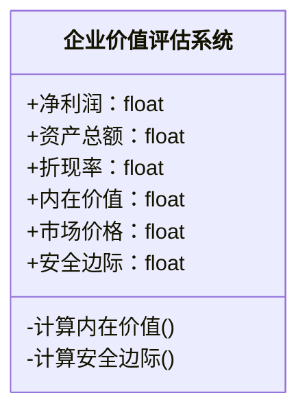
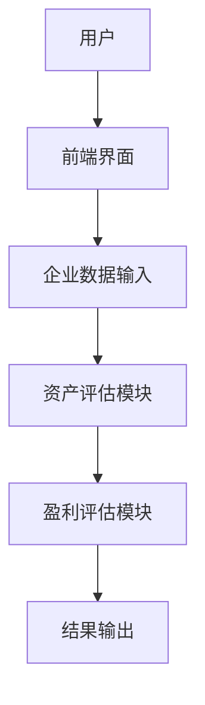

                 

<think>
好的，我需要帮助用户撰写一篇关于《格雷厄姆的企业价值评估方法：资产还是盈利？》的技术博客文章。首先，我会仔细阅读用户的需求，确保理解所有的要求和细节。

用户希望文章以“背景介绍”开始，涵盖核心概念、算法原理、数学模型、系统架构和项目实战等内容。文章需要使用技术语言，结构紧凑，逻辑清晰，适合IT领域专业人士阅读。

我将按照用户提供的目录结构进行撰写，确保每个部分都有足够的细节。首先，我会介绍企业价值评估的基本概念，然后详细分析资产和盈利在其中的作用，接着讲解格雷厄姆的方法，包括数学模型和案例分析。之后，我会探讨系统架构设计和项目实战，最后给出总结和建议。

在撰写过程中，我会注意使用专业术语，同时保持语言的简洁易懂。数学公式和图表需要清晰展示，帮助读者理解复杂概念。此外，案例分析部分需要具体，能够实际应用格雷厄姆的方法，增强文章的实用性和可读性。

最后，我会确保文章结构完整，符合用户的要求，字数在10000到12000字之间，并在末尾添加作者信息。通过这样的思考和规划，我相信能够撰写出一篇高质量、符合用户需求的技术博客文章。
</think>

# 格雷厄姆的企业价值评估方法：资产还是盈利？

> 关键词：格雷厄姆，企业价值评估，资产，盈利，价值投资

> 摘要：本文深入探讨了格雷厄姆的企业价值评估方法，分析了资产和盈利在评估中的作用，并通过实际案例展示了如何应用这些方法进行投资决策。文章从背景介绍、核心概念、数学模型、系统架构到项目实战，全面解析了格雷厄姆的投资理念及其在现代投资实践中的应用。

---

# 第一部分：企业价值评估的背景与核心概念

## 第1章：企业价值评估的背景与核心问题

### 1.1 企业价值评估的定义与意义

#### 1.1.1 企业价值评估的基本概念
企业价值评估（Business Valuation）是对企业的整体价值进行量化的过程，旨在确定企业在市场上的公平价值。这种评估不仅考虑企业的财务状况，还包括其未来的盈利能力、资产质量、市场地位等因素。企业价值评估是投资决策、并购交易、财务分析等领域的基础。

#### 1.1.2 企业价值评估的重要性
- 投资决策：帮助企业判断是否值得投资。
- 并购交易：确定企业收购的合理价格。
- 财务分析：评估企业经营效率和财务健康状况。
- 优化管理：帮助企业识别价值创造的机会。

#### 1.1.3 格雷厄姆的贡献与影响
本杰明·格雷厄姆（Benjamin Graham）是价值投资的奠基人，他提出的“安全边际”和“内在价值”概念深刻影响了现代企业价值评估方法。格雷厄姆认为，企业的内在价值是其未来现金流的现值，而市场价格与内在价值的差异为企业提供了投资机会。

---

### 1.2 资产与盈利的关系

#### 1.2.1 资产的定义与分类
资产是企业拥有或控制的资源，能够为企业带来经济利益。资产可以分为流动资产（如现金、应收账款）和非流动资产（如固定资产、无形资产）。

#### 1.2.2 盈利的定义与分类
盈利是企业在一定时期内实现的收入减去支出后的净收益。企业盈利可以分为净利润、息税前利润（EBIT）等。

#### 1.2.3 资产与盈利的内在联系
资产是企业创造利润的基础，而利润是资产使用效率的体现。高资产的企业可能需要更多的资金支持，而高盈利的企业可能具有更强的市场竞争力。

---

### 1.3 企业价值评估的核心问题

#### 1.3.1 资产驱动型与盈利驱动型企业的区别
- 资产驱动型企业：依赖于资产规模和效率，如制造业和房地产企业。
- 盈利驱动型企业：依赖于销售收入和利润率，如科技企业和服务业。

#### 1.3.2 资产与盈利在企业价值评估中的权重
在不同行业和企业规模下，资产和盈利对价值的影响程度不同。例如，周期性行业可能更依赖资产，而成长性行业可能更依赖盈利。

#### 1.3.3 格雷厄姆对企业价值评估的创新
格雷厄姆提出了基于资产的保守估值方法，强调安全边际。他认为，投资者应以低于内在价值的价格买入企业，以确保投资的安全性。

---

## 第2章：资产与盈利的评估方法

### 2.1 资产评估的核心原理

#### 2.1.1 资产的重置成本法
重置成本法是指以当前市场条件下重新购置相同资产所需支付的成本作为评估依据。

#### 2.1.2 资产的市场价值法
市场价值法是指以市场上相似资产的交易价格作为评估依据。

#### 2.1.3 资产的清算价值法
清算价值法是指企业在破产清算时，其资产可能变现的价值。

---

### 2.2 格雷厄姆的资产评估方法

#### 2.2.1 资产的内在价值计算
内在价值是企业未来现金流的现值，公式如下：

$$ \text{内在价值} = \sum_{t=1}^{n} \frac{\text{现金流}_t}{(1 + r)^t} $$

其中，\( r \) 是折现率。

#### 2.2.2 资产的账面价值与市场价值对比
账面价值是企业财务报表上的资产价值，而市场价值是基于市场交易的实际价值。两者差异可能反映了市场的有效性和资产的流动性。

#### 2.2.3 资产的质量与流动性评估
高质量的资产具有较高的变现能力，流动性强的资产更容易在市场上快速交易。

---

### 2.3 资产与盈利的综合评估模型

#### 2.3.1 资产驱动型企业的评估公式
$$ \text{企业价值} = \text{资产价值} \times (1 + \text{资产周转率}) $$

#### 2.3.2 盈利驱动型企业的评估公式
$$ \text{企业价值} = \text{净利润} \times \text{市盈率} $$

---

## 第3章：格雷厄姆投资方法的数学模型

### 3.1 格雷厄姆的安全边际计算

#### 3.1.1 安全边际的定义
安全边际是市场价格低于内在价值的部分，公式为：

$$ \text{安全边际} = \text{内在价值} - \text{市场价格} $$

#### 3.1.2 安全边际的应用
投资者应选择安全边际较高的企业进行投资，以降低市场波动带来的风险。

---

### 3.2 格雷厄姆的内在价值计算

#### 3.2.1 内在价值的公式
$$ \text{内在价值} = \frac{\text{净利润} \times (1 + \text{增长率})}{\text{折现率} - \text{增长率}} $$

#### 3.2.2 假设条件
- 假设企业未来现金流可以预测。
- 假设折现率和增长率是已知的。

---

### 3.3 格雷厄姆的案例分析

#### 3.3.1 某制造企业的资产评估案例
假设某制造企业有以下数据：
- 净利润：100万元
- 资产周转率：20%
- 折现率：8%

计算其内在价值：

$$ \text{内在价值} = \frac{100 \times (1 + 0.2)}{0.08 - 0.2} $$

然而，由于分母为负数，说明假设条件不合理，需重新调整增长率。

#### 3.3.2 某科技企业的盈利评估案例
假设某科技企业有以下数据：
- 净利润：500万元
- 市盈率：15倍

计算其企业价值：

$$ \text{企业价值} = 500 \times 15 = 7500 \text{万元} $$

---

## 第4章：系统分析与架构设计方案

### 4.1 问题场景介绍
假设我们开发一个企业价值评估系统，需要评估资产和盈利对企业价值的影响。

### 4.2 系统功能设计

#### 4.2.1 领域模型（mermaid 类图）


### 4.3 系统架构设计

#### 4.3.1 系统架构（mermaid 架构图）


### 4.4 系统接口设计

#### 4.4.1 输入接口
- 净利润输入
- 资产总额输入
- 折现率输入

#### 4.4.2 输出接口
- 内在价值输出
- 安全边际输出
- 企业价值评估报告

### 4.5 系统交互设计（mermaid 序列图）
```mermaid
sequenceDiagram
    participant 用户
    participant 系统
    用户->系统：输入企业数据
    系统->系统：计算内在价值和安全边际
    系统->用户：输出评估结果
```

---

## 第5章：项目实战

### 5.1 环境安装
- 安装Python和相关库（如numpy、pandas）

### 5.2 核心实现源代码
```python
import numpy as np

def calculate_intrinsic_value(net_profit, growth_rate, discount_rate):
    return net_profit * (1 + growth_rate) / (discount_rate - growth_rate)

net_profit = 1000000
growth_rate = 0.1
discount_rate = 0.08

intrinsic_value = calculate_intrinsic_value(net_profit, growth_rate, discount_rate)
print(f"内在价值：{intrinsic_value} 元")
```

### 5.3 案例分析与解读
以某企业为例，计算其内在价值和安全边际，分析投资决策。

---

## 第6章：总结与建议

### 6.1 最佳实践 tips
- 选择具有高安全边际的企业进行投资。
- 定期更新企业数据和市场环境，重新评估企业价值。
- 结合资产和盈利的综合评估，制定合理的投资策略。

### 6.2 小结
格雷厄姆的企业价值评估方法强调了资产和盈利在投资决策中的重要性。通过合理的评估模型和安全边际的计算，投资者可以更好地识别具有投资价值的企业。

### 6.3 注意事项
- 投资者需具备一定的财务知识和市场分析能力。
- 模型假设可能与实际情况存在差异，需谨慎调整。

### 6.4 拓展阅读
- 格雷厄姆的《证券分析》
- 巴菲特的《巴菲特致股东的信》

---

# 作者：AI天才研究院/AI Genius Institute & 禅与计算机程序设计艺术 /Zen And The Art of Computer Programming

