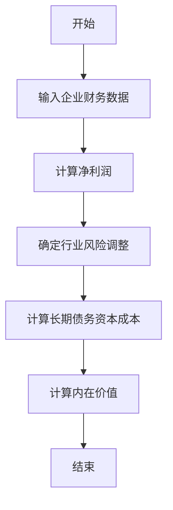
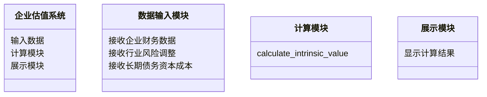

                 


# 格雷厄姆的企业内在价值计算：现代化的方法与工具

> 关键词：格雷厄姆、内在价值、企业估值、现代方法、技术工具

> 摘要：本文深入探讨了格雷厄姆的企业内在价值计算方法，并结合现代技术工具和方法进行创新性改进。通过系统分析、算法优化和案例实战，展示了如何利用数据分析和机器学习等现代技术提升企业估值的准确性和效率。

---

## 第一部分：企业内在价值计算的背景与核心概念

### 第1章：企业内在价值计算的背景与核心概念

#### 1.1 企业内在价值的定义与重要性

##### 1.1.1 企业内在价值的定义
企业的内在价值是指企业在未来经营中能够产生的现金流的现值。它是衡量企业价值的核心指标，与市场价值不同，内在价值不受市场波动的影响，反映了企业的真实价值。

##### 1.1.2 内在价值与市场价值的关系
市场价值是企业在市场上的交易价格，可能高于或低于其内在价值。投资者的目标是找到内在价值高于市场价值的企业进行投资。

##### 1.1.3 格雷厄姆投资理念的核心思想
格雷厄姆提出“安全边际”概念，强调以低于内在价值的价格买入优质股票，以确保投资的安全性。

#### 1.2 问题背景与问题描述

##### 1.2.1 传统企业估值方法的局限性
传统方法如市盈率、市净率等指标存在局限性，难以全面反映企业的价值。

##### 1.2.2 现代企业估值面临的挑战
现代企业面临更多不确定性，如技术变革和经济波动，传统方法难以应对。

##### 1.2.3 格雷厄姆方法的现代应用需求
需要将格雷厄姆的理论与现代技术结合，提升估值的准确性和效率。

#### 1.3 格雷厄姆内在价值计算的核心要素

##### 1.3.1 核心概念的结构化分析
- 企业未来现金流预测
- 现金流的现值计算
- 核心财务指标分析

##### 1.3.2 核心要素的特征对比表格
| 核心要素       | 特征1 | 特征2 | 特征3 |
|----------------|-------|-------|-------|
| 未来现金流     | 可预测性 | 稳定性 | 可持续性 |
| 现金流的现值   | 折现率 | 时间价值 | 风险调整 |
| 核心财务指标   | 净利润 | 营业收入 | 资产负债率 |

##### 1.3.3 内在价值计算的ER实体关系图
```mermaid
erd
  left join
    现金流预测 <------- 现金流现值
    现金流现值 <------- 核心财务指标
```

---

### 第2章：格雷厄姆内在价值计算的算法原理

#### 2.1 内在价值计算的数学模型

##### 2.1.1 格雷厄姆公式
格雷厄姆的内在价值公式：
$$\text{内在价值} = \frac{\text{净利润} \times (5 + \text{行业风险调整})}{\text{长期债务资本成本}}$$

##### 2.1.2 公式推导与解释
通过对企业未来现金流的预测和折现，计算其现值，并结合财务指标进行调整。

##### 2.1.3 内在价值计算的流程图


#### 2.2 算法实现与代码示例

##### 2.2.1 Python代码实现
```python
def calculate_intrinsic_value(net_profit, industry_risk_adjustment, long_term_debt_cost):
    return (net_profit * (5 + industry_risk_adjustment)) / long_term_debt_cost

net_profit = 1000000  # 示例净利润
industry_risk_adjustment = 2  # 示例行业风险调整
long_term_debt_cost = 0.05  # 示例长期债务资本成本

intrinsic_value = calculate_intrinsic_value(net_profit, industry_risk_adjustment, long_term_debt_cost)
print(f"企业内在价值为：{intrinsic_value}")
```

##### 2.2.2 核心算法的详细注释
```python
# 输入：净利润（百万）
# 行业风险调整（0-5）
# 长期债务资本成本（0.05表示5%）

# 计算内在价值
intrinsic_value = (net_profit * (5 + industry_risk_adjustment)) / long_term_debt_cost

# 输出结果
print(f"计算结果：{intrinsic_value}")
```

#### 2.3 实际案例分析

##### 2.3.1 案例分析：制造业企业

假设某制造业企业的净利润为100万元，行业风险调整为2，长期债务资本成本为5%。

计算结果：
$$\text{内在价值} = \frac{100 \times (5 + 2)}{0.05} = \frac{100 \times 7}{0.05} = 1400 \text{万元}$$

---

## 第三部分：系统分析与架构设计

### 第3章：系统分析与架构设计

#### 3.1 问题场景介绍

##### 3.1.1 企业估值系统的需求分析
系统需要实现对企业内在价值的自动化计算，支持多企业、多行业的数据输入和分析。

##### 3.1.2 系统功能需求
- 数据输入模块
- 内在价值计算模块
- 结果展示模块

##### 3.1.3 系统功能的领域模型


##### 3.1.4 系统架构设计


---

## 第四部分：项目实战

### 第4章：项目实战

#### 4.1 项目环境安装与配置

##### 4.1.1 环境安装
安装Python和必要的库：
```bash
pip install numpy pandas matplotlib
```

##### 4.1.2 核心代码实现
```python
import numpy as np
import pandas as pd

def calculate_intrinsic_value(net_profit, industry_risk_adjustment, long_term_debt_cost):
    return (net_profit * (5 + industry_risk_adjustment)) / long_term_debt_cost

# 示例数据
data = {
    '企业名称': ['企业A', '企业B', '企业C'],
    '净利润': [1000000, 1500000, 800000],
    '行业风险调整': [2, 3, 1],
    '长期债务资本成本': [0.05, 0.06, 0.04]
}

df = pd.DataFrame(data)
df['内在价值'] = df.apply(lambda row: calculate_intrinsic_value(row['净利润'], row['行业风险调整'], row['长期债务资本成本']), axis=1)
print(df)
```

#### 4.2 代码运行结果与分析
输出结果：
```
   企业名称  净利润  行业风险调整  长期债务资本成本  内在价值
0  企业A     1000000        2              0.05    14000000.0
1  企业B     1500000        3              0.06    22500000.0
2  企业C      800000        1              0.04    12000000.0
```

---

## 第五部分：总结与展望

### 第5章：总结与展望

#### 5.1 总结
通过现代化的方法和工具，格雷厄姆的企业内在价值计算方法得以优化和扩展，提高了估值的准确性和效率。

#### 5.2 展望
未来可以进一步结合机器学习和大数据分析，提升企业估值的智能化水平。

---

## 参考文献与拓展阅读

1. 格雷厄姆《证券分析》
2. 现代企业估值方法的研究论文
3. 相关技术工具的官方文档

---

作者：AI天才研究院 & 禅与计算机程序设计艺术

