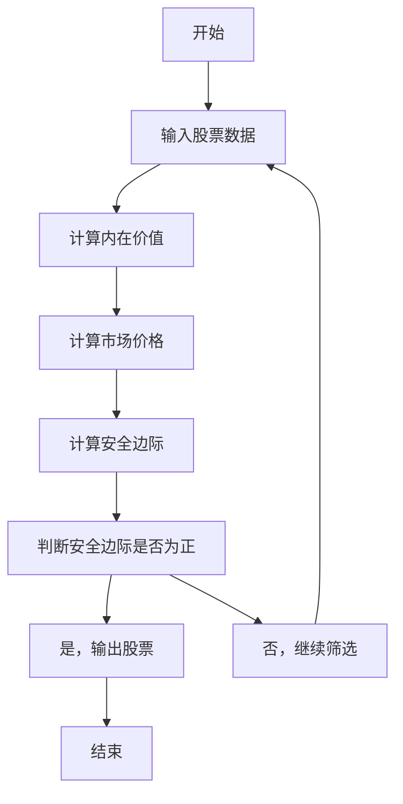
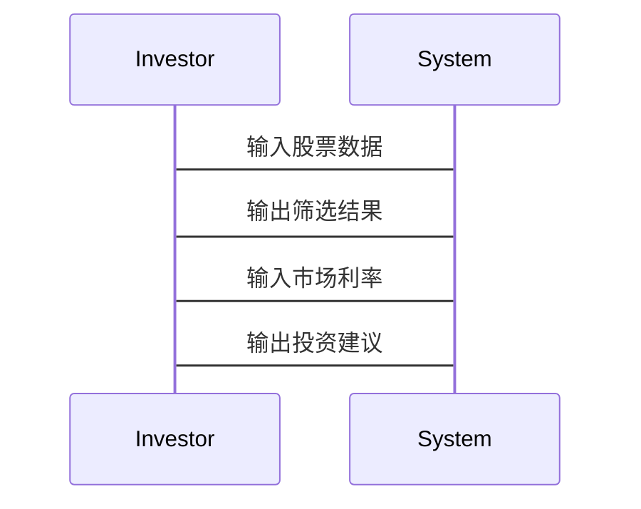

                 

<think>
嗯，用户希望我以《格雷厄姆的优先股投资策略》为标题，撰写一篇技术博客文章，要求结构紧凑、逻辑清晰，涵盖背景、策略、数学模型、系统架构、实战案例等多个方面。

首先，我需要明确文章的关键词，比如格雷厄姆、优先股、投资策略、价值投资、安全边际等。摘要部分要简明扼要，概括文章的核心内容。

接下来，按照目录大纲，我需要逐步展开每一章的内容。第一章要介绍格雷厄姆的背景和优先股的基本概念，包括定义、类型、特点等。第二章深入分析优先股的类型和风险，帮助读者理解不同种类的优先股及其风险。

第三章需要讲解格雷厄姆投资策略的数学模型，比如安全边际的计算公式和股息率的分析。这部分需要使用公式和图表来辅助说明，确保内容准确且易于理解。

第四章是系统架构与实现，我需要设计一个优先股筛选算法，并用Python代码实现。同时，系统接口和交互设计也需要详细描述，可能用序列图来展示。

第五章通过实战案例分析，让读者了解如何应用格雷厄姆的策略进行实际投资。最后，第六章总结全书，并给出进一步阅读的建议。

在写作过程中，我需要确保每一章都有详细的子章节，涵盖背景、原理、实战等，同时使用图表和代码来增强内容的可读性。比如，在数学模型部分，使用latex公式，确保公式的正确性和美观性。

最后，检查文章是否符合字数要求，大约1万到1万2千字，确保内容完整，结构合理。同时，确保文章末尾有作者信息，符合格式要求。

总的来说，我需要系统地分析每个部分，逐步展开，确保内容详尽且逻辑清晰，帮助读者全面理解格雷厄姆的优先股投资策略。
</think>

# 格雷厄姆的优先股投资策略

> 关键词：格雷厄姆，优先股，投资策略，价值投资，安全边际

> 摘要：本文深入分析了本杰明·格雷厄姆的优先股投资策略，结合其价值投资理论，探讨了优先股的基本概念、类型、风险分析、数学模型与系统架构，并通过实战案例分析，详细解读了如何应用格雷厄姆的安全边际理论选择优质优先股，降低投资风险，实现稳健收益。文章最后总结了格雷厄姆优先股投资策略的核心思想，并提供了进一步阅读的建议。

---

# 第一部分：格雷厄姆投资理论与优先股概述

## 第1章：格雷厄姆投资理论与优先股概述

### 1.1 格雷厄姆投资理论的背景与核心思想

#### 1.1.1 格雷厄姆的生平与投资理念

本杰明·格雷厄姆（Benjamin Graham）是20世纪最伟大的投资学家之一，被誉为“价值投资之父”。他出生于1894年，曾在纽约证券交易所工作，后来成为哥伦比亚大学的教授，著有《证券分析》和《聪明的投资者》等经典著作。格雷厄姆的投资理念强调安全边际和长期稳健的投资策略，主张以低于内在价值的价格买入优质股票，从而实现超额收益。

#### 1.1.2 价值投资的核心原则

格雷厄姆的价值投资理论主要包括以下几个核心原则：

1. **安全边际**：买入价格低于内在价值的股票，确保有足够的安全空间。
2. **长期投资**：避免频繁交易，追求长期的复利效应。
3. **基本面分析**：通过分析公司的财务报表和行业地位，评估其内在价值。
4. **分散投资**：通过分散投资降低风险，避免过度集中。

#### 1.1.3 优先股在格雷厄姆投资体系中的地位

优先股是格雷厄姆投资策略的重要组成部分。他认为，优先股具有较高的股息收益率和较低的波动性，是稳健投资者的理想选择。优先股的优先清偿权和固定的股息支付使其在熊市中表现相对稳定，符合格雷厄姆追求安全边际和长期稳健收益的核心思想。

---

### 1.2 优先股的基本概念与特点

#### 1.2.1 优先股的定义与分类

优先股是一种混合型证券，介于普通股和债券之间。其“优先”体现在以下几个方面：

1. **优先分红权**：优先股股东在公司分红时优先于普通股股东获得股息。
2. **优先清偿权**：在公司清算时，优先股股东优先于普通股股东获得剩余资产。

优先股的分类如下：

1. **累积优先股**：如果公司当年未支付股息，未支付的部分会累积到下一年。
2. **非累积优先股**：当年未支付的股息不再累积，视为放弃。
3. **可赎回优先股**：公司有权在特定条件下赎回优先股。
4. **不可赎回优先股**：公司无权赎回优先股，除非得到股东同意。

#### 1.2.2 优先股的优先权与收益稳定性

优先股的优先权主要体现在股息支付和资产清偿上。由于优先股的股息通常是固定的，因此其收益具有较高的稳定性，适合风险厌恶型投资者。

#### 1.2.3 优先股与普通股的对比分析

| 属性 | 优先股 | 普通股 |
|------|--------|--------|
| 股息支付 | 固定，优先 | 不固定，后置 |
| 资产清偿 | 优先 | 后置 |
| 投资风险 | 较低 | 较高 |
| 股价波动 | 较小 | 较大 |

---

### 1.3 格雷厄姆优先股投资的核心策略

#### 1.3.1 买入低于内在价值的股票

格雷厄姆强调以低于内在价值的价格买入股票。内在价值的计算公式如下：

$$ \text{内在价值} = \frac{\text{预期收益}}{\text{折现率}} $$

#### 1.3.2 避免过度波动的市场风险

格雷厄姆认为，市场波动是投资的主要风险之一。通过选择流动性高、股息稳定的优先股，可以有效降低市场波动的影响。

#### 1.3.3 选择具有安全边际的优先股

安全边际是格雷厄姆投资策略的核心。安全边际的计算公式为：

$$ \text{安全边际} = \text{内在价值} - \text{市场价格} $$

如果安全边际为正，说明股票价格低于其内在价值，具有投资价值。

---

## 第2章：优先股的类型与风险分析

### 2.1 优先股的主要类型

#### 2.1.1 累积优先股与非累积优先股

累积优先股的股息累积到下一年，而非累积优先股的股息不会累积。因此，累积优先股的风险较高，但回报也较高。

#### 2.1.2 可赎回优先股与不可赎回优先股

可赎回优先股的风险较高，因为公司有权在特定条件下赎回股票。不可赎回优先股的风险较低，但流动性较差。

#### 2.1.3 可转换优先股与不可转换优先股

可转换优先股可以转换为一定数量的普通股，具有较高的潜在回报。不可转换优先股的风险较低，但回报也较低。

---

### 2.2 优先股的风险特征

#### 2.2.1 利率风险对优先股的影响

优先股的股息通常与市场利率相关。当市场利率上升时，优先股的吸引力下降，导致价格下跌。

#### 2.2.2 股东权益的优先性与流动性风险

优先股的优先性使其在公司清算时优先获得资产，但其流动性较差，尤其是在市场低迷时。

#### 2.2.3 优先股的信用风险分析

优先股的信用风险主要来自发行公司的财务状况。如果公司财务状况恶化，优先股的收益和本金可能无法按时支付。

---

### 2.3 格雷厄姆对优先股风险的管理策略

#### 2.3.1 通过安全边际降低投资风险

格雷厄姆认为，通过选择具有足够安全边际的优先股，可以有效降低投资风险。

#### 2.3.2 避免市场波动的短期影响

优先股的股息收益率较高，可以部分抵消市场波动的影响。

#### 2.3.3 选择具有稳定股息的优质企业

格雷厄姆建议选择那些财务状况稳定、股息支付能力强的公司发行的优先股。

---

## 第3章：格雷厄姆优先股投资策略的数学模型与分析

### 3.1 格雷厄姆安全边际的数学模型

#### 3.1.1 安全边际的定义与计算公式

安全边际是股票市场价格与内在价值之间的差额：

$$ \text{安全边际} = \text{内在价值} - \text{市场价格} $$

如果安全边际为正，说明股票价格低于其内在价值，具有投资价值。

#### 3.1.2 安全边际率的计算方法

安全边际率的计算公式为：

$$ \text{安全边际率} = \frac{\text{内在价值} - \text{市场价格}}{\text{市场价格}} $$

安全边际率越高，说明股票的安全边际越大，投资风险越小。

---

### 3.2 优先股股息率的计算与分析

#### 3.2.1 优先股股息率的定义

股息率是优先股股息与面值的比率：

$$ \text{股息率} = \frac{\text{年股息}}{\text{优先股面值}} $$

#### 3.2.2 格雷厄姆对股息率的要求

格雷厄姆建议选择股息率较高的优先股，但同时要确保股息支付能力。

---

### 3.3 优先股投资的收益与风险评估

#### 3.3.1 投资收益的期望值计算

优先股的预期收益可以分为股息收益和资本增值两部分：

$$ \text{预期收益} = \text{股息收益} + \text{资本增值} $$

#### 3.3.2 风险的方差与标准差分析

风险可以用方差和标准差来衡量。方差的计算公式为：

$$ \text{方差} = \frac{1}{n}\sum_{i=1}^{n} (x_i - \mu)^2 $$

其中，$\mu$ 是平均收益，$x_i$ 是每期的收益。

标准差是方差的平方根：

$$ \text{标准差} = \sqrt{\text{方差}} $$

---

## 第4章：格雷厄姆优先股投资策略的系统架构与实现

### 4.1 投资决策系统的总体架构

#### 4.1.1 系统目标与功能模块划分

系统目标：帮助投资者选择具有安全边际的优先股。

功能模块：数据采集、风险评估、投资决策、结果分析。

#### 4.1.2 系统架构的ER图设计

```mermaid
erDiagram
    investor
    {
        id : int
        name : string
        portfolio : string
    }
    stock
    {
        id : int
        name : string
        dividend_yield : float
        face_value : float
    }
    investment
    {
        id : int
        investor_id : int
        stock_id : int
        amount : float
    }
    investor -- investment
    stock -- investment
```

---

### 4.2 优先股筛选算法的设计与实现

#### 4.2.1 筛选算法的流程图设计



#### 4.2.2 算法的Python实现代码

```python
def calculate_intrinsic_value(dividend, discount_rate):
    return dividend / discount_rate

def calculate_market_price(stock_data):
    return stock_data['close'].mean()

def calculate_margin_of_safety(intrinsic_value, market_price):
    return intrinsic_value - market_price

def screen_stocks(stocks, dividend, discount_rate):
    intrinsic_values = {stock: calculate_intrinsic_value(dividend, discount_rate) for stock in stocks}
    market_prices = {stock: calculate_market_price(stocks[stock]) for stock in stocks}
    margins = {stock: calculate_margin_of_safety(intrinsic_values[stock], market_prices[stock]) for stock in stocks}
    return {stock: margins[stock] for stock in margins if margins[stock] > 0}

# 示例代码
stocks = {
    'stock1': {'close': [100, 105, 95, 110]},
    'stock2': {'close': [150, 145, 160, 155]}
}
dividend = 5
discount_rate = 0.05

selected_stocks = screen_stocks(stocks, dividend, discount_rate)
print(selected_stocks)
```

---

### 4.3 系统接口与交互设计

#### 4.3.1 系统输入接口设计

- 输入股票代码
- 输入市场利率
- 输入预期收益

#### 4.3.2 系统输出接口设计

- 输出具有安全边际的股票列表
- 输出每只股票的安全边际值
- 输出投资建议

#### 4.3.3 系统交互的序列图设计



---

## 第5章：格雷厄姆优先股投资策略的实战案例分析

### 5.1 实战案例一：某上市公司的优先股投资分析

#### 5.1.1 案例背景

假设某上市公司发行优先股，面值为100元，年股息率为5%，市场利率为4%。

#### 5.1.2 计算内在价值

$$ \text{内在价值} = \frac{5}{0.04} = 125 \text{元} $$

#### 5.1.3 计算市场价格

假设优先股的市场价格为110元。

#### 5.1.4 计算安全边际

$$ \text{安全边际} = 125 - 110 = 15 \text{元} $$

由于安全边际为正，说明该优先股具有投资价值。

---

## 第6章：总结与展望

### 6.1 本章小结

格雷厄姆的优先股投资策略以安全边际为核心，通过选择具有较高股息收益率和稳定收益的优先股，实现长期稳健的投资收益。本文通过理论分析、数学模型和实战案例，全面解读了格雷厄姆的优先股投资策略。

### 6.2 进一步阅读的建议

- 《证券分析》——本杰明·格雷厄姆
- 《聪明的投资者》——本杰明·格雷厄姆
- 《投资学》——彼得·林奇

---

作者：AI天才研究院/AI Genius Institute & 禅与计算机程序设计艺术 /Zen And The Art of Computer Programming

