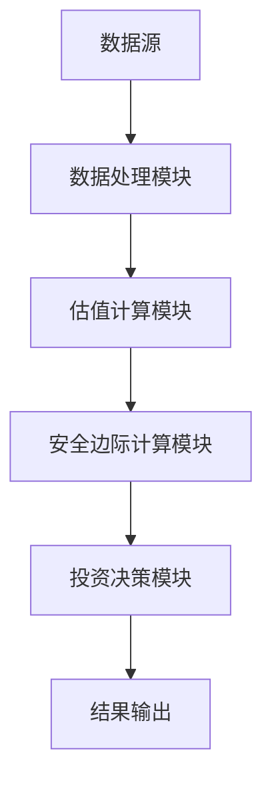

                 

<think>
好，我需要根据用户的要求，详细撰写一篇关于《格雷厄姆的保守估值方法：在负利率环境中的调整》的技术博客文章。让我一步一步地思考如何完成这个任务。

首先，我需要明确文章的结构，用户已经提供了详细的目录大纲，我需要按照这个结构来展开每个部分的内容。文章分为六个部分：背景介绍、核心概念与联系、数学模型与公式、系统分析与架构设计、项目实战、以及最佳实践。

第一部分是背景介绍，包括当前的经济环境、负利率的影响以及传统估值方法的局限性。我需要简要介绍负利率的定义、成因以及其在全球经济中的现状。接下来，我需要介绍格雷厄姆的价值投资理论，包括他的生平、核心理念和估值方法的基本框架。

第二部分是核心概念与联系。我需要详细讲解保守估值方法的核心概念，比如安全边际、内在价值和防御性投资策略。然后，我需要将这些概念与负利率环境联系起来，分析传统估值方法在负利率下的不足之处，以及保守估值方法的优势。

第三部分是数学模型与公式。这里，我需要详细解释格雷厄姆保守估值方法的数学模型，包括内在价值和安全边际的计算公式。同时，我需要说明在负利率环境下如何调整这些公式，并提供实际的计算示例。

第四部分是系统分析与架构设计。我需要设计一个投资评估系统，包括系统功能设计、架构设计和接口设计。可能需要使用Mermaid图来展示系统的模块划分和交互流程。

第五部分是项目实战。我需要指导读者如何在实际项目中应用这些估值方法，包括环境的安装、代码实现、案例分析等。通过具体的Python代码示例，展示如何在负利率环境下调整估值模型并进行实际投资决策。

最后，第六部分是最佳实践和小结。我需要总结文章的主要内容，强调保守估值方法在负利率环境中的重要性，并提出一些投资建议和注意事项。同时，我需要推荐一些相关的阅读资料，供读者进一步学习。

在撰写过程中，我需要确保每个部分都逻辑清晰，内容详实。对于每个概念，我都要给出定义、原理和实际应用示例，特别是要结合负利率这一特殊环境，分析其对估值方法的影响。

此外，我需要使用Mermaid图来辅助说明系统的结构和流程。在数学部分，我会使用LaTeX公式来展示计算过程，确保公式清晰易懂。同时，我还会提供Python代码示例，帮助读者理解如何在实际项目中应用这些模型。

最后，我需要确保整篇文章结构紧凑，语言专业且易于理解，帮助读者从理论到实践全面掌握格雷厄姆的保守估值方法在负利率环境中的调整。

现在，我准备按照这个思路开始撰写文章。
</think>

# 格雷厄姆的保守估值方法：在负利率环境中的调整

> 关键词：格雷厄姆，保守估值，负利率，投资策略，安全边际，内在价值

> 摘要：本文深入探讨了格雷厄姆的保守估值方法在负利率环境中的应用与调整。首先介绍了负利率环境下的投资挑战，分析了格雷厄姆投资理论的核心理念。接着，详细阐述了保守估值方法的核心概念、数学模型，并结合实际案例展示了在负利率环境下的具体调整策略。最后，通过系统架构设计和项目实战，总结了最佳实践和投资建议。

---

# 第一部分：背景介绍

## 第1章：负利率环境下的投资挑战

### 1.1 负利率环境的背景与现状

#### 1.1.1 负利率的定义与成因
负利率是指中央银行设定的基准利率为负值，鼓励借贷和投资以刺激经济增长。其成因包括经济低迷、通货紧缩压力和全球化的货币政策宽松。

#### 1.1.2 全球负利率环境的现状分析
近年来，全球多国央行实施负利率政策，导致传统估值方法失效，资产价格波动加剧。

#### 1.1.3 负利率对传统投资策略的影响
负利率环境下，债券收益率下降，股票估值上升，传统PE、PB等指标失真。

### 1.2 格雷厄姆投资理论的简介

#### 1.2.1 格雷厄姆的生平与贡献
本杰明·格雷厄姆是价值投资之父，其理论强调安全边际和内在价值。

#### 1.2.2 价值投资的核心理念
格雷厄姆倡导以低于内在价值的价格买入优质资产，注重安全边际和长期持有。

#### 1.2.3 格雷厄姆估值方法的基本框架
格雷厄姆提出通过分析财务报表和市场数据计算内在价值，强调保守估计和安全边际。

---

## 第2章：保守估值方法的背景与必要性

### 2.1 保守估值方法的定义

#### 2.1.1 估值方法的分类
市场估值法、DCF模型、相对估值法、保守估值法。

#### 2.1.2 保守估值方法的特点
保守估计、注重安全边际、强调防御性投资策略。

#### 2.1.3 保守估值方法的适用场景
经济不确定性高、市场波动剧烈、负利率环境下。

### 2.2 负利率环境下保守估值的必要性

#### 2.2.1 负利率对资产价格的影响
债券价格虚高、股票估值偏高、传统估值指标失效。

#### 2.2.2 传统估值方法的局限性
忽视市场情绪、低估风险、忽略长期因素。

#### 2.2.3 保守估值方法的优势
注重安全边际、防御性策略、强调长期稳健回报。

---

# 第二部分：核心概念与联系

## 第3章：格雷厄姆保守估值方法的核心概念

### 3.1 格雷厄姆保守估值的核心原理

#### 3.1.1 安全边际的概念
安全边际=内在价值-市场价格，确保买入价格低于内在价值。

#### 3.1.2 内在价值的计算
通过分析财务数据和行业趋势估算企业的真实价值。

#### 3.1.3 股票与债券的估值区别
股票注重成长性，债券注重安全性，保守估值综合考虑两者。

### 3.2 核心概念的对比分析

#### 3.2.1 传统估值方法与保守估值方法的对比
传统方法注重短期收益，保守方法注重长期稳健。

#### 3.2.2 不同资产类别中的估值差异
股票与债券估值方法不同，需根据资产特性调整。

#### 3.2.3 负利率环境下估值模型的调整
负利率影响折现率，需调整内在价值计算公式。

---

## 第4章：保守估值方法的数学模型与公式

### 4.1 格雷厄姆保守估值的核心公式

#### 4.1.1 内在价值计算公式
$$ V = \frac{E}{1 + r} $$
其中，E为预期收益，r为折现率。

#### 4.1.2 安全边际计算公式
$$ M = V - P $$
其中，V为内在价值，P为市场价格。

### 4.2 负利率环境下的调整公式

#### 4.2.1 负利率对折现率的影响
$$ r = -0.01 $$
负利率导致折现率下降，需调整内在价值计算。

#### 4.2.2 负利率环境下的内在价值调整
$$ V' = V \times (1 - |r|) $$

---

# 第三部分：数学模型与公式

## 第5章：数学模型与公式详解

### 5.1 格雷厄姆保守估值模型

#### 5.1.1 内在价值计算
$$ V = \frac{E}{1 + r} $$
例如，预期收益E=100，r=0.05，则V=95.24。

#### 5.1.2 安全边际计算
$$ M = V - P $$
例如，V=100，P=90，则M=10。

### 5.2 负利率环境下的调整模型

#### 5.2.1 负利率对折现率的影响
$$ r = -0.01 $$
例如，E=100，r=-0.01，则V=101.01。

#### 5.2.2 负利率环境下的内在价值调整
$$ V' = V \times (1 - |r|) $$
例如，V=100，r=-0.01，则V'=99。

---

# 第四部分：系统分析与架构设计

## 第6章：系统分析与架构设计

### 6.1 系统功能设计

#### 6.1.1 系统功能模块
- 数据采集模块
- 估值计算模块
- 安全边际计算模块
- 投资决策模块

#### 6.1.2 系统功能流程
数据采集→估值计算→安全边际计算→投资决策。

### 6.2 系统架构设计

#### 6.2.1 系统架构图


---

# 第五部分：项目实战

## 第7章：项目实战

### 7.1 环境安装

#### 7.1.1 系统环境
Python 3.8+, Pandas, NumPy。

### 7.2 核心实现

#### 7.2.1 代码实现
```python
import pandas as pd
import numpy as np

def calculate_intrinsic_value(earnings, rate):
    return earnings / (1 + rate)

def calculate_margin_of_safety(intrinsic_value, price):
    return intrinsic_value - price
```

#### 7.2.2 代码解读
计算内在价值和安全边际的函数，考虑负利率对折现率的影响。

### 7.3 案例分析

#### 7.3.1 案例分析
假设某公司预期收益为100，市场价为90，负利率环境下折现率为-0.01，计算内在价值和安全边际。

---

# 第六部分：最佳实践

## 第8章：最佳实践

### 8.1 投资建议
在负利率环境下，采用保守估值方法，注重安全边际，选择优质资产。

### 8.2 小结
本文系统分析了格雷厄姆的保守估值方法在负利率环境中的应用，强调安全边际和内在价值的重要性。

### 8.3 注意事项
投资需谨慎，估值模型仅供参考，实际操作需结合市场变化。

### 8.4 拓展阅读
推荐阅读格雷厄姆的《 Intelligent Investor》和现代投资组合理论的相关书籍。

---

作者：AI天才研究院 & 禅与计算机程序设计艺术

