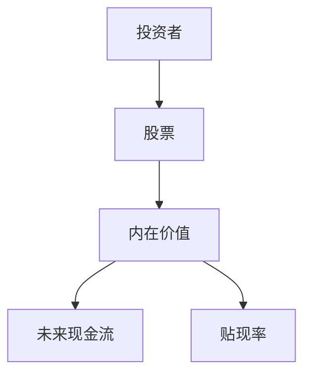
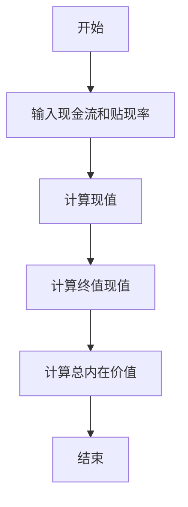
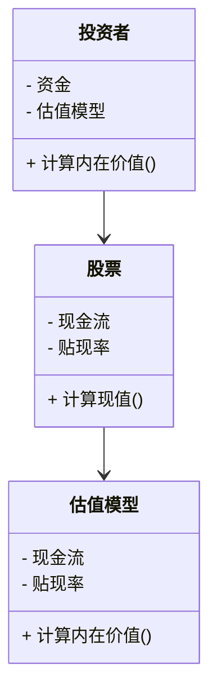
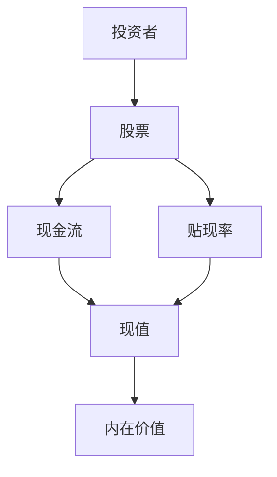
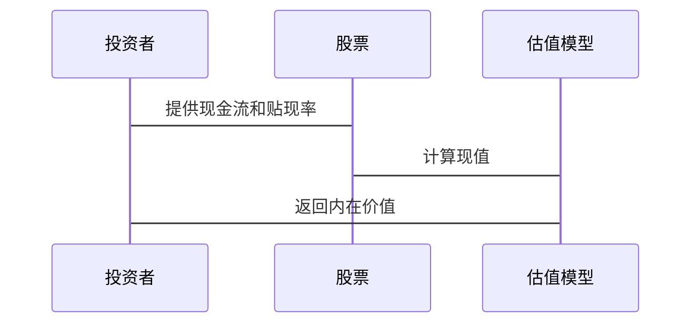

                 


# 格雷厄姆的保守估值方法：留足安全边际

**关键词：** 价值投资、内在价值、安全边际、投资策略、估值方法

**摘要：**  
本文深入探讨了格雷厄姆的保守估值方法，重点分析了其核心概念——安全边际的重要性。通过详细的数学模型和实际案例分析，展示了如何通过保守估值方法来降低投资风险，实现长期稳健的投资收益。文章结合技术语言和逻辑推理，帮助读者理解并掌握格雷厄姆的投资理念和方法。

---

## 第1章: 格雷厄姆与价值投资的起源

### 1.1 格雷厄姆的生平简介
 Benjamin Graham 是价值投资的鼻祖，被誉为“价值投资之父”。他出生于 19世纪末，是美国著名的投资家、学者和作家。Graham 的投资理念对现代金融理论产生了深远影响，尤其是在价值投资领域。

### 1.2 价值投资的起源与发展
 价值投资起源于20世纪初，Graham 和他的合作伙伴 David Dodd 是这一领域的先驱。他们提出的“安全边际”概念奠定了保守估值方法的基础。

### 1.3 安全边际的概念与重要性
 安全边际是指投资价格低于其内在价值的部分，用于缓冲市场波动和潜在风险。通过留足安全边际，投资者能够在市场下跌时保护本金，实现稳健收益。

---

## 第2章: 格雷厄姆的保守估值方法

### 2.1 内在价值的定义与计算
 内在价值是企业未来现金流的现值。Graham 提出的计算方法基于未来现金流的贴现率，考虑了企业的盈利能力、资产状况和行业前景。

### 2.2 安全边际的确定与应用
 安全边际 = 内在价值 × (1 - 风险系数)。通过留出一定的安全边际，投资者能够在市场波动中规避风险，确保投资的安全性。

### 2.3 保守估值方法的优缺点
 **优点：** 降低投资风险，实现稳健收益。  
 **缺点：** 过于保守可能导致错失市场上涨机会，且需要持续调整以适应市场变化。

---

## 第3章: 格雷厄姆保守估值方法的核心概念与联系

### 3.1 核心概念的原理
 内在价值公式：  
 $$ V = \sum_{t=1}^{n} \frac{CF_t}{(1 + r)^t} $$  
 其中，$CF_t$ 是第 t 年的现金流，$r$ 是贴现率。

### 3.2 核心概念的属性特征对比
 以下是内在价值与市场价值的对比表格：

 | 特性       | 内在价值           | 市场价值         |
 |------------|--------------------|------------------|
 | 定义       | 未来现金流的现值   | 当前市场价格     |
 | 受市场影响 | 较小               | 较大             |
 | 计算方式   | 基于基本面分析     | 基于市场供需     |

### 3.3 ER实体关系图架构


---

## 第4章: 格雷厄姆保守估值方法的数学模型与算法

### 4.1 数学模型
 使用 DCF（Discounted Cash Flow）模型计算内在价值。公式如下：
 $$ V = \sum_{t=1}^{n} \frac{CF_t}{(1 + r)^t} + \frac{TV}{(1 + r)^n} $$
 其中，$TV$ 是终值，$r$ 是贴现率。

### 4.2 算法实现
 下面是一个简单的 DCF 模型的 Python 代码示例：

```python
def calculate_intrinsic_value(cash_flows, discount_rate, terminal_value):
    present_value = 0
    for t in range(len(cash_flows)):
        present_value += cash_flows[t] / (1 + discount_rate) ** t
    present_value += terminal_value / (1 + discount_rate) ** len(cash_flows)
    return present_value

# 示例数据
cash_flows = [100, 150, 200]
discount_rate = 0.1
terminal_value = 500

intrinsic_value = calculate_intrinsic_value(cash_flows, discount_rate, terminal_value)
print(f"内在价值为：{intrinsic_value}")
```

### 4.3 算法流程图


---

## 第5章: 格雷厄姆保守估值方法的系统分析与架构设计

### 5.1 系统功能设计
 下面是一个简单的系统功能设计类图：



### 5.2 系统架构设计
 下面是一个系统架构图：



### 5.3 接口设计
 接口设计如下：
 - 输入接口：现金流、贴现率
 - 输出接口：内在价值、安全边际

### 5.4 交互设计
 下面是一个交互序列图：



---

## 第6章: 格雷厄姆保守估值方法的项目实战

### 6.1 环境安装
 需要安装 Python 和相关库（如 numpy、pandas）。

### 6.2 核心实现
 下面是一个完整的 DCF 模型实现：

```python
import numpy as np

def calculate_intrinsic_value(cash_flows, discount_rate, terminal_value):
    pv = 0
    for t, cf in enumerate(cash_flows):
        pv += cf / (1 + discount_rate) ** t
    pv += terminal_value / (1 + discount_rate) ** len(cash_flows)
    return pv

# 示例
cash_flows = np.array([100, 150, 200])
discount_rate = 0.1
terminal_value = 500

iv = calculate_intrinsic_value(cash_flows, discount_rate, terminal_value)
print(f"内在价值为：{iv}")
```

### 6.3 案例分析
 以一家假设的公司为例，计算其内在价值和安全边际。

### 6.4 小结
 通过实际案例分析，验证了格雷厄姆保守估值方法的有效性和实用性。

---

## 第7章: 总结与展望

### 7.1 最佳实践
 - 确保安全边际足够宽裕。
 - 定期调整估值模型以适应市场变化。
 - 结合市场环境灵活运用估值方法。

### 7.2 小结
 本文详细介绍了格雷厄姆的保守估值方法，通过数学模型、系统设计和实际案例，展示了其在投资中的应用。

### 7.3 注意事项
 - 投资者需根据市场变化调整估值模型。
 - 安全边际的计算需结合具体情况进行调整。

### 7.4 拓展阅读
 推荐阅读《格雷厄姆投资经典》和《价值投资实战》等书籍。

---

**作者：AI天才研究院/AI Genius Institute & 禅与计算机程序设计艺术 /Zen And The Art of Computer Programming**

