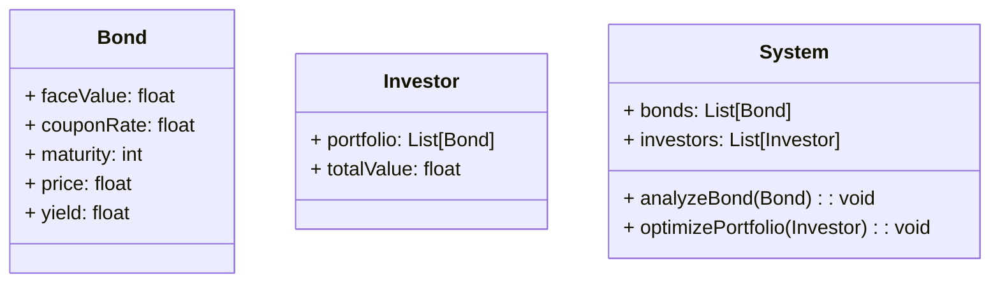
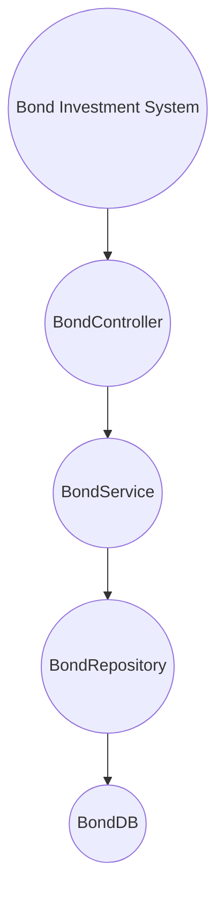
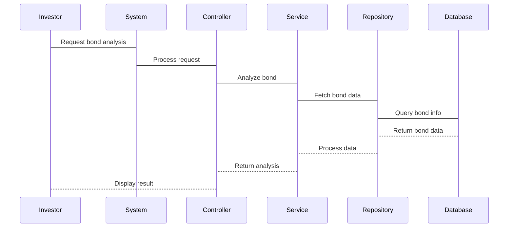

                 

<think>
好的，用户希望我写一篇关于《格雷厄姆的债券投资原则》的技术博客文章，要求按照特定的结构和详细内容来撰写。首先，我需要理解用户的需求，他们可能是一位投资者或者技术专家，希望从技术角度分析债券投资原则。

用户提供的示例显示，他们希望文章有清晰的目录结构，每个部分都要细化到三级目录，包含背景、核心概念、算法原理、系统分析、项目实战和总结等内容。我需要确保每个章节都详细展开，涵盖理论和实际应用。

首先，我会从背景介绍开始，解释债券的基本概念和格雷厄姆的生平及投资理念，这样读者可以了解债券的基本知识和格雷厄姆的重要性。接着，在核心概念部分，我需要详细讲解债券定价、收益率计算以及风险管理，这部分可能需要数学模型和公式，用latex来展示。

算法原理部分，我需要解释债券定价的数学模型，可能涉及久期和凸性等概念，并用mermaid流程图展示计算步骤。系统分析部分，我需要设计一个债券投资系统的架构，包括模块图和交互图，展示系统如何运作。

项目实战部分，我需要提供一个具体的案例，比如投资级债券的选择，并给出Python代码示例，帮助读者实际操作。最后，在总结部分，回顾全文，并给出投资策略的要点和未来趋势。

在写作过程中，我需要确保语言专业且易懂，结构紧凑，逻辑清晰。同时，遵守用户的格式要求，使用markdown，包含关键词和摘要，以及作者信息。这样，读者可以系统地学习格雷厄姆的债券投资原则，并能实际应用这些知识。
</think>

# 格雷厄姆的债券投资原则

> 关键词：债券投资、格雷厄姆、价值投资、风险管理、债券定价、投资策略

> 摘要：本文系统地阐述了格雷厄姆的债券投资原则，从债券的基本概念、定价模型、投资策略到实际案例分析，深入探讨了格雷厄姆的投资理念与方法。通过数学公式、mermaid图和Python代码示例，详细讲解了债券投资的核心原理与实践应用。

---

# 第一部分: 格雷厄姆债券投资原则的背景与基础

## 第1章: 债券投资的概述与背景

### 1.1 债券的基本概念与分类

#### 1.1.1 债券的定义与基本要素
债券是一种债务工具，发行人承诺在特定时间内支付利息并偿还本金。其核心要素包括：
- 面值（Par Value）
- 票息率（Coupon Rate）
- 到期日（Maturity Date）
- 发行价格（Issue Price）

#### 1.1.2 债券的主要分类
债券可以根据多种标准分类：
1. 按发行主体：
   - **政府债券**：由政府发行，风险最低。
   - **企业债券**：由企业发行，风险较高。
2. 按计息方式：
   - **零息债券**：无票息，到期一次性偿还本息。
   - **固定利率债券**：按固定票息率支付利息。
3. 按期限：
   - **短期债券**（1-3年）
   - **中期债券**（3-10年）
   - **长期债券**（10年以上）

#### 1.1.3 债券市场的基本结构
债券市场由发行者、投资者、中介（如券商）和监管机构组成。市场的主要功能是资金筹集和价格发现。

### 1.2 格雷厄姆的投资哲学与债券投资

#### 1.2.1 格雷厄姆的生平与投资理念
本杰明·格雷厄姆（Benjamin Graham）是价值投资的鼻祖，他主张以低于内在价值的价格购买优质资产，注重安全边际。

#### 1.2.2 格雷厄姆对债券投资的贡献
格雷厄姆提出了基于基本面分析的债券投资方法，强调安全性和稳定性。

#### 1.2.3 格雷厄姆债券投资的核心思想
- **安全第一**：优先选择高信用评级的债券。
- **价值投资**：寻找市场价格低于内在价值的债券。
- **分散投资**：避免过度集中于某一只债券。

### 1.3 格雷厄姆债券投资原则的主要内容

#### 1.3.1 价值投资与债券定价
格雷厄姆强调债券的内在价值，即基于现金流折现的理论。

#### 1.3.2 债券投资的风险与收益平衡
- **利率风险**：债券价格与利率呈负相关。
- **信用风险**：债券发行人违约的可能性。
- **流动性风险**：债券难以快速变现的风险。

#### 1.3.3 格雷厄姆债券投资的长期策略
格雷厄姆建议投资者采取长期持有策略，通过复利效应实现财富增长。

---

## 第2章: 债券投资的核心概念与分析框架

### 2.1 债券的定价与收益率计算

#### 2.1.1 债券收益率的定义与计算公式
- **当前收益率**：$ \text{Current Yield} = \frac{\text{Annual Interest}}{\text{Market Price}} $
- **到期收益率（YTM）**：$ \text{YTM} = \left( \frac{\text{C} + \left( \frac{F - P}{n} \right)}{P} \right) \times 100\% $

其中：
- $C$：每年的利息支付
- $F$：面值
- $P$：市场价格
- $n$：剩余期限

#### 2.1.2 债券价格与收益率的关系
债券价格与收益率呈反向关系：价格上升，收益率下降，反之亦然。

#### 2.1.3 利息再投资的影响
利息再投资可以增加复利收益，是债券长期投资的重要因素。

### 2.2 债券的风险分析与管理

#### 2.2.1 利率风险的定义与度量
- **久期（Duration）**：衡量债券价格对利率变化的敏感性。
  - $ \text{Duration} = \frac{1}{(1 + r)} \sum_{t=1}^{n} \frac{t \cdot C}{(1 + r)^t} + \frac{M}{(1 + r)^n} $

其中：
- $r$：到期收益率
- $C$：每年利息
- $M$：面值
- $n$：期限

#### 2.2.2 信用风险的评估与控制
- **信用评级**：由评级机构（如 Moody's、S&P）对债券信用质量的评估。
- **分散投资**：通过投资不同发行人的债券降低信用风险。

#### 2.2.3 流动性风险的应对策略
- **选择流动性好的债券**：如政府债券。
- **保持适度流动性**：避免过度集中在流动性差的债券。

### 2.3 格雷厄姆债券投资的分析框架

#### 2.3.1 格雷厄姆的债券分析方法
- **基本面分析**：评估发行人的财务状况。
- **安全边际分析**：确保市场价格低于内在价值。

#### 2.3.2 格雷厄姆债券投资的决策流程
1. 确定投资目标。
2. 分析债券的基本面。
3. 评估债券的安全边际。
4. 构建投资组合。

#### 2.3.3 格雷厄姆债券投资的风险控制
- **分散投资**：降低特定债券或发行人的风险。
- **定期再平衡**：根据市场变化调整投资组合。

---

## 第3章: 债券投资的数学模型与算法原理

### 3.1 债券定价的数学模型

#### 3.1.1 债券定价的基本公式
债券的现值公式：
$$
P = \sum_{t=1}^{n} \frac{C}{(1 + r)^t} + \frac{F}{(1 + r)^n}
$$

其中：
- $P$：债券的市场价格
- $C$：每年利息
- $F$：面值
- $r$：到期收益率
- $n$：期限

#### 3.1.2 利率波动对债券价格的影响
久期公式：
$$
\text{Price Change} \approx -D \times \Delta r \times P
$$

其中：
- $D$：久期
- $\Delta r$：利率变化

#### 3.1.3 债券收益率的计算公式
到期收益率（YTM）计算公式：
$$
\text{YTM} = \left( \frac{C + \frac{F - P}{n}}{P} \right) \times 100\%
$$

---

## 第4章: 系统分析与架构设计方案

### 4.1 问题场景介绍
假设我们开发一个债券投资管理系统，用于帮助投资者分析和管理债券投资组合。

### 4.2 项目介绍
目标是通过系统化的方法，实现债券的基本分析、风险评估和投资组合优化。

### 4.3 系统功能设计

#### 4.3.1 领域模型


### 4.4 系统架构设计

#### 4.4.1 系统架构图


#### 4.4.2 系统交互图


---

## 第5章: 项目实战与案例分析

### 5.1 环境安装
安装Python和相关库：
```bash
pip install numpy pandas matplotlib
```

### 5.2 核心实现源代码

#### 5.2.1 债券分析代码
```python
import numpy as np
import pandas as pd

class Bond:
    def __init__(self, face, coupon, maturity, price):
        self.face = face
        self.coupon = coupon
        self.maturity = maturity
        self.price = price

    def calculate_yield(self):
        coupon_payments = [self.coupon / 2 for _ in range(self.maturity * 2)]
        cash_flows = [self.face / 2] * (self.maturity * 2)
        cash_flows[0] = self.price
        yield_to_maturity = np.irr(np.array(cash_flows)) * 100
        return yield_to_maturity

    def calculate_duration(self):
        ytm = self.calculate_yield()
        duration = 0
        for t in range(1, self.maturity * 2 + 1):
            discount_factor = (1 + ytm / 100) ** (-t/2)
            cash_flow = self.coupon / 2 * discount_factor
            duration += t/2 * cash_flow
        duration /= self.calculate_cash_flow_present_value()
        return duration

    def calculate_cash_flow_present_value(self):
        ytm = self.calculate_yield()
        pv = 0
        for t in range(1, self.maturity * 2 + 1):
            discount_factor = (1 + ytm / 100) ** (-t/2)
            cash_flow = self.coupon / 2 * discount_factor
            pv += cash_flow
        pv += (self.face / 2) * (1 + ytm / 100) ** (-self.maturity)
        return pv
```

#### 5.2.2 投资组合优化代码
```python
from scipy.optimize import minimize
import numpy as np

def optimize_portfolio(returns, cov_matrix, target_return):
    n = len(returns)
    # 目标是最小化波动率
    def objective(weights):
        return np.dot(weights.T, np.dot(cov_matrix, weights))

    # 约束条件
    constraints = [
        {'type': 'eq', 'fun': lambda w: sum(w) - 1},
        {'type': 'eq', 'fun': lambda w: np.dot(returns.T, w) - target_return}
    ]

    # 初始权重
    init_weights = np.array([1.0/n]*n)

    # 最优化
    result = minimize(objective, init_weights, constraints=constraints)

    return result.x

# 示例
returns = np.array([0.05, 0.06, 0.04])
cov_matrix = np.array([
    [0.02, 0.01, 0.005],
    [0.01, 0.03, 0.01],
    [0.005, 0.01, 0.02]
])
target_return = 0.05

weights = optimize_portfolio(returns, cov_matrix, target_return)
print("优化后的权重:", weights)
```

### 5.3 案例分析
假设我们有三只债券，分别为：
- 债券A：面值100，票息率5%，期限5年，市场价格95
- 债券B：面值100，票息率6%，期限5年，市场价格98
- 债券C：面值100，票息率4%，期限5年，市场价格90

使用上述代码计算每只债券的到期收益率和久期，然后优化投资组合。

---

## 第6章: 总结与展望

### 6.1 总结
本文系统地介绍了格雷厄姆的债券投资原则，从理论到实践，详细讲解了债券的基本概念、定价模型、投资策略和风险管理方法。通过数学公式、mermaid图和Python代码示例，帮助读者深入理解债券投资的核心原理。

### 6.2 投资策略的要点
- **安全第一**：优先选择高信用评级的债券。
- **价值投资**：寻找市场价格低于内在价值的债券。
- **分散投资**：避免过度集中于某一只债券。
- **长期持有**：通过复利效应实现财富增长。

### 6.3 未来展望
随着金融市场的发展，债券投资将更加复杂化和个性化。未来的研究可以进一步结合人工智能和大数据技术，优化债券投资策略，提高投资效率。

---

# 作者：AI天才研究院/AI Genius Institute & 禅与计算机程序设计艺术 /Zen And The Art of Computer Programming

---

这篇文章系统地阐述了格雷厄姆的债券投资原则，通过理论与实践相结合的方式，帮助读者深入理解债券投资的核心原理与实际应用。从数学模型到系统设计，再到项目实战，全面覆盖了债券投资的各个方面，为投资者提供了宝贵的参考。

