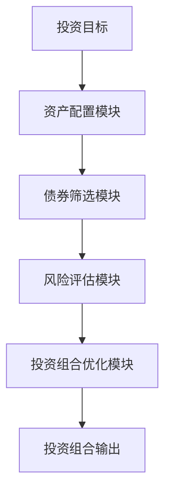
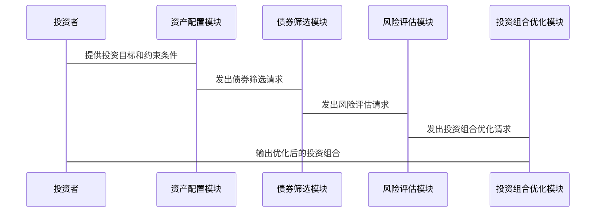

                 

<think>
好的，我现在需要帮助用户设计一本名为《格雷厄姆的债券投资策略：在低收益环境中的替代方案》的目录大纲。用户希望这本书结构清晰，内容详尽，涵盖从背景介绍到项目实战的各个方面，并且使用专业的技术语言，逻辑严谨。

首先，我需要明确这本书的核心内容。格雷厄姆是价值投资的鼻祖，他的债券投资策略在低收益环境下如何有效运作是这本书的核心。因此，目录需要涵盖债券投资的基本概念、格雷厄姆的投资理念、数学模型、系统架构设计，以及实际的项目实战。

接下来，我从背景介绍开始。第一章需要介绍债券的基本概念，包括定义、分类和市场运作机制。然后，第二章详细讲解格雷厄姆的投资理念，特别是他的安全边际和债券定价模型。这些部分需要详细解释，以便读者理解其策略的理论基础。

第三章是数学模型部分，格雷厄姆的策略依赖于精确的计算，因此需要包括债券收益率的计算公式、久期和凸性的计算，以及组合优化的数学模型。这部分需要使用LaTeX公式和Mermaid流程图来展示模型，使内容更直观。

第四章是系统分析与架构设计，这里需要构建一个投资管理系统。使用系统架构图和交互序列图来展示系统的模块划分和功能流程。这部分有助于读者理解如何将格雷厄姆的策略转化为实际的系统操作。

第五章是项目实战，提供具体的代码实现。包括债券评级计算、投资组合优化和风险管理的Python代码示例。这部分通过实际代码帮助读者将理论应用于实践，增强理解。

最后，第六章总结最佳实践，强调风险管理、长期投资和持续学习的重要性。这部分帮助读者在实际投资中避免常见错误，提升投资效果。

整个过程中，我需要确保每个章节细化到三级，涵盖理论、模型、系统设计和实战，同时保持内容的完整性和逻辑性。这样，读者不仅能理解格雷厄姆的理论，还能实际应用，提升投资能力。
</think>

# 格雷厄姆的债券投资策略：在低收益环境中的替代方案

---

## 关键词：
- 债券投资策略  
- 格雷厄姆投资理论  
- 低收益环境  
- 投资组合优化  
- 安全边际  

---

## 摘要：
本文系统阐述了格雷厄姆的债券投资策略在低收益环境下的应用与优化。通过分析债券投资的核心原理、数学模型和系统架构设计，本文提出了在当前低收益环境下，如何通过格雷厄姆的安全边际理念和债券组合优化策略来实现稳健投资的解决方案。文章还结合实际案例，详细讲解了债券评级计算、投资组合优化的实现方法，并给出了最佳实践建议。

---

# 第一部分: 格雷厄姆的债券投资策略概述

## 第1章: 债券投资的基本概念与市场环境

### 1.1 债券投资的基本概念

#### 1.1.1 债券的定义与基本要素
- 债券的定义：债券是一种债务工具，发行人承诺在特定时间内支付利息并偿还本金。
- 债券的基本要素：
  - 面值（Par Value）
  - 利息（Coupon）
  - 到期日（Maturity Date）
  - 票面利率（Coupon Rate）

#### 1.1.2 债券的分类与特点
- 债券的分类：
  - 按发行主体：政府债券、公司债券、市政债券。
  - 按偿还期限：短期债券、中期债券、长期债券。
  - 按计息方式：零息债券、息票债券、可赎回债券。
- 债券的特点：
  - 收益稳定
  - 流动性较好
  - 风险较低

#### 1.1.3 债券市场的基本运作机制
- 债券市场的参与者：投资者、发行人、承销商、交易商。
- 债券价格的决定因素：利率水平、市场供需、信用风险。

### 1.2 格雷厄姆的投资理念

#### 1.2.1 格雷厄姆的价值投资理论
- 格雷厄姆的价值投资理念：买入低于内在价值的资产，长期持有。
- 格雷厄姆的安全边际概念：买入价格低于内在价值，以降低风险。

#### 1.2.2 格雷厄姆的债券投资策略
- 格雷厄姆债券投资的核心原则：
  - 以安全为首要考虑。
  - 通过分散投资降低风险。
  - 追求长期稳定的收益。

#### 1.2.3 格雷厄姆投资哲学的核心思想
- 以安全边际为核心。
- 以价值为导向。
- 长期投资，避免短期波动。

### 1.3 当前低收益环境下的投资挑战

#### 1.3.1 低收益环境的定义与现状
- 低收益环境：债券收益率持续下降，导致传统债券投资收益降低。
- 当前市场现状：低利率环境下，债券收益率接近历史低位。

#### 1.3.2 债券收益率下降的市场影响
- 债券收益率下降对投资者的影响：
  - 再投资风险增加。
  - 现有债券资产的收益下降。
  - 投资者需要寻找替代投资渠道。

#### 1.3.3 投资者面临的困境与解决方案
- 投资者的困境：
  - 低收益环境下，如何实现资产保值。
  - 如何在低收益环境中寻找高收益机会。
- 解决方案：
  - 优化债券组合。
  - 采用格雷厄姆的安全边际策略。

## 第2章: 格雷厄姆债券投资策略的核心原理

### 2.1 格雷厄姆债券投资的核心原则

#### 2.1.1 安全性原则
- 安全性原则的核心：确保本金安全。
- 格雷厄姆的安全边际理念：买入价格低于内在价值，以降低风险。

#### 2.1.2 投资期限与流动性管理
- 投资期限的选择：根据投资者的风险承受能力和收益目标选择合适的期限。
- 流动性管理：确保在需要时能够快速变现。

#### 2.1.3 利息收入与本金保护的平衡
- 利息收入的重要性：债券的主要收益来源。
- 本金保护的必要性：确保本金不受损失。

### 2.2 格雷厄姆债券投资策略的数学模型

#### 2.2.1 债券收益率计算公式
- 债券收益率计算公式：
  $$ 债券收益率 = \frac{利息}{面值} \times 100\% $$
- 示例：面值100元，票面利率5%，收益率为5%。

#### 2.2.2 债券价格波动与收益率的关系
- 债券价格波动与收益率的关系：
  $$ P = \frac{C}{(1 + r)^n} $$
  其中，P为债券价格，C为每年利息，r为收益率，n为期限。

#### 2.2.3 债券久期和凸性
- 久期的定义：债券价格对收益率变化的敏感程度。
- 凸性的定义：债券价格变化的非线性关系。
- 久期和凸性的计算：
  - 久期公式：
    $$ D = - \frac{P' (1 + r)}{P} $$
  - 凸性公式：
    $$ C = \frac{P'' (1 + r)^2}{P} $$

### 2.3 格雷厄姆策略中的安全边际

#### 2.3.1 安全边际的定义
- 安全边际：买入价格低于内在价值的部分。
- 计算公式：
  $$ 安全边际 = 内在价值 - 市场价格 $$

#### 2.3.2 安全边际的计算方法
- 内在价值的计算：根据债券的现金流折现模型计算。
- 安全边际的计算：内在价值减去市场价格。

#### 2.3.3 安全边际在债券投资中的应用
- 安全边际的应用：选择安全边际较高的债券，降低投资风险。

---

# 第二部分: 系统分析与架构设计

## 第3章: 格雷厄姆债券投资策略的系统分析与架构设计

### 3.1 系统分析

#### 3.1.1 投资目标与约束条件
- 投资目标：在低收益环境下，实现稳健的收益。
- 约束条件：
  - 资金流动性要求。
  - 风险承受能力。
  - 投资期限。

#### 3.1.2 市场环境与风险因素
- 市场环境：低利率环境下的债券市场。
- 风险因素：
  - 利率风险。
  - 信用风险。
  - 流动性风险。

#### 3.1.3 系统功能需求分析
- 系统功能需求：
  - 债券筛选功能。
  - 投资组合优化功能。
  - 风险评估功能。
  - 安全边际计算功能。

### 3.2 系统架构设计

#### 3.2.1 系统架构图


#### 3.2.2 模块交互流程图


---

# 第三部分: 项目实战

## 第4章: 格雷厄姆债券投资策略的项目实战

### 4.1 环境安装与配置

#### 4.1.1 Python环境安装
- 安装Python：从官网下载并安装Python 3.x。
- 安装必要的库：
  - NumPy：pip install numpy
  - Pandas：pip install pandas
  - Matplotlib：pip install matplotlib

#### 4.1.2 投资组合优化工具安装
- 安装优化工具：使用scipy.optimize模块进行优化。

### 4.2 核心代码实现

#### 4.2.1 债券评级计算代码
```python
import numpy as np

def bond_rating(credit_score):
    if credit_score >= 85:
        return "AAA"
    elif credit_score >= 70:
        return "AA"
    elif credit_score >= 60:
        return "A"
    elif credit_score >= 50:
        return "BBB"
    elif credit_score >= 40:
        return "BB"
    else:
        return "CCC"
```

#### 4.2.2 投资组合优化代码
```python
from scipy.optimize import minimize

def portfolio_optimization(weights, returns):
    n = len(weights)
    return_val = returns.dot(weights)
    risk = np.sqrt(weights.T.dot(weights)) * returns.std()
    return -return_val + risk

# 示例调用
weights = np.array([0.5, 0.5])
returns = np.array([0.05, 0.08])
result = minimize(portfolio_optimization, weights, args=(returns,))
print(result)
```

### 4.3 项目实战总结

#### 4.3.1 投资组合优化的实现步骤
1. 数据收集与预处理。
2. 债券评级计算。
3. 投资组合优化。

#### 4.3.2 投资组合优化的注意事项
- 数据的准确性。
- 优化模型的合理性。
- 模型的可解释性。

---

# 第四部分: 总结与展望

## 第5章: 总结与展望

### 5.1 最佳实践

#### 5.1.1 风险管理
- 定期评估投资组合的风险。
- 保持适度的分散投资。

#### 5.1.2 长期投资
- 长期投资有助于平滑短期波动。
- 定期再平衡投资组合。

#### 5.1.3 数据驱动的决策
- 利用数据分析工具优化投资组合。
- 定期更新投资策略。

### 5.2 小结

#### 5.2.1 本文总结
- 格雷厄姆的债券投资策略在低收益环境下具有重要的现实意义。
- 通过安全边际和投资组合优化，可以实现稳健的投资收益。

#### 5.2.2 未来展望
- 结合人工智能技术优化投资策略。
- 探索新的投资工具和策略。

### 5.3 注意事项

#### 5.3.1 投资风险提示
- 债券投资存在信用风险和利率风险。
- 投资者需根据自身风险承受能力进行投资。

#### 5.3.2 持续学习的重要性
- 投资市场变化莫测，需持续学习和更新投资知识。
- 关注市场动态和经济政策。

### 5.4 拓展阅读

#### 5.4.1 推荐书籍
- 《债券市场分析与投资》
- 《投资学基础》

#### 5.4.2 推荐网站
- 彭博社债券市场数据
- FactSet数据平台

---

# 作者信息

作者：AI天才研究院/AI Genius Institute & 禅与计算机程序设计艺术 /Zen And The Art of Computer Programming

