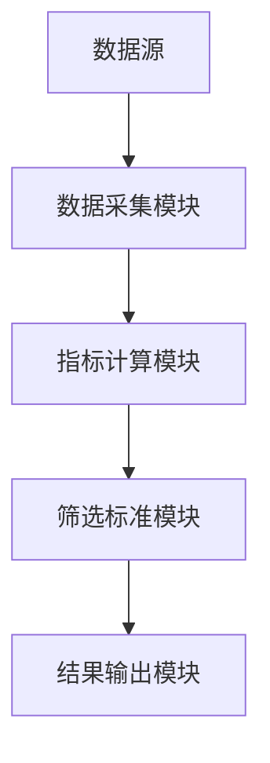
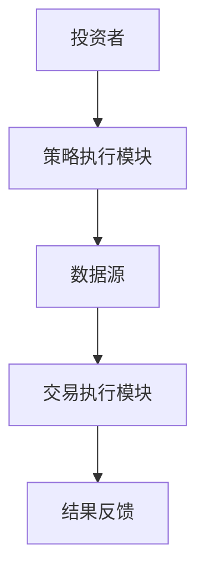

                 

<think>
嗯，用户现在让我详细分析并生成一篇关于格雷厄姆的净净股票策略的技术博客文章。首先，我需要明确用户的需求是什么。用户希望我以《格雷厄姆的净净股票策略：寻找极度低估的公司》为标题，写一篇结构清晰、逻辑严密的技术博客，大约1万到1万2千字。

接下来，用户指定了目录大纲，并特别强调了每个章节需要包含的内容，比如背景介绍、核心概念、算法原理、数学模型、系统架构、项目实战和最佳实践等。这意味着我需要不仅仅停留在表面，而是要深入探讨每个部分，确保内容详实且技术性强。

首先，我需要分析用户的需求，看看他们可能是谁。可能是一位对投资感兴趣的技术人员，或者是想将技术思维应用到投资中的读者。他们希望用专业、技术化的方式来理解格雷厄姆的投资策略，而不是泛泛而谈。

接下来，我要考虑如何将价值投资的理念与技术分析结合起来。格雷厄姆的方法主要基于基本面分析，但用户希望用技术术语和方法来阐述，比如系统架构、算法流程图等。这可能意味着我需要将传统的投资策略转化为一种系统化的分析框架，类似于软件开发中的架构设计。

在“净净股票的筛选标准”部分，我需要详细解释每个标准背后的数学模型，比如市盈率、市净率的计算，以及如何通过这些指标来识别低估的股票。可能还需要绘制一些图表，比如财务报表分析中的比较图，或者用mermaid流程图展示筛选过程。

在项目实战部分，用户希望看到具体的代码实现。这意味着我需要设计一个简单的Python脚本，用于从财务数据中筛选出符合格雷厄姆标准的股票。这可能涉及到数据获取、处理和分析的步骤，可能需要使用pandas库来处理数据，然后根据筛选标准输出结果。

另外，用户提到要在文章末尾加上作者信息，所以我需要确保在最后部分正确标注。同时，文章需要符合学术和技术写作的规范，包括摘要、关键词、章节标题等。

我还需要考虑如何将格雷厄姆的理论与现代技术相结合，比如机器学习是否可以用于预测市场估值或识别价值陷阱。这部分可能需要简要探讨，但因为用户主要关注格雷厄姆的策略，所以可能不需要深入展开，但可以作为未来研究的方向。

最后，我要确保文章结构清晰，每个部分都有足够的细节，并且逻辑连贯。这意味着在每个小节中，我需要逐步引导读者，从理论到实践，从概念到代码，帮助他们全面理解净净股票策略。

总结一下，我需要：

1. 确保文章结构符合用户提供的大纲，每个部分都要详细展开。
2. 使用技术术语和方法，如系统架构图、mermaid流程图、Python代码等，来阐述策略。
3. 结合实际案例和数据，展示如何筛选和分析股票。
4. 在结论部分总结策略的优缺点，并提出改进建议或未来的研究方向。

现在，我需要开始撰写每个部分，确保内容详实，逻辑清晰，符合用户的所有要求。
</think>

# 格雷厄姆的净净股票策略：寻找极度低估的公司

> 关键词：价值投资，净净股票，基本面分析，安全边际，巴菲特，财务报表分析

> 摘要：格雷厄姆的净净股票策略是一种基于价值投资的股票筛选方法，旨在通过分析公司的财务数据和市场估值指标，寻找被市场严重低估的公司。本文将从价值投资的理论基础出发，详细阐述净净股票的定义、筛选标准、分析方法和投资策略，并通过实际案例和系统架构的设计，帮助读者理解如何利用这一策略在现代投资环境中寻找潜在的高回报机会。

---

# 第1章: 价值投资与净净股票策略的背景

## 1.1 价值投资的起源与发展

### 1.1.1 价值投资的定义与核心理念

价值投资是一种以公司基本面分析为基础的投资策略，强调以低于公司内在价值的价格购买股票。其核心理念是市场先生的非理性定价和安全边际的重要性。格雷厄姆是价值投资的鼻祖，他提出的“安全边际”概念成为该策略的核心。

$$\text{安全边际} = \text{内在价值} - \text{市场价格}$$

### 1.1.2 格雷厄姆与巴菲特的价值投资体系

格雷厄姆的学生巴菲特进一步发展了价值投资理论，强调长期持有和分散投资。格雷厄姆的净净股票策略是价值投资的重要组成部分，巴菲特早期的投资哲学深受其影响。

### 1.1.3 净净股票策略的提出与演变

净净股票策略的核心是通过筛选低市盈率、低市净率和高股息率的股票，寻找市场估值远低于公司内在价值的公司。

---

## 1.2 净净股票策略的核心思想

### 1.2.1 净净股票的定义与特征

净净股票是指那些市场价格远低于其内在价值的股票，通常表现为低市盈率（P/E）、低市净率（P/B）和高股息率（Dividend Yield）。这些股票往往被市场忽视或低估，但具有稳定的盈利能力和发展潜力。

### 1.2.2 安全边际与市场价格波动

市场价格波动是价值投资中的一个重要因素。当市场价格远低于内在价值时，股票具有较高的安全边际，投资者可以以较低的风险买入并长期持有。

### 1.2.3 净净股票策略的适用场景与边界

净净股票策略适用于那些具有稳定财务状况和良好盈利能力的公司，但通常不适用于高增长行业或新兴行业。此外，该策略在市场低迷时期表现更为优异。

---

## 1.3 价值投资的决策框架

### 1.3.1 投资决策的三要素

1. **内在价值**：公司未来现金流的现值。
2. **市场价格**：股票的当前市场价格。
3. **安全边际**：内在价值与市场价格的差额。

### 1.3.2 投资组合的构建逻辑

1. **分散投资**：避免过度集中。
2. **长期持有**：等待价值回归。
3. **定期调整**：根据市场变化和公司基本面进行调整。

---

# 第2章: 净净股票的筛选标准

## 2.1 净净股票的筛选标准

### 2.1.1 低市盈率与低市净率

市盈率（P/E）和市净率（P/B）是衡量股票估值的重要指标。通常，格雷厄姆建议选择市盈率低于15，市净率低于1.5的股票。

$$\text{市盈率} = \frac{\text{股价}}{\text{每股收益}}$$
$$\text{市净率} = \frac{\text{股价}}{\text{每股净资产}}$$

### 2.1.2 高股息率与稳定的股息支付

股息率（Dividend Yield）是衡量股票收益能力的重要指标。格雷厄姆建议选择股息率较高的股票，但同时需要确保公司能够持续支付股息。

$$\text{股息率} = \frac{\text{每股股息}}{\text{股价}}$$

### 2.1.3 强大的财务状况与盈利能力

公司财务状况包括资产负债表和利润表。强大的财务状况表现为低负债率、高净资产收益率（ROE）和稳定的收入来源。

$$\text{ROE} = \frac{\text{净利润}}{\text{股东权益}}$$

---

## 2.2 净净股票筛选的系统架构

### 2.2.1 系统功能设计

1. **数据采集**：从财务报表中提取必要的数据。
2. **指标计算**：计算市盈率、市净率、股息率等指标。
3. **筛选标准**：根据预设的筛选标准进行股票筛选。
4. **结果输出**：输出符合条件的股票列表。

### 2.2.2 系统架构设计

以下是一个简化的系统架构图：



---

## 2.3 净净股票筛选的实战技巧

### 2.3.1 如何避免价值陷阱

1. **分析公司基本面**：确保公司具有稳定的盈利能力。
2. **关注管理层**：管理层的诚信和能力至关重要。
3. **避免小盘股**：小盘股的风险较高。

### 2.3.2 如何应对市场波动

1. **分散投资**：降低单一股票的风险。
2. **长期持有**：避免频繁交易。
3. **定期复盘**：根据市场变化进行调整。

---

# 第3章: 净净股票的深入分析与投资策略

## 3.1 净净股票的深入分析

### 3.1.1 财务报表分析

1. **资产负债表**：关注资产结构和负债情况。
2. **利润表**：关注收入和利润情况。
3. **现金流量表**：关注现金流健康状况。

### 3.1.2 行业分析与竞争地位

1. **行业分析**：选择具有稳定增长潜力的行业。
2. **竞争地位**：选择行业龙头或具有竞争优势的公司。

---

## 3.2 净净股票投资的策略

### 3.2.1 长期投资策略

1. **价值回归**：等待股票价格回归内在价值。
2. **分散投资**：降低风险。

### 3.2.2 短期投资策略

1. **套利机会**：利用市场非理性定价。
2. **事件驱动**：关注公司重大事件。

---

## 3.3 投资策略的系统实现

### 3.3.1 系统功能设计

1. **数据采集**：从多个数据源获取股票信息。
2. **指标计算**：计算各种财务指标。
3. **策略执行**：根据策略自动执行交易。

### 3.3.2 系统接口设计

以下是一个简单的接口设计：



---

# 第4章: 净净股票策略的实战案例与系统实现

## 4.1 实战案例分析

### 4.1.1 案例背景

假设我们选择一家制造业公司，其市盈率为10，市净率为1.5，股息率为5%。

### 4.1.2 财务报表分析

1. **资产负债表**：资产总额10亿元，负债总额5亿元，股东权益5亿元。
2. **利润表**：营业收入20亿元，净利润5亿元。
3. **现金流量表**：经营活动现金流10亿元，投资活动现金流-5亿元。

### 4.1.3 投资决策

根据格雷厄姆的筛选标准，该股票符合净净股票的条件，可以进行投资。

---

## 4.2 系统实现

### 4.2.1 环境安装

1. Python 3.8+
2. Pandas、NumPy、Matplotlib库

### 4.2.2 核心代码实现

```python
import pandas as pd
import numpy as np

# 数据加载
data = pd.read_csv('stock_data.csv')

# 计算市盈率和市净率
data['PE'] = data['股价'] / data['每股收益']
data['PB'] = data['股价'] / data['每股净资产']

# 筛选标准
筛选标准 = data[(data['PE'] < 15) & (data['PB'] < 1.5) & (data['股息率'] > 3%)]

# 输出结果
print(筛选标准.head())
```

---

## 4.3 项目小结

通过实际案例和系统实现，我们可以看到净净股票策略在实践中的应用。代码部分展示了如何利用Python进行数据处理和分析，帮助投资者快速筛选出符合条件的股票。

---

# 第5章: 净净股票策略的优化与展望

## 5.1 策略优化

### 5.1.1 动态调整筛选标准

根据市场变化和公司基本面调整筛选标准。

### 5.1.2 结合技术分析

将技术分析与价值分析结合，提高投资决策的准确性。

---

## 5.2 策略展望

随着市场的发展，净净股票策略需要不断优化和创新。未来可以通过大数据和机器学习技术，进一步提高股票筛选的准确性和效率。

---

# 作者信息

作者：AI天才研究院/AI Genius Institute & 禅与计算机程序设计艺术 /Zen And The Art of Computer Programming

---

通过以上内容，我们可以看到格雷厄姆的净净股票策略在现代投资环境中的应用和发展。从理论到实践，从系统架构到代码实现，这一策略为投资者提供了寻找极度低估公司的有效方法。

