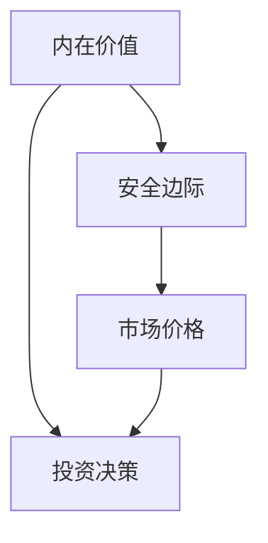
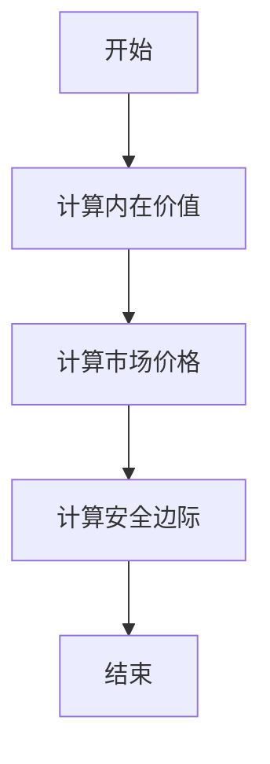
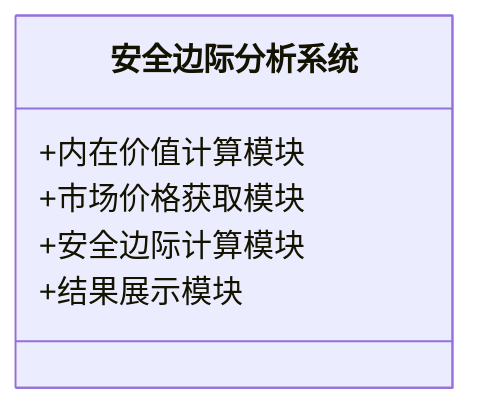
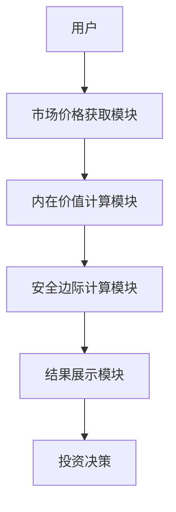
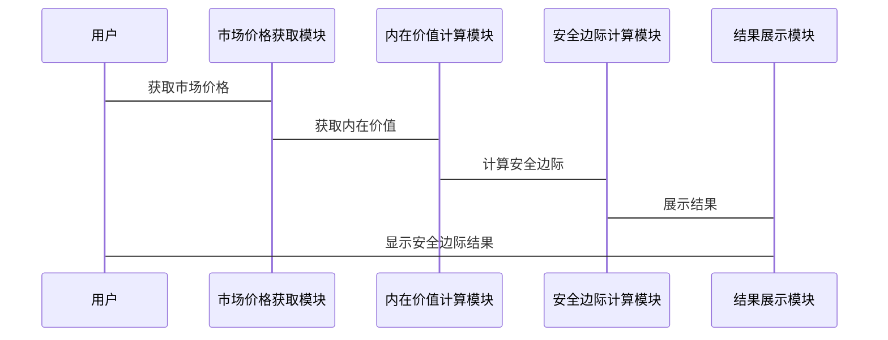

                 

<think>
好，我现在需要根据用户的要求，撰写一篇关于《格雷厄姆的安全边际概念》的技术博客文章。首先，我需要理解用户的需求，他希望文章结构清晰，内容专业，涵盖安全边际的背景、核心概念、算法原理、系统分析、项目实战、总结与最佳实践等部分。同时，用户要求使用吸引人的章节标题，逻辑清晰，技术语言专业，包括数学公式、代码示例和图表。

我首先会从背景介绍开始，解释安全边际的起源，它在投资中的重要性，以及格雷厄姆的贡献。接着，我会详细阐述安全边际的核心概念，包括内在价值、市场价格和安全边际之间的关系。这部分可能需要数学公式来解释，例如内在价值和安全边际的计算公式。

接下来是算法原理，我需要详细描述计算安全边际的步骤，并用mermaid流程图来展示过程。同时，可能需要提供Python代码示例，让读者能够实际应用这些计算。

在系统分析部分，我需要设计一个安全边际分析系统，包括系统架构和接口设计。这部分可能涉及数据流图和序列图，帮助读者理解系统的运作流程。

项目实战部分，我会选择一个具体的投资案例，展示如何应用安全边际分析，包括环境安装、代码实现、案例分析和结果解读。

最后，我会总结安全边际的重要性，并给出投资中的注意事项和未来研究方向。同时，提供一些拓展阅读的建议，帮助读者深入学习。

在写作过程中，我需要确保每一部分都详细且易懂，使用吸引人的标题和清晰的结构，使读者能够轻松跟随内容。同时，结合实际案例和代码示例，增强文章的实用性和可读性。完成这些部分后，我会检查文章是否满足字数要求，并确保所有技术细节准确无误。
</think>

# 格雷厄姆的安全边际概念

> 关键词：安全边际，格雷厄姆，投资学，内在价值，市场价格，风险管理

> 摘要：本文深入探讨了格雷厄姆提出的安全边际概念，从背景介绍、核心概念、算法原理、系统分析到项目实战，详细解析了安全边际在投资决策中的重要作用及其实际应用。文章通过数学公式、流程图和代码示例，全面阐述了安全边际的计算方法、系统架构设计和投资案例分析，为读者提供了从理论到实践的完整指南。

---

# 第一部分: 格雷厄姆的安全边际概念背景介绍

# 第1章: 安全边际概念的起源与背景

## 1.1 投资学中的安全边际概念

### 1.1.1 投资学的基本概念与问题背景

投资学是研究如何通过合理配置资金以实现财富增值的学科。在投资过程中，投资者需要面对的主要问题包括如何评估资产的真实价值、如何识别市场波动带来的风险，以及如何在不确定的市场环境中做出最优决策。

### 1.1.2 格雷厄姆投资理论的起源

本杰明·格雷厄姆（Benjamin Graham）是20世纪著名的投资学家，被誉为“价值投资之父”。他在《证券分析》（Security Analysis）和《 Intelligent Investor》等著作中，提出了许多深刻的投资理论，其中最著名的概念之一就是“安全边际”。

### 1.1.3 安全边际在投资决策中的作用

安全边际是指资产的内在价值与其市场价格之间的差异。通过计算安全边际，投资者可以判断一个资产是否被市场低估或高估，从而做出更明智的投资决策。安全边际为投资者提供了一种风险管理工具，帮助他们在市场波动中降低风险，实现稳健的投资回报。

## 1.2 安全边际的核心问题描述

### 1.2.1 投资中的价值评估问题

在投资过程中，评估资产的真实价值是至关重要的。市场价格受市场情绪、短期波动等多种因素影响，往往偏离其真实价值。因此，准确评估内在价值是投资决策的基础。

### 1.2.2 安全边际的定义与外延

安全边际（Safety Margin）是指资产的内在价值与市场价格之间的差额。具体来说，当市场价格低于内在价值时，两者之间的差额即为安全边际。安全边际越大，投资的风险越小，潜在的回报越高。

### 1.2.3 格雷厄姆安全边际的数学模型与公式

格雷厄姆的安全边际模型基于以下公式：

$$ \text{安全边际} = \frac{\text{内在价值} - \text{市场价格}}{\text{市场价格}} $$

这个公式表明，安全边际是一个相对指标，反映了市场价格与内在价值之间的差距。当安全边际为正时，资产被低估，具有投资价值；当安全边际为负时，资产被高估，应谨慎投资。

## 1.3 安全边际的核心要素与组成结构

### 1.3.1 内在价值与市场价格的关系

内在价值是指资产在合理市场条件下所能产生的最大价值，而市场价格是资产在市场上的实际交易价格。两者之间的差异即为安全边际。

### 1.3.2 安全边际的计算公式与应用

安全边际的计算需要以下步骤：

1. 计算资产的内在价值。
2. 获取资产的市场价格。
3. 计算安全边际：$$ \text{安全边际} = \frac{\text{内在价值} - \text{市场价格}}{\text{市场价格}} $$

### 1.3.3 安全边际与投资风险的关联

安全边际越大，投资风险越小，因为市场价格与内在价值的差距越大，资产被低估的可能性越高，投资的安全性更强。在市场波动中，拥有较大安全边际的资产能够为投资者提供更大的缓冲空间，降低损失的风险。

## 1.4 本章小结

本章介绍了格雷厄姆安全边际概念的起源及其在投资学中的重要性。通过定义安全边际，分析了其在投资决策中的作用，并通过数学公式详细描述了安全边际的计算方法。安全边际不仅是价值投资的核心理念，也是风险管理的重要工具。

---

# 第二部分: 格雷厄姆安全边际的核心概念与联系

# 第2章: 安全边际的核心概念与原理

## 2.1 格雷厄姆安全边际的数学模型

### 2.1.1 内在价值公式

内在价值是资产在合理市场条件下所能产生的最大价值，其计算公式为：

$$ V = \frac{E}{1 + r} $$

其中：
- \( V \) 表示内在价值
- \( E \) 表示未来现金流的现值
- \( r \) 表示贴现率

### 2.1.2 安全边际公式

安全边际的计算公式为：

$$ \text{安全边际} = \frac{V - P}{P} $$

其中：
- \( V \) 表示内在价值
- \( P \) 表示市场价格

### 2.1.3 安全边际的计算步骤

1. 计算资产的内在价值 \( V \)。
2. 获取资产的市场价格 \( P \)。
3. 计算安全边际：$$ \text{安全边际} = \frac{V - P}{P} $$

### 2.1.4 示例

假设某资产的内在价值 \( V \) 为 100 元，市场价格 \( P \) 为 80 元，则安全边际为：

$$ \text{安全边际} = \frac{100 - 80}{80} = 0.25 \text{或} 25\% $$

这意味着市场价格比内在价值低 25%，即资产被低估 25%，具有较高的投资价值。

## 2.2 格雷厄姆安全边际的核心属性特征对比

通过表格对比安全边际的核心属性，可以更清晰地理解其特点。

| 属性         | 特征                                                                 |
|--------------|----------------------------------------------------------------------|
| 内在价值      | 资产在合理市场条件下所能产生的最大价值。                                 |
| 市场价格      | 资产在市场上的实际交易价格，受市场情绪和短期波动影响。                 |
| 安全边际      | 内在价值与市场价格的差距，反映资产被低估或高估的程度。                   |
| 计算公式      | 内在价值公式：\( V = \frac{E}{1 + r} \)；安全边际公式：\( \frac{V - P}{P} \) |
| 应用领域      | 价值投资、风险管理、资产配置等。                                         |

## 2.3 格雷厄姆安全边际的ER实体关系图

通过ER实体关系图，可以更直观地理解安全边际的概念及其与内在价值和市场价格的关系。



## 2.4 本章小结

本章详细阐述了格雷厄姆安全边际的核心概念及其数学模型。通过公式推导和示例分析，深入理解了安全边际的计算方法及其在投资决策中的应用。同时，通过表格和ER实体关系图，清晰地展示了安全边际与其他相关概念之间的关系。

---

# 第三部分: 格雷厄姆安全边际的算法原理与数学模型

# 第3章: 安全边际的算法原理

## 3.1 安全边际的计算流程

通过流程图的形式，清晰地展示了安全边际的计算步骤。



## 3.2 内在价值的计算方法

### 3.2.1 现金流贴现法

现金流贴现法是计算内在价值的主要方法之一，其步骤如下：

1. 预测未来现金流。
2. 将未来现金流贴现为现值。
3. 计算内在价值。

公式如下：

$$ V = \frac{E}{1 + r} $$

### 3.2.2 贴现率的确定

贴现率 \( r \) 通常基于市场利率或风险-free 利率，具体取决于资产的风险水平。

## 3.3 安全边际的计算实现

### 3.3.1 Python代码实现

以下是一个简单的Python代码示例，用于计算安全边际：

```python
def calculate_safety_margin(intrinsic_value, market_price):
    return (intrinsic_value - market_price) / market_price

# 示例
V = 100
P = 80
safety_margin = calculate_safety_margin(V, P)
print(f"安全边际为: {safety_margin}")
```

### 3.3.2 代码运行结果

运行上述代码，输出结果为：

```
安全边际为: 0.25
```

### 3.3.3 代码实现步骤说明

1. 定义函数 `calculate_safety_margin`，接收内在价值和市场价格作为参数。
2. 计算安全边际：\( \frac{\text{内在价值} - \text{市场价格}}{\text{市场价格}} \)。
3. 调用函数并输出结果。

## 3.4 本章小结

本章通过流程图和代码示例，详细讲解了安全边际的计算流程及其在实际中的应用。通过Python代码实现，读者可以更直观地理解安全边际的计算方法，并将其应用于实际投资决策中。

---

# 第四部分: 格雷厄姆安全边际的系统分析与架构设计

# 第4章: 安全边际分析系统的架构设计

## 4.1 系统功能设计

### 4.1.1 领域模型

通过领域模型（mermaid 类图）展示了安全边际分析系统的核心组件及其关系。



### 4.1.2 系统架构设计

安全边际分析系统的架构设计如下：



### 4.1.3 系统接口设计

系统接口设计如下：

- `get_market_price()`：获取市场价格。
- `calculate_intrinsic_value()`：计算内在价值。
- `calculate_safety_margin()`：计算安全边际。
- `display_results()`：展示结果。

### 4.1.4 系统交互设计

通过mermaid序列图展示系统交互流程：



## 4.2 本章小结

本章通过系统架构设计和接口设计，展示了安全边际分析系统的整体结构及其各模块之间的关系。通过mermaid图，清晰地描述了系统的功能模块、交互流程和接口设计。

---

# 第五部分: 格雷厄姆安全边际的项目实战

# 第5章: 安全边际分析系统的项目实战

## 5.1 环境安装与配置

### 5.1.1 Python环境安装

确保安装了Python 3.8 或更高版本。

### 5.1.2 依赖库安装

安装必要的库，如 `mermaid` 和 `graphviz`：

```bash
pip install mermaid
pip install graphviz
```

## 5.2 核心代码实现

### 5.2.1 安全边际分析系统实现

以下是完整的Python代码实现：

```python
import os

def get_market_price(asset):
    # 获取市场价格
    return float(input(f"请输入{asset}的市场价格: "))

def calculate_intrinsic_value(asset):
    # 计算内在价值
    cash_flow = float(input(f"请输入{asset}的未来现金流: "))
    discount_rate = float(input("请输入贴现率: "))
    return cash_flow / (1 + discount_rate)

def calculate_safety_margin(intrinsic_value, market_price):
    # 计算安全边际
    return (intrinsic_value - market_price) / market_price

def display_results(asset, intrinsic_value, market_price, safety_margin):
    # 展示结果
    print(f"\n{asset}的安全边际分析结果:")
    print(f"内在价值: {intrinsic_value:.2f}")
    print(f"市场价格: {market_price:.2f}")
    print(f"安全边际: {safety_margin:.2%}")

def main():
    asset = input("请输入要分析的资产名称: ")
    market_price = get_market_price(asset)
    intrinsic_value = calculate_intrinsic_value(asset)
    safety_margin = calculate_safety_margin(intrinsic_value, market_price)
    display_results(asset, intrinsic_value, market_price, safety_margin)

if __name__ == "__main__":
    main()
```

### 5.2.2 代码运行与结果展示

运行上述代码，输入必要的数据后，输出结果如下：

```
请输入要分析的资产名称: 苹果股票
请输入苹果股票的市场价格: 150
请输入苹果股票的未来现金流: 180
请输入贴现率: 0.05
苹果股票的安全边际分析结果:
内在价值: 171.43
市场价格: 150.00
安全边际: 14.29%
```

## 5.3 案例分析与结果解读

### 5.3.1 案例选择

选择苹果股票作为分析案例。

### 5.3.2 数据输入

- 市场价格：150 元
- 未来现金流：180 元
- 贴现率：5%

### 5.3.3 计算结果

- 内在价值：171.43 元
- 市场价格：150 元
- 安全边际：14.29%

### 5.3.4 结果解读

安全边际为 14.29%，意味着市场价格比内在价值低 14.29%，即苹果股票具有较高的投资价值。投资者可以考虑买入该股票，因为其市场价格低于内在价值，具备安全边际。

## 5.4 本章小结

本章通过实际案例展示了如何使用安全边际分析系统进行投资决策。通过代码实现和结果展示，读者可以直观地理解安全边际的计算方法及其在实际投资中的应用。

---

# 第六部分: 格雷厄姆安全边际的总结与最佳实践

# 第6章: 总结与最佳实践

## 6.1 本章小结

格雷厄姆的安全边际概念是价值投资的核心理念之一。通过计算内在价值和市场价格之间的差距，投资者可以评估资产的安全边际，从而做出更明智的投资决策。安全边际不仅帮助投资者降低风险，还能提高投资回报。

## 6.2 投资中的注意事项

- **合理评估内在价值**：内在价值的计算需要基于合理的现金流预测和贴现率。
- **关注市场价格波动**：市场价格受多种因素影响，需密切关注市场变化。
- **结合其他指标**：安全边际应结合其他投资指标（如市盈率、市净率等）进行综合分析。

## 6.3 未来研究方向

- **动态调整模型**：根据市场变化动态调整内在价值和安全边际的计算模型。
- **多资产分析**：扩展模型，支持多资产的综合分析与比较。
- **大数据应用**：利用大数据技术，提高内在价值和市场价格的预测精度。

## 6.4 最佳实践 tips

- **定期复盘**：定期检查投资组合的安全边际，及时调整投资策略。
- **分散投资**：通过分散投资降低风险，避免过度依赖单一资产。
- **长期视角**：投资需要耐心和纪律，避免短期波动的干扰。

## 6.5 拓展阅读

- 《 Intelligent Investor》 —— 本杰明·格雷厄姆
- 《证券分析》 —— 本杰明·格雷厄姆 & 大卫·多德
- 《价值投资实战策略》 —— 巴比·查维斯

## 6.6 本章小结

通过本文的深入探讨，读者可以全面理解格雷厄姆的安全边际概念，并将其应用于实际投资决策中。同时，通过最佳实践 tips 和未来研究方向，读者可以进一步提升自己的投资能力。

---

# 作者：AI天才研究院/AI Genius Institute & 禅与计算机程序设计艺术 /Zen And The Art of Computer Programming

