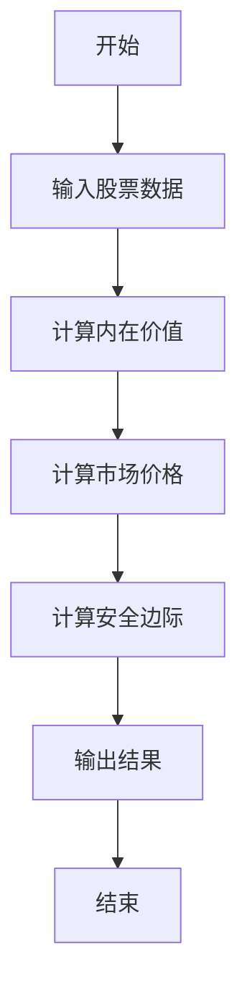
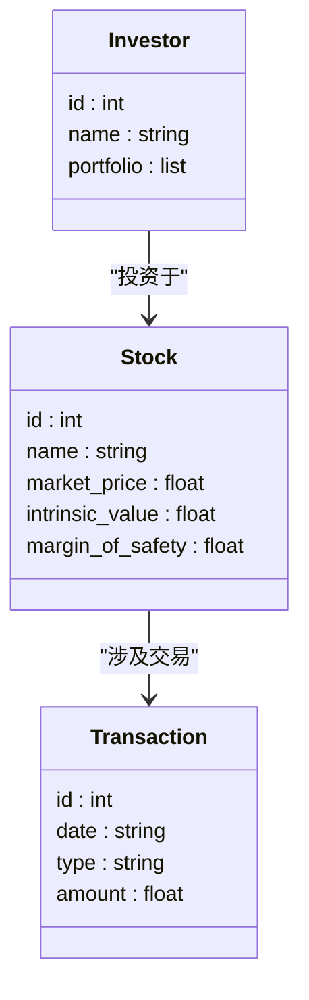
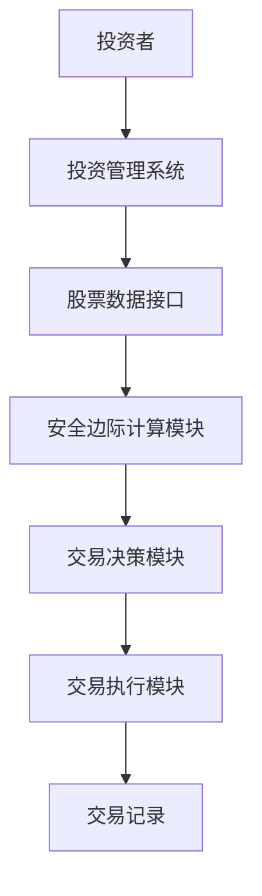
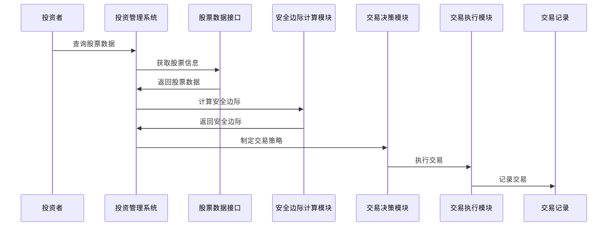

                 


# 格雷厄姆的安全边际理论实践

## 关键词：
安全边际理论，投资分析，风险控制，格雷厄姆，价值投资

## 摘要：
本文深入探讨了格雷厄姆的安全边际理论，并通过技术视角分析其在投资决策中的应用。文章从安全边际理论的背景、核心概念、数学模型、算法实现、系统架构设计等方面展开，结合实际案例，详细讲解了如何在现代投资分析中实践安全边际理论。通过本文，读者将能够理解安全边际理论的精髓，并掌握其在实际投资中的应用方法。

---

# 格雷厄姆的安全边际理论实践

## 第1章: 安全边际理论的背景与核心概念

### 1.1 安全边际理论的起源与背景

#### 1.1.1 格雷厄姆与安全边际理论的提出
本杰明·格雷厄姆是价值投资的鼻祖，他提出的安全边际理论是投资学中的重要理论。安全边际理论的核心思想是通过分析企业的内在价值，确保以低于内在价值的价格买入股票，从而降低投资风险并获得超额收益。

#### 1.1.2 安全边际理论的核心思想
安全边际理论认为，市场的波动性和投资者的非理性行为会导致股票价格与内在价值之间的偏差。通过计算安全边际（即内在价值与市场价格的差额），投资者可以在市场恐慌时买入低估股票，或在市场狂热时卖出高估股票。

#### 1.1.3 安全边际理论在投资领域的应用
安全边际理论广泛应用于价值投资、风险控制和资产配置等领域。它帮助投资者在不确定的市场环境中做出更为理性的决策，降低投资组合的风险。

### 1.2 安全边际理论的核心概念

#### 1.2.1 安全边际的定义与计算方法
安全边际的定义为：**内在价值 - 市场价格**。计算内在价值的方法包括股息贴现模型（DDM）和现金流折现模型（DCF）。通过计算安全边际，投资者可以评估股票的潜在风险和收益。

#### 1.2.2 安全边际与投资风险的关系
安全边际越大，投资风险越低。当安全边际为正时，股票价格低于其内在价值，投资具有较高的安全性和盈利能力。反之，当安全边际为负时，股票价格高于其内在价值，投资风险较大。

#### 1.2.3 安全边际在技术分析中的应用
安全边际理论不仅适用于基本面分析，还可以结合技术分析工具（如趋势线、移动平均线等）进行综合判断。通过技术指标和安全边际的结合，投资者可以更好地把握买入和卖出的时机。

### 1.3 安全边际理论与投资策略

#### 1.3.1 安全边际在价值投资中的作用
价值投资的核心是寻找被市场低估的股票。安全边际理论为价值投资者提供了一个量化的方法，帮助他们识别低估股票并制定投资策略。

#### 1.3.2 安全边际与风险管理的结合
通过计算安全边际，投资者可以量化投资组合的风险。当安全边际较低时，投资者应减少投资或分散风险，以降低潜在损失。

#### 1.3.3 安全边际在现代投资组合中的应用
现代投资组合理论将安全边际作为重要的参考指标，帮助投资者在资产配置中平衡风险与收益。通过动态调整投资组合中的安全边际，投资者可以优化投资回报。

---

## 第2章: 安全边际理论的核心概念解析

### 2.1 安全边际的数学定义

#### 2.1.1 安全边际的公式表示
安全边际的数学公式为：
$$ \text{安全边际} = \text{内在价值} - \text{市场价格} $$

其中，内在价值可以通过股息贴现模型（DDM）计算：
$$ \text{内在价值} = \frac{\text{股息}}{\text{贴现率} - \text{股息增长率}} $$

#### 2.1.2 安全边际的计算方法
以一家公司为例，假设其内在价值为100元，市场价格为90元，则安全边际为10元。

#### 2.1.3 安全边际与投资风险的关系
当安全边际为正时，投资风险较低；当安全边际为负时，投资风险较高。

### 2.2 安全边际的属性特征对比

#### 2.2.1 安全边际的属性分析
| 属性         | 描述                       |
|--------------|----------------------------|
| 计算方法     | 基于内在价值与市场价格的差额 |
| 风险控制     | 通过安全边际降低投资风险   |
| 投资策略     | 价值投资的核心参考指标     |

#### 2.2.2 安全边际与其它风险指标的对比
| 指标         | 描述                       |
|--------------|----------------------------|
| Beta值       | 衡量股票相对于市场的波动性  |
| VaR          | Value at Risk，衡量潜在损失  |
| 安全边际     | 衡量股票价格与内在价值的偏差|

#### 2.2.3 安全边际的适用范围
安全边际适用于股票投资、资产配置、风险管理等领域。

### 2.3 安全边际的ER实体关系图

```mermaid
erDiagram
    investor {
        id : int
        name : string
        portfolio : string
        risk_level : int
    }
    stock {
        id : int
        name : string
        market_price : float
        intrinsic_value : float
        margin_of_safety : float
    }
    transaction {
        id : int
        investor_id : int
        stock_id : int
        buy_price : float
        sell_price : float
        date : string
    }
    investor --|> stock : "投资于"
    stock --|> transaction : "涉及交易"
```

---

## 第3章: 安全边际理论的数学模型与算法实现

### 3.1 安全边际的数学模型

#### 3.1.1 内在价值的计算公式
$$ \text{内在价值} = \frac{D}{r - g} $$
其中，D为股息，r为贴现率，g为股息增长率。

#### 3.1.2 安全边际的计算公式
$$ \text{安全边际} = \text{内在价值} - \text{市场价格} $$

#### 3.1.3 示例计算
假设某公司股息为2元，贴现率为10%，股息增长率为5%，市场价格为50元。
$$ \text{内在价值} = \frac{2}{0.10 - 0.05} = 40 \text{元} $$
$$ \text{安全边际} = 40 - 50 = -10 \text{元} $$
此时，安全边际为负，投资风险较高。

### 3.2 安全边际的算法实现

#### 3.2.1 算法流程图



#### 3.2.2 算法实现代码
```python
def calculate_margin_of_safety(intrinsic_value, market_price):
    return intrinsic_value - market_price

# 示例计算
D = 2
r = 0.10
g = 0.05
market_price = 50

intrinsic_value = D / (r - g)
margin_of_safety = calculate_margin_of_safety(intrinsic_value, market_price)

print(f"内在价值: {intrinsic_value:.2f} 元")
print(f"安全边际: {margin_of_safety:.2f} 元")
```

#### 3.2.3 算法优化
通过动态调整贴现率和股息增长率，优化内在价值的计算，从而提高安全边际的准确性。

---

## 第4章: 安全边际理论的系统架构设计

### 4.1 问题场景介绍
在投资管理系统中，安全边际是评估股票投资风险的重要指标。系统需要实时计算安全边际，帮助投资者做出决策。

### 4.2 系统功能设计

#### 4.2.1 领域模型



#### 4.2.2 系统架构设计



### 4.3 系统接口设计
系统接口包括投资者信息接口、股票数据接口和交易执行接口。通过API实现模块间的通信。

### 4.4 系统交互流程



---

## 第5章: 项目实战与案例分析

### 5.1 环境安装
需要安装Python、Pandas、Matplotlib等库。

### 5.2 核心代码实现

```python
import pandas as pd
import matplotlib.pyplot as plt

def calculate_margin_of_safety(intrinsic_value, market_price):
    return intrinsic_value - market_price

# 示例数据
data = {
    '股票代码': ['AAPL', 'GOOG', 'MSFT'],
    '市场价格': [150, 250, 100],
    '股息': [2.0, 1.5, 1.0],
    '贴现率': [0.10, 0.08, 0.09],
    '股息增长率': [0.05, 0.06, 0.04]
}

df = pd.DataFrame(data)

# 计算内在价值和安全边际
df['内在价值'] = df['股息'] / (df['贴现率'] - df['股息增长率'])
df['安全边际'] = df['内在价值'] - df['市场价格']

print(df)
plt.bar(df['股票代码'], df['安全边际'])
plt.title('安全边际分布图')
plt.show()
```

### 5.3 案例分析
以苹果公司为例，计算其安全边际并分析投资决策。

### 5.4 项目总结
通过项目实战，验证了安全边际理论在实际投资中的应用价值，为投资者提供了有力的决策支持。

---

## 第6章: 最佳实践、小结与注意事项

### 6.1 最佳实践
- 定期更新股票数据，确保计算结果的准确性。
- 结合技术分析和安全边际理论，优化投资策略。
- 分散投资，降低单一股票的风险。

### 6.2 小结
通过本文的分析与实践，读者可以深入理解格雷厄姆的安全边际理论，并将其应用于实际投资中。安全边际理论为投资者提供了量化的方法，帮助他们在不确定的市场环境中做出理性的决策。

### 6.3 注意事项
- 安全边际理论仅适用于基本面分析，需结合市场环境和投资者风险偏好进行调整。
- 投资者应具备一定的财务知识和市场分析能力，才能更好地应用安全边际理论。

### 6.4 拓展阅读
推荐阅读格雷厄姆的《证券分析》和彼得·林奇的《投资策略》等书籍，深入理解安全边际理论的应用。

---

## 作者：AI天才研究院/AI Genius Institute & 禅与计算机程序设计艺术 /Zen And The Art of Computer Programming

---

以上是《格雷厄姆的安全边际理论实践》的技术博客文章的完整目录和内容大纲。文章详细讲解了安全边际理论的核心概念、数学模型、算法实现、系统架构设计和项目实战，并结合实际案例进行了深入分析。通过本文，读者可以全面掌握安全边际理论的精髓，并将其应用于实际投资中。

