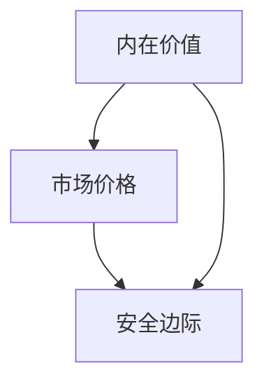
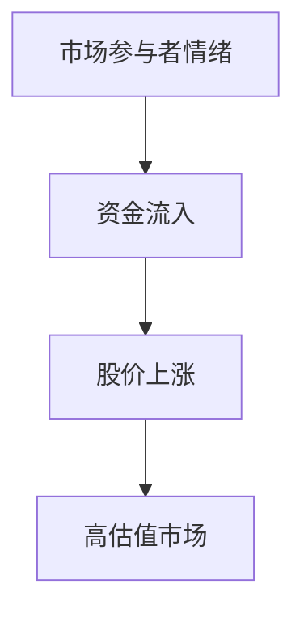
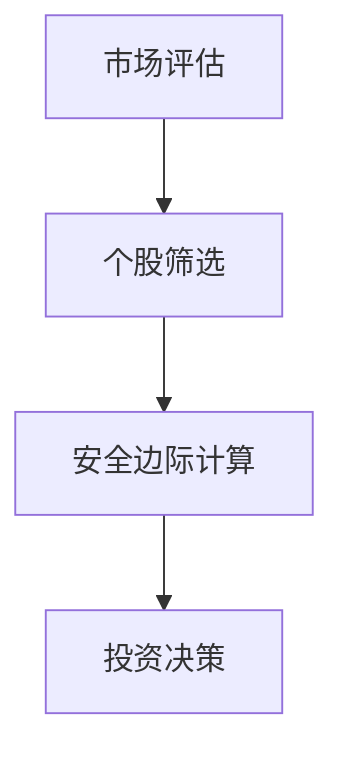
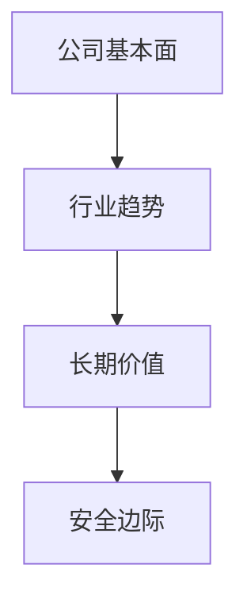

                 

# 格雷厄姆的安全边际理论：在高估值市场中的应用

## 关键词：安全边际，高估值市场，投资策略，风险管理，价值投资，数学模型

## 摘要：本篇文章深入探讨格雷厄姆的安全边际理论，分析其在高估值市场中的应用。文章从理论基础出发，结合数学模型和实际案例，讲解如何在高估值市场中应用安全边际理论进行投资决策，降低风险，实现稳健收益。

---

## 第1章：安全边际理论的概述

### 1.1 安全边际的定义与核心概念

#### 1.1.1 安全边际的基本定义
安全边际是投资中一个重要的概念，由本杰明·格雷厄姆提出。它是指股票的市场价格低于其内在价值的差额部分。简单来说，安全边际 = 内在价值 - 市场价格。这个差额越大，投资的风险越小，回报的确定性越高。

#### 1.1.2 格雷厄姆的价值投资理念
格雷厄姆的价值投资理念强调购买被市场低估的股票。他认为，市场价格會受到情绪和短期波动的影响，而内在价值才是决定股票长期表现的关键因素。安全边际是价值投资中重要的保护机制，它确保投资者在市场波动中不会遭受重大损失。

#### 1.1.3 安全边际在投资中的作用
安全边际的作用在于提供一个“缓冲区”，即当市场价格下跌时，内在价值与市场价格的差距能够吸收部分损失，从而保护投资者免受重大亏损。安全边际越大，投资者的抗风险能力越强。

**背景介绍：**
安全边际的计算涉及到内在价值的评估，通常使用格雷厄姆的方法，如将股息率与债券收益率进行比较，或者使用市盈率、市净率等指标来评估股票的内在价值。

**核心概念与联系：**
以下是安全边际与其他投资概念的对比表格：

| 概念          | 描述                                                                 |
|---------------|----------------------------------------------------------------------|
| 内在价值      | 股票的真正价值，基于其盈利能力、资产质量等因素。                   |
| 市场价格      | 股票在市场上的交易价格，受情绪和短期因素影响。                     |
| 安全边际      | 内在价值与市场价格的差额，提供投资的缓冲区。                       |

**算法原理讲解：**
安全边际的计算公式为：
$$ \text{安全边际} = \text{内在价值} - \text{市场价格} $$

以下是计算内在价值的简化模型：
$$ \text{内在价值} = \frac{\text{股息}}{\text{收益率}} $$

**数学模型：**
假设一只股票的内在价值为 $V$，市场价格为 $P$，则安全边际为：
$$ \text{安全边际} = V - P $$

如果安全边际为正，说明股票被低估，适合买入；如果为负，则说明股票被高估，应避免买入。

**系统分析：**
以下是安全边际理论的系统架构图：

**项目实战：**
以苹果公司为例，假设其内在价值为 $100，市场价格为 $90，则安全边际为 $10。此时，苹果股票被视为被低估，适合买入。

**最佳实践 tips：**
- 安全边际越大，投资风险越小。
- 在市场波动加剧时，安全边际尤为重要。

---

## 第2章：高估值市场的特征与风险

### 2.1 高估值市场的定义与指标

#### 2.1.1 市场估值的主要指标
市场估值的主要指标包括：
- 市盈率（P/E）：股价与每股收益的比率。
- 市净率（P/B）：股价与每股净资产的比率。
- 市销率（P/S）：股价与每股销售收入的比率。

#### 2.1.2 高估值市场的特征
高估值市场的特征包括：
- 市场估值指标显著高于历史平均水平。
- 投资者情绪乐观，资金大量流入股市。
- 股票价格普遍高于其内在价值。

#### 2.1.3 高估值市场的风险
高估值市场的风险主要体现在：
- 市场波动加剧，股价可能大幅下跌。
- 资产泡沫破裂的风险增加。
- 投资者可能面临本金损失的风险。

**背景介绍：**
高估值市场的形成通常是由于市场参与者对未来收益的过度乐观，导致股票价格被推高，超过了其实际价值。

**系统分析：**
以下是高估值市场的系统架构图：

**项目实战：**
以2000年的互联网泡沫为例，许多科技股的市盈率远高于行业平均水平，最终导致市场大幅下跌。

**最佳实践 tips：**
- 在高估值市场中，投资者应谨慎选择股票，寻找具有强大基本面的公司。
- 保持适度的仓位，避免过度集中投资。

---

## 第3章：安全边际在高估值市场中的应用

### 3.1 安全边际的计算与应用

#### 3.1.1 安全边际的计算方法
安全边际的计算方法包括：
1. 使用DCF模型评估内在价值。
2. 比较市盈率、市净率等指标，判断股票是否被低估。
3. 结合行业平均估值水平，评估个股的安全边际。

#### 3.1.2 安全边际的应用策略
在高估值市场中，安全边际的应用策略包括：
- 选择具有强大竞争优势的公司，这些公司的内在价值增长潜力较大。
- 优先选择那些市场价格显著低于内在价值的股票。
- 在市场高估时，减少投资或选择现金为王。

**背景介绍：**
在高估值市场中，计算安全边际时需要考虑市场整体估值水平和个股的特殊情况。

**数学模型：**
以下是安全边际的应用公式：

$$ \text{安全边际率} = \frac{\text{内在价值} - \text{市场价格}}{\text{市场价格}} $$

安全边际率为正时，股票具有投资价值。

**项目实战：**
假设某股票的内在价值为 $100，市场价格为 $80，安全边际率为 25%。此时，该股票被视为被低估，适合买入。

**最佳实践 tips：**
- 在高估值市场中，安全边际率应至少为 10% 或更高。
- 定期重新评估安全边际，及时调整投资组合。

---

## 第4章：投资策略与风险管理

### 4.1 投资策略的制定

#### 4.1.1 投资策略的制定步骤
1. 评估市场整体估值水平。
2. 选择具有强大基本面的公司。
3. 计算股票的安全边际。
4. 确定投资比例和仓位。

#### 4.1.2 投资策略的优化
- 分散投资，降低风险。
- 定期再平衡投资组合。
- 留出足够的现金头寸，以应对市场波动。

**系统分析：**
以下是投资策略的系统架构图：

**项目实战：**
以投资组合为例，假设投资者将资金分配为 60% 的股票和 40% 的现金，其中股票部分主要选择安全边际较高的个股。

**最佳实践 tips：**
- 定期评估投资组合的安全边际，及时调整。
- 在高估值市场中，避免集中投资单一行业或公司。

---

## 第5章：安全边际的长期视角

### 5.1 长期投资视角下的安全边际

#### 5.1.1 长期视角的重要性
长期视角下，安全边际能够帮助投资者抵御短期市场波动，关注公司的长期价值。

#### 5.1.2 安全边际与长期投资决策
在长期投资中，安全边际是评估公司内在价值的重要工具，能够帮助投资者识别那些能够持续创造价值的公司。

**背景介绍：**
长期视角下，安全边际的计算需要考虑公司的成长性和行业趋势。

**系统分析：**
以下是长期视角下的系统架构图：

**项目实战：**
以亚马逊为例，尽管其股价较高，但其长期成长潜力和强大的竞争优势使其具有较高的安全边际。

**最佳实践 tips：**
- 长期投资者应关注公司的竞争优势和长期增长潜力。
- 定期评估公司基本面的变化，及时调整安全边际评估。

---

## 第6章：案例分析与经验分享

### 6.1 成功案例分析

#### 6.1.1 案例1：某科技公司
背景：该公司在高估值市场中被低估，安全边际较高。
分析：计算其安全边际，发现其市场价格低于内在价值，适合买入。

#### 6.1.2 案例2：某传统行业公司
背景：该公司在市场低估，安全边际较大。
分析：通过计算其内在价值，发现其市场价格低于内在价值，适合长期持有。

### 6.2 经验分享

#### 6.2.1 投资心态的调整
在高估值市场中，投资者需要保持冷静，避免被市场情绪左右。

#### 6.2.2 风险管理的重要性
通过分散投资和合理配置资产，降低投资风险。

**项目实战：**
以某公司为例，计算其安全边际，评估其投资价值，并制定相应的投资策略。

---

## 第7章：总结与展望

### 7.1 总结

#### 7.1.1 核心观点回顾
- 安全边际是价值投资的重要工具。
- 在高估值市场中，安全边际的应用能够帮助投资者降低风险，实现稳健收益。

#### 7.1.2 本文的主要结论
- 高估值市场中，安全边际的应用需要结合市场整体估值和个股基本面。
- 长期视角下，安全边际能够帮助投资者抵御短期波动，关注长期价值。

### 7.2 展望

#### 7.2.1 未来研究方向
- 安全边际理论在不同市场环境中的应用。
- 安全边际与技术分析的结合。

#### 7.2.2 对投资者的建议
- 在高估值市场中，投资者应谨慎选择股票，注重安全边际。
- 长期投资者应关注公司的基本面和长期增长潜力。

---

## 作者：AI天才研究院/AI Genius Institute & 禅与计算机程序设计艺术 /Zen And The Art of Computer Programming

---

以上是《格雷厄姆的安全边际理论：在高估值市场中的应用》的完整目录和内容概要。每一章都详细阐述了安全边际理论的核心概念、计算方法、实际应用以及风险管理策略，并通过实际案例和图表进行分析。希望这篇文章能为投资者在高估值市场中应用安全边际理论提供有价值的指导和启示。

