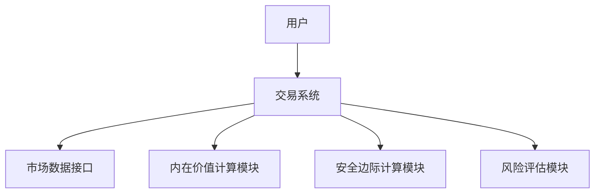
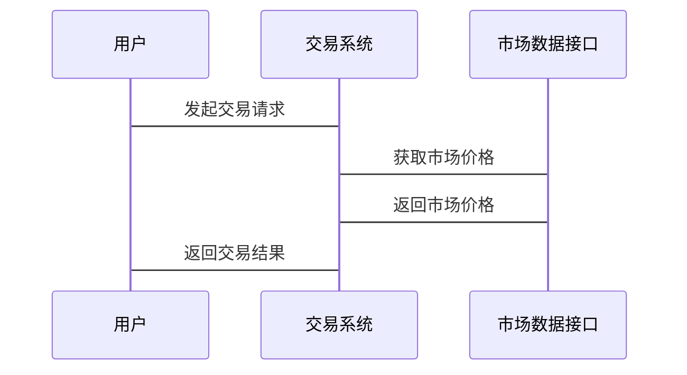

                 


# 格雷厄姆的安全边际理论：在高频交易时代的重要性

## 关键词：
- 格雷厄姆安全边际理论
- 高频交易
- 算法交易
- 投资风险管理
- 内在价值评估

## 摘要：
本文深入探讨了格雷厄姆的安全边际理论在高频交易时代的重要性。通过分析安全边际理论的核心概念、数学模型、算法实现及其在高频交易中的应用，本文揭示了该理论在现代金融市场中的独特价值。从理论基础到实际应用，从数学模型到代码实现，本文为读者提供了全面的视角，帮助他们在高频交易的复杂环境中应用这一经典理论。

---

# 第1章：安全边际理论的起源与核心概念

## 1.1 格雷厄姆与安全边际理论的提出

### 1.1.1 格雷厄姆的生平与投资理念
本杰明·格雷厄姆（Benjamin Graham）是20世纪最伟大的投资理论家之一，被誉为“价值投资之父”。他的投资理念强调以低于内在价值的价格购买优质资产，以确保投资的安全性。格雷厄姆的投资哲学深刻影响了沃伦·巴菲特等一代投资大师。

### 1.1.2 安全边际理论的定义与核心思想
安全边际理论的核心思想是：投资者应以低于内在价值的价格购买资产，以确保在市场波动中具有足够的“安全空间”。具体来说，安全边际 = 内在价值 - 市场价格。这种思维方式强调了风险管理的重要性，而非单纯追求收益最大化。

### 1.1.3 安全边际理论在投资中的应用
安全边际理论不仅适用于传统投资领域，还可以扩展到高频交易和算法交易中。在高频交易中，市场的瞬时波动性和交易机会的短暂性使得安全边际理论的适用性更加重要。

---

## 1.2 安全边际理论的核心要素

### 1.2.1 核心概念：安全边际的计算与意义
安全边际是内在价值与市场价格之间的差额，反映了资产的“安全空间”。当市场价格低于内在价值时，安全边际为正，投资具有安全性；反之，则存在风险。

### 1.2.2 核心要素：内在价值、市场价格与安全边际的关系
- **内在价值（Intrinsic Value）**：资产的真正价值，基于其未来现金流的折现值。
- **市场价格（Market Price）**：资产在市场上的交易价格。
- **安全边际（Margin of Safety）**：内在价值 - 市场价格。

### 1.2.3 核心公式：安全边际 = 内在价值 - 市场价格
$$
\text{Margin of Safety} = \text{Intrinsic Value} - \text{Market Price}
$$

---

## 1.3 安全边际理论的优缺点分析

### 1.3.1 优点：风险控制与稳健投资
- 通过安全边际，投资者可以在市场波动中避免重大损失。
- 适用于长期价值投资，强调稳健而非激进。

### 1.3.2 缺点：忽略市场波动与短期机会
- 安全边际理论主要适用于长期投资，对高频交易中的短期机会捕捉能力有限。
- 在市场剧烈波动时，安全边际可能迅速消失，导致投资机会的错失。

### 1.3.3 适用场景：长期价值投资与防御性投资
安全边际理论最适合在市场低迷或资产价格被低估时使用，帮助投资者在市场底部布局。

---

# 第2章：安全边际理论在高频交易中的应用

## 2.1 高频交易的基本概念与特点

### 2.1.1 高频交易的定义与特点
高频交易是指通过计算机算法在极短时间内进行大量的交易，通常涉及复杂的数学模型和高速的交易执行系统。高频交易的特点包括：
- 高速性：交易速度极快，通常以毫秒为单位。
- 算法驱动：依赖复杂的数学模型和算法。
- 高频性：短时间内进行大量交易。

### 2.1.2 高频交易的技术基础：算法交易与程序化交易
- **算法交易**：基于数学模型的自动交易策略。
- **程序化交易**：通过编写程序自动执行交易指令。

### 2.1.3 高频交易的市场影响与风险
- 市场影响：可能导致价格波动加剧，甚至引发闪崩。
- 风险：高频交易的高杠杆性和短期性使其容易受到市场波动的影响。

---

## 2.2 安全边际理论与高频交易的结合

### 2.2.1 高频交易中的安全边际计算
在高频交易中，安全边际的计算需要考虑以下几个方面：
- **短期波动性**：高频交易中的价格波动可能比传统投资更剧烈。
- **算法模型**：需要结合高频交易的算法模型，实时计算安全边际。
- **执行速度**：安全边际的计算需要在极短的时间内完成。

### 2.2.2 高频交易中的风险控制与安全边际的应用
- **实时监控**：通过算法实时监控交易的市场风险。
- **动态调整**：根据市场变化动态调整安全边际。

### 2.2.3 安全边际理论在高频交易中的优缺点
- **优点**：帮助高频交易者在市场波动中降低风险。
- **缺点**：高频交易的复杂性可能使安全边际的计算变得困难。

---

## 2.3 高频交易中的安全边际计算示例

### 2.3.1 基于短期价格波动的安全边际计算
假设某资产的内在价值为 $100，市场价格为 $95，短期波动性为 $5。在这种情况下，安全边际为 $5，风险较低。

### 2.3.2 基于算法模型的安全边际计算
通过高频交易算法，实时计算资产的内在价值和市场价格，动态调整安全边际。

---

# 第3章：安全边际理论的核心数学模型与公式

## 3.1 内在价值的计算公式

### 3.1.1 内在价值的定义
内在价值是资产未来现金流的现值，通常使用 discounted cash flow (DCF) 模型计算。

### 3.1.2 内在价值的计算公式
$$
\text{Intrinsic Value} = \frac{\text{未来现金流}}{\text{折现率}} 
$$

### 3.1.3 内在价值计算的假设条件与限制
- 假设未来现金流可以预测。
- 折现率的选择对结果影响较大。

---

## 3.2 安全边际的计算公式

### 3.2.1 安全边际的定义
安全边际是内在价值与市场价格的差额。

### 3.2.2 安全边际的计算公式
$$
\text{Margin of Safety} = \text{Intrinsic Value} - \text{Market Price}
$$

---

## 3.3 安全边际与风险控制的数学模型

### 3.3.1 风险调整后的安全边际计算
$$
\text{Adjusted MOS} = \text{MOS} \times (1 - \text{风险因子})
$$

### 3.3.2 使用蒙特卡洛模拟进行风险评估
通过蒙特卡洛模拟，评估不同市场条件下安全边际的变化。

---

# 第4章：安全边际理论的算法实现与代码示例

## 4.1 安全边际计算的算法流程

### 4.1.1 算法输入
- 资产的基本面数据（如现金流、折现率）。
- 市场价格。

### 4.1.2 算法步骤
1. 计算内在价值。
2. 计算市场价格。
3. 计算安全边际。

### 4.1.3 算法输出
- 安全边际值。
- 投资建议（如“买入”、“卖出”）。

---

## 4.2 Python代码实现

### 4.2.1 计算内在价值的代码
```python
def calculate_intrinsic_value(cash_flow, discount_rate):
    return cash_flow / discount_rate
```

### 4.2.2 计算安全边际的代码
```python
def calculate_margin_of_safety(intrinsic_value, market_price):
    return intrinsic_value - market_price
```

---

## 4.3 数学模型与公式

### 4.3.1 内在价值的计算公式
$$
\text{Intrinsic Value} = \frac{\text{Cash Flow}}{\text{Discount Rate}}
$$

### 4.3.2 安全边际的计算公式
$$
\text{Margin of Safety} = \text{Intrinsic Value} - \text{Market Price}
$$

---

# 第5章：安全边际理论的系统分析与架构设计

## 5.1 系统架构设计

### 5.1.1 系统功能设计
- 内在价值计算模块。
- 市场价格获取模块。
- 安全边际计算模块。
- 风险评估模块。

### 5.1.2 系统架构图


---

## 5.2 系统交互设计

### 5.2.1 交易系统与市场数据接口的交互


---

# 第6章：项目实战与最佳实践

## 6.1 项目实战

### 6.1.1 环境安装
- 安装Python和相关库（如Pandas、NumPy）。

### 6.1.2 代码实现
```python
import pandas as pd
import numpy as np

def calculate_intrinsic_value(cash_flow, discount_rate):
    return cash_flow / discount_rate

def calculate_margin_of_safety(intrinsic_value, market_price):
    return intrinsic_value - market_price

# 示例数据
cash_flow = 100
discount_rate = 0.1
market_price = 90

# 计算内在价值
intrinsic_value = calculate_intrinsic_value(cash_flow, discount_rate)

# 计算安全边际
margin_of_safety = calculate_margin_of_safety(intrinsic_value, market_price)

print(f"内在价值：{intrinsic_value}")
print(f"市场价格：{market_price}")
print(f"安全边际：{margin_of_safety}")
```

### 6.1.3 案例分析
假设某资产的现金流为 $100，折现率为 10%，市场价格为 $90。计算结果如下：
- 内在价值：$100
- 市场价格：$90
- 安全边际：$10

---

## 6.2 最佳实践

### 6.2.1 注意事项
- 安全边际的计算需要考虑市场波动性。
- 高频交易中的安全边际需要动态调整。

### 6.2.2 小结
安全边际理论在高频交易中仍然具有重要的意义。通过结合算法交易和风险控制，投资者可以在现代金融市场中更好地应用这一经典理论。

---

# 结语

格雷厄姆的安全边际理论在高频交易时代的重要性不言而喻。通过理论与实践的结合，投资者可以在现代金融市场中更好地控制风险、抓住机会。未来，随着技术的进步，安全边际理论的应用将更加广泛和深入。

---

作者：AI天才研究院/AI Genius Institute & 禅与计算机程序设计艺术 /Zen And The Art of Computer Programming

