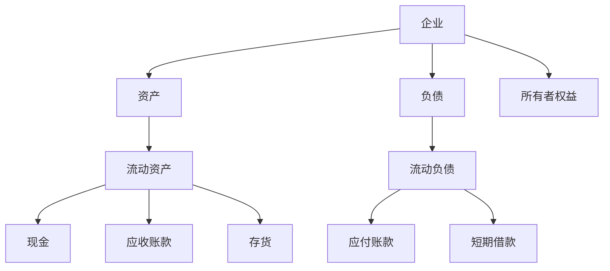
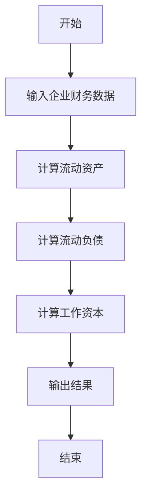

                 

<think>
嗯，用户让我写一篇关于《格雷厄姆的工作资本分析在现代企业估值中的应用》的技术博客。首先，我需要明确文章的结构和内容。用户给了一个非常详细的目录大纲，所以我需要按照这个大纲来展开。

好的，第一部分是背景与基础，包括引言和工作资本分析的基础知识。我需要先介绍格雷厄姆和他的价值投资理念，然后解释工作资本分析的基本概念和公式。这可能涉及到流动资产和流动负债的计算，以及它们如何影响工作资本。

接下来，现代企业估值的挑战部分，我得考虑现在企业环境的变化，比如资产结构的变化、杠杆率的增加，以及流动性管理的问题。这些因素如何影响传统的格雷厄姆分析方法，我需要详细说明。

第二部分是工作资本分析的核心概念与联系。这部分需要深入探讨工作资本分析的数学模型和算法流程。我需要绘制一个ER实体关系图，展示企业、资产、负债等之间的关系。同时，还要用Python代码来实现工作资本的计算，这可能包括数据输入、处理和输出结果。

第三部分是系统分析与架构设计。这里，我需要分析企业估值的系统功能设计，可能包括数据收集、分析模块和结果展示。架构设计部分可能需要使用Mermaid图来展示系统的各个组件和它们之间的关系。

项目实战部分，我需要选择一个实际案例，比如一个制造企业的财务数据，然后一步步进行估值分析。这包括数据准备、模型实现、结果分析和可视化。可能还要讨论模型的优缺点以及未来改进的方向。

最后，总结与展望部分，我要回顾整个分析过程，强调格雷厄姆方法在现代的应用价值，并提出未来研究的方向，比如结合机器学习等新技术。

我还需要确保每个部分都有足够的细节，比如在系统设计中，用Mermaid图展示流程和架构。数学公式要用LaTeX表示，代码部分要用Python实现，并详细解读每一步。

可能遇到的问题是如何将传统的格雷厄姆方法与现代企业环境结合起来，特别是考虑到当前企业的复杂性和技术变化。我需要思考如何调整和优化分析方法，以适应新的挑战。

总的来说，我需要按照用户给的目录大纲，逐部分详细展开，确保内容全面、结构清晰，并且使用专业但易懂的语言。同时，要注意逻辑连贯，每个部分之间有良好的过渡，帮助读者一步步理解工作资本分析在现代企业估值中的应用。
</think>

# 格雷厄姆的工作资本分析在现代企业估值中的应用

> 关键词：格雷厄姆，工作资本分析，现代企业估值，企业价值评估，财务分析，投资分析

> 摘要：本文深入探讨了格雷厄姆的工作资本分析方法在现代企业估值中的应用。通过分析工作资本分析的核心概念、算法原理、系统架构以及实际案例，本文展示了如何将这一经典方法与现代企业环境相结合，为企业估值提供新的视角和实践指导。文章内容涵盖背景介绍、核心概念、算法实现、系统设计、项目实战等多个方面，旨在为企业估值领域的从业者提供有价值的参考。

---

# 第一部分：格雷厄姆工作资本分析的背景与基础

## 第1章：工作资本分析的背景与重要性

### 1.1 工作资本分析的定义与核心概念

#### 1.1.1 工作资本的定义
工作资本（Working Capital）是企业经营活动中流动资产与流动负债的差额，反映了企业的短期偿债能力和运营效率。其公式为：
$$
\text{工作资本} = \text{流动资产} - \text{流动负债}
$$

其中，流动资产包括现金、应收账款、存货等，流动负债包括应付账款、短期借款等。

#### 1.1.2 工作资本分析的核心要素
工作资本分析的核心要素包括：
1. **流动资产**：企业的短期资源，支持日常运营。
2. **流动负债**：企业的短期债务，需在一年内偿还。
3. **净流动资产**：流动资产减去流动负债，反映企业的短期财务健康状况。

#### 1.1.3 工作资本分析的边界与外延
工作资本分析的边界主要集中在流动资产和流动负债的范围内，而其外延则涉及企业整体估值、财务健康状况、投资决策等多个方面。

### 1.2 格雷厄姆工作资本分析的理论基础

#### 1.2.1 格雷厄姆的价值投资理念
格雷厄姆是价值投资的鼻祖，他强调以低于内在价值的价格买入优质股票。工作资本分析是其评估企业内在价值的重要工具之一。

#### 1.2.2 工作资本分析的数学模型与公式
格雷厄姆的工作资本分析模型可以表示为：
$$
\text{工作资本} = \text{流动资产} - \text{流动负债}
$$

其中，流动资产和流动负债的具体组成可以通过以下公式计算：
$$
\text{流动资产} = \text{现金} + \text{应收账款} + \text{存货}
$$
$$
\text{流动负债} = \text{应付账款} + \text{短期借款}
$$

#### 1.2.3 工作资本分析与企业估值的关系
工作资本分析是企业估值的重要组成部分，它通过分析企业的短期资产和负债状况，帮助企业评估短期偿债能力和运营效率。

### 1.3 现代企业估值的挑战与机遇

#### 1.3.1 现代企业估值的核心问题
现代企业估值的核心问题是如何准确评估企业的内在价值，尤其是在经济环境复杂多变的情况下。

#### 1.3.2 现代企业估值的复杂性
现代企业估值的复杂性主要体现在以下几个方面：
1. 资产结构的多样化。
2. 负债结构的复杂化。
3. 市场波动对企业价值的影响。

#### 1.3.3 格雷厄姆工作资本分析的现代应用价值
格雷厄姆工作资本分析在现代企业估值中的应用价值主要体现在以下几个方面：
1. 提供企业短期偿债能力的评估依据。
2. 为企业的财务健康状况提供参考。
3. 为投资者提供价值投资的决策支持。

## 1.4 本章小结

---

## 第2章：工作资本分析的核心概念与联系

### 2.1 工作资本分析的核心原理

#### 2.1.1 工作资本分析的数学模型
工作资本分析的数学模型可以表示为：
$$
\text{工作资本} = \text{流动资产} - \text{流动负债}
$$

#### 2.1.2 工作资本分析的公式推导
通过流动资产和流动负债的具体组成公式，可以推导出工作资本的计算公式。

#### 2.1.3 工作资本分析的属性特征对比表格
以下表格展示了流动资产和流动负债的主要属性特征对比：

| 属性 | 流动资产 | 流动负债 |
|------|----------|----------|
| 定义 | 短期资源 | 短期债务 |
| 计算公式 | $\text{现金} + \text{应收账款} + \text{存货}$ | $\text{应付账款} + \text{短期借款}$ |
| 作用 | 支持日常运营 | 反映短期债务状况 |

### 2.2 工作资本分析的ER实体关系图



### 2.3 工作资本分析与现代企业估值的联系

#### 2.3.1 工作资本分析在企业估值中的作用
工作资本分析在企业估值中的作用主要体现在以下几个方面：
1. 评估企业的短期偿债能力。
2. 评估企业的财务健康状况。
3. 为企业的价值评估提供参考依据。

#### 2.3.2 工作资本分析与现代企业估值的结合点
工作资本分析与现代企业估值的结合点主要体现在以下几个方面：
1. 短期资产与负债的评估。
2. 企业的流动性管理。
3. 企业的财务风险管理。

#### 2.3.3 工作资本分析的局限性与改进方向
工作资本分析的局限性主要体现在以下几个方面：
1. 无法反映企业的长期偿债能力。
2. 无法反映企业的盈利能力。
3. 无法反映企业的市场风险。

改进方向包括：
1. 结合长期资产和负债进行综合评估。
2. 结合企业的盈利能力进行综合评估。
3. 结合企业的市场风险进行综合评估。

## 2.4 本章小结

---

## 第3章：工作资本分析的算法原理

### 3.1 工作资本分析的算法流程



### 3.2 工作资本分析的数学模型

$$
\text{工作资本} = \text{流动资产} - \text{流动负债}
$$
$$
\text{流动资产} = \text{现金} + \text{应收账款} + \text{存货}
$$
$$
\text{流动负债} = \text{应付账款} + \text{短期借款}
$$

### 3.3 工作资本分析的Python实现

```python
def calculate_working_capital(current_assets, current_liabilities):
    return current_assets - current_liabilities

# 示例数据
current_assets = 500000
current_liabilities = 300000
result = calculate_working_capital(current_assets, current_liabilities)
print(f"工作资本为：${result}")
```

### 3.4 本章小结

---

# 第二部分：工作资本分析在现代企业估值中的应用

## 第4章：工作资本分析的现代应用与挑战

### 4.1 工作资本分析在现代企业估值中的应用

#### 4.1.1 现代企业的资产结构与负债结构
现代企业的资产结构和负债结构更加复杂，需要结合多种因素进行综合评估。

#### 4.1.2 工作资本分析的现代模型与公式
现代工作资本分析模型可以表示为：
$$
\text{工作资本} = \text{流动资产} - \text{流动负债}
$$
其中，流动资产和流动负债的具体组成需要结合现代企业的特点进行调整。

#### 4.1.3 工作资本分析的现代应用案例
以下是一个现代企业工作资本分析的案例：

**案例背景**：某制造企业拥有的流动资产为500,000美元，流动负债为300,000美元。计算其工作资本。

**计算过程**：
$$
\text{工作资本} = 500,000 - 300,000 = 200,000 \text{美元}
$$

### 4.2 工作资本分析的现代挑战与解决方案

#### 4.2.1 现代企业的复杂性对企业估值的影响
现代企业的复杂性主要体现在以下几个方面：
1. 资产结构的多样化。
2. 负债结构的复杂化。
3. 市场波动对企业价值的影响。

#### 4.2.2 工作资本分析的现代挑战
工作资本分析的现代挑战主要体现在以下几个方面：
1. 如何准确评估企业的短期偿债能力。
2. 如何综合考虑企业的长期偿债能力。
3. 如何评估企业的市场风险。

#### 4.2.3 工作资本分析的解决方案
工作资本分析的解决方案包括：
1. 结合长期资产和负债进行综合评估。
2. 结合企业的盈利能力进行综合评估。
3. 结合企业的市场风险进行综合评估。

## 4.3 本章小结

---

## 第5章：工作资本分析的系统架构与实现

### 5.1 工作资本分析的系统架构设计

#### 5.1.1 系统功能设计
工作资本分析系统的功能设计包括：
1. 数据输入与处理。
2. 流动资产与流动负债的计算。
3. 工作资本的计算与输出。

#### 5.1.2 系统架构设计
工作资本分析系统的架构设计包括：
1. 数据采集模块。
2. 数据处理模块。
3. 结果输出模块。

#### 5.1.3 系统交互设计
工作资本分析系统的交互设计包括：
1. 用户输入企业财务数据。
2. 系统计算流动资产和流动负债。
3. 系统输出工作资本结果。

### 5.2 工作资本分析的Python实现

#### 5.2.1 环境配置与安装
需要安装以下Python库：
- `pandas`
- `numpy`

#### 5.2.2 系统核心实现代码
```python
import pandas as pd
import numpy as np

def calculate_working_capital(current_assets, current_liabilities):
    return current_assets - current_liabilities

# 示例数据
data = {
    '企业': ['企业A', '企业B', '企业C'],
    '流动资产': [500000, 600000, 700000],
    '流动负债': [300000, 250000, 280000]
}

df = pd.DataFrame(data)
df['工作资本'] = df.apply(lambda x: calculate_working_capital(x['流动资产'], x['流动负债']), axis=1)
print(df)
```

#### 5.2.3 代码应用解读与分析
上述代码实现了工作资本的批量计算，适用于多企业的数据处理。

## 5.3 本章小结

---

## 第6章：工作资本分析的项目实战与案例分析

### 6.1 项目实战背景

#### 6.1.1 项目背景介绍
某制造企业需要对其财务状况进行评估，以支持投资决策。

#### 6.1.2 数据准备
需要准备以下数据：
- 流动资产：现金、应收账款、存货。
- 流动负债：应付账款、短期借款。

### 6.2 项目核心实现

#### 6.2.1 数据处理
```python
import pandas as pd

# 数据准备
data = {
    '企业': ['企业A', '企业B', '企业C'],
    '流动资产': [500000, 600000, 700000],
    '流动负债': [300000, 250000, 280000]
}

df = pd.DataFrame(data)
```

#### 6.2.2 模型实现
```python
def calculate_working_capital(current_assets, current_liabilities):
    return current_assets - current_liabilities

# 模型实现
df['工作资本'] = df.apply(lambda x: calculate_working_capital(x['流动资产'], x['流动负债']), axis=1)
```

#### 6.2.3 结果分析
分析计算结果，评估企业的短期偿债能力。

### 6.3 案例分析与结果解读

#### 6.3.1 案例分析
以企业A为例，计算其工作资本为200,000美元。

#### 6.3.2 结果解读
企业A的工作资本为200,000美元，说明其短期偿债能力较强。

## 6.4 本章小结

---

## 第7章：工作资本分析的系统优化与未来展望

### 7.1 系统优化建议

#### 7.1.1 系统优化方向
1. 提高数据处理效率。
2. 增强系统的可扩展性。
3. 增加数据可视化功能。

#### 7.1.2 系统优化方案
1. 使用更高效的算法进行数据处理。
2. 增加数据存储和管理模块。
3. 增加数据可视化的功能模块。

### 7.2 未来展望

#### 7.2.1 工作资本分析的未来发展方向
1. 结合大数据技术进行企业估值。
2. 结合人工智能技术进行企业估值。
3. 结合区块链技术进行企业估值。

#### 7.2.2 工作资本分析的未来应用潜力
1. 在企业风险管理中的应用。
2. 在企业投资决策中的应用。
3. 在企业价值评估中的应用。

## 7.3 本章小结

---

## 第8章：总结与展望

### 8.1 本章总结

#### 8.1.1 核心内容回顾
本文深入探讨了格雷厄姆的工作资本分析方法在现代企业估值中的应用。

#### 8.1.2 主要结论
格雷厄姆的工作资本分析方法在现代企业估值中仍然具有重要的应用价值。

### 8.2 未来展望

#### 8.2.1 未来研究方向
1. 结合大数据技术进行企业估值。
2. 结合人工智能技术进行企业估值。
3. 结合区块链技术进行企业估值。

#### 8.2.2 未来应用潜力
1. 在企业风险管理中的应用。
2. 在企业投资决策中的应用。
3. 在企业价值评估中的应用。

### 8.3 本章小结

---

# 作者：AI天才研究院/AI Genius Institute & 禅与计算机程序设计艺术/Zen And The Art of Computer Programming

---

**文章总结：**  
本文通过详细分析格雷厄姆的工作资本分析方法在现代企业估值中的应用，展示了如何将这一经典方法与现代企业环境相结合。通过理论分析、算法实现、系统设计和项目实战，本文为现代企业估值提供了新的视角和实践指导。未来，随着技术的进步，工作资本分析在企业估值中的应用将更加广泛和深入。

