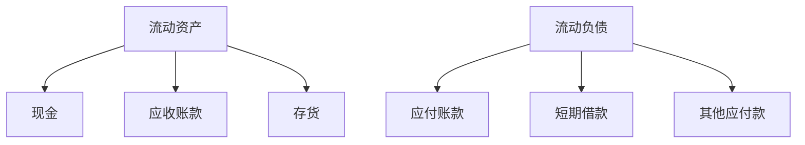
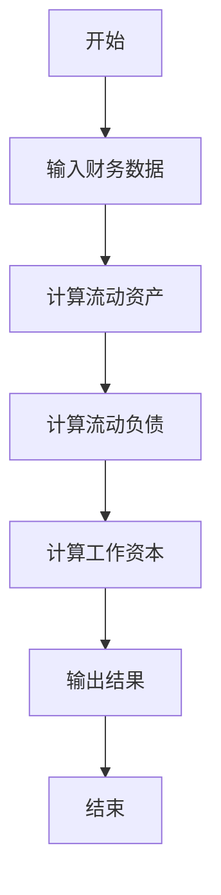
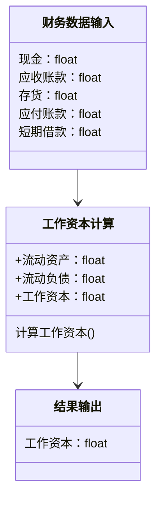
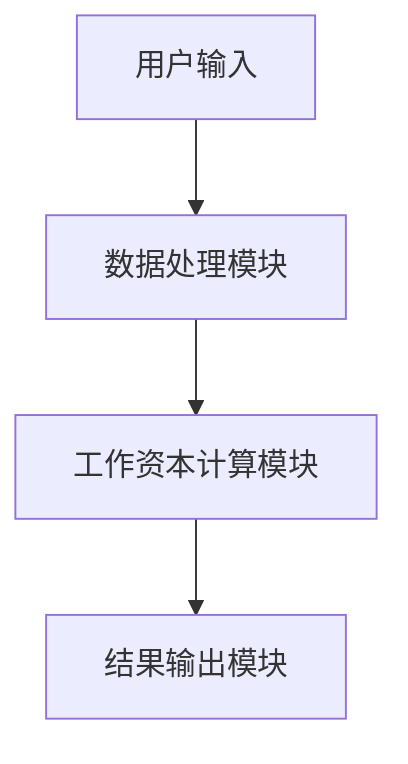
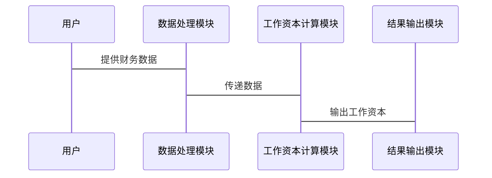

                 


# 《格雷厄姆的工作资本分析方法》

---

## 关键词：
工作资本分析、流动资产、流动负债、净流动资产、财务报表分析、投资分析方法、企业估值

---

## 摘要：
本文系统地介绍了格雷厄姆的工作资本分析方法，从核心概念、算法原理到实际应用，详细阐述了如何通过工作资本分析评估企业的财务健康状况和内在价值。文章通过丰富的案例和代码示例，深入浅出地讲解了工作资本分析的理论基础和实践应用，帮助读者掌握这一经典的投资分析方法。

---

## 正文：

---

### 第1章：工作资本分析概述

#### 1.1 工作资本分析的基本概念
工作资本分析是格雷厄姆提出的一种评估企业财务状况的方法，主要用于衡量企业的短期偿债能力和流动性。工作资本（Working Capital）是指企业的流动资产减去流动负债，是企业运营中不可或缺的指标。

**问题背景**：
在企业财务分析中，流动性是衡量企业短期偿债能力的重要指标。工作资本分析通过对企业流动资产和流动负债的对比，评估企业的财务健康状况。

**问题解决**：
通过计算工作资本，投资者可以了解企业在短期内偿还债务的能力，从而做出更明智的投资决策。

**边界与外延**：
工作资本分析仅关注流动资产和流动负债，不包括非流动资产和非流动负债。其外延主要应用于企业估值、投资决策和风险管理。

**核心要素**：
- 流动资产：现金、应收账款、存货等。
- 流动负债：应付账款、短期借款等。
- 净流动资产：工作资本减去非流动资产。

---

#### 1.2 工作资本分析的意义
工作资本分析不仅是评估企业短期偿债能力的重要工具，还能帮助投资者发现潜在的财务风险。通过分析工作资本的变化趋势，投资者可以更好地理解企业的财务健康状况。

---

#### 1.3 工作资本分析的应用场景
- 企业估值：评估企业的内在价值。
- 投资决策：帮助投资者选择具有较强流动性的企业。
- 风险管理：识别企业的短期偿债能力。

---

### 第2章：工作资本分析的核心概念

#### 2.1 流动资产与流动负债的定义与属性对比
| **属性**       | **流动资产**                | **流动负债**                |
|-----------------|-----------------------------|-----------------------------|
| **定义**       | 可在一年内变现的资产         | 预计在一年内偿还的债务       |
| **特征**       | 短期性、流动性                | 短期性、负债性                |
| **具体项目**   | 现金、应收账款、存货         | 应付账款、短期借款            |
| **重要性**     | 支持企业日常运营             | 影响企业的短期偿债能力        |

---

#### 2.2 工作资本分析的ER实体关系图


---

#### 2.3 工作资本分析的公式推导
工作资本的计算公式为：
$$\text{工作资本} = \text{流动资产} - \text{流动负债}$$

净流动资产的计算公式为：
$$\text{净流动资产} = \text{工作资本} - \text{非流动资产}$$

---

### 第3章：工作资本分析的算法原理

#### 3.1 工作资本分析的流程图


---

#### 3.2 工作资本分析的Python实现
```python
def calculate_working_capital(current_assets, current_liabilities):
    working_capital = current_assets - current_liabilities
    return working_capital

# 示例数据
current_assets = 500000  # 流动资产（元）
current_liabilities = 300000  # 流动负债（元）

# 计算工作资本
working_capital = calculate_working_capital(current_assets, current_liabilities)
print(f"工作资本 = {working_capital}元")
```

---

### 第4章：系统分析与架构设计方案

#### 4.1 问题场景介绍
假设我们有一家制造公司，需要对其财务状况进行分析，以评估其短期偿债能力。

---

#### 4.2 项目介绍
本项目旨在通过Python代码实现工作资本分析的算法，帮助投资者评估企业的财务健康状况。

---

#### 4.3 系统功能设计


---

#### 4.4 系统架构设计


---

#### 4.5 系统接口设计


---

### 第5章：项目实战

#### 5.1 环境安装
- 安装Python和必要的库（如Pandas）。

---

#### 5.2 核心代码实现
```python
import pandas as pd

def calculate_working_capital(df):
    current_assets = df['流动资产'].sum()
    current_liabilities = df['流动负债'].sum()
    working_capital = current_assets - current_liabilities
    return working_capital

# 示例数据
data = {
    '流动资产': [500000, 600000, 700000],
    '流动负债': [300000, 400000, 500000]
}
df = pd.DataFrame(data)

# 计算工作资本
working_capital = calculate_working_capital(df)
print(f"工作资本 = {working_capital}元")
```

---

#### 5.3 代码解读与分析
- 使用Pandas库读取数据。
- 计算流动资产和流动负债的总和。
- 输出工作资本。

---

#### 5.4 实际案例分析
以某公司为例，通过实际数据计算其工作资本，分析其财务健康状况。

---

#### 5.5 项目小结
通过本项目，读者可以掌握工作资本分析的基本方法，并能够将其应用于实际场景。

---

### 第6章：工作资本分析的最佳实践

#### 6.1 小结
工作资本分析是评估企业短期偿债能力的重要工具，能够帮助投资者做出更明智的投资决策。

---

#### 6.2 注意事项
- 确保数据的准确性和完整性。
- 考虑企业的行业特点和经营环境。

---

#### 6.3 拓展阅读
建议读者进一步阅读格雷厄姆的《证券分析》一书，深入了解其投资理论。

---

### 作者：AI天才研究院/AI Genius Institute & 禅与计算机程序设计艺术 /Zen And The Art of Computer Programming

---

**总结**：本文通过详细的理论阐述和代码示例，系统地介绍了格雷厄姆的工作资本分析方法。读者可以通过本文掌握工作资本分析的核心概念和实践应用，从而更好地应用于企业估值和投资决策中。

