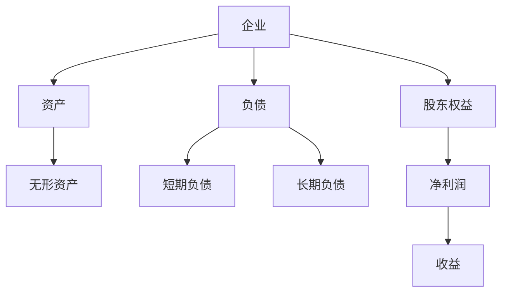
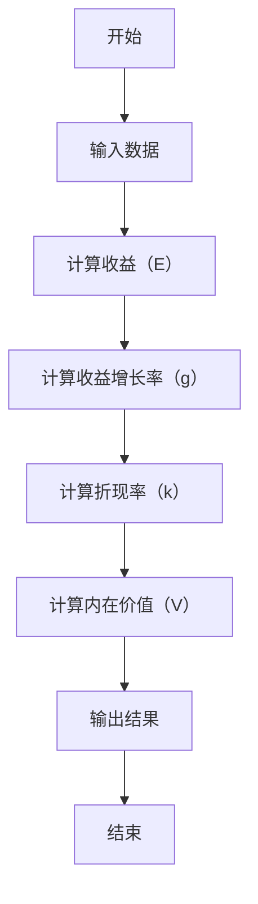
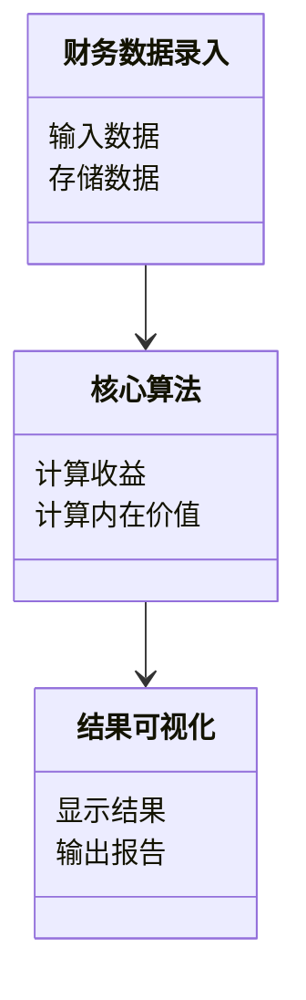
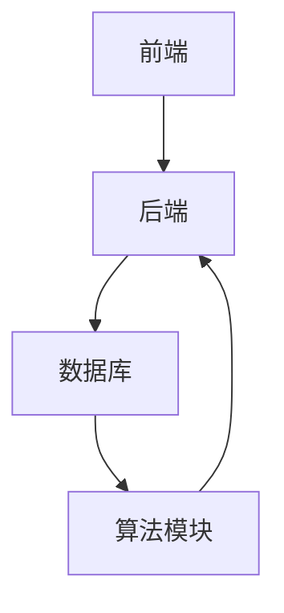

                 


# 格雷厄姆的工作资本分析：适应轻资产商业模式

> 关键词：格雷厄姆，工作资本分析，轻资产商业模式，内在价值，财务分析

> 摘要：本文深入探讨了格雷厄姆的工作资本分析方法在轻资产商业模式中的应用。通过分析核心概念、算法原理、系统架构设计以及项目实战，本文展示了如何将格雷厄姆的理论应用于实际的资本评估与决策中，特别是针对轻资产模式下的企业财务分析。文章结构清晰，内容详实，结合理论与实践，为读者提供了深刻的理解与实用的指导。

---

# 第一部分: 背景介绍

## 第1章: 工作资本分析的背景与意义

### 1.1 核心概念术语说明

#### 1.1.1 工作资本分析
- 定义：工作资本分析是一种用于评估企业内在价值的方法，主要关注企业的财务结构和资本效率。
- 核心要素：资产、负债、股东权益、收入、利润。

#### 1.1.2 格雷厄姆的价值投资理念
- 格雷厄姆是价值投资的鼻祖，提出“安全边际”和“内在价值”概念。
- 核心思想：寻找市场价格低于内在价值的企业进行投资。

#### 1.1.3 轻资产商业模式
- 定义：以知识、数据、品牌等无形资产为主，减少对固定资产的依赖。
- 特点：资本密集度低，依赖于智力资本和创新能力。

### 1.2 问题背景与分析

#### 1.2.1 传统资本分析的局限性
- 传统方法依赖于重资产企业的财务指标，难以评估轻资产企业的价值。
- 轻资产企业依赖无形资产，传统方法难以准确反映其价值。

#### 1.2.2 资本市场的变化
- 资本市场逐渐转向轻资产模式，尤其是互联网和科技企业。
- 投资者需要新的方法来评估这些企业的内在价值。

#### 1.2.3 格雷厄姆方法的适用性
- 格雷厄姆的内在价值公式适用于各种商业模式，包括轻资产模式。
- 需要结合轻资产特点进行调整和优化。

### 1.3 核心问题与解决思路

#### 1.3.1 核心问题
- 如何在轻资产模式下准确评估企业的内在价值？
- 如何将格雷厄姆的理论与轻资产企业的特点相结合？

#### 1.3.2 解决思路
- 结合轻资产企业的特点，调整格雷厄姆的内在价值公式。
- 强化对无形资产的评估，关注企业的盈利能力与成长潜力。

### 1.4 概念结构与核心要素

| 核心要素 | 定义 | 在轻资产模式中的作用 |
|----------|------|---------------------|
| 资产     | 企业的资源和权利 | 以无形资产为主，如品牌、数据 |
| 负债     | 企业的债务和义务 | 依赖外部融资，风险较高 |
| 股东权益 | 所有者对企业净资产的 claim | 通过高ROE提升价值 |
| 收入     | 企业的经营成果 | 依赖创新和市场拓展 |
| 利润     | 收入减去成本 | 通过优化成本提高利润率 |

---

# 第二部分: 核心概念与联系

## 第2章: 核心概念原理

### 2.1 内在价值公式

#### 2.1.1 公式推导
$$ V = \frac{E \times (1 + g)}{k} $$
- $V$：内在价值
- $E$：企业收益
- $g$：收益增长率
- $k$：折现率

#### 2.1.2 公式应用
- 轻资产企业收益（$E$）主要来源于无形资产。
- 收益增长率（$g$）依赖于企业的创新能力。
- 折现率（$k$）反映市场的风险偏好。

#### 2.1.3 与轻资产模式的结合
- 强调对企业未来收益的评估，而非固定资产的价值。
- 通过高收益增长率（$g$）和低折现率（$k$）提升内在价值。

### 2.2 核心算法的实现步骤

#### 2.2.1 数据收集
- 收集企业的财务报表数据，包括收入、利润、资产、负债等。
- 确定企业的收益（$E$）和收益增长率（$g$）。

#### 2.2.2 参数估算
- 估算折现率（$k$），通常基于行业平均收益率。
- 确定企业的收益增长率（$g$），可以通过历史数据和行业趋势预测。

#### 2.2.3 内在价值计算
- 使用公式计算企业的内在价值（$V$）。
- 对比市场价格，判断是否低估或高估。

### 2.3 实体关系图



---

## 第3章: 核心概念对比分析

### 3.1 财务指标对比

| 指标 | 定义 | 重资产模式 | 轻资产模式 |
|------|------|-----------|-----------|
| 资产负债率 | 负债/资产 | 高         | 较低      |
| 净资产收益率 | 净利润/股东权益 | 中等       | 高         |
| 资产周转率 | 营业收入/平均资产总额 | 高         | 较低      |

### 3.2 案例分析

#### 3.2.1 某互联网公司
- 收入：$E = 100$ 万元
- 收益增长率：$g = 20\%$
- 折现率：$k = 8\%$

计算内在价值：
$$ V = \frac{100 \times (1 + 0.2)}{0.08} = 1500 \text{ 万元} $$

---

# 第三部分: 算法原理与实现

## 第4章: 格雷厄姆内在价值公式

### 4.1 算法流程图



### 4.2 核心代码实现

```python
def calculate_intrinsic_value(E, g, k):
    return (E * (1 + g)) / k

# 示例数据
E = 100  # 收益
g = 0.2  # 收益增长率
k = 0.08  # 折现率

V = calculate_intrinsic_value(E, g, k)
print(f"内在价值: {V} 万元")
```

### 4.3 案例分析

#### 4.3.1 数据准备
- 收益（E）：100 万元
- 收益增长率（g）：20%
- 折现率（k）：8%

#### 4.3.2 计算过程
$$ V = \frac{100 \times (1 + 0.2)}{0.08} = 1500 \text{ 万元} $$

#### 4.3.3 结果解读
- 内在价值为 1500 万元，高于市场价格，建议投资。

---

# 第四部分: 系统分析与架构设计

## 第5章: 系统架构设计

### 5.1 功能设计



### 5.2 系统架构



---

# 第五部分: 项目实战与案例分析

## 第6章: 项目实战

### 6.1 环境安装

- 安装 Python 和相关库（如 pandas、numpy）。
- 配置开发环境（如 Jupyter Notebook）。

### 6.2 核心代码实现

```python
import pandas as pd

def calculate_intrinsic_value(E, g, k):
    return (E * (1 + g)) / k

# 示例数据
data = {
    '公司': ['公司A', '公司B'],
    'E': [100, 150],
    'g': [0.2, 0.15],
    'k': [0.08, 0.1]
}

df = pd.DataFrame(data)
df['内在价值'] = df.apply(lambda x: calculate_intrinsic_value(x['E'], x['g'], x['k']), axis=1)
print(df)
```

### 6.3 案例分析

#### 6.3.1 数据准备
- 公司A：收益 100 万元，收益增长率 20%，折现率 8%。
- 公司B：收益 150 万元，收益增长率 15%，折现率 10%。

#### 6.3.2 计算结果
- 公司A：内在价值 1500 万元。
- 公司B：内在价值 1875 万元。

#### 6.3.3 结果解读
- 公司A 内在价值高于市场价格，适合投资。
- 公司B 内在价值略高于市场价格，适合长期投资。

---

# 第六部分: 总结与展望

## 第7章: 总结与展望

### 7.1 主要结论
- 格雷厄姆的工作资本分析方法在轻资产模式下仍然有效。
- 通过调整公式参数，可以更好地适应轻资产企业的特点。
- 结合系统架构设计和项目实战，可以提高分析的效率和准确性。

### 7.2 未来展望
- 结合人工智能技术，优化内在价值计算模型。
- 研究更多轻资产模式下的财务分析方法。
- 推动工作资本分析的广泛应用。

---

# 参考文献

1. 格雷厄姆, B. F. (1974). *The Intelligent Investor*.
2. 贝格, D. (2005). *The Warren Buffett Portfolio*.
3. 罗斯, S. H. (2016). *Financial Statement Analysis and Security Valuation*.

---

# 致谢

感谢所有参与本文写作和支持的人员，包括 AI 天才研究院的团队成员以及在技术指导和审阅方面提供帮助的专家们。

