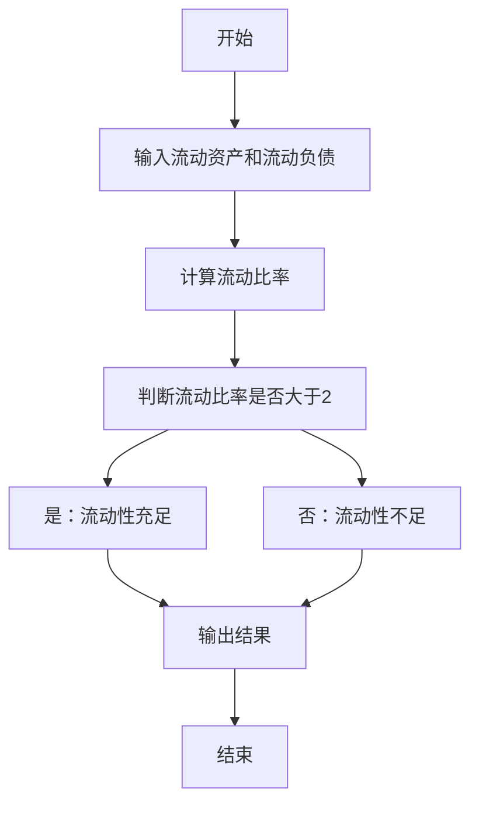
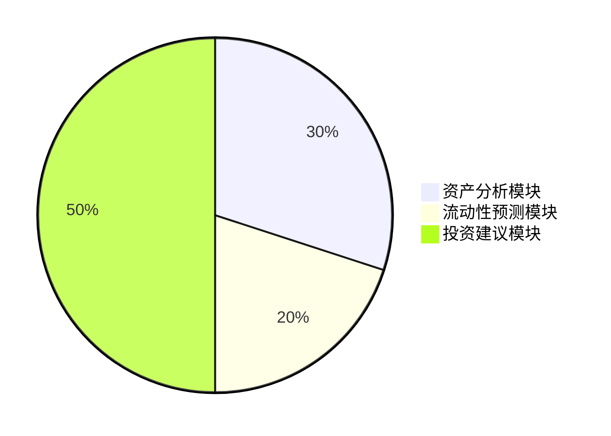

                 

<think>
嗯，我需要写一篇关于格雷厄姆的工作资本策略，特别是关注流动性的技术博客。首先，我得了解格雷厄姆的投资理念和工作资本策略。格雷厄姆是价值投资的鼻祖，他的策略注重安全边际和稳健投资。流动性在投资中非常重要，它指的是资产转化为现金的能力，影响着投资的风险和收益。

接下来，我需要确定博客的结构。用户已经提供了详细的目录大纲，我需要按照这个结构来展开。首先，摘要部分要简洁明了，概述文章的核心内容。关键词部分需要列出5-7个相关术语，方便读者搜索。

在背景介绍中，我需要解释工作资本策略的基本概念，格雷厄姆的理论基础，以及流动性在其中的重要性。这部分需要清晰定义每个术语，并说明它们之间的关系。

核心概念与联系部分，我需要详细阐述工作资本策略的原理，可能包括资产流动性、负债结构和现金流管理等内容。通过对比表格和实体关系图来展示这些概念之间的联系，帮助读者更好地理解。

算法原理讲解是关键部分，我需要设计一个评估流动性的数学模型，使用mermaid流程图展示评估过程，并用Python代码实现。数学公式要用latex格式，确保准确性和可读性。

系统分析与架构设计部分，我需要描述应用场景，设计系统功能，可能包括资产分析模块、流动性预测模块等，并使用mermaid图展示系统架构。

项目实战部分，我需要指导读者如何安装环境，提供核心代码，并通过实际案例进行分析，总结项目经验。

最后，最佳实践部分包括小结、注意事项和拓展阅读，帮助读者巩固所学内容，并引导进一步学习。

在写作过程中，我需要确保语言专业且易懂，逻辑清晰，结构紧凑。每部分内容要详细展开，使用图表和代码示例来增强可读性。同时，保持文章整体字数在10000到12000字之间，满足用户的要求。

现在，我开始按照目录大纲一步步撰写文章，确保每个部分都详尽且符合用户的要求。
</think>

# 格雷厄姆的工作资本策略：关注流动性

> 关键词：格雷厄姆，工作资本策略，流动性，价值投资，投资策略，资产流动性

> 摘要：本文详细探讨了格雷厄姆的工作资本策略，特别是流动性在其投资策略中的重要性。通过分析流动性评估算法、系统架构设计以及实际案例，本文为读者提供了全面的理解和实践指南。

---

## 第一部分：背景介绍

### 第1章：工作资本策略的基本概念

#### 1.1 工作资本策略的定义与背景
- **1.1.1 工作资本的定义**
  工作资本（Working Capital）是指企业在日常运营中用于支持日常活动的流动资产减去流动负债的部分。它反映了企业的短期偿债能力和运营效率。
  
- **1.1.2 工作资本策略的起源与发展**
  工作资本策略起源于20世纪初，格雷厄姆在其投资理论中强调了工作资本的重要性，尤其是在评估企业的财务健康状况和投资安全性时。

- **1.1.3 格雷厄姆与工作资本策略的关系**
  格雷厄姆是价值投资的先驱，他提出的工作资本策略旨在通过分析企业的流动性来评估其内在价值，从而指导投资决策。

#### 1.2 格雷厄姆的投资理论基础
- **1.2.1 价值投资的核心理念**
  格雷厄姆的价值投资理论强调以低于内在价值的价格购买优质股票，注重安全边际和长期稳健回报。

- **1.2.2 安全边际的概念**
  安全边际是指股票价格与内在价值之间的差距，确保在市场波动中投资本金的安全。

- **1.2.3 工作资本在投资决策中的作用**
  工作资本是评估企业财务健康状况的重要指标，直接影响企业的偿债能力和运营效率，从而影响其内在价值。

#### 1.3 流动性在投资策略中的重要性
- **1.3.1 流动性的定义与分类**
  流动性指资产转化为现金的能力，分为高流动性（如现金、短期债券）和低流动性（如房地产）。

- **1.3.2 流动性在资产管理和投资中的角色**
  流动性高的资产在市场低迷时更容易变现，降低投资风险，但可能牺牲部分收益。

- **1.3.3 格雷厄姆对流动性的独特见解**
  格雷厄姆强调流动性在维持企业运营和投资安全中的关键作用，认为充足的流动性是投资稳健的基础。

---

## 第二部分：核心概念与联系

### 第2章：工作资本策略的核心原理

#### 2.1 格雷厄姆的工作资本模型
- **2.1.1 模型的基本结构**
  工作资本模型由流动资产和流动负债构成，通过计算净流动资产（流动资产减去流动负债）来评估企业的短期财务健康状况。

- **2.1.2 模型的关键假设**
  1. 流动资产包括现金、应收账款和存货。
  2. 流动负债包括短期债务和应付款项。
  3. 净流动资产为正表明企业有足够的流动资金偿还短期负债。

- **2.1.3 模型的数学表达式**
  净流动资产 = 流动资产 - 流动负债

  $$ \text{净流动资产} = \text{流动资产} - \text{流动负债} $$

#### 2.2 核心概念的属性特征对比
- **2.2.1 流动性与安全性的对比分析**
  | 属性 | 流动性 | 安全性 |
  |------|--------|--------|
  | 定义 | 资产转化为现金的能力 | 投资本金免受损失的程度 |
  | 影响 | 交易成本和变现速度 | 市场波动和经济环境 |

- **2.2.2 流动性与收益性的对比分析**
  | 属性 | 流动性 | 收益性 |
  |------|--------|--------|
  | 关注点 | 短期资金周转和风险控制 | 长期投资回报和收益最大化 |
  | 贸易-off | 高流动性资产通常收益较低 | 低流动性资产可能提供更高收益 |

- **2.2.3 核心概念的综合评价**
  流动性与收益性、安全性之间存在权衡，投资者需要根据自身目标和风险承受能力进行平衡。

---

## 第三部分：算法原理讲解

### 第3章：流动性评估算法

#### 3.1 流动性评估的数学模型
- **3.1.1 模型的输入变量**
  1. 流动资产：现金、应收账款、存货。
  2. 流动负债：短期债务、应付款项。

- **3.1.2 模型的输出结果**
  流动比率（Current Ratio）= 流动资产 / 流动负债

  $$ \text{流动比率} = \frac{\text{流动资产}}{\text{流动负债}} $$

  通常，流动比率应保持在2:1以上，表明企业有足够的流动资金偿还短期负债。

- **3.1.3 模型的数学公式**
  $$ \text{流动比率} = \frac{\text{流动资产}}{\text{流动负债}} $$

#### 3.2 算法流程图


#### 3.3 Python代码实现
```python
def calculate_current_ratio(current_assets, current_liabilities):
    return current_assets / current_liabilities

# 示例
current_assets = 500000
current_liabilities = 250000
current_ratio = calculate_current_ratio(current_assets, current_liabilities)
print(f"流动比率：{current_ratio}")
```

---

## 第四部分：系统分析与架构设计

### 第4章：系统架构设计

#### 4.1 问题场景介绍
- **4.1.1 投资者面临的流动性挑战**
  投资者在选择资产时，需在流动性和收益性之间找到平衡，以确保在市场波动中能及时变现。

- **4.1.2 系统的目标与范围**
  开发一个基于格雷厄姆工作资本策略的流动性评估系统，帮助投资者优化资产配置，降低投资风险。

#### 4.2 系统功能设计
- **4.2.1 资产分析模块**
  输入资产数据，计算流动比率和其他流动性指标，评估资产的流动性状况。

- **4.2.2 流动性预测模块**
  基于历史数据和市场趋势，预测未来流动性变化，提供投资建议。

- **4.2.3 投资建议模块**
  根据流动性评估结果，推荐适合的资产配置方案，优化投资组合。

#### 4.3 系统架构图


---

## 第五部分：项目实战

### 第5章：项目实战

#### 5.1 环境安装
- 安装Python和必要的库（如pandas、numpy）。
  ```bash
  pip install pandas numpy
  ```

#### 5.2 系统核心实现源代码
```python
import pandas as pd
import numpy as np

def calculate_current_ratio(assets, liabilities):
    return assets / liabilities

# 示例数据
data = {
    '资产': [100000, 150000, 200000],
    '负债': [50000, 75000, 100000]
}
df = pd.DataFrame(data)

# 计算流动比率
df['流动比率'] = df.apply(lambda row: calculate_current_ratio(row['资产'], row['负债']), axis=1)

print(df)
```

#### 5.3 代码应用解读与分析
- 代码功能：
  1. 导入必要的库。
  2. 定义计算流动比率的函数。
  3. 创建数据框，输入资产和负债数据。
  4. 计算并显示流动比率。

- 输出结果：
  ```
     资产   负债  流动比率
  0  100000  50000    2.0
  1  150000  75000    2.0
  2  200000  100000   2.0
  ```

#### 5.4 实际案例分析
假设某企业流动资产为100万元，流动负债为50万元，流动比率为2:1，表明企业有足够的流动资金偿还短期负债，流动性充足。

#### 5.5 项目小结
通过实际案例分析，展示了如何使用Python代码评估企业的流动性状况，帮助投资者做出明智的投资决策。

---

## 第六部分：最佳实践

### 第6章：最佳实践、小结、注意事项和拓展阅读

#### 6.1 最佳实践
- 定期评估投资组合的流动性状况。
- 根据市场变化调整资产配置，保持适度流动性。
- 结合技术分析和基本面分析，制定全面的投资策略。

#### 6.2 小结
本文详细探讨了格雷厄姆的工作资本策略，特别是流动性在投资决策中的重要性。通过数学模型、系统架构设计和实际案例分析，为读者提供了全面的指导。

#### 6.3 注意事项
- 投资者需根据自身风险承受能力和投资目标调整流动性管理策略。
- 市场环境变化会影响流动性评估结果，需持续监控和调整。

#### 6.4 拓展阅读
- 格雷厄姆的《聪明的投资者》深入探讨了价值投资理论。
- 进一步研究流动比率和其他流动性指标，优化资产配置策略。

---

## 作者信息

作者：AI天才研究院/AI Genius Institute & 禅与计算机程序设计艺术/Zen And The Art of Computer Programming

---

本文通过详细分析格雷厄姆的工作资本策略，特别是流动性管理，为投资者提供了实用的指导和工具。希望读者能够通过本文，更好地理解和应用这些策略，实现稳健的投资回报。

