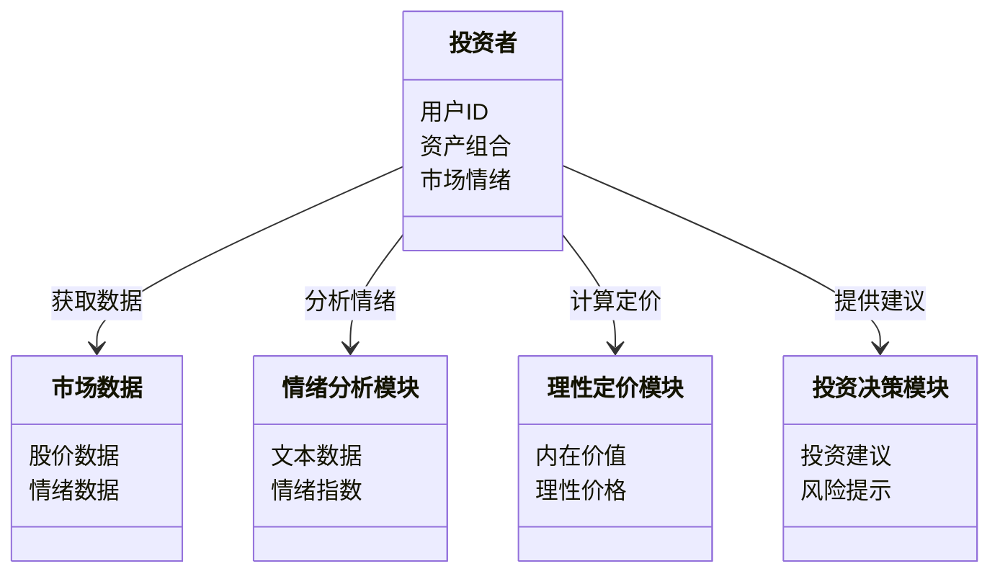
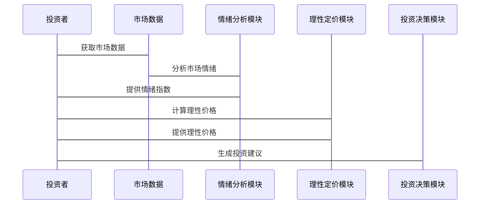

                 


```markdown
# 市场先生理论：情绪化市场中的理性

> 关键词：市场先生理论，情绪化市场，理性投资，投资者行为，市场情绪

> 摘要：本文深入探讨了格雷厄姆提出的市场先生理论，分析了市场情绪对投资决策的影响，并结合算法和系统设计，提出了一种基于市场情绪的理性投资策略。通过量化市场情绪、构建数学模型和设计系统架构，本文为投资者在情绪化市场中做出理性决策提供了理论支持和实践指导。

---

## 第一部分: 市场先生理论的背景与基础

### 第1章: 市场先生理论的背景介绍

#### 1.1 市场情绪与投资者行为

##### 1.1.1 投资者的心理偏差
投资者在市场中常受心理偏差影响，如过度自信、从众心理和损失厌恶。例如，投资者倾向于在市场上涨时过于乐观，而在市场下跌时过于悲观，这种情绪偏差导致非理性决策。

##### 1.1.2 市场情绪与市场定价的关系
市场情绪直接影响资产定价。例如，在牛市中，乐观情绪推高股价；在熊市中，恐慌情绪导致股价下跌。市场情绪的波动性与资产价格的波动性密切相关。

##### 1.1.3 格雷厄姆的市场先生理论的提出背景
格雷厄姆在20世纪提出的市场先生理论，旨在解释市场情绪对资产定价的影响。他将市场情绪抽象为一个“市场先生”，代表市场的非理性波动。

#### 1.2 市场先生模型的定义与运作机制

##### 1.2.1 市场先生模型的定义
市场先生模型将市场情绪抽象为一个虚拟人物，代表市场的非理性波动。理性投资者通过与市场先生互动，寻找定价合理的投资机会。

##### 1.2.2 市场先生与理性投资者的互动
市场先生代表市场情绪，理性投资者则基于基本面分析做出决策。两者的互动决定了资产的市场价格。

##### 1.2.3 市场先生模型的核心假设与边界
市场先生模型假设市场情绪波动是随机的，理性投资者的目标是找到定价低估的资产。模型适用于长期投资，而非短期投机。

#### 1.3 市场先生理论的核心概念

##### 1.3.1 市场情绪的周期性
市场情绪呈现周期性波动，从乐观到悲观，再从悲观到乐观，形成一个循环。

##### 1.3.2 市场定价的波动性
市场价格波动与市场情绪密切相关，情绪高涨时价格可能偏离内在价值，情绪低落时可能低于内在价值。

##### 1.3.3 市场先生模型与理性决策的关系
市场先生模型帮助投资者识别情绪化定价，理性投资者利用模型在市场低潮时买入低估资产，在市场高潮时卖出高估资产。

#### 1.4 本章小结
本章介绍了市场情绪对投资决策的影响，以及格雷厄姆提出的市场先生理论。市场先生代表市场情绪，理性投资者通过与市场先生互动，寻找定价合理的投资机会。

---

## 第二部分: 市场先生理论的核心模型与分析

### 第2章: 市场先生模型的构建与分析

#### 2.1 市场先生模型的构建

##### 2.1.1 情绪化市场的建模思路
从市场情绪入手，构建市场先生模型，量化市场情绪对资产定价的影响。

##### 2.1.2 市场先生模型的数学表达
市场先生模型的数学表达式：
$$ P = V + E $$
其中，P为市场价格，V为资产的内在价值，E为情绪化溢价。

##### 2.1.3 市场情绪的量化指标
常用的市场情绪指标包括恐慌指数（VIX）、市场波动率等。

#### 2.2 市场先生模型的核心属性

##### 2.2.1 情绪波动的周期性
市场情绪呈现周期性波动，周期长度和波动幅度因市场环境而异。

##### 2.2.2 市场定价的非理性特征
市场价格在情绪驱动下表现出非理性特征，如过度波动和定价偏差。

##### 2.2.3 理性投资者的行为模式
理性投资者通过基本面分析识别低估资产，在市场低潮时买入，市场高潮时卖出。

#### 2.3 市场先生模型的验证与评估

##### 2.3.1 模型的验证方法
通过历史数据验证模型的有效性，比较模型预测价格与实际价格的差异。

##### 2.3.2 模型的有效性评估
评估模型在不同市场环境下的表现，判断其是否能够准确反映市场情绪。

##### 2.3.3 模型的局限性分析
市场先生模型假设市场情绪波动是随机的，但在实际中可能受到其他因素影响，如宏观经济政策和公司基本面变化。

#### 2.4 本章小结
本章详细构建了市场先生模型，分析了其核心属性和验证方法。模型为投资者提供了量化市场情绪的工具，帮助他们做出理性决策。

---

## 第三部分: 市场先生理论的算法与数学模型

### 第3章: 市场情绪的量化与算法实现

#### 3.1 市场情绪的量化方法

##### 3.1.1 基于文本的情绪分析
通过自然语言处理技术分析新闻和社交媒体，量化市场情绪。例如，使用情感分析算法对文本进行打分，分数越高表示情绪越乐观。

##### 3.1.2 基于价格波动的情绪指标
利用资产价格波动率衡量市场情绪。例如，计算标准差或波动率指数。

##### 3.1.3 市场情绪的综合评估
综合文本情绪和价格波动率，构建一个综合的情绪指数。

#### 3.2 市场先生模型的算法实现

##### 3.2.1 情绪化市场的模拟算法
模拟市场情绪的波动，计算资产价格的变化。例如，使用随机游走模型模拟情绪变化。

##### 3.2.2 理性定价的计算方法
根据资产的内在价值计算理性定价，公式为：
$$ V = \frac{C}{r} $$
其中，C为现金流，r为贴现率。

##### 3.2.3 市场先生模型的优化算法
通过调整模型参数，如情绪波动幅度和理性定价权重，优化模型的预测能力。

#### 3.3 市场先生模型的数学模型

##### 3.3.1 市场情绪的数学表达
市场情绪的数学模型：
$$ E(t) = \alpha E(t-1) + \beta \epsilon $$
其中，E(t)为当前市场情绪，E(t-1)为前一期市场情绪，α为自回归系数，β为随机扰动项的系数，ε为随机扰动项。

##### 3.3.2 理性定价的数学公式
理性定价的数学公式：
$$ V = \sum_{t=1}^{n} \frac{C_t}{(1 + r)^t} $$
其中，C_t为第t期的现金流，r为贴现率。

##### 3.3.3 情绪化市场的动态方程
描述市场情绪动态变化的方程：
$$ P(t) = V(t) + E(t) $$

#### 3.4 本章小结
本章详细介绍了市场情绪的量化方法和算法实现，为投资者提供了量化市场情绪的工具。

---

## 第四部分: 市场先生理论的系统分析与架构设计

### 第4章: 基于市场先生理论的系统架构设计

#### 4.1 系统需求分析

##### 4.1.1 问题场景介绍
在实际投资中，投资者需要实时监控市场情绪，识别定价合理的资产。

##### 4.1.2 项目介绍
本项目旨在开发一个基于市场先生理论的投资决策支持系统，帮助投资者做出理性决策。

##### 4.1.3 系统功能设计（领域模型）



#### 4.2 系统架构设计

##### 4.2.1 系统架构设计图


##### 4.2.2 关键模块分析
- 情绪分析模块：负责分析市场情绪，生成情绪指数。
- 理性定价模块：负责计算资产的内在价值，生成理性价格。

##### 4.2.3 系统交互流程



#### 4.3 系统接口设计

##### 4.3.1 系统接口说明
- 情绪分析模块接口：提供情绪指数查询功能。
- 理性定价模块接口：提供理性价格查询功能。

##### 4.3.2 接口实现细节
- 情绪分析模块接口：通过API返回情绪指数。
- 理性定价模块接口：通过API返回理性价格。

#### 4.4 本章小结
本章详细设计了基于市场先生理论的系统架构，包括功能模块、系统交互流程和接口设计。

---

## 第五部分: 市场先生理论的项目实战与最佳实践

### 第5章: 项目实战与最佳实践

#### 5.1 项目实战

##### 5.1.1 环境安装
- 安装Python、Pandas、NumPy、Scikit-learn等工具。
- 安装文本分析工具，如NLTK或Snowball。

##### 5.1.2 系统核心实现源代码

```python
import numpy as np
import pandas as pd

# 情绪分析模块
def calculate_emotion(sentiment_scores):
    return np.mean(sentiment_scores)

# 理性定价模块
def calculate_rational_price(cash_flows, discount_rate):
    return sum(cash_flows / (1 + discount_rate)**t for t in range(len(cash_flows)))

# 市场先生模型
def market_emotion_model(price_data, cash_flows, discount_rate):
    emotion = calculate_emotion(price_data['sentiment'])
    rational_price = calculate_rational_price(cash_flows, discount_rate)
    market_price = rational_price + emotion * np.std(price_data['return'])
    return market_price
```

##### 5.1.3 代码应用解读与分析
上述代码实现了情绪分析和理性定价的计算，结合市场情绪波动计算市场价格。

##### 5.1.4 实际案例分析
以某股票为例，分析其市场价格与理性价格的差异，判断其是否被市场先生情绪影响。

#### 5.2 最佳实践

##### 5.2.1 实践技巧
- 定期监控市场情绪，识别定价偏差。
- 结合基本面分析，验证市场先生模型的有效性。

##### 5.2.2 注意事项
- 市场先生模型假设市场情绪波动是随机的，实际中可能受到其他因素影响。
- 投资者应结合市场环境，灵活调整投资策略。

##### 5.2.3 拓展阅读
- 格雷厄姆的《证券分析》
- 现代投资组合理论

#### 5.3 本章小结
本章通过项目实战展示了市场先生理论的应用，并提出了最佳实践建议，帮助投资者在实际操作中更好地应用该理论。

---

## 附录

### 附录A: 市场先生模型的数学推导

详细推导市场先生模型的数学公式，包括情绪指数的计算和理性定价的验证。

### 附录B: 系统实现的详细代码

提供系统实现的完整代码，包括各个模块的具体实现细节。

---

## 参考文献

1. 格雷厄姆，B. (1949). 《证券分析》。
2. 弗伦克尔，R. (2015). 《投资学基础》。
3. 理查德，D. (2018). 《行为金融学》。

---

## 结语

市场先生理论为投资者提供了理解情绪化市场的重要工具。通过量化市场情绪、构建数学模型和设计系统架构，投资者可以在情绪化市场中做出更理性的决策。本文结合理论与实践，为投资者提供了实用的指导。

---

## 作者信息

作者：AI天才研究院/AI Genius Institute & 禅与计算机程序设计艺术 /Zen And The Art of Computer Programming
```

