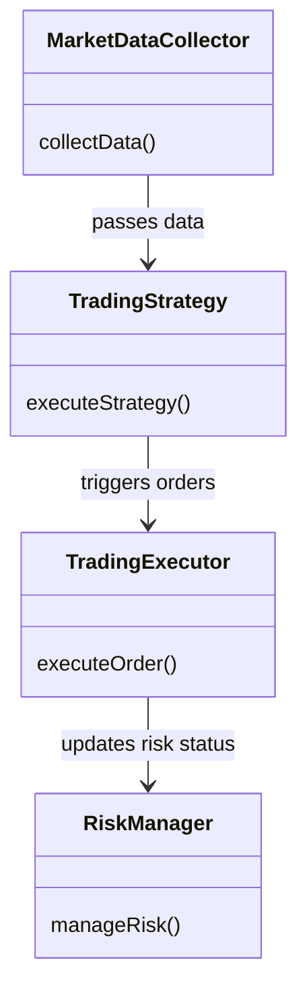
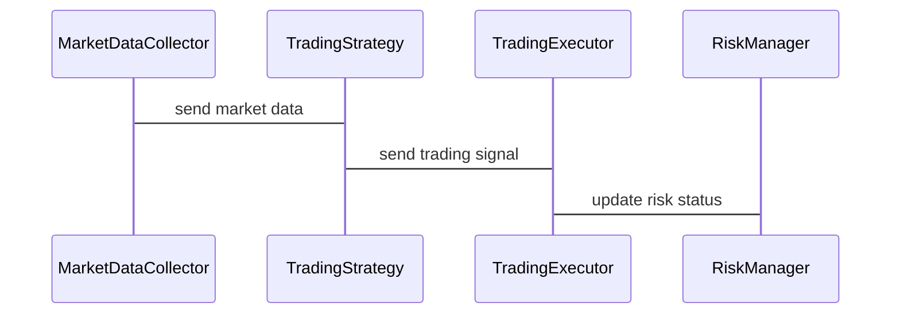

                 


# 格雷厄姆的市场先生理论：高频交易时代的反思

## 关键词
- 市场先生理论
- 高频交易
- 市场情绪
- 波动性分析
- 统计套利
- 机器学习

## 摘要
本文系统地探讨了格雷厄姆的市场先生理论在高频交易时代的应用与反思。通过分析市场情绪、波动性与高频交易策略之间的关系，揭示了市场先生理论在现代金融环境中的演变与挑战。文章结合理论与实践，从算法设计、系统架构到项目实现，全面解析了市场先生理论在高频交易中的应用，并提出了相应的优化建议。

---

## 第1章: 市场先生理论的背景与高频交易的兴起

### 1.1 市场先生理论的起源与核心思想

#### 1.1.1 格雷厄姆与市场先生理论的提出
- **格雷厄姆的背景**：本杰明·格雷厄姆是价值投资理论的先驱，提出了市场先生理论，认为市场价格围绕内在价值波动。
- **市场先生的定义**：市场先生是市场的化身，代表市场情绪的变化，推动价格波动。
- **市场先生理论的核心**：市场情绪是价格波动的主要驱动力，投资者应关注长期价值而非短期波动。

#### 1.1.2 市场先生理论的核心概念
- **市场情绪**：投资者情绪的变化影响市场价格，市场先生通过情绪波动推动价格波动。
- **价格波动**：价格围绕内在价值上下波动，市场先生的情绪变化是波动的核心驱动力。
- **内在价值**：资产的真正价值，与市场波动无关，是长期投资的基础。

#### 1.1.3 市场先生理论的现代应用
- **现代市场环境**：市场先生理论在现代金融中的应用，特别是在高频交易中的应用。
- **市场情绪的影响**：市场情绪如何影响高频交易策略和市场波动。
- **理论的演变**：市场先生理论在高频交易时代的发展与变化。

### 1.2 高频交易的定义与发展

#### 1.2.1 高频交易的基本定义
- **高频交易**：利用高速计算机和算法在极短时间内进行大量交易，捕捉市场机会。
- **高频交易的特点**：速度快、交易频率高、依赖算法。
- **高频交易的技术基础**：高速网络、低延迟硬件、高效的算法。

#### 1.2.2 高频交易的技术基础
- **技术要求**：高速网络、低延迟服务器、高频交易算法。
- **高频交易的优势**：快速反应、捕捉微小价格差异。
- **高频交易的风险**：市场波动加剧、潜在的系统性风险。

#### 1.2.3 高频交易的市场影响
- **市场流动性**：高频交易提高了市场流动性。
- **价格波动**：高频交易可能导致价格波动加剧。
- **市场结构变化**：高频交易改变了市场结构，推动了交易技术的发展。

### 1.3 市场先生理论与高频交易的结合

#### 1.3.1 市场先生理论在高频交易中的应用
- **市场情绪分析**：高频交易中，市场情绪分析是关键，市场先生理论提供了理论基础。
- **价格波动预测**：利用市场先生理论预测价格波动，优化交易策略。
- **算法设计**：市场先生理论影响高频交易算法的设计，如统计套利和机器学习模型。

#### 1.3.2 高频交易对市场先生理论的挑战
- **数据量增加**：高频交易产生的大量数据对市场先生理论的分析提出了更高要求。
- **算法复杂性**：高频交易算法的复杂性使得市场先生理论的应用更加困难。
- **市场结构变化**：高频交易改变了市场结构，影响了市场先生理论的有效性。

#### 1.3.3 两者的结合对现代金融的影响
- **市场效率提升**：市场先生理论与高频交易结合，提高了市场效率。
- **市场风险增加**：高频交易可能导致市场波动加剧，增加市场风险。
- **理论与实践的融合**：市场先生理论在高频交易中的应用推动了金融理论与实践的融合。

---

## 第2章: 市场先生理论的核心概念与高频交易的关系

### 2.1 市场情绪模型的构建

#### 2.1.1 市场情绪的定义与分类
- **市场情绪**：投资者情绪的总和，影响市场价格波动。
- **情绪分类**：乐观、悲观、中性等。
- **情绪指标**：如恐慌指数、市场情绪指数等。

#### 2.1.2 市场情绪与价格波动的关系
- **情绪驱动价格**：市场情绪是价格波动的主要驱动力。
- **情绪周期**：市场情绪呈现周期性变化，影响价格波动。
- **情绪与波动性**：市场情绪越极端，波动性越大。

#### 2.1.3 市场情绪的量化方法
- **情绪量化指标**：如VIX指数、市场情绪指数等。
- **情绪分析技术**：如自然语言处理、情感分析等。
- **情绪预测模型**：如时间序列分析、机器学习模型。

### 2.2 高频交易中的市场情绪分析

#### 2.2.1 高频交易中的情绪识别
- **实时情绪识别**：高频交易需要实时分析市场情绪。
- **情绪识别技术**：如新闻分析、社交媒体情绪分析。
- **情绪数据来源**：新闻、社交媒体、交易数据等。

#### 2.2.2 情绪分析对高频交易策略的影响
- **策略优化**：情绪分析优化交易策略，提高收益。
- **风险管理**：情绪分析帮助识别市场风险，避免重大损失。
- **交易信号**：情绪分析生成交易信号，指导高频交易。

#### 2.2.3 情绪分析的实现方法
- **数据收集**：收集市场情绪数据，如新闻、社交媒体等。
- **数据处理**：清洗数据，提取情绪特征。
- **模型训练**：训练情绪分析模型，如LSTM、随机森林等。
- **结果应用**：将情绪分析结果应用于交易策略。

### 2.3 市场先生理论与高频交易的对比分析

#### 2.3.1 市场先生理论的核心要素
- **市场情绪**：情绪是价格波动的核心驱动力。
- **价格波动**：价格围绕内在价值波动。
- **内在价值**：资产的真正价值，不受情绪影响。

#### 2.3.2 高频交易的核心要素
- **高速交易**：高频交易依赖高速计算机和算法。
- **算法策略**：高频交易依赖复杂的算法策略。
- **数据驱动**：高频交易依赖大量数据进行分析。

#### 2.3.3 两者的异同点对比
- **相同点**：两者都关注市场情绪和价格波动。
- **不同点**：市场先生理论是宏观理论，高频交易是微观技术。

---

## 第3章: 高频交易中的市场波动性分析

### 3.1 市场波动性的定义与测量

#### 3.1.1 波动性的定义
- **波动性**：市场价格的变动程度，反映市场的不稳定程度。
- **波动性指标**：如标准差、波动率等。

#### 3.1.2 波动性的测量方法
- **统计方法**：计算标准差、波动率等。
- **模型方法**：使用GARCH模型等。

#### 3.1.3 波动性与市场风险的关系
- **波动性越大，风险越高**：波动性是市场风险的重要指标。
- **波动性与收益的关系**：高波动性可能带来高收益。

### 3.2 高频交易对市场波动性的放大效应

#### 3.2.1 高频交易对市场波动性的贡献
- **高频交易加剧波动**：高频交易可能导致价格短期剧烈波动。
- **高频交易的影响**：高频交易通过算法交易放大市场波动。

#### 3.2.2 波动性放大效应的机制
- **算法交易**：高频交易算法可能导致价格的快速波动。
- **反馈循环**：市场波动引发更多交易，进一步加剧波动。

#### 3.2.3 波动性放大效应的案例分析
- **2010年闪电崩盘**：高频交易导致的市场崩盘事件。
- **其他案例**：如2021年GameStop事件。

### 3.3 市场先生理论对波动性分析的启示

#### 3.3.1 市场先生理论对波动性的解释
- **情绪驱动波动**：市场情绪是波动的主要驱动力。
- **内在价值与波动**：波动围绕内在价值展开。

#### 3.3.2 高频交易对市场先生理论的验证
- **高频交易中的波动性**：高频交易验证了市场先生理论的波动性预测。
- **市场情绪与波动性**：高频交易中的市场情绪与波动性密切相关。

#### 3.3.3 波动性分析的未来发展方向
- **更复杂的情绪模型**：发展更复杂的市场情绪模型，提高波动性预测的准确性。
- **结合高频数据分析**：结合高频数据分析，优化波动性分析模型。
- **风险管理**：利用波动性分析优化风险管理策略。

---

## 第4章: 市场先生理论在高频交易中的算法实

#### 4.1 统计套利算法的设计与实现

##### 4.1.1 统计套利的基本原理
- **统计套利**：利用资产价格的统计特性进行套利。
- **均值回归模型**：假设价格会回归均值。

##### 4.1.2 统计套利的实现步骤
- **数据收集**：收集相关资产的价格数据。
- **计算价差**：计算资产之间的价差。
- **建立模型**：建立均值回归模型，预测价差回归均值。
- **执行交易**：根据模型预测，执行套利交易。

##### 4.1.3 统计套利的优缺点
- **优点**：收益稳定，风险可控。
- **缺点**：需要大量数据，计算复杂。

##### 4.1.4 统计套利的代码实现
```python
import pandas as pd
import numpy as np

# 数据收集
data = pd.read_csv('prices.csv')

# 计算价差
spread = data['Asset1'] - data['Asset2']

# 建立均值回归模型
mean = spread.mean()
std = spread.std()

# 预测价差回归均值
spread_forecast = mean + (spread - mean) * 0.5

# 执行交易
# 如果预测价差低于均值，买入Asset1，卖出Asset2
# 如果预测价差高于均值，卖出Asset1，买入Asset2
```

##### 4.1.5 统计套利的数学模型
$$ \text{价差} = \text{均值} + \text{标准差} \times \text{随机变量} $$

#### 4.2 机器学习模型在高频交易中的应用

##### 4.2.1 机器学习模型的基本原理
- **机器学习**：通过训练数据，建立预测模型。
- **高频交易中的应用**：预测价格走势，生成交易信号。

##### 4.2.2 机器学习模型的实现步骤
- **数据收集**：收集历史价格数据。
- **数据预处理**：清洗数据，提取特征。
- **模型训练**：训练机器学习模型，如LSTM、随机森林等。
- **模型预测**：根据模型预测价格走势。
- **执行交易**：根据预测结果，执行交易。

##### 4.2.3 机器学习模型的优缺点
- **优点**：能够捕捉复杂的价格模式，适应性强。
- **缺点**：计算复杂，需要大量数据，模型可能过拟合。

##### 4.2.4 机器学习模型的代码实现
```python
import tensorflow as tf
from tensorflow.keras.layers import LSTM, Dense

# 数据收集
data = pd.read_csv('prices.csv')

# 数据预处理
features = data[['Open', 'High', 'Low', 'Close']]
labels = data['Next_Close']

# 模型训练
model = tf.keras.Sequential()
model.add(LSTM(64, input_shape=(4, 1)))
model.add(Dense(1))
model.compile(optimizer='adam', loss='mse')

model.fit(features, labels, epochs=100, batch_size=32)
```

##### 4.2.5 机器学习模型的数学模型
$$ \text{预测价格} = \text{模型}(历史价格) $$

---

## 第5章: 高频交易系统的架构设计与实现

### 5.1 系统功能设计

#### 5.1.1 系统功能模块
- **数据采集模块**：收集市场数据。
- **算法模块**：执行交易策略。
- **执行模块**：执行交易指令。
- **风险管理模块**：监控和管理风险。

#### 5.1.2 系统功能设计的mermaid类图


#### 5.1.3 系统功能设计的mermaid序列图


### 5.2 系统架构设计

#### 5.2.1 系统架构的mermaid架构图


#### 5.2.2 系统架构设计的详细描述
- **数据流**：市场数据从数据采集模块流向交易策略模块。
- **交易信号**：交易策略模块生成交易信号，发送到交易执行模块。
- **风险管理**：交易执行模块更新风险管理模块的状态。

### 5.3 系统接口设计

#### 5.3.1 系统接口的定义
- **数据接口**：数据采集模块与交易策略模块之间的接口。
- **交易接口**：交易策略模块与交易执行模块之间的接口。
- **风险管理接口**：交易执行模块与风险管理模块之间的接口。

#### 5.3.2 接口设计的详细描述
- **数据接口**：数据采集模块提供市场数据，交易策略模块接收数据。
- **交易接口**：交易策略模块发送交易信号，交易执行模块接收信号。
- **风险管理接口**：交易执行模块更新风险管理模块的状态。

### 5.4 系统实现与优化

#### 5.4.1 系统实现的详细步骤
- **数据采集**：收集市场数据，如价格、成交量等。
- **算法设计**：设计交易策略，如统计套利、机器学习模型等。
- **交易执行**：根据策略执行交易指令。
- **风险管理**：监控和管理交易风险。

#### 5.4.2 系统优化的建议
- **优化数据采集**：使用更高效的数据采集方法，减少延迟。
- **优化算法**：改进算法，提高交易速度和准确性。
- **优化风险管理**：开发更先进的风险管理模型，降低风险。

---

## 第6章: 市场先生理论与高频交易的反思与优化

### 6.1 市场先生理论在高频交易中的反思

#### 6.1.1 市场先生理论的局限性
- **情绪模型的简化**：市场先生理论对市场情绪的简化可能无法捕捉复杂的市场动态。
- **高频交易的复杂性**：高频交易的算法复杂性使得市场先生理论的应用受到限制。
- **数据驱动的挑战**：高频交易依赖大量数据，市场先生理论的分析需要更多的数据支持。

#### 6.1.2 高频交易对市场先生理论的挑战
- **数据量增加**：高频交易产生的大量数据对市场先生理论的分析提出了更高要求。
- **算法复杂性**：高频交易算法的复杂性使得市场先生理论的应用更加困难。
- **市场结构变化**：高频交易改变了市场结构，影响了市场先生理论的有效性。

### 6.2 市场先生理论的优化与改进

#### 6.2.1 市场情绪模型的优化
- **复杂的情绪模型**：开发更复杂的市场情绪模型，提高预测准确性。
- **结合高频数据**：结合高频数据分析，优化市场情绪模型。
- **动态调整模型**：根据市场变化动态调整情绪模型。

#### 6.2.2 高频交易策略的优化
- **优化算法**：改进高频交易算法，提高交易速度和准确性。
- **风险管理**：优化风险管理策略，降低交易风险。
- **结合市场先生理论**：将市场先生理论与高频交易策略相结合，提高收益。

#### 6.2.3 市场先生理论与高频交易的结合
- **理论与实践结合**：将市场先生理论与高频交易策略相结合，优化交易结果。
- **动态调整策略**：根据市场情绪变化动态调整交易策略。
- **持续优化**：根据市场变化持续优化市场先生理论的应用。

---

## 第7章: 总结与展望

### 7.1 本文总结
- **主要结论**：市场先生理论在高频交易中的应用与挑战，优化建议。

### 7.2 对未来研究的展望
- **市场情绪模型的改进**：开发更复杂的市场情绪模型，提高预测准确性。
- **高频交易算法的优化**：改进高频交易算法，提高交易速度和准确性。
- **市场结构的变化**：研究市场结构的变化对市场先生理论的影响。

---

## 参考文献
（此处列出相关参考文献，如书籍、论文等。）

---

## 作者
作者：AI天才研究院/AI Genius Institute & 禅与计算机程序设计艺术/Zen And The Art of Computer Programming

---

以上是一个详细且结构清晰的目录大纲，涵盖了格雷厄姆的市场先生理论与高频交易的结合，从理论到实践，从分析到优化，全面而深入地探讨了这一主题。

