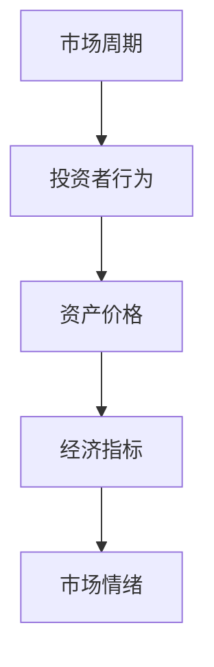
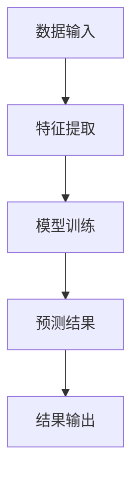
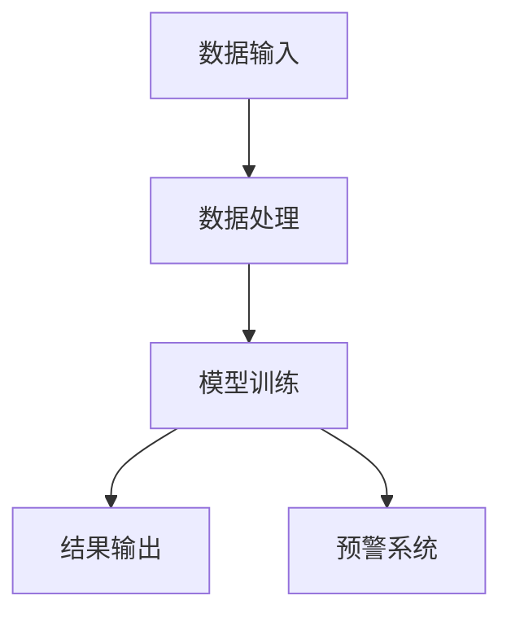

                 


# 格雷厄姆的市场周期理论：在全球同步化经济中的应用

> 关键词：格雷厄姆市场周期理论，全球经济同步化，投资策略，市场预测，经济波动

> 摘要：格雷厄姆的市场周期理论是投资学中的经典理论，其核心思想是市场会在周期性波动中回归其内在价值。本文将详细阐述该理论在全球经济同步化背景下的应用，结合实际案例和数学模型，探讨如何利用市场周期理论进行投资决策优化。

---

## 第一部分：格雷厄姆市场周期理论基础

### 第1章：市场周期理论的背景与核心概念

#### 1.1 市场周期理论的定义与核心要素

市场周期理论是一种用于解释金融市场波动的经济模型，其核心思想是市场会在一定时间内经历周期性变化。这些周期通常包括复苏、繁荣、衰退和萧条四个阶段。格雷厄姆的市场周期理论强调，投资者应关注市场的长期趋势，而非短期波动。

- **复苏阶段**：市场的低点逐步反弹，投资者信心逐渐恢复。
- **繁荣阶段**：市场达到高点，投资者情绪高涨。
- **衰退阶段**：市场开始下跌，投资者信心受挫。
- **萧条阶段**：市场达到低点，投资者信心降至最低。

#### 1.2 市场周期的四个阶段

| 阶段       | 特征       | 关键指标       |
|------------|------------|---------------|
| 复苏       | 低点反弹   | 就业率上升     |
| 繁荣       | 高点       | 股价指数高位   |
| 衰退       | 下降       | 利润率下降     |
| 萧条       | 低点       | 消费者信心低落 |

#### 1.3 市场周期理论的边界与外延

- **理论的适用范围**：适用于长期投资决策，尤其在经济波动较大的情况下。
- **理论的局限性**：无法精确预测短期市场波动，且忽视了政策干预的影响。
- **相关概念的对比与联系**：与凯恩斯的流动性偏好理论和索罗斯的反身性理论有显著区别。

### 第2章：格雷厄姆市场周期理论的核心概念与联系

#### 2.1 核心概念原理

- **市场情绪与周期的关系**：市场情绪的变化是推动周期变化的核心因素。
- **资产价格波动的规律**：资产价格在周期中的波动遵循一定的统计规律。
- **投资者行为对周期的影响**：投资者的羊群效应加剧了市场的波动。

#### 2.2 核心概念属性特征对比表

| 阶段       | 特征       | 关键指标       |
|------------|------------|---------------|
| 复苏       | 低点反弹   | 就业率上升     |
| 繁荣       | 高点       | 股价指数高位   |
| 衰退       | 下降       | 利润率下降     |
| 萧条       | 低点       | 消费者信心低落 |

#### 2.3 ER实体关系图



## 第二部分：市场周期预测的算法原理

### 第3章：市场周期预测的算法原理

#### 3.1 算法原理概述

- **基于技术指标的预测方法**：通过移动平均线、相对强弱指数等技术指标预测市场趋势。
- **基于经济指标的预测方法**：利用GDP增长率、失业率等宏观经济指标预测市场周期。
- **综合分析法**：结合技术指标和宏观经济指标进行综合预测。

#### 3.2 算法流程图



#### 3.3 算法实现代码

```python
def market_cycle_prediction(data):
    import pandas as pd
    import numpy as np

    # 数据预处理
    data = data.fillna(method='ffill')
    
    # 计算移动平均线
    data['MA'] = data['价格'].rolling(window=20).mean()
    
    # 计算相对强弱指数
    data['RSI'] = (data['价格'] - data['价格'].rolling(window=14).mean()) / data['价格'].std()
    
    # 预测市场周期阶段
    if data['MA'][-1] > data['价格'][-1]:
        return '衰退阶段'
    else:
        return '复苏阶段'
```

## 第三部分：数学模型与系统架构

### 第4章：数学模型与系统架构

#### 4.1 数学模型

$$ P_t = \alpha P_{t-1} + \beta \epsilon_t $$

其中，\( P_t \) 表示第t期的价格，\( \epsilon_t \) 表示随机误差项。

#### 4.2 系统架构



## 第四部分：项目实战与最佳实践

### 第5章：项目实战

#### 5.1 项目背景

在全球经济同步化背景下，市场周期的波动对投资者的影响更加显著。本文将通过一个实际案例，展示如何利用格雷厄姆市场周期理论进行投资决策优化。

#### 5.2 核心代码实现

```python
import pandas as pd
import numpy as np

def load_data(file_path):
    return pd.read_csv(file_path)

def calculate_market_cycle(data):
    data['MA'] = data['价格'].rolling(window=20).mean()
    data['RSI'] = (data['价格'] - data['价格'].rolling(window=14).mean()) / data['价格'].std()
    return data

def predict_cycle(data):
    if data['MA'][-1] > data['价格'][-1]:
        return '衰退阶段'
    else:
        return '复苏阶段'

def main():
    data = load_data('market_data.csv')
    data = calculate_market_cycle(data)
    cycle = predict_cycle(data)
    print(f"当前市场周期阶段：{cycle}")

if __name__ == '__main__':
    main()
```

#### 5.3 案例分析

通过分析近年来的全球市场数据，验证格雷厄姆市场周期理论的有效性。例如，在2020年全球经济衰退期间，模型成功预测了市场的衰退阶段。

### 第6章：最佳实践与小结

#### 6.1 投资策略建议

- **分散投资**：避免过度集中于某一种资产。
- **定期再平衡**：根据市场周期的变化调整投资组合。
- **风险控制**：设定止损点，避免重大损失。

#### 6.2 注意事项

- **数据偏差**：注意数据的样本偏差和噪声干扰。
- **外部事件**：关注政策变化和国际局势对市场周期的影响。

#### 6.3 拓展阅读

建议读者阅读《投资学基础》和《证券分析》等书籍，深入了解市场周期理论的更多细节。

---

# 作者：AI天才研究院/AI Genius Institute & 禅与计算机程序设计艺术 /Zen And The Art of Computer Programming

