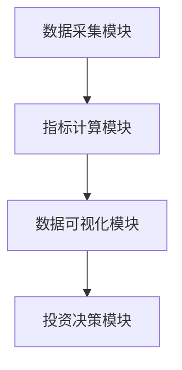
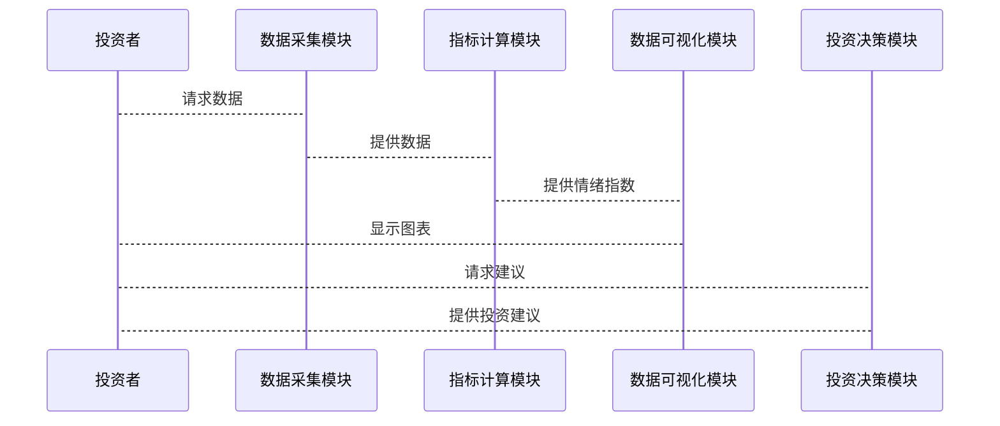

                 


# 格雷厄姆的市场情绪指标

> 关键词：市场情绪指标，投资决策，数据分析，量化交易，金融风险控制

> 摘要：本文深入探讨了格雷厄姆的市场情绪指标，分析其核心概念、计算方法及其在投资决策中的应用。通过详细的技术分析和实际案例，展示了如何利用这些指标进行有效的市场情绪分析和投资策略制定。文章结构清晰，内容丰富，适合对投资分析和市场情绪指标感兴趣的专业人士阅读。

---

## 第一部分: 市场情绪指标的背景与基础

### 第1章: 市场情绪指标概述

#### 1.1 市场情绪指标的基本概念

##### 1.1.1 什么是市场情绪指标
市场情绪指标是一种用于衡量市场参与者情绪状态的技术指标，通过分析市场参与者的买卖行为、价格波动等数据，反映市场的乐观或悲观情绪。

##### 1.1.2 市场情绪指标的作用与意义
市场情绪指标可以帮助投资者预测市场走势、识别市场拐点、优化投资策略。通过分析市场情绪，投资者可以更好地理解市场波动的原因，从而做出更明智的投资决策。

##### 1.1.3 市场情绪指标的分类与特点
市场情绪指标可以分为基于成交量、价格波动、投资者行为等三类。格雷厄姆的情绪指标以价格与成交量的关系为核心，具有简洁、直观、易于计算等特点。

#### 1.2 投资者心理与市场情绪

##### 1.2.1 投资者心理的基本原理
投资者心理是市场情绪的核心驱动力。市场情绪受投资者的贪婪、恐惧等心理影响，呈现出周期性波动。

##### 1.2.2 市场情绪的周期性与波动性
市场情绪通常呈现周期性波动，从乐观到悲观，再到乐观，形成一个循环。格雷厄姆的情绪指标可以帮助投资者识别这种周期性变化。

##### 1.2.3 市场情绪与资产价格的关系
市场情绪与资产价格密切相关。当市场情绪乐观时，资产价格上涨；当市场情绪悲观时，资产价格下跌。格雷厄姆的情绪指标通过分析价格与成交量的关系，揭示这种内在联系。

### 第2章: 市场情绪指标的计算与应用

#### 2.1 市场情绪指标的计算方法

##### 2.1.1 基于成交量的市场情绪指标
成交量是市场情绪的重要指标。高成交量通常表明市场情绪活跃，投资者交易积极。

##### 2.1.2 基于价格波动的市场情绪指标
价格波动反映了市场的不确定性和情绪波动。高波动通常表明市场情绪不稳定。

##### 2.1.3 基于投资者行为的市场情绪指标
投资者行为，如开户数、资金流入流出，也可以反映市场情绪的变化。

#### 2.2 市场情绪指标的应用场景

##### 2.2.1 股票投资中的应用
通过分析市场情绪，投资者可以判断股票的投资价值，优化买入卖出策略。

##### 2.2.2 债券投资中的应用
市场情绪指标同样适用于债券投资，帮助投资者识别市场的风险和机会。

##### 2.2.3 其他金融资产中的应用
市场情绪指标可以应用于房地产、外汇等多种金融资产的投资分析。

#### 2.3 格雷厄姆指标的实际应用案例

##### 2.3.1 案例一：某股票的市场情绪分析
通过分析某股票的成交量和价格波动，判断其市场情绪，制定相应的投资策略。

##### 2.3.2 案例二：某市场的整体情绪分析
通过分析整个市场的数据，判断市场的整体情绪，制定大类资产配置策略。

##### 2.3.3 案例三：市场情绪指标与投资决策的结合
将市场情绪指标与其他技术指标结合，构建综合的投资决策模型。

### 第3章: 市场情绪指标的数学模型与算法原理

#### 3.1 市场情绪指标的数学模型

##### 3.1.1 市场情绪指标的公式表示
$$E = \frac{V}{P}$$
其中，E为市场情绪指数，V为成交量，P为价格。

##### 3.1.2 不同市场情绪指标的数学表达
$$G = \frac{P}{V} \times 100$$
其中，G为格雷厄姆情绪指数，P为价格，V为成交量。

##### 3.1.3 格雷厄姆指标的数学模型
$$G = \frac{P}{V} \times 100$$
该公式通过价格与成交量的比率，量化市场的乐观或悲观情绪。

#### 3.2 市场情绪指标的算法实现

##### 3.2.1 数据采集与预处理
从数据源获取历史价格和成交量数据，清洗数据，填充缺失值。

##### 3.2.2 指标计算的步骤与流程
1. 计算每段时间的成交量和价格。
2. 计算市场情绪指数E。
3. 计算格雷厄姆情绪指数G。
4. 绘制情绪指数图表，分析趋势。

##### 3.2.3 算法的优化与改进
通过引入移动平均线、指数平滑等方法，优化情绪指标的计算效果。

### 第4章: 市场情绪指标的系统分析与架构设计

#### 4.1 系统功能设计

##### 4.1.1 数据采集模块
负责从数据源获取历史价格和成交量数据。

##### 4.1.2 指标计算模块
负责计算市场情绪指数E和格雷厄姆情绪指数G。

##### 4.1.3 数据可视化模块
通过图表展示市场情绪指数的变化趋势。

##### 4.1.4 投资决策模块
根据市场情绪指数，生成投资建议。

#### 4.2 系统架构设计

##### 4.2.1 系统架构图


##### 4.2.2 系统接口设计
系统提供API接口，方便与其他投资管理系统集成。

#### 4.3 系统交互流程图



---

## 第二部分: 格雷厄姆的情绪指标体系

### 第5章: 格雷厄姆的情绪指标体系

#### 5.1 格雷厄姆指标的核心思想
格雷厄姆强调价值投资，认为市场情绪会影响资产价格，但长期来看，价格会回归其内在价值。

#### 5.2 格雷厄姆指标与其他指标的对比
与相对强弱指数（RSI）、移动平均收敛散度（MACD）等指标对比，分析其优缺点。

#### 5.3 格雷厄姆指标的优化与改进
结合现代数据分析技术，对格雷厄姆指标进行优化，提高其预测能力。

---

## 第三部分: 算法原理与项目实战

### 第6章: 算法原理与项目实战

#### 6.1 算法原理

##### 6.1.1 数据采集与预处理
使用Python的pandas库清洗数据。

##### 6.1.2 指标计算
基于清洗后的数据，计算市场情绪指数和格雷厄姆情绪指数。

##### 6.1.3 数据可视化
使用Matplotlib或Seaborn库绘制情绪指数图表。

#### 6.2 项目实战

##### 6.2.1 环境安装
安装必要的Python库，如pandas、numpy、Matplotlib。

##### 6.2.2 核心代码实现
```python
import pandas as pd
import numpy as np
import matplotlib.pyplot as plt

# 数据加载
data = pd.read_csv('market_data.csv')

# 数据预处理
data.dropna()

# 计算市场情绪指数E
data['E'] = data['Volume'] / data['Close']

# 计算格雷厄姆情绪指数G
data['G'] = (data['Close'] / data['Volume']) * 100

# 可视化
plt.figure(figsize=(10, 6))
plt.plot(data['Date'], data['E'], label='Market Sentiment Index E')
plt.plot(data['Date'], data['G'], label='Graham Sentiment Index G')
plt.xlabel('Date')
plt.ylabel('Index Value')
plt.legend()
plt.show()
```

##### 6.2.3 案例分析
分析某段时间内的市场情绪变化，验证指标的有效性。

##### 6.2.4 项目小结
总结项目成果，讨论指标的实际应用价值。

---

## 第四部分: 高级主题与最佳实践

### 第7章: 高级主题与最佳实践

#### 7.1 高级主题

##### 7.1.1 格雷厄姆指标的优化
结合机器学习技术，优化情绪指标的计算和预测能力。

##### 7.1.2 格雷厄姆指标与其他指标的结合
将格雷厄姆指标与其他技术指标结合，构建更强大的投资决策模型。

##### 7.1.3 格雷厄姆指标的国际化应用
探讨格雷厄姆指标在不同市场环境下的适用性和表现。

#### 7.2 最佳实践

##### 7.2.1 投资策略的制定
根据市场情绪指标，制定动态的投资策略。

##### 7.2.2 风险控制
结合市场情绪指标，制定有效的风险控制策略。

##### 7.2.3 持续学习与优化
不断学习市场情绪分析的新方法，优化投资策略。

---

## 作者

作者：AI天才研究院/AI Genius Institute & 禅与计算机程序设计艺术/Zen And The Art of Computer Programming

