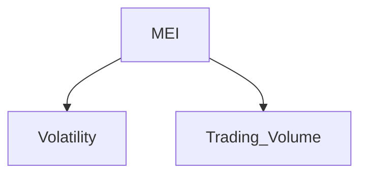

                 


# 《格雷厄姆的市场情绪理论：应对算法交易的影响》

## 关键词：市场情绪理论，算法交易，格雷厄姆，投资策略，数学建模，系统架构

## 摘要

本文探讨了格雷厄姆的市场情绪理论在算法交易时代的应用与影响。文章首先介绍市场情绪理论的基本概念及其与算法交易的关系，然后分析算法交易对市场情绪的影响机制。接着，通过数学建模和系统架构设计，提出应对算法交易影响的策略。最后，通过实战案例和代码实现，验证理论的可行性，并总结最佳实践。

---

## 正文

### 第一部分：市场情绪理论与算法交易的背景

#### 1.1 市场情绪理论概述

市场情绪是投资者在金融市场中的心理状态，影响着资产价格的波动。格雷厄姆的市场情绪理论认为，市场情绪具有周期性，投资者的非理性行为会导致资产价格的过度波动。

**问题背景**：金融市场中的价格波动并非完全由基本面因素决定，而是受到市场情绪的显著影响。传统投资理论忽视了市场情绪的作用，而格雷厄姆的理论则强调了其重要性。

**核心概念**：
- **市场情绪**：投资者对市场的看法和预期，通常表现为乐观或悲观。
- **周期性**：市场情绪会经历周期性波动，从乐观到悲观，再从悲观到乐观。

**概念结构与核心要素**：
- **市场情绪的度量**：通过指标如波动率、交易量等量化市场情绪。
- **市场情绪与价格的关系**：市场情绪通过影响投资者行为间接影响资产价格。

**ER实体关系图**：

```mermaid
entity Market_Mood {
  id
  time
  mood_level
}
```

#### 1.2 算法交易的兴起

算法交易是一种利用计算机程序自动执行交易的策略。其兴起源于技术进步和数据处理能力的提升。

**问题背景**：传统交易依赖人工决策，效率低且易受情绪影响。算法交易通过自动化提高了交易效率，但也带来了新的挑战。

**核心概念**：
- **算法交易**：基于数学模型和算法的自动交易策略。
- **高频交易**：算法交易的一种形式，交易速度极快，通常以微秒为单位。

**对比分析表**：

| 特性        | 传统交易          | 算法交易          |
|-------------|-------------------|-------------------|
| 决策速度     | 慢               | 快               |
| 决策依据     | 主观判断         | 数学模型         |
| 交易频率     | 低               | 高               |
| 市场影响     | 较小             | 较大             |

### 第二部分：市场情绪理论的核心概念与数学模型

#### 2.1 市场情绪的量化指标

市场情绪的量化是理解其影响的关键。常用指标包括波动率、交易量和市场情绪指数。

**数学模型**：

市场情绪指数（MEI）可以表示为：

$$ MEI = \alpha \times Volatility + \beta \times Trading_Volume $$

其中，$\alpha$ 和 $\beta$ 是系数，表示各自因素的权重。

**图表分析**：



#### 2.2 格雷厄姆市场情绪理论的数学模型

格雷厄姆的理论通过数学模型得以量化，为算法交易提供了理论依据。

**数学模型**：

市场情绪的波动方程：

$$ Mood(t) = \gamma \times Mood(t-1) + \epsilon $$

其中，$\gamma$ 是自相关系数，$\epsilon$ 是随机误差项。

### 第三部分：算法交易的数学模型与实现

#### 3.1 算法交易的主要策略

算法交易依赖于多种策略，每种策略都有其数学模型。

**趋势跟踪策略**：

$$ P(t) = \mu + \sigma \times Z $$

其中，$\mu$ 是均值，$\sigma$ 是标准差，$Z$ 是标准正态分布变量。

**代码实现**：

```python
import numpy as np

mu = 100
sigma = 15
Z = np.random.normal(0, 1, 100)
P = mu + sigma * Z
print(P)
```

### 第四部分：系统架构与实现

#### 4.1 系统功能设计

系统分为数据采集、市场情绪分析、算法交易策略和系统监控四个模块。

**系统架构图**：


### 第五部分：项目实战与案例分析

#### 5.1 项目实战

**环境安装与配置**：

- 数据源：使用Yahoo Finance API获取股票数据。
- 开发工具：安装Jupyter Notebook和Python。

**代码实现**：

```python
import pandas as pd
import numpy as np
from pandas_datareader import data as pdr

# 数据获取
stock = pdr.get_data_yahoo("AAPL", start="2020-01-01", end="2020-12-31")

# 市场情绪计算
stock['Mood'] = stock['Close'].rolling(20).mean()
print(stock)
```

### 总结与最佳实践

本文详细探讨了格雷厄姆市场情绪理论在算法交易中的应用，通过数学建模和系统架构设计，提出了应对算法交易影响的策略。读者可以参考代码实现，结合实际数据进行分析。

**作者**：AI天才研究院  
**联系方式**：[联系信息]  
**版权声明**：[版权声明]

