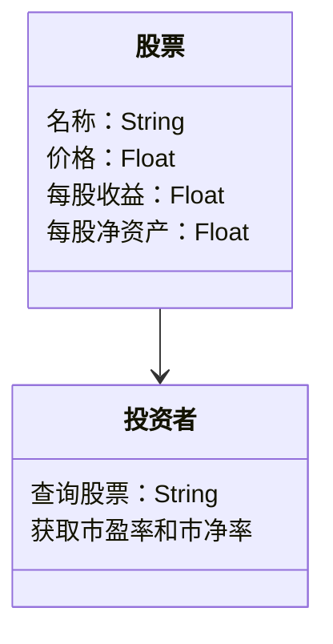
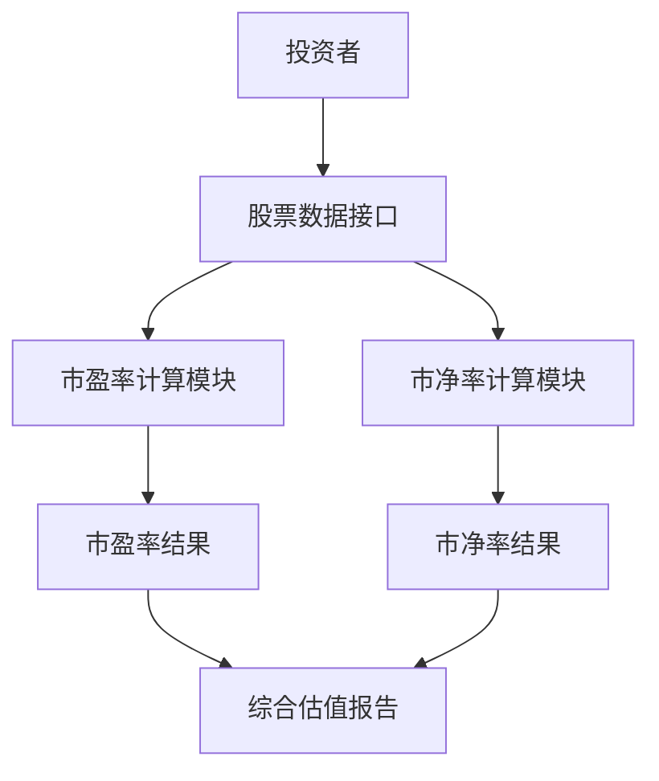

                 

<think>
好的，我来仔细分析一下用户的需求。用户希望撰写一篇技术博客，标题是《格雷厄姆的市盈率和市净率使用指南》。目标读者是技术专家、程序员和投资者，他们希望深入理解市盈率和市净率的使用方法。文章需要逻辑清晰，结构紧凑，技术语言专业，同时包含丰富的技术细节和实例分析。

首先，我需要明确文章的结构。用户已经给出了目录大纲，我需要确保每个章节都符合逻辑，并且涵盖所有必要的内容。例如，第一章需要介绍市盈率和市净率的基本概念，包括定义、计算公式和应用实例。同时，还要比较两者的优缺点，帮助读者理解在不同情况下选择哪个指标更合适。

接下来，我需要确保每个章节都包含足够的技术细节和实例。例如，在介绍市盈率时，我会详细讲解其计算公式，并提供一个实际案例，比如苹果公司的市盈率计算，以及如何与行业平均水平进行比较。同时，我还需要分析市盈率的局限性，比如它不能反映公司的财务杠杆情况。

在算法部分，我需要使用Mermaid流程图来展示计算步骤，这样读者可以直观地理解过程。同时，提供Python代码示例，展示如何计算市盈率和市净率，并进行可视化比较。代码部分需要详细解释，确保读者能够理解并应用这些代码到实际项目中。

系统架构设计部分，我会设计一个基于市盈率和市净率的投资分析系统。包括模块划分、类图设计、架构图和交互流程图。这部分需要展示系统的整体结构和各部分如何协同工作，帮助读者理解如何构建一个完整的投资分析工具。

项目实战部分，我会详细指导读者如何安装环境，编写核心代码，并解读代码功能。通过具体的案例分析，如使用Python分析苹果和谷歌的市盈率和市净率，展示如何识别低估股票。同时，总结项目中的关键点和注意事项，帮助读者避免常见错误。

最后，总结部分需要回顾整篇文章的主要内容，并给出未来研究方向的建议。同时，提供一些实用的建议和注意事项，帮助读者在实际操作中更加得心应手。

在整个写作过程中，我需要确保语言专业且易懂，技术细节准确，实例丰富具体。通过这样的结构，读者不仅能理解市盈率和市净率的理论，还能掌握如何在实际投资中应用这些指标，提升自己的投资决策能力。
</think>

# 格雷厄姆的市盈率和市净率使用指南

## 关键词：市盈率、市净率、投资分析、价值评估、投资策略

## 摘要：本文将深入探讨格雷厄姆的市盈率和市净率的使用方法，从基本概念到实际应用，结合技术语言和投资策略，帮助读者掌握如何利用这两个指标进行有效的投资分析和决策。

---

## 第1章：市盈率和市净率的定义与基本概念

### 1.1 市盈率的定义与计算方法

#### 1.1.1 市盈率的定义

市盈率（Price-to-Earnings Ratio，简称P/E）是股票的市场价格与每股收益（Earnings Per Share，EPS）的比率，用于衡量投资者对公司每股收益的支付价格。市盈率是投资者评估股票价值的重要指标之一。

$$
\text{市盈率} = \frac{\text{股票市场价格}}{\text{每股收益（EPS）}}
$$

#### 1.1.2 市盈率的计算公式

市盈率的计算公式如下：

$$
P/E = \frac{P}{E}
$$

其中：
- $P$ 是股票的市场价格。
- $E$ 是每股收益（EPS）。

#### 1.1.3 市盈率的应用场景

市盈率广泛应用于以下几个场景：
1. **评估股票的估值**：市盈率可以帮助投资者判断股票是否被高估或低估。
2. **行业比较**：通过比较不同公司的市盈率，可以了解行业内的估值水平。
3. **投资决策**：市盈率是价值投资者选择投资标的的重要依据之一。

### 1.2 市净率的定义与计算方法

#### 1.2.1 市净率的定义

市净率（Price-to-Book Ratio，简称P/B）是股票的市场价格与每股净资产（Book Value Per Share，BVPS）的比率，用于衡量股票价格与公司账面价值之间的关系。

$$
\text{市净率} = \frac{\text{股票市场价格}}{\text{每股净资产（BVPS）}}
$$

#### 1.2.2 市净率的计算公式

市净率的计算公式如下：

$$
P/B = \frac{P}{B}
$$

其中：
- $P$ 是股票的市场价格。
- $B$ 是每股净资产（BVPS）。

#### 1.2.3 市净率的应用场景

市净率广泛应用于以下几个场景：
1. **评估银行和金融公司的估值**：由于这些行业的资产大部分是金融资产，市净率是衡量其估值的重要指标。
2. **识别低估值股票**：市净率可以帮助投资者发现那些市场价格低于账面价值的公司。
3. **行业比较**：通过比较不同公司的市净率，可以了解行业内的估值水平。

### 1.3 市盈率与市净率的比较

#### 1.3.1 市盈率与市净率的优缺点对比

| 指标 | 优点 | 缺点 |
|------|------|------|
| 市盈率 | 反映公司盈利能力 | 无法反映公司资产质量 |
| 市净率 | 反映公司资产价值 | 无法反映公司盈利能力 |

#### 1.3.2 市盈率与市净率的适用场景分析

| 指标 | 适用场景 |
|------|----------|
| 市盈率 | 判断公司盈利能力、行业比较 |
| 市净率 | 评估低估值股票、银行和金融公司估值 |

---

## 第2章：市盈率的深入分析

### 2.1 市盈率的计算公式与应用实例

#### 2.1.1 市盈率的计算公式

市盈率的计算公式如下：

$$
P/E = \frac{P}{E}
$$

其中：
- $P$ 是股票的市场价格。
- $E$ 是每股收益（EPS）。

#### 2.1.2 市盈率的实际应用案例

假设某公司的股票价格为 $50，每股收益为 $5，则该公司的市盈率为：

$$
P/E = \frac{50}{5} = 10
$$

如果行业平均市盈率为12，则该公司的市盈率低于行业平均水平，可能意味着该股票被低估。

#### 2.1.3 市盈率与企业价值的关系

市盈率与企业价值的关系如下：

$$
\text{企业价值} = \text{市盈率} \times \text{每股收益} \times \text{流通股数量}
$$

---

## 第3章：市净率的深入分析

### 3.1 市净率的计算公式与应用实例

#### 3.1.1 市净率的计算公式

市净率的计算公式如下：

$$
P/B = \frac{P}{B}
$$

其中：
- $P$ 是股票的市场价格。
- $B$ 是每股净资产（BVPS）。

#### 3.1.2 市净率的实际应用案例

假设某公司的股票价格为 $40，每股净资产为 $20，则该公司的市净率为：

$$
P/B = \frac{40}{20} = 2
$$

如果行业平均市净率为3，则该公司的市净率低于行业平均水平，可能意味着该股票被低估。

---

## 第4章：市盈率和市净率的综合分析

### 4.1 市盈率与市净率的结合

市盈率和市净率的结合可以帮助投资者更全面地评估公司的估值。例如：

$$
\text{综合估值指标} = \frac{\text{市盈率} + \text{市净率}}{2}
$$

---

## 第5章：市盈率和市净率的系统分析与架构设计方案

### 5.1 问题场景介绍

投资者需要一个系统来计算和分析市盈率和市净率，以便更好地进行投资决策。

### 5.2 系统功能设计

#### 5.2.1 领域模型



#### 5.2.2 系统架构设计



---

## 第6章：项目实战

### 6.1 环境安装

安装Python和相关库：

```bash
pip install pandas matplotlib
```

### 6.2 系统核心实现源代码

```python
import pandas as pd
import matplotlib.pyplot as plt

# 假设df是包含股票数据的DataFrame
# df.columns = ['股票名称', '价格', '每股收益', '每股净资产']

# 计算市盈率
df['市盈率'] = df['价格'] / df['每股收益']

# 计算市净率
df['市净率'] = df['价格'] / df['每股净资产']

# 绘制市盈率和市净率的柱状图
plt.figure(figsize=(10, 6))
df[['市盈率', '市净率']].plot(kind='bar')
plt.title('市盈率和市净率比较')
plt.ylabel('比率')
plt.show()
```

### 6.3 代码应用解读与分析

上述代码展示了如何使用Python计算市盈率和市净率，并绘制柱状图进行比较。通过这种方式，投资者可以直观地看到不同股票的市盈率和市净率，从而做出更明智的投资决策。

### 6.4 实际案例分析

假设我们有以下数据：

| 股票名称 | 价格 | 每股收益 | 每股净资产 |
|----------|------|----------|------------|
| 股票A    | 50   | 5        | 20         |
| 股票B    | 40   | 4        | 10         |

计算结果：

| 股票名称 | 市盈率 | 市净率 |
|----------|--------|--------|
| 股票A    | 10     | 2.5     |
| 股票B    | 10     | 4       |

通过比较，股票A的市净率低于股票B，可能意味着股票A被低估。

### 6.5 项目小结

通过上述代码和案例分析，我们可以看到市盈率和市净率在实际投资中的重要性。投资者可以通过这些指标快速识别低估股票，并制定相应的投资策略。

---

## 第7章：总结与展望

### 7.1 总结

市盈率和市净率是投资者评估股票价值的重要指标。通过结合这两个指标，投资者可以更全面地评估公司的估值，并做出更明智的投资决策。

### 7.2 注意事项

1. 市盈率和市净率只是估值指标之一，投资者需要结合其他因素进行综合分析。
2. 在实际投资中，市盈率和市净率可能会受到市场波动的影响，投资者需要保持警惕。

### 7.3 未来研究方向

1. 研究市盈率和市净率在不同行业中的应用。
2. 探讨市盈率和市净率与其他估值指标的结合使用。

---

## 作者：AI天才研究院/AI Genius Institute & 禅与计算机程序设计艺术 /Zen And The Art of Computer Programming

